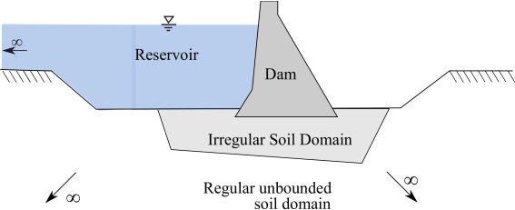

# Governing equation for Dam-Reservoir System

@fig-ch6-fig1 illustrates a dam-reservoir-soil (DRS) system that consists of following components;

1. *Structure*: the dam and irregular bounded soil domain with linear or nonlinear material behavior. In this chapter, however, for the sake of clarity of v-ST/FEM formulation the structure is assumed to behave linearly.
2. *Reservoir*: the semi-unbounded prismatic channel with linear, inviscid, irrotational, and compressible fluid. The term *fluid domain* and *reservoir* will be used interchangeably.
3. *Soil domain* : the regular unbounded soil domain which is assumed to be isotropic, homogeneous, linear elastic material. Besides, the term *soil* is used as a general expression for denoting the geological material underneath the structure and reservoir.

{#fig-ch6-fig1}

In practice, sometimes, the structure is situated on a relatively very stiff soil. In such cases, the effect of interaction with the soil can be neglected. Subsequently, a DRS system can simply be represented by a dam-reservoir (DR) system (see @fig-ch6-fig2) where the dynamic interaction between structure (dam) and reservoir plays a major role. It is natural, therefore, to start with the governing equations of a DR system, and subsequently extending them to include the effect of dynamic soil-structure interaction.

{#fig-ch6-fig2}

## Governing equation for dam-reservoir system

@fig-ch6-fig2 depicts the dam-reservoir system situated on a relatively rigid ground which is subjected to the transient ground motion. The horizontal and vertical component of ground motion are denoted by $a_{1}^{g}(t)$ and $a_{2}^{g}(t)$, respectively. Note that the ground motion is assumed to be spatially-uniform. Henceforth, the superscript ${(\cdot)}^{s}$ and ${(\cdot)}^{f}$ will be used for denoting the quantities related to the solid (dam) and fluid domain, respectively. Let $\Omega^{f}$ be the computation domain for fluid (i.e. reservoir) with free surface denoted by $\Gamma_{f}^{f}$ and upstream artificial boundary denoted by $\Gamma_{\infty}^{f}$. The fluid-soil interface (of fluid domain $\Omega^{f}$) -- the bottom boundary of fluid domain which is in contact with the ground -- is denoted by $\Gamma^{f}_{fs}$. The fluid-dam interface of the fluid domain is represented by $\Gamma_{fd}^{f}$. Let $\Omega^{s}$ denote the finite computation domain for solid which, in the present case, is occupied by the dam body. The fluid-dam interface of solid domain is represented by $\Gamma_{fd}^{s}$. The outward unit normal vectors to the fluid and solid boundary are denoted by $\mathbf{n}^{s}$ and $\mathbf{n}^{f}$, respectively.

Neglecting the internal viscosity, and assuming the water to be linearly compressible with a small amplitudes for the displacements and velocity, the hydrodynamic pressure distribution in the reservoir is governed by the pressure wave equation [@Zienkiewicz2005],

$$
\frac{1}{{{c^2}}}\frac{{{\partial ^2}p}}{{\partial {t^2}}} - \frac{{{\partial ^2}p}}{{\partial x_i^2}} = 0
$$ {#eq-ch6-1}

where $p(\vec{x},t)$ is the hydrodynamic pressure in the water (in excess of hydrostatic pressure), and $c$ is the speed of sound in water. Further, it is assumed that the water in the reservoir is initially at rest conditions,

$$
\begin{aligned}
p\left( {{\mathbf{x}},0} \right) &= 0; & \frac{{\partial p\left( {{\mathbf{x}},0} \right)}}{{\partial t}} = 0
\end{aligned}
$$ {#eq-ch6-2}

The hydrodynamic pressure distribution within the reservoir domain is obtained by solving @eq-ch6-1 with the following boundary conditions.

1. *Boundary condition at $\Gamma^{f}_{f}$*: If the possibility of surface gravity waves at the free surface is neglected then the boundary condition on $\Gamma^{f}_{f}$ becomes

$$
p(x,t) = 0 \quad \forall (\mathbf{x},t) \in \Gamma^{f}_{f} \times (0,T)
$$ {#eq-ch6-3}

If, however, one wishes to include the effect of surface-gravity waves while solving the dynamic DRI problem then the boundary condition is given by linearized surface wave condition [@Zienkiewicz2005]

$$
\frac{{\partial p}}{{\partial {x_2}}} =  - \frac{1}{g}\frac{{{\partial ^2}p}}{{\partial {t^2}}} \quad \forall (\mathbf{x},t) \in \Gamma^{f}_{f} \times (0,T)
$$ {#eq-ch6-4}

where $g$ is the acceleration due to gravity, $x_{2}$-axis is in the vertical direction, and the free surface is parallel to the $x_{1}$-axis.

In this thesis the effect of surface-gravity wave is not considered, hence, the boundary condition @eq-ch6-3 will be adopted.

2. *Boundary condition at $\Gamma^{f}_{\infty}$*: The upstream artificial boundary is obtained by truncating the infinite reservoir domain. In case no excitation source is present exterior to $\Gamma^{f}_{\infty}$ the artificial boundary should be able to absorb the incoming waves. This is the case when vertical component of ground motion is absent. In case both horizontal and vertical component are present the vertical motion of the ground generates the free-field response which then enters the fluid domain $\Omega^{f}$ through the artificial boundary. Therefore, in later case the artificial boundary should only absorb the outgoing scattered pressure-waves. The absorbing boundary condition for the fluid domain is given by,

$$
\nabla \left( {p - {p^f}} \right) \cdot {{\mathbf{n}}^f} =  - \frac{1}{c}\frac{{\partial \left( {p - {p^f}} \right)}}{{\partial t}} \quad \forall (\mathbf{x},t) \in \Gamma^{f}_{\infty} \times (0,T)
$$ {#eq-ch6-5}

where $p^{f}$ is the free-field response of reservoir, and $(p-p^{f})$ denotes the scattered pressure wave. Eq. [\[eq-ch6-5\]](#eq-ch6-5){reference-type="eqref" reference="eq-ch6-5"} signifies that the outgoing scattered waves are traveling towards infinity and no spurious reflection of scattered waves will take place at the truncated boundary. After rearrangement of the terms in Eq. [\[eq-ch6-5\]](#eq-ch6-5){reference-type="eqref" reference="eq-ch6-5"},

$$
\nabla p \cdot {{\mathbf{n}}^f} =  - \frac{1}{c}\frac{{\partial p}}{{\partial t}} + \nabla {p^f} \cdot {{\mathbf{n}}^f} + \frac{1}{c}\frac{{\partial {p^f}}}{{\partial t}} \quad \forall (\mathbf{x},t) \in \Gamma^{f}_{\infty} \times (0,T)
$$

In @eq-ch6-5 the first term corresponds to an array of dashpots (with damping coefficient equal to $1/c$) placed normal to the absorbing boundary $\Gamma^{f}_{f}$, and last two terms corresponds to the free-field response of reservoir (see @fig-ch6-fig3). It will be shown in next section that the free-response of reservoir $p^{f}$ can effectively be given by $p^{f}=p^{f}(x_{2},t)$. In addition, noting that the outward normal vector $\mathbf{n}^{f}$ at $\Gamma^{f}_{\infty}$ is $[-1,0]^{T}$, the second term in above equation vanishes and following traction boundary condition can be obtained

$$
\nabla p \cdot {{\mathbf{n}}^f} =  - \frac{1}{c}\frac{{\partial p}}{{\partial t}}  + \frac{1}{c}\frac{{\partial {p^f}}}{{\partial t}} \quad \forall (\mathbf{x},t) \in \Gamma^{f}_{\infty} \times (0,T)
$$ {#eq-ch6-6}

3. *Boundary condition at $\Gamma^{f}_{fd}$*: The traction boundary condition at fluid-dam interface is describe by

$$
\nabla p \cdot {{\mathbf{n}}^f} =  - {\rho ^f}\frac{{\partial {\mathbf{v}}}}{{\partial t}} \cdot {{\mathbf{n}}^f} \quad \forall (\mathbf{x},t) \in \Gamma^{f}_{fd} \times (0,T)
$$ {#eq-ch6-7}

where $\rho^{f}$ is the mass density of water, and $\mathbf{v}$ is the total velocity of the material points of dam that belong to the interface $\Gamma^{f}_{fd}$.

4. *Boundary condition at $\Gamma^{f}_{fs}$*: The traction boundary condition at fluid-soil interface is describe by

$$
\nabla p \cdot {{\mathbf{n}}^f} =  - {\rho ^f}{{\mathbf{a}}^g} \cdot {{\mathbf{n}}^f} - {q_c}\frac{{\partial p}}{{\partial t}} \quad \forall (\mathbf{x},t) \in \Gamma^{f}_{fs} \times (0,T)
$$ {#eq-ch6-8}

where $\mathbf{a}^{g}(t)$ is the acceleration of ground, and $q_{c}$ is the damping coefficient which is the fundamental parameter characterizing the effect of reservoir bottom materials and it is given in [@Fenves1983] as,

$$
{q_c} = \frac{{1 - {\alpha_b}}}{{c\left( {1 + {\alpha _b}} \right)}}
$$ {#eq-ch6-9}

in which $\alpha_{b}$ is the ratio of the amplitude of reflected hydrodynamic pressure wave to the amplitude of a vertically propagating pressure wave incident on the reservoir bottom. The wave reflection coefficient $\alpha_{b}$ is more physically meaningful description than $q_{c}$ of the behavior of hydrodynamic pressure waves at the reservoir bottom. The wave reflection coefficient $\alpha_{b}$ may range within the limiting values of $1$ and $-1$. For $\alpha_{b}=1$ the reservoir-bottom acts as the perfect reflector for the pressure waves, and $\alpha_{b}=-1$ models a very soft reservoir bottom (or foundation).

The second term in @eq-ch6-8 represents the modification of the vertical free-field ground acceleration due to interaction between the impounded water and the foundation medium. Due to this term the reservoir bottom also produces a damping effect representing the energy radiated through refraction (or absorption) of hydrodynamic pressure waves into the foundation medium away from the dam-water system. Accordingly, this term signifies the dynamic interaction between the reservoir water and the ground which permits partial absorption of hydrodynamic pressure waves at the reservoir bottom.

Lastly, computation domain of fluid, in the dam-reservoir system with a rigid foundation, and the aforementioned boundary conditions are illustrated in @fig-ch6-fig3.

{#fig-ch6-fig3}

Let us now discuss the governing equation for the solid domain (recall that in DR-system the solid domain is occupied by dam only) which is given by,

$$
\rho^{s}\frac{{\partial v_i}}{{\partial t}} - \frac{{\partial {\sigma_{ij}}}}{{\partial {x_j}}} - {\rho ^s}{b_i} = 0 \quad \forall (\mathbf{x},t) \in \Omega^{s}\times (0,T)
$$ {#eq-ch6-10}

where $\rho^{s}$ is the mass density of the solid domain. Further, for an isotropic, homogeneous, linear elastic material stress-strain relationship is described by

$$
{\sigma *{ij}} = \lambda {\epsilon*{kk}}{\delta *{ij}} + 2\mu {\epsilon*{ij}}
$$ {#eq-ch6-11}

where $\lambda$ and $\mu$ are the Lame parameters, and

$$
{\epsilon _{ij}} = \frac{1}{2}\left( {\frac{{\partial {u_i}}}{{\partial {x_j}}} + \frac{{\partial {u_j}}}{{\partial {x_i}}}} \right)
$$ {#eq-ch6-12}

The initial conditions for the solid domain are

$$
\begin{split}
{u_i}\left( {{\mathbf{x}},0} \right) = u_i^0\left( {\mathbf{x}} \right)\quad \,\forall {\mathbf{x}} \in {\Omega ^s}
\\
{v_i}\left( {{\mathbf{x}},0} \right) = v_i^0\left( {\mathbf{x}} \right)\quad \,\forall {\mathbf{x}} \in {\Omega ^s}
\end{split}
$$ {#eq-ch6-13}

and the Dirichlet boundary condition is described by

$$
{u_i}\left( {{\mathbf{x}},t} \right) = {g_i}\left( {{\mathbf{x}},t} \right)\quad \,\forall \left( {{\mathbf{x}},t} \right) \in \Gamma _i^g \times \left( {0,T} \right)
$$ {#eq-ch6-14}

In case of DR-system, the traction boundary condition for solid domain can be decomposed into (i) traction boundary condition due to externally applied surface loads (see @eq-ch6-15), (ii) traction boundary condition due to total pressure (hydrostatic and hydrodynamic pressure) of impounded water acting on $\Gamma^{s}_{fd}$ (see @eq-ch6-16).

$$
{\sigma *{ij}}n_j^s = {f^{s}*{i}}\quad \,\forall \left( {{\mathbf{x}},t} \right) \in \Gamma _{i,h}^s \times \left( {0,T} \right)
$$ {#eq-ch6-15}

$$
{\sigma _{ij}}n_j^s =  - \left\{ {{p_0}({\mathbf{x}}) + p({\mathbf{x}},t)} \right\}n_i^s\quad \forall \left( {{\mathbf{x}},t} \right) \in \Gamma _{fd}^s \times \left( {0,T} \right)
$$ {#eq-ch6-16}

where $p_{0}(\mathbf{x})$ and $p(\mathbf{x},t)$ denote the hydrostatic and hydrodynamic pressure due to impounded water in the reservoir, respectively, and $\Gamma^{s}_{i,h}$ denotes the portion of solid-boundary on which surface loads in $x_{i}$-direction are prescribed.

Lastly, the strong form of initial-boundary value problem of dynamic interaction between dam-reservoir system situated on a perfectly rigid ground is stated in @fig-ch6-box-1.

:::{.callout-note title="Strong form of initial-boundary value problem of dynamic interaction between a dam and a reservoir on a rigid foundation subjected to the ground motion"}

Given the functions;

$$
\begin{align*}
b_{i} &:\Omega^{s}\times [0,T]\rightarrow\mathbb{R}
&
g_{i} &:\Gamma_{i}^{g}\times [0,T]\rightarrow\mathbb{R}
&
h_{i} &:\Gamma^{s}*{i,h}\times [0,T]\rightarrow\mathbb{R}
\\
u*{i}^{0} &:\Omega^{s}\rightarrow\mathbb{R}
&
v_{i}^{0} &:\Omega^{s}\rightarrow\mathbb{R}
&
\rho^{s} &:\Omega\rightarrow \mathbb{R}
&
\\
a^{g}*{i} &:[0,T]\rightarrow\mathbb{R}
&
p^{f} &: \Gamma^{f}*{\infty} \times [0,T] \rightarrow R
\end{align*}
$$

and the constants $\lambda$, $\mu$, $c$, $q_{c}$, find $u_{i}:\bar \Omega^{s} \times [0,T] \rightarrow \mathbb{R}$, $v_{i}:\bar \Omega^{s} \times [0,T] \rightarrow \mathbb{R}$, and $p:\bar \Omega^{f} \times [0,T]$ such that

$$
\begin{equation*}
\frac{1}{{{c^2}}}\frac{{{\partial ^2}p}}{{\partial {t^2}}} - \frac{{{\partial ^2}p}}{{\partial x_i^2}} = 0 \quad \forall (\mathbf{x},t) \in \Omega^{f}\times (0,T)
\end{equation*}
$$

$$
\begin{align*}
p(x,t) &=0\quad \forall (\mathbf{x},t)\in \Gamma^{f}*{f}\times (0,T)
\\
\nabla p \cdot {{\mathbf{n}}^f} &=  - \frac{1}{c}\frac{{\partial p}}{{\partial t}} + \frac{1}{c}\frac{{\partial {p^f}}}{{\partial t}}\quad \,\forall ({\mathbf{x}},t) \in \Gamma*\infty ^f \times (0,T)
\\
\nabla p \cdot {{\mathbf{n}}^f} &=  - {\rho ^f}\frac{{\partial {\mathbf{v}}}}{{\partial t}} \cdot {{\mathbf{n}}^f} \quad \forall (\mathbf{x},t) \in \Gamma^{f}*{fd} \times (0,T)
\\
\nabla p \cdot {{\mathbf{n}}^f} &=  - {\rho ^f}{{\mathbf{a}}^g} \cdot {{\mathbf{n}}^f} - {q_c}\frac{{\partial p}}{{\partial t}} \quad \forall (\mathbf{x},t) \in \Gamma^{f}*{fs} \times (0,T)
\end{align*}
$$

$$
\begin{equation*}
\frac{{\partial v_i}}{{\partial t}} - \frac{{\partial {\sigma_{ij}}}}{{\partial {x_j}}} - {\rho ^s}{b_i} = 0 \quad \forall (\mathbf{x},t) \in \Omega^{s}\times (0,T)
\end{equation*}
$$

$$
\begin{align*}
{\sigma_{ij}} &= \lambda {\epsilon_{kk}}{\delta_{ij}} + 2\mu {\epsilon_{ij}}
&
{\epsilon _{ij}} &= \frac{1}{2}\left( {\frac{{\partial {u_i}}}{{\partial {x_j}}} + \frac{{\partial {u_j}}}{{\partial {x_i}}}} \right)
\\
{u_i}\left( {{\mathbf{x}},0} \right) &= u_i^0\left( {\mathbf{x}} \right)\quad \,\forall {\mathbf{x}} \in {\Omega ^s}
&
{v_i}\left( {{\mathbf{x}},0} \right) &= v_i^0\left( {\mathbf{x}} \right)\quad \,\forall {\mathbf{x}} \in {\Omega ^s}
\end{align*}
$$

$$
\begin{align*}
{u_i}\left( {{\mathbf{x}},t} \right) &= {g_i}\left( {{\mathbf{x}},t} \right)\quad \,\forall \left( {{\mathbf{x}},t} \right) \in \Gamma_{i}^{g} \times \left( {0,T} \right)
\\
{\sigma_{ij}}n_j^s &= {f^{s}*{i}}\quad \,\forall \left( {{\mathbf{x}},t} \right) \in \Gamma*{i,h}^s \times \left( {0,T} \right)
\\
{\sigma_{ij}}n_j^s &=  - \left\{ {{p_0}({\mathbf{x}}) + p({\mathbf{x}},t)} \right\}n_i^s\quad \forall \left( {{\mathbf{x}},t} \right) \in \Gamma_{fd}^s \times \left( {0,T} \right)
\end{align*}
$$

:::

## Governing equation for dam-reservoir-soil system {#sec:ch6_sec2-2}

In case of dam-reservoir-soil system, solid domain $\Omega^{s}$ consists of dam and bounded soil domain, and in this chapter both are assumed to behave linearly. The governing equation for fluid domain, initially at rest, is described by the pressure-wave equation @eq-ch6-1. The boundary condition at the free surface $\Gamma^{f}_{f}$, the upstream artificial boundary $\Gamma^{f}_{\infty}$, and fluid-dam interface $\Gamma^{f}_{fd}$ is given by @eq-ch6-3, @eq-ch6-6, and @eq-ch6-7, respectively. At reservoir bottom (i.e. fluid-soil interface) the traction boundary condition becomes,

$$
\nabla p \cdot {{\mathbf{n}}^f} =  - {\rho ^f}\frac{{\partial {{\mathbf{v}}}}}{{\partial t}} \cdot {{\mathbf{n}}^f} - {q_c}\frac{{\partial p}}{{\partial t}}\quad \,\forall ({\mathbf{x}},t) \in \Gamma_{fs}^f \times (0,T)
$$ {#eq-ch6-17}

where $\mathbf{v}$ is the velocity of material-points (of soil domain) that are positioned at the fluid-soil interface $\Gamma^{s}_{fs}$, and $q_{c}$ is given by @eq-ch6-9.

{#fig-ch6-fig4}

The motion of solid domain (both soil and dam) is governed by the classical elastodynamics equation presented in @eq-ch6-10 -- @eq-ch6-12. The initial conditions and the Dirichlet boundary condition are given by @eq-ch6-13 and @eq-ch6-14, respectively. The traction boundary condition due to the external surface loading is given in @eq-ch6-15, and the traction boundary condition due to the hydrostatic pressure $p_{0}(\mathbf{x})$ and hydrodynamic pressure $p(\mathbf{x},t)$ of impounded water acting on the dam-fluid interface $\Gamma^{s}_{fd}$ and the fluid-soil interface $\Gamma^{s}_{fs}$ is given by @eq-ch6-18.

$$
{\sigma _{ij}}n_j^s =  - \left\{ {{p_0}({\mathbf{x}}) + p({\mathbf{x}},t)} \right\}n_i^s\quad \,\forall ({\mathbf{x}},t) \in \Gamma *{fd}^s \cup \Gamma*{fs}^s \times (0,T)
$$ {#eq-ch6-18}

in which $\mathbf{n}^{s}$ is the outward normal vector to the boundary of solid domain $\Omega^{s}$.\ Further, the traction boundary condition at the artificial boundary of truncated soil domain must be satisfied for correctly modeling the radiation-damping effect of unbounded soil domain. These boundary conditions are describe as follows.

$$
{\sigma_{ij}}n_j^s =  - c_{ip}^v{v_p} + c_{ip}^vv_p^f + \sigma_{ip}^fn_p^s\quad \,\,\forall ({\mathbf{x}},t) \in \,\Gamma_\infty ^L \cup \Gamma_\infty ^R \times (0,T)
$$ {#eq-ch6-19}

$$
{\sigma_{ij}}n_j^s =  - c_{ip}^h{v_p} + 2c_{ip}^hv_p^{in}\quad \,\,\forall ({\mathbf{x}},t) \in \,\Gamma_\infty ^B \times (0,T)
$$ {#eq-ch6-20}

where $\Gamma^{L}_{\infty}$, $\Gamma^{R}_{\infty}$, and $\Gamma^{B}_{\infty}$ are the left, right and bottom artificial (absorbing) boundary of truncated soil domain, respectively (see @fig-ch6-fig4). $\mathbf{v}^{f}$ and $\sigma^{f}$ are the velocity and stress due to free-field response of unbounded soil domain. $\mathbf{c}^{v}$ and $\mathbf{c}^{h}$ are the damping coefficient matrix of dashpots which are arranged at the vertical and horizontal viscous boundaries, respectively. Furthermore, the free-field response of reservoir and soil domain is obtained by solving the auxiliary state problem for the DRS system (see @fig-ch6-fig4 a).

:::{.callout-note title="Strong form of initial-boundary value problem of dynamic interaction between a dam, a reservoir, and soil subjected to the ground motion"}

Given the functions

$$
\begin{align*}
b_{i} &:\Omega^{s}\times [0,T]\rightarrow\mathbb{R}
&
g_{i} &:\Gamma_{i}^{g}\times [0,T]\rightarrow\mathbb{R}
&
h_{i} &:\Gamma^{s}_{i,h}\times [0,T]\rightarrow\mathbb{R}
\\
u_{i}^{0} &:\Omega^{s}\rightarrow\mathbb{R}
&
v_{i}^{0} &:\Omega^{s}\rightarrow\mathbb{R}
&
\rho^{s} &:\Omega\rightarrow \mathbb{R}
&
\\
v^{in}_{i} &:[0,T]\rightarrow\mathbb{R}
&
p^{f} &: \Gamma^{f}_{\infty} \times [0,T] \rightarrow R
&
u_{i}^{f} &: \Gamma^{L}_{\infty}\cup\Gamma^{R}_{\infty} \times [0,T] \rightarrow \mathbb{R}
\end{align*}
$$

and the constants $\lambda$, $\mu$, $c$, $q_{c}$, $\mathbf{c}^{v}$, $\mathbf{c}^{h}$ find $u_{i}:\bar \Omega^{s} \times [0,T] \rightarrow \mathbb{R}$, $v_{i}:\bar \Omega^{s} \times [0,T] \rightarrow \mathbb{R}$, and $p:\bar \Omega^{f} \times [0,T]$ such that

$$
\begin{align*}
\frac{1}{{{c^2}}}\frac{{{\partial ^2}p}}{{\partial {t^2}}} - \frac{{{\partial ^2}p}}{{\partial x_i^2}} &= 0 \quad \forall (\mathbf{x},t) \in \Omega^{f}\times (0,T)
\\
p(x,t) &=0\quad \forall (\mathbf{x},t)\in \Gamma^{f}_{f}\times (0,T)
\\
\nabla p \cdot {{\mathbf{n}}^f} &=  - \frac{1}{c}\frac{{\partial p}}{{\partial t}} + \nabla {p^f} \cdot {{\mathbf{n}}^f} + \frac{1}{c}\frac{{\partial {p^f}}}{{\partial t}}\quad \,\forall ({\mathbf{x}},t) \in \Gamma_{\infty}^{f} \times (0,T)
\\
\nabla p \cdot {{\mathbf{n}}^f} &=  - {\rho ^f}\frac{{\partial {\mathbf{v}}}}{{\partial t}} \cdot {{\mathbf{n}}^f} \quad \forall (\mathbf{x},t) \in \Gamma^{f}_{fd} \times (0,T)
\\
\nabla p \cdot {{\mathbf{n}}^f} &=  - {\rho ^f}\frac{{\partial {{\mathbf{v}}}}}{{\partial t}} \cdot {{\mathbf{n}}^f} - {q_c}\frac{{\partial p}}{{\partial t}}\quad \,\forall ({\mathbf{x}},t) \in \Gamma_{fs}^f \times (0,T)
\end{align*}
$$

$$
\begin{equation*}
\frac{{\partial v_i}}{{\partial t}} - \frac{{\partial {\sigma_{ij}}}}{{\partial {x_j}}} - {\rho ^s}{b_i} = 0 \quad \forall (\mathbf{x},t) \in \Omega^{s}\times (0,T)
\end{equation*}
$$

$$
\begin{align*}
{\sigma_{ij}} &= \lambda {\epsilon_{kk}}{\delta_{ij}} + 2\mu {\epsilon_{ij}}
&
{\epsilon _{ij}} &= \frac{1}{2}\left( {\frac{{\partial {u_i}}}{{\partial {x_j}}} + \frac{{\partial {u_j}}}{{\partial {x_i}}}} \right)
\\
{u_i}\left( {{\mathbf{x}},0} \right) &= u_i^0\left( {\mathbf{x}} \right)\quad \,\forall {\mathbf{x}} \in {\Omega ^s}
&
{v_i}\left( {{\mathbf{x}},0} \right) &= v_i^0\left( {\mathbf{x}} \right)\quad \,\forall {\mathbf{x}} \in {\Omega ^s}
\end{align*}
$$

$$
\begin{align*}
{u_i}\left( {{\mathbf{x}},t} \right) &= {g_i}\left( {{\mathbf{x}},t} \right)\quad \,\forall \left( {{\mathbf{x}},t} \right) \in \Gamma_{i}^{g} \times \left( {0,T} \right)
\\
{\sigma_{ij}}n_j^s &= {f^{s}_{i}}\quad \,\forall \left( {{\mathbf{x}},t} \right) \in \Gamma_{i,h}^s \times \left( {0,T} \right)
\\
{\sigma_{ij}}n_j^s &=   - \left\{ {{p_0}({\mathbf{x}}) + p({\mathbf{x}},t)} \right\}n_i^s\quad \,\forall \left( {{\mathbf{x}},t} \right) \in \Gamma_{fd}^s \times \left( {0,T} \right)
\\
{\sigma_{ij}}n_j^s &=  - c_{ip}^v{v_p} + c_{ip}^vv_p^f + \sigma_{ip}^fn_p^s\quad \,\,\forall ({\mathbf{x}},t) \in \,\Gamma_\infty ^L \cup \Gamma_\infty ^R \times (0,T)
\\
{\sigma_{ij}}n_j^s &=  - c_{ip}^h{v_p} + 2c_{ip}^hv_p^{in}\quad \,\,\forall ({\mathbf{x}},t) \in \,\Gamma_\infty ^B \times (0,T)
\end{align*}
$$

:::

## Free-field response of dam-reservoir system {#sec:ch6_sec3-1}

In order to obtain the dynamic response of dam-reservoir or dam-reservoir-soil system the free field response must be obtained by analysis of the corresponding auxiliary system.

Fig. [2](#fig:ch6_fig2){reference-type="ref" reference="fig:ch6_fig2"}b illustrates the auxiliary state of a dam-reservoir system. Let $\Omega^{f}_{+}$ be the two-dimensional spatial domain occupied by the auxiliary-state. The free field response is obtained by solving pressure wave equation for the auxiliary state. Recall that the reservoir bottom is horizontal and only vertical motion of ground (reservoir-bottom) need to be considered in the analysis. In this situation the hydrodynamic pressure $p^{f}$ depends upon $x_{2}$ coordinate only and satisfied the following one-dimensional wave equation, 

$$
\frac{1}{{{c^2}}}\frac{{{\partial ^2}p^{f}}}{{\partial {t^2}}} - \frac{{{\partial ^2}p^{f}}}{{\partial x_2^2}} = 0
$$ {#eq-ch6-21}

In this way the auxiliary state can be represented by a fluid-column placed adjacent to the upstream truncated boundary of reservoir (i.e. $\Gamma^{f}_{\infty}$). The fluid-column is considered at the rest at $t=0$. At the top surface of the fluid-column $p^{f}=0$, and at the bottom surface following traction boundary condition should be imposed

$$
\frac{{\partial {p^f}}}{{\partial {x_2}}} = {\rho ^f}a_2^g\left( t \right) + {q_c}\frac{{\partial {p^f}}}{{\partial t}}
$$ {#eq-ch6-22}

where $a_{2}^{g}(t)$ is the $x_{2}$-component of ground acceleration, and $q_{c}$ is given by @eq-ch6-9.

## Free field response of dam-reservoir-soil system {#sec:ch6_sec3-2}

@fig-ch6-fig4 a depicts the auxiliary state for dam-reservoir-soil system. The auxiliary state contains both the infinite reservoir and the soil domain, and the spatial-domain occupied by the auxiliary state is given by $\Omega\cup\Omega_{+}\cup\Omega_{+}^{f}$. Accordingly, the free-field hydrodynamic pressure ($p^{f}$) and the free-field displacement ($u^{f}$) of soil domain are the primary unknowns.[^1]

[^1]: However, in order to compute the total response of the DRS system we only need the information of free-field solutions at the truncated boundaries.

Theoretically speaking, the free-field response ($u^{f},p^{f}$) is obtained by analysis of auxiliary dam-reservoir-soil system while considering the effects of reservoir-soil interaction in spatial domain $\Omega^{f}_{+}\cup \Omega_{+}$. This strategy, however, will require huge computational cost. This expensive analysis may be simplified by ignoring the coupling between the reservoir and soil in spatial domain $\Omega^{f}_{+}\cup \Omega_{+}$. Under this assumption, the bottom surface of reservoir domain $\Omega^{f}_{+}$ can be treated as a rigid-surface thus ignoring the effects of foundation flexibility. Subsequently, $p^{f}$ can be computed by solving a fluid-column problem as discussed in the previous subsection. Further, $u_{f}$ will be computed by solving the soil-column problem as discussed in previous Chapter. In this way, by ignoring the effects of secondary reservoir-soil interaction in spatial domain $\Omega^{f}_{+}\cup \Omega_{+}$, it is now possible to compute $u^{f}$ and $p^{f}$ from the the corresponding simple column problems at very low computational cost.

