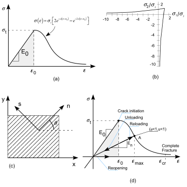

# Nonlinear dynamic behavior of concrete gravity dams

## Introduction

In previous chapters linear dynamic problems are solved by using v-ST/FEM. In Chapter [\[ch:ch6\]](#ch:ch6){reference-type="ref" reference="ch:ch6"}, linear dynamic analysis of gravity dam subjected to the earthquake ground motion show that the large tensile stresses may develop in dam which can exceed the tensile strength of the mass concrete. In such cases, a linear analysis is no longer valid since tensile cracks will form and propagates in the concrete, affecting the vibration properties an dynamic response of the dam. Consequently, cracking based on seismic actions in dams is an important factor in the safety evaluation of gravity dams and it may cause catastrophic consequences such as loss of life and property if the dam fails.

Extensive research has been performed over the last 25 years into the fracture behavior of concrete. A tensile-strength-based crack propagation analysis is generally considered unreliable due to the mesh-dependent response prediction [@Bazant1987]. Non-linear behavior in the fracture process zone (FPZ), which is significantly large for the concrete normally used in dams, is neglected in the conventional linear elastic fracture mechanics (LEFM) models. Under very slowly applied loads and also under impulsive loads, concrete fracture behavior seems to be adequately predicted by the LEFM models [@Bhattacharjee1993]. In the intermediate range, from short-term static loading to seismic-induced strain rates, non-linear fracture mechanics (NLFM) models considering the strain softening behavior in the FPZ appear to be more appropriate.

Continuum mechanics approaches to represent the tensile crack propagation are computationally very attractive for applications in complex structural analysis when the crack profiles are not known a priori. General drawbacks of the conventional smeared crack analysis model, such as the mesh-sensitive response prediction and the stress-locking in finite elements, can largely be overcome using the energy conserving co-axial rotating crack model (CRCM), which is an improved NLFM model [@Bhattacharjee1993].

[@Bhattacharjee1993] investigated the dynamic fracture response of Koyna dam by using the CRCM concrete model. In the analysis of this dam, the foundation was assumed to be rigid, and the dynamic interaction of dam-reservoir system was modeled by the Westergaard added mass technique. The response results of the dam indicated that cracks formed at the base and at the upper portion near the change in downstream slope for the Koyna earthquake records. [@Lee1998] also obtained similar solutions for Koyna dam under the same boundary and loading conditions by using a plastic-damage concrete model which includes tension and compression strain softening effects. They studied in detail tension damage in the dam and noted that damage in compression is less important in comparison with damage in tension for dams. In another paper, [@Cervera1995] developed an isotropic damage model for the seismic evaluation of concrete gravity and arch dams. This model accounts for the different behavior of concrete in tension and compression by splitting the stress tensor into tensile and compressive components, each with its own damage surface and evolution law. The seismic analyses of their selected gravity dam which resembles very closely Koyna dam, including dam-reservoir-foundation interactions, subjected to artificially generated earthquakes of different intensities indicated tension damage in the dam, but no compression damage occurred. The formed tension damage was seen at the upper portion of the dam. In the lights of these investigations, the tension cracks have only important influence on the seismic response of concrete gravity dams. Therefore, tension cracking is only considered in the present study.

In this chapter, v-ST/FEM is employed for the problems involving dynamic response of solids and structures with nonlinear stress-strain relationships. The structure of the present chapter is described as follows. First, we will define  the problem of dynamic interaction between the concrete gravity dam and reservoir, in which a generalized nonlinear stress-strain relationship is used to describe the material behavior of concrete in the dam. Then we will discuss the space-time weak form of the model problem. , It is shown that the nonlinearity is caused by only the presence of stress term in the v-ST/FEM weak form. Subsequently, two v-ST/FEM schemes are proposed for the time integration of the space-time nodal vectors and matrices comprising the stress term. This chapter also presents a block-iterative scheme to enforce the coupling between the solid and fluid domain. Finally, the numerical results of the nonlinear dynamic analysis of a concrete gravity dam subjected to the earthquake ground motion are presented and discussed.

## Statement of problem

@fig-ch6-fig2 depicts the dam-reservoir system situated on a relatively rigid ground which is subjected to the spatially uniform transient ground motion. The horizontal and vertical component of ground motion are denoted by $a_{1}^{g}(t)$ and $a_{2}^{g}(t)$, respectively. Henceforth, the superscript ${(\cdot)}^{s}$ and ${(\cdot)}^{f}$ will be used for denoting the quantities related to the solid (dam) and fluid domain, respectively. Let $\Omega^{f}$ be the computation domain of reservoir which is enclosed by a free surface $\Gamma_{f}^{f}$, an upstream artificial boundary $\Gamma_{\infty}^{f}$, a fluid-soil interface $\Gamma^{f}_{fs}$, and a fluid-dam interface $\Gamma_{fd}^{f}$. Accordingly, the boundary of the fluid domain can be described by 

$$
\Gamma _{}^f = \Gamma _f^f \cup \Gamma _\infty ^f \cup \Gamma _{fs}^f \cup \Gamma _{fd}^f
$$ {#eq-ch7-1} 

Let $\Omega^{s}$ be the computation domain of dam, $\Gamma_{fd}^{s}$ be the fluid-dam interface of dam, and $\Gamma_{ds}^{s}$ be the base of the dam. The outward unit normal vectors to the fluid and solid boundary are denoted by $\mathbf{n}^{s}$ and $\mathbf{n}^{f}$, respectively, and 

$$
{{\mathbf{n}}^s} + {{\mathbf{n}}^f} = {\mathbf{0}}
$$ {#eq-ch7-2} 

Since the ground underneath the dam, which is in spatially uniform motion, is assumed to be perfectly-rigid it is advantageous to describe the motion of the dam relative to the ground. Let $\mathbf{u}$ and $\mathbf{v}$ be the relative displacements and relative velocities of the dam, respectively, and $\rho^{s}$ be the mass-density of the dam.  The governing equation of motion for the dam becomes, 

$$
{\rho ^s}\frac{{\partial {v_i}}}{{\partial t}} - \frac{{\partial {\sigma _{ij}}}}{{\partial {x_j}}} = {\rho ^s}\left( {{b_i} - a_i^g} \right) \quad \forall ({\mathbf{x}},t) \in {\Omega ^s} \times (0,T)
$$ {#eq-ch7-3}

where $b_{i}$ is the external body force density, and $-\rho^{s}\mathbf{a}^{g}(t)$ is the pseudo force acting on the dam due to the accelerating frame of reference. The above equation can be derived from the @eq-ch6-10 while noting that the spatial gradient of ground motion is zero. The initial conditions for the dam are given by, 

$$
\begin{split}
{u_i}\left( {{\mathbf{x}},0} \right) = u_i^0\left( {\mathbf{x}} \right)\quad \,\forall {\mathbf{x}} \in {\Omega ^s}
\\
{v_i}\left( {{\mathbf{x}},0} \right) = v_i^0\left( {\mathbf{x}} \right)\quad \,\forall {\mathbf{x}} \in {\Omega ^s}
\end{split}
$$ {#eq-ch7-4} 

and the boundary condition, 

$$
{u_i}\left( {{\mathbf{x}},t} \right) = 0\quad \,\forall \left( {{\mathbf{x}},t} \right) \in \Gamma _{s}^{ds} \times \left( {0,T} \right)
$$ {#eq-ch7-5}

characterizes the rigid-base boundary condition for the dam at $\Gamma^{s}_{ds}$.

The traction boundary condition for the dam can be divided into two components; (i) traction boundary condition due to the external surface loads acting on $\Gamma^{s}_{h}$ (see
@eq-ch7-6, (ii) traction boundary condition due to total pressure (hydrostatic and hydrodynamic pressure) of impounded water acting on $\Gamma^{s}_{fd}$ (see @eq-ch7-7). 

$$
\sigma  \cdot {\mathbf{n}}_{}^s = {\mathbf{h}}\quad \forall \left( {{\mathbf{x}},t} \right) \in \Gamma _h^s \times \left( {0,T} \right)
$$ {#eq-ch7-6}

$$
\sigma  \cdot {\mathbf{n}}^{s} =  - p_{0}\left( {{\mathbf{x}}} \right){\mathbf{n}}_{}^s p\left( {{\mathbf{x}},t} \right){\mathbf{n}}_{}^s \quad
\forall \left( {{\mathbf{x}},t} \right) \in \Gamma _{fd}^s \times \left( {0,T} \right)
$$ {#eq-ch7-7}

If it is assumed that the strains in the dam body are small enough so that the problem remains geometrically linear then the nonlinear stress-strain relationship for the dam can be described by rate-form,

$$
\begin{aligned}
\frac{{\partial \sigma }}{{\partial t}} &= {\mathbf{C}}:{\mathbf{d}}&
\text{or}&
&\frac{{\partial \sigma_{ij} }}{{\partial t}} &= {\mathbf{C}_{ijkl}}:{\mathbf{d}_{kl}}&
\end{aligned}
$$ {#eq-ch7-8}

where $\mathbf{C}$ denotes a fourth order tangent modulus tensor which may depends upon the small-strain tensor $\mathbf{\epsilon}$, stretching tensor $\mathbf{d}$, and/or some internal variables [@Hashiguchi2014]. Expression for small-strain tensor and stretching tensor is given below, 

$$
{\epsilon _{ij}} = \frac{1}{2}\left( {\frac{{\partial {u_i}}}{{\partial {x_j}}} + \frac{{\partial {u_j}}}{{\partial {x_i}}}} \right)
$$ {#eq-ch7-9}

$$
{d_{ij}} = \frac{1}{2}\left( {\frac{{\partial {v_i}}}{{\partial {x_j}}} + \frac{{\partial {v_j}}}{{\partial {x_i}}}} \right)
$$ {#eq-ch7-10}

Let us now focus on the governing equations for the impounded water in the reservoir. Assuming the impounded water in the reservoir to be inviscid, linearly compressible with a small amplitudes for the displacements and velocity, the initial-boundary value problem for the fluid domain can be described as follows [@Zienkiewicz2005].

$$
\frac{1}{{{c^2}}}\frac{{{\partial^2}p}}{{\partial {t^2}}} - \frac{{{\partial^2}p}}{{\partial x_i^2}} = 0\quad {\text{in}}\quad {\forall (\mathbf{x},t) \in \Omega^f \times (0,T)}
$$ {#eq-ch7-11}

$$
p\left( {{\mathbf{x}},0} \right) = 0 \quad \forall \mathbf{x} \in \Omega^{f}
$$ {#eq-ch7-12}

$$
\frac{{\partial p\left( {{\mathbf{x}},0} \right)}}{{\partial t}} = 0 \quad \forall \mathbf{x} \in \Omega^{f}
$$ {#eq-ch7-13}

$$
p(x,t) &= 0 \quad \forall (\mathbf{x},t) \in \Gamma^{f}_{f} \times (0,T)
$$ {#eq-ch7-14}

$$
\nabla p \cdot {{\mathbf{n}}^f} =  - \frac{1}{c}\frac{{\partial p}}{{\partial t}}  + \frac{1}{c}\frac{{\partial {p^f}}}{{\partial t}} \quad \forall (\mathbf{x},t) \in \Gamma^{f}_{\infty} \times (0,T)
$$ {#eq-ch7-15}

$$
\nabla p \cdot {{\mathbf{n}}^f} =  - {\rho ^f}\frac{{\partial {\mathbf{v}}}}{{\partial t}} \cdot {{\mathbf{n}}^f} - {\rho ^f}{{\mathbf{a}}^g} \cdot {{\mathbf{n}}^f}\quad \forall ({\mathbf{x}},t) \in \Gamma _{fd}^f \times (0,T)
$$ {#eq-ch7-16}

$$
\nabla p \cdot {{\mathbf{n}}^f} =  - {\rho ^f}{{\mathbf{a}}^g} \cdot {{\mathbf{n}}^f} - {q_c}\frac{{\partial p}}{{\partial t}} \quad \forall (\mathbf{x},t) \in \Gamma^{f}_{fs} \times (0,T)
$$ {#eq-ch7-17}

where $p(\vec{x},t)$ is the hydrodynamic pressure in the water (in excess of hydrostatic pressure), $c$ is the speed of sound in water, $p^{f}$ is the free-field hydrodynamic pressure in the reservoir, $\mathbf{a}^{g}(t)$ is the spatially uniform ground motion, $\rho^{f}$ is the mass density of the water. @eq-ch7-16, $\mathbf{v}$ denotes the relative velocity of the dam with respect to the base of the dam. In @eq-ch7-17, $q_{c}$ is the damping coefficient which is the fundamental parameter characterizing the effect of reservoir bottom materials and it is given in [@Fenves1983] as, 

$$
{q_c} = \frac{{1 - {\alpha_{b}}}}{{c\left( {1 + {\alpha_{b}}} \right)}}
$$ {#eq-ch7-18}

in which, $\alpha_{b}$ is the ratio of the amplitude of reflected hydrodynamic pressure wave to the amplitude of a vertically propagating pressure wave incident on the reservoir bottom.

Note that the governing equation for the fluid domain, which is given by @eq-ch7-11, remains linear for both $p$ and $\mathbf{v}$. This equation is identical to the one presented in the last chapter. The governing equation for the solid domain (i.e. dam), which is given by @eq-ch7-3, is nonlinear due to the nonlinear stress-strain relationship. However, this equation is linear in hydrodynamic pressure acting on the dam-fluid interface (see boundary condition given by @eq-ch7-7. The linearity of @eq-ch7-3 in $p$ and @eq-ch7-11 in $\mathbf{v}$ implies the linear coupling between fluid and solid domain.

## A nonlinear smeared crack model for concrete material

Materials such as concrete, mortar, and rocks have very less tensile strength (about 10 percent) than compressive strength and exhibit a quasi-brittle behavior. Tensile fracture in concrete like materials involves progressive micro-cracking, tortuous debonding and other processes of internal damage which eventually coalesce into a macro-cracks. Accordingly, a mass concrete when subjected to the tensile loading undergo strain softening before leading to a complete loss of strength. @fig-ch7-1 shows a typical stress-strain relationship for mass concrete from uniaxial tension test obtained by [@Bruhwiler1990]. At the beginning, a linear relationship between stress and strain exists until the elastic limit is reached. Once the elastic limit is crossed, micro-cracks develop within the mass concrete, which results in nonlinearity in the curve up to the ultimate tensile strength $\sigma_{t}$. The post-peak behavior starts with the strain-softening due to growth of micro-cracks in the weakest cross-section of the specimen which then coalescence into a crack: a geometrical discontinuity that separates the material. Therefore, the stress-strain relationship for the concrete like materials can be divided into two regime: (i) pre-softening regime and (ii) softening regime.

![Typical stress-strain curve for mass concrete from simple tension test after [@Bruhwiler1990]](./figures/ch7-fig-1.svg){#fig-ch7-1}

In what follows the co-axially rotating crack model (CRCM)[^3] which is defined by (i) the pre-softening material behavior, (ii) the criterion for crack initiation, (iii) the fracture energy conservation, and (iv) the growth, closing and reopening of cracks, and v-ST/FEM implementation of this constitutive model are presented.

### Pre-softening behavior

The stress-strain relationship at a material point is given by

$$
\left\{ \sigma  \right\} = \left[ {\mathbf{C}} \right] \cdot \left\{ \varepsilon  \right\}
$$ {#eq-ch7-71}

where $\left[ {\mathbf{C}} \right]$,

$\left\{ \sigma  \right\} = \left[ {{\sigma_{11}},{\sigma_{22}},{\sigma_{12}}} \right]$

and

$\left\{ \varepsilon  \right\} = \left[ {{\varepsilon_{11}},{\varepsilon_{22}},2{\varepsilon_{12}}} \right]$

denotes Voigt-form of the constitutive matrix, stress tensor and strain tensor, respectively. In pre-softening case since there are no cracks
developed in concrete, the standard elastic plane stress-strain matrix for an isotropic material is used. Then, the matrix

$\left[ {\mathbf{C}} \right]$ is given by

$$
\left[ {\mathbf{C}} \right] = \frac{E_{0}}{{1 - {\nu ^2}}}\left[ {\begin{array}{cc}
  1&\nu &0 \\
  \nu &1&0 \\
  0&0&{\frac{{1 - \nu }}{2}}
\end{array}} \right]
$$ {#eq-ch-72}

where $\nu$ is the Poisson's ratio, and $E_{0}$ is the modulus of elasticity.

{#fig-ch7-2}

### Crack initiation criterion

The stress-strain relationship for concrete becomes non-linear near the peak strength as shown in @fig-ch7-2 . In the post-peak strain softening phase, coalescence of the micro-cracks causes a gradual reduction of the stress resistance. The area under the uniaxial stress-strain curve up to the peak, defined in @eq-ch7-71, is taken as the index for softening initiation:

$$
{U_0} = \frac{1}{2}{\sigma _t}{\varepsilon _0}=\frac{\sigma_{t}^{2}}{2E_{0}}
$$ {#eq-ch7-73}

where $\sigma_{t}$ is the uniaxial tensile strength of mass concrete, $\varepsilon_{0}$ is the corresponding strain threshold, $E_{0}$ is the modulus of elasticity. In the plane-stress finite element analyses, the crack initiation criterion is given by [@Bhattacharjee1993; @Calayir2005] 

$$
\frac{1}{2}{\sigma_{1}\varepsilon_{1}} \ge U_{0}
$$ {#eq-ch7-74}

where $\sigma_{1}$ and $\varepsilon_{1}$ are the maximum principal stress and strain, respectively. In above equation the term $(\sigma_{1}\varepsilon_{1}/2)$ denotes the tensile strain energy density. Accordingly, the biaxial effect in the crack initiation criterion may be given by

$$
\sigma_{1} \ge \frac{\sigma_{t}^{2}}{E_{0} \varepsilon_{1}}\quad
\text{or} \quad
\frac{\sigma_{1}}{\sigma_{t}} \ge \sqrt{\frac{\sigma_{1}}{E_{0}\varepsilon_{1}}}
$$ {#eq-ch7-75}

This equation represents a biaxial failure envelope which is illustrated in @fig-ch7-2 It can be observed that strain softening occurs for tension-tension and tension-compression stress states due to tension cracking, however, no cracks develop under compression-compression stress state.

### Strain softening model for concrete and fracture energy conservation

[@Bhattacharjee1993] used a linear strain softening relationship; the tensile resistance of concrete is assumed to decrease linearly from the
pre-softening undamaged state to the fully damaged state of zero tensile resistance. Recently, numerous researchers have shown that it is more
realistic to assume a strain softening curve with a steep initial decline followed by an extended tail [@Kurumatani2016; @Geers2000; @Jirasek2008; @Giry2011; @Peerlings1998; @Calayir2005]. According to [@Calayir2005], the post-peak strain softening behavior of concrete can be modeled by using following exponential strain softening relationship (see also @fig-ch7-2 a) 

$$
\sigma \left( \varepsilon  \right) = \left\{ \begin{gathered}
  {E_0}\varepsilon ,\quad \varepsilon  \leqslant {\varepsilon _0} \\
  {\sigma _t}\left[ {2{e^{ - a\left( {\varepsilon  - {\varepsilon _0}} \right)}} - {e^{ - 2a\left( {\varepsilon  - {\varepsilon _0}} \right)}}} \right],\quad {\varepsilon _0} < \varepsilon  < {\varepsilon _{cr}} \\
  0,\qquad \varepsilon  \geqslant {\varepsilon _{cr}} \\
\end{gathered}  \right.
$$ {#eq-ch7-76}

where $\varepsilon_{cr}$ denotes the maximum strain that may not be exceeded during strain softening, and is consistent with the study carried out by [@Bazant1987]. The value of $\varepsilon_{cr}$ can be calculated when its corresponding stress given is equal to $\delta_{cr} \sigma_{t}$. Thus, $\sigma = \delta_{cr} \sigma_{t}$ in @eq-ch76 b one can expressed $\varepsilon$ as

$$
{\varepsilon _{cr}} = {\varepsilon _0} + \frac{1}{a}\ln \left( {\frac{{1 + \sqrt {1 - {\delta _{cr}}} }}{{{\delta _{cr}}}}} \right)
$$ {#eq-ch7-77}

In this study $\delta_{cr}=0.02$, therefore, ${\varepsilon _{cr}}$ is given by 

$$
{\varepsilon _{cr}}={\varepsilon _{0}} + \frac{4.6}{a}
$$ {#eq-ch7-78}

In @eq-ch7-76, @eq-ch7-77, @eq-ch7-78 $a$ is a dimensionless parameter which is related to the slope of the softening curve. The parameter $a$ should be adjusted such that the energy dissipation for a unit area of crack plane propagation is conserved. Let the fracture energy[^4] be denoted by $G_{f}$. In the energy balance approach it is assumed that the fracture energy $G_{f}$ will be absorbed due to formation of a unit area of crack surface. When the crack propagates a certain amount of stored energy is released, and the crack can only propagates when the released energy is equal to or greater than the absorbed energy [@Hillerborg1976]. The limiting value of $a$ can be obtained b, 

$$
\int_0^\infty  {\sigma d\varepsilon } : = \int_0^{{\varepsilon _0}} {\sigma d\varepsilon }  + \int_{{\varepsilon _0}}^\infty  {\sigma d\varepsilon }  = \frac{{{G_f}}}{{{l_{ch}}}}
$$ {#eq-ch7-79}

Now, use of the stress-strain relationship as given by @eq-ch7-76 in above equation will yield following expression for $a$. 

$$
a = \frac{3}{{{\varepsilon _o}\left( {\frac{{2{G_f}}}{{{l_{ch}}{\sigma _t}{\varepsilon _o}}} - 1} \right)}} \geqslant 0
$$ {#eq-ch7-80}

In @eq-ch7-79 and @eq-ch7-80, $l_{ch}$ is a geometrical constant which is introduced as a measure of the length of fracture processing zone in mass concrete. In two-dimensional finite element analyses, $l_{ch}$ can be calculated by using the relations given below [@Kurumatani2016],

$$
\begin{split}
\text{Triangular element:}& l_{ch} = \sqrt{2A_{e}}
\\
\text{Quadrilateral element:}& l_{ch} = \sqrt{A_{e}}
\end{split}
$$ {#eq-ch7-81}

in which $A_{e}$ denotes the area of a two-dimensional finite element.

### Constitutive relationship during softening

After the softening initiation, a smeared band of micro-cracks is assumed to appear in the direction normal to the principal the tensile stress. The axes of principal stresses rotates during the cracking. In a co-axially rotating crack model (CRCM), the axes of principal stress and strain are allowed to rotate during or after cracking while assuming stress and strain to be coaxial (Rots, 1991; Bhattacharjee and Leger, 1993; Calayir and Karaton, 2005). The material reference axis system, referred to as the local axis system, is aligned with the principal strain directions (direction $n-s$ in @fig-ch7-2 c). The constitutive matrix relating the local stresses to local strains is defined as

$$
\left[ {{{\mathbf{C}}_{ns}}} \right] = \frac{{{E_0}}}{{1 - \eta {\nu ^2}}}\left[ {\begin{array}{cc}
  \eta &{\nu \eta }&0 \\
  {\eta \nu }&1&0 \\
  0&0&{\mu \frac{{1 - \eta {\nu ^2}}}{{2\left( {1 + \nu } \right)}}}
\end{array}} \right]
; \quad \eta = \frac{E_{n}}{E_{0}}
$$ {#eq-ch7-82}

where $\eta \in [0,1]$ is the ratio of the softened elastic modulus ($E_{n}$) in the direction normal to the fracture plane to the initial isotropic elastic modulus ($E_{0}$), thus $\eta$ denotes the damaged state of the material; $\eta=1$ implies undamaged state and $\eta=0$ implies a fully damaged state. In this equation, $\mu$ is the shear resistance factor defined for the CRCM as follows: 

$$
\mu  = \frac{{1 + \nu }}{{1 - \eta {\nu ^2}}}\left( {\frac{{\eta {\varepsilon _n} - {\varepsilon _s}}}{{{\varepsilon _n} - {\varepsilon _s}}} - \eta \nu } \right),\qquad \mu  \in \left[ {0,1} \right]
$$

where $\varepsilon_{n}$ is the maximum principal strain,

${\varepsilon_{s} } = \max \left( {{\varepsilon_{1}},{\varepsilon_{2}}} \right)$, which is in normal direction to the fracture plane, and $\varepsilon_{s}$ is the minimum principal strain, ${\varepsilon_{s}} = \min \left( {{\varepsilon_{1}},{\varepsilon_{2}}} \right)$, which in the direction parallel to the fracture plane (i.e., smeared band of micro-cracks).

It is important to note that in @eq-ch7-82 constitutive matrix $\left[ \mathbf{C}_{ns} \right]$ is defined in the local axis system ($n-s$ direction in @fig-ch7-2 c. However, in a finite element computation this matrix is transformed to the global $x-y$ coordinate directions, $\left[ {{{\mathbf{C}}_{global}}} \right]$, by using

$$
\left[ {{{\mathbf{C}}_{global}}} \right] = {\left[ {\mathbf{R}} \right]^T}\left[ {{{\mathbf{C}}_{ns}}} \right]\left[ {\mathbf{R}} \right]
$$ {#eq-ch7-84}

where

$$
\left[ {\mathbf{R}} \right] = \left[ {\begin{array}{cc}
  {{{\cos }^2}\theta }&{{{\sin }^2}\theta }&{\sin \theta \cos \theta } \\
  {{{\sin }^2}\theta }&{{{\cos }^2}\theta }&{ - \sin \theta \cos \theta } \\
  { - 2\sin \theta \cos \theta }&{2\sin \theta \cos \theta }&{{{\cos }^2}\theta  - {{\sin }^2}\theta }
\end{array}} \right]
$$ {#eq-ch7-85}

in which $\theta$ is the angle between the $n$-axis and $x$-axis as shown in @fig-ch7-2 c. With increasing strain softening, the damaged elastic modulus $E_{n}$ (see @fig-ch7-2 d), and therefore the parameters $\eta$ and $\mu$ decrease gradually and may eventually reach zero values after complete fracture ($\varepsilon_{n}>\varepsilon_{cr}$). The damaged state constitutive matrix given in @eq-ch7-82 is updated as the parameters $\eta$ and $\mu$ change their values, and these changes are also reflected in the global constitutive matrix (see @eq-ch7-84). In addition, the change in global constitutive matrix $\left[ \mathbf{C}_{global} \right]$ is also caused by a rotation of the local axis system, which is always kept aligned with the directions of principal strains to keep the principal stresses and strains coaxial. The CRCM is very effective in alleviating the stress locking which is usually observed in fixed crack models [@Rots1991].

### Closing and reopening of cracks

During the unloading/reloading, when the strain, $\varepsilon_{n}$, is less than the previously attained maximum value, $\varepsilon_{max}$
(see @fig-ch7-2 d), the secant modulus, $E_{n}$ and therefore $\eta$, do not change; however, the parameter $\mu$ changes during this process. During unloading the shear reduction factor, $\mu$, gradually increases with the reduction of $\varepsilon_{n}$. The damaged state elastic modulus in the normal direction, $E_{n}$ (which may have reached a zero value), is replaced by the undamaged initial value, $E_{0}$, if the parameter $\mu$ is greater than a threshold value $\mu_{c}$. In this study $\mu_{c}=0.95$ is considered. In subsequent loading steps, when $\varepsilon_{n}>0$, the value $\mu$ is determined by using the damaged value $\eta$ to determine the reopening of cracks. If $\mu$ becomes less than $\mu_{c}$, the element behavior is determined by either reloading or the reopening path depending on the final state attained in previous tensile cycles. The appropriate value of the damage modulus, $E_{n}$, is reused in @eq-ch7-82 at that state.

In what follows an informal explanation regarding the the physical significance of CRCM during the unloading/reloading process is presented. Imagine the smeared band of micro-cracks developed inside the test-specimen subjected to dynamic loading. In addition, assume that the material is partially damaged (this state is described by point-A in @fig-ch7-2 d). At this stage, strength of the material has degraded in both normal and tangential directions to the plane. In CRCM this corresponds to the $\eta<1.0$ and $\mu<1.0$, where the former and later are related to the strength reduction in normal and tangential directions, respectively. At this stage, if loading continues then $\eta$ and $\mu$ will keep decreasing denoting the strength reduction in smeared band due to growth of cracks. In case of unloading, the normal strain $\varepsilon_{n}$ decreases and cracks start closing, accordingly the shear resistance factor, $\mu$, starts to increase compare to its value at point-A in @fig-ch7-2 d. This signifies the gain of strength in tangential direction to the damaged plane due to the partial closing of cracks. During unloading, as long as the cracks are still opened (i.e. $\mu<\mu_{c}$), the strength in the normal direction remains same as that of point-A. In CRCM, this behavior is simulated by keeping 

$E_{n}$ and $\eta$ fixed to their values at point point-A as long as the condition $\mu<\mu_{c}$ is satisfied. The condition $\mu \ge \mu_{c}$ depicts the state of fully closed cracks. In this situation material regains its undamaged initial compressible strength. In addition to $\mu \ge \mu_{c}$, one should also check the value of $\eta$ since $\eta<1$ and $eta=1$ refer to the damaged and undamaged state, respectively. During reloading, partially or fully closed cracks reopen, and the condition $\mu < \mu_{c}$ is satisfied. The element behavior is determined by either reloading or the reopening path depending on the final state attained in previous tensile cycles. The appropriate values, $\eta$, $\mu$, and $E_{n}$ should be used in @eq-ch7-82 to compute the constitutive matrix.
