# V-STFEM for nonlinear dynamic analysis of concrete gravity dams

## Summary

The chapter presents space-time finite element formulations for the problems involving dynamic response of solids and structures with nonlinear stress-strain relationships. The problem of dynamic interaction between the concrete gravity dam and reservoir is taken as a model problem, in which a generalized nonlinear stress-strain relationship is used to describe the material behavior of concrete in the dam. The foundation underneath the dam-reservoir (DR) system is assumed to be perfectly rigid. The governing equations describing the dynamic interaction between dam and reservoir constitute a system of linear-nonlinear coupled equations, in which linear equations govern the reservoir domain and nonlinear equations govern the solid domain. Subsequently, v-ST/FEM weak form is derived and then discretized by using the space-time finite elements. Accordingly, an unsymmetrical system of linear-nonlinear algebraic equations describes the discrete form of the v-ST/FEM weak form. A block-iterative scheme is devised to enforce the coupling between the solid and fluid domain. In each iteration of v-ST/FEM with the block-iterative scheme, the linearized equations of the solid domain are first solved to compute the increments in the velocity field. Subsequently, the total velocities are corrected and then used for computing the trial values of hydrodynamic pressures in the reservoir by solving the linear equation for the reservoir domain. Iterations are performed until the convergence in the solutions is achieved. In each iteration of the proposed scheme, therefore, linear equations for the solid and fluid domain are solved, separately, which significantly decreases the computation cost.

In the present problem, nonlinearity is caused by only the presence of stress term in the v-ST/FEM weak form. Accordingly, two v-ST/FEM schemes are proposed for the time integration of the space-time nodal vectors and matrices comprising the stress term. The first scheme uses the three-point Gauss-Lobatto quadrature rule for time-integration, whereas the second scheme uses the two-point Gauss-Legendre quadrature rule. Further, the Gauss-Lobatto quadrature rules include the endpoints of the time interval, while the latter approach includes the points only located inside the time interval.

Subsequently, to evaluate the numerical performance of the v-ST/FEM schemes dynamic fracture analyses of the concrete dam are performed. Numerical simulations are performed for following two cases: the first case ignores the coupling between the dam and reservoir, and the second case includes the coupling between dam and reservoir. In the former case, hydrodynamic pressures are set to zero in the discretized equations of the solid domain, consequently, block-iterative scheme reduces to the Newton method.

A co-axially rotating crack model (CRCM) with exponential strain softening rule is employed to model the fracture of the concrete. Finite element implementation of the CRCM requires the average of integration point strains to determine the cracking behavior of the element as a whole. In v-ST/FEM, one can opt the average of either spatial integration point strains or the space-time integration point strains. Accordingly, three v-ST/FEM schemes are devised for the dynamic fracture analysis of the concrete dam: *v-ST/FEM-1* corresponds to the three-point Gauss-Lobatto rule and the spatially averaged strains, *v-ST/FEM-2* corresponds to the two-point Gauss-Legendre rule and the spatially averaged strains, and *v-ST/FEM-3* corresponds to the two-point Gauss-Legendre rule and the space-time averaged strains.

Numerical simulations presented in this chapter confirms that all v-ST/FEM schemes are consistent with each other. All schemes can successfully simulate the crack propagation in the concrete dam during the earthquake loading. Dynamic fracture analysis of concrete dam involves the rapid change of the stiffness of the dam due to the crack opening-closing-reopening cycles. The results indicates that *v-ST/FEM-1* is the most robust algorithm among the three v-ST/FEM schemes discussed here. Further, total number of iteration increases at the instant of crack closing and smaller time steps may be required to achieve the convergence. During the crack opening and reopening, however, number of iterations are relatively low which can be attributed to the high order accuracy of the v-ST/FEM schemes.

## v-ST/FEM formulation

Let $\Omega^{f}_{h}$, the set of finite spatial fluid-elements $\Omega^{f}_{e}, e=1,\cdots,n^{f}_{el}$, be the discretization of reservoir domain $\Omega^{f}$, where $n^{f}_{el}$ is the total number of spatial fluid elements in $\Omega^{f}_{h}$. Further, let $\Omega^{s}_{h}$, the set of finite spatial solid-elements $\Omega^{s}_{e}$, $e=1,\cdots, n_{el}$, be the discretization of solid domain $\Omega^{s}$, where $n_{el}$ is the total number of spatial elements in $\Omega_{h}$. Now, consider a non-uniform subdivision for the time domain $[0,T]$, $0=t_{0}<t_{1}<\cdots < t_{N}=T$ with $I_{n}=(t_{n},t_{n+1})$, $\Delta t = t_{n+1}-t_{n}$. The $n^{th}$ space-time slab for fluid domain $Q^{f}_{n}=\Omega^{f}_{h} \times I_{n}$ and for solid domain $Q^{s}_{n}=\Omega^{s}_{h} \times I_{n}$, and corresponding space-time finite element for fluid domain $Q^{f}_{n,e}=\Omega^{f}_{e}\times I_{n}, e=1,\cdots, n^{f}_{el}$, and for solid domain $Q^{s} _{n,e}=\Omega^{s}_{e} \times I_{n}, e=1,\cdots, n_{el}$.

Consider $\mathscr{P}_{l}(Q_{n,e}^{f})$ and $\mathscr{P}_{l}(Q^{s}_{n,e})$, the collection of all polynomials defined on $Q_{n,e}^{f}$ and $Q^{s}_{n,e}$, respectively, with a total degree of no more than $l$. Let the space of piecewise continuous functions defined on domain $(\ast)$ is given by $C^{0}(\ast)$. Consider also the following collection of functions:

$$
\mathfrak{F}_{l,h}^f: = \left\{ {\left. {{p^h}} \right|{p^h} \in {C^0}\left( {\bigcup\nolimits_{n = 0}^{N - 1} {Q_n^f} } \right),\left. {{p^h}} \right|Q_{n,e}^f \in {\mathcal{P}_l}\left( {Q_{n,e}^f} \right)} \right\}
$$ {#eq-ch7-19}

$$
{\mathfrak{F}^{s}_{l,h}}: = \left\{ {\left. {{{\mathbf{u}}^h}} \right|{{\mathbf{u}}^h} \in {C^0}{{\left( {\bigcup\nolimits_{n = 0}^{N - 1} {{Q^{s}_n}} } \right)}^2},\left. {{{\mathbf{u}}^h}} \right|Q^{s}_{n,e} \in {{\left( {{\mathcal{P}_l}\left( {Q_{n,e}^{s}} \right)} \right)}^2}} \right\}
$$ {#eq-ch7-20}

Where ${\left. {{p^h}} \right|Q^{f}_{n,e}}$ and ${\left. {{{\mathbf{u}}^h}} \right|Q^{s}_{n,e}}$ is the restriction of $p^{h}(\mathbf{x},t)$ to $Q^{f}_{n,e}$ and restriction of $\mathbf{u}^{h}(\mathbf{x},t)$ to $Q^{s} _{n,e}$, respectively. The space of the test functions for the fluid-domain is

$$
{\mathscr{Q}^h}: = \left\{ {\left. {{q^h}} \right|{q^h} \in \mathfrak{F}_{l,h}^f,{q^h} = 0,\forall \left( {{\mathbf{x}},t} \right) \in \Gamma _f^f \times {I_n}} \right\},
$$ {#eq-ch7-21}

and the space of trial functions is same as the space of test function, i.e.

$$
S_p^h = {\mathscr{Q}^{h}}
$$ {#eq-ch7-22}

The space of the test functions for the solid domain is

$$
{V^h}: = \left\{ {\left. {{{\mathbf{v}}^h}} \right|{{\mathbf{v}}^h} \in \mathfrak{F}_{l,h},{{\mathbf{v}}^h} = 0,\forall \left( {{\mathbf{x}},t} \right) \in \Gamma ^{s}_{ds} \times {I_n}}, i=1,2 \right\}
$$ {#eq-ch7-23}

And the space of trial functions for solid domain is same as the space of test function, i.e.

$$
S_v^h = V^{h}
$$ {#eq-ch7-24}

In order to obtain the space-time weak form of pressure-wave equation @eq-ch7-11 is rewritten as 

$$
\frac{1}{{{c^2}}}\frac{{\partial q}}{{\partial t}} - \frac{{{\partial ^2}p}}{{\partial x_i^2}} = 0
$$ {#eq-ch7-25}

Where $q(\mathbf{x},t)$ is an auxiliary variable given by

$$
q=\frac{\partial p}{\partial t}
$$ {#eq-ch7-26}

and

$$
p\left( {{\mathbf{x}},t} \right) = p\left( {{\mathbf{x}},{t_n}} \right) + \int_{{t_n}}^t {q\left( {{\mathbf{x}},\tau } \right)d\tau \quad \,\forall \left( {{\mathbf{x}},\tau } \right) \in {\Omega ^f} \times \left[ {{t_n},t} \right]}
$$ {#eq-ch7-27}

The v-ST/FEM weak-form for @eq-ch7-25 and @eq-ch7-3 can be stated as; Find $\mathbf{v}\in S^{h}_{v}$ and $q\in S^{h}_{p}$ such that for all $\delta \mathbf{v}\in V^{h}$, $\delta q \in \mathscr{Q}^{h}$, and for all $n=1,\cdots , N-1$, @eq-ch7-28 and @eq-ch7-29 hold true.

$$
\begin{split}
& \int_{{I_n}}^{} {\int_{\Omega _h^f}^{} {\delta q\frac{1}{{{c^2}}}\frac{{\partial q}}{{\partial t}}d\Omega dt} } + \int_{\Omega _h^f}^{} {\delta q\left( {{\mathbf{x}},{t_n}} \right)\frac{1}{{{c^2}}}q\left( {{\mathbf{x}},t_n^ + } \right)d\Omega } \\ 
& - \int_{\Omega _h^f}^{} {\delta q\left( {{\mathbf{x}},{t_n}} \right)\frac{1}{{{c^2}}}q\left( {{\mathbf{x}},t_n^ - } \right)d\Omega } + \int_{{I_n}}^{} {\int_{\Omega _h^f}^{} {\frac{{\partial \delta q}}{{\partial {x_i}}}} \frac{{\partial p}}{{\partial {x_i}}}d\Omega dt} \\
& + \int_{{I_n}}^{} {\int_{\Gamma _{fd}^f}^{} {\delta q{\rho ^f}\frac{{\partial {v_i}}}{{\partial t}}n_i^fdsdt} } + \int_{{I_n}}^{} {\int_{\Gamma _{fd}^f}^{} {\delta q{\rho ^f}a_i^gn_i^fdsdt} } \\
& + \int_{{I_n}}^{} {\int_{\Gamma _{fs}^f}^{} {\delta q{\rho ^f}a_i^gn_i^fdsdt} } + \int_{{I_n}}^{} {\int_{\Gamma _{fs}^f}^{} {\delta q{\rho ^f}{q_c}qdsdt} } \\ 
& + \int_{{I_n}}^{} {\int_{\Gamma _\infty ^f}^{} {\delta q\frac{1}{c}qdsdt} } - \int_{{I_n}}^{} {\int_{\Gamma _\infty ^f}^{} {\delta q\frac{1}{c}{q^f}dsdt} }  = 0 
\end{split}
$$ {#eq-ch7-28}

$$
\begin{split}
& \int_{{I_n}}^{} {\int_{{\Omega^{s}_h}}^{} {{\rho ^s}\delta {v_i}{\frac{\partial v_i}{\partial t}}d\Omega dt} } + \int_{{\Omega^{s}_h}}^{} {{\rho ^s}\delta {v_i}\left( {{\mathbf{x}},t_n^ + } \right){v_i}\left( {\mathbf{x},t_n^ + } \right)d\Omega } \\ 
& - \int_{\Omega _h^s}^{} {{\rho ^s}\delta {v_i}\left( {{\mathbf{x}},t_n^ + } \right){v_i}\left( {x,t_n^ - } \right)d\Omega } + \int_{{I_n}}^{} {\int_{\Omega _h^s}^{} {\frac{{\partial \delta {v_i}}}{{\partial {x_j}}}{\sigma _{ij}}d\Omega dt} } \\ 
& \int_{{I_n}}^{} {\int_{\Gamma _i^h}^{} {\delta {v_i}f_i^sdsdt} } - \int_{{I_n}}^{} {\int_{\Omega _h^s}^{} {{\rho ^s}\delta {v_i}\left( {{b_i} - a_i^g} \right)d\Omega dt} } \\
& + \int_{{I_n}}^{} {\int_{\Gamma _{fd}^s}^{} {\delta {v_i}{p_0}n_i^sdsdt} } + \int_{{I_n}}^{} {\int_{\Gamma _{fd}^s}^{} {\delta {v_i}pn_i^sdsdt} }  = 0
\end{split}
$$ {#eq-ch7-29}

In @eq-ch7-28 and @eq-ch7-29, $n^{f}_{i}$ and $n^{s}_{i}$ are the components of outward normal vector at the fluid and solid boundary, respectively (see also @eq-ch7-2). Hydrodynamic pressure $p$ and displacements $\mathbf{u}$ are obtained by consistent integration of $q$ and $\mathbf{v}$, respectively, and $q^{f}$ is related to the free-field hydrodynamic pressure by

$$
{q^f} = \frac{{\partial {p^f}}}{{\partial t}}
$$ {#eq-ch7-30}

## Space-time finite element discretization

Let $n_{e}$ and $n^{f}_{e}$ be the total number of nodes in spatial finite element for solid and fluid domain, respectively. Let $v_{i}(\mathbf{x},t_{n}^{+})$ and $v_{i}(\mathbf{x},t_{n+1}^{-})$ be the spatial velocities on the bottom and top faces of space-time slab $Q_{n}$, respectively. Similarly, let $q(\mathbf{x},t_{n}^{+})$ and $q(\mathbf{x},t_{n+1}^{-})$ be the spatial velocities on the bottom and top faces of space-time slab $Q^{f}_{n}$, respectively. Considering linear interpolation of time $t\in I_{n}$, 

$$
t(\theta)=T_{1}(\theta) t_{n} + T_{2}(\theta)t_{n+1}, \quad \forall \theta \in [-1,1]
$$ {#eq-ch7-31}

where,

$$
\begin{aligned}
T_{1}(\theta)&=\frac{1-\theta}{2} &
T_{2}(\theta)&=\frac{1+\theta}{2}
\end{aligned}
$$ {#eq-ch7-32}

The test function and trial function for velocity field defined on $Q_{n,e}$ are given by 

$$
\delta {v_i}\left( {{\mathbf{x}},t} \right){ = ^a}\delta {v_{iI}}{T_a}\left( \theta  \right){N^I}\left( {\xi ,\eta } \right)
$$ {#eq-ch7-33}

$$
{v_i}\left( {{\mathbf{x}},t} \right){ = ^a}{v_{iI}}{T_a}\left( \theta  \right){N^I}\left( {\xi ,\eta } \right)
$$ {#eq-ch7-34}

The displacements of dam $\mathbf{u}(\mathbf{x},t)$ are given by @eq-ch7-32 which are obtained by time integration of @eq-ch7-34 while using @eq-ch7-32.

$$
{u_i}\left( {{\mathbf{x}},t} \right) = {u_i}\left( {{\mathbf{x}},{t_n}} \right) + {{\tilde T}_1}\left( \theta  \right){v_i}\left( {{\mathbf{x}},{t_n}} \right) + {{\tilde T}_2}\left( \theta  \right){v_i}\left( {{\mathbf{x}},{t_{n + 1}}} \right)
$$ {#eq-ch7-35}

in which,

$$
\begin{aligned}
{{\tilde T}_1}\left( \theta  \right) &= \frac{{\Delta {t_n}}}{2}\left[ {1 - T_1^2\left( \theta  \right)} \right]
&
{{\tilde T}_2}\left( \theta  \right) &= \frac{{\Delta {t_n}}}{2}T_2^2\left( \theta  \right)
\end{aligned}
$$ {#eq-ch7-36}

The test and trial function for $q(\mathbf{x},t)$ defined on $Q_{n,e}$ are given by 

$$
\delta q\left( {{\mathbf{x}},t} \right){ = ^a}\delta {q_I}{T_a}\left( \theta  \right)N_f^I\left( {\xi ,\eta } \right)
$$ {#eq-ch7-37}

$$
q\left( {{\mathbf{x}},t} \right) = {}^{a}q_{I}{T_a}\left( \theta  \right)N_f^I\left( {\xi ,\eta } \right)
$$ {#eq-ch7-38}

The hydrodynamic pressure $p$ due to impounded water in the reservoir is given by @eq-ch7-39 which is obtained by time integration of @eq-ch7-38 while using the expression for $T_{1}$ and $T_{2}$ given in @eq-ch7-32 Eq. [\[eq-ch7-32\]](#eq-ch7-32){reference-type="eqref" reference="eq-ch7-32"}.

$$
p\left( {{\mathbf{x}},t} \right) = p\left( {{\mathbf{x}},{t_n}} \right) + {{\tilde T}_1}\left( \theta  \right)q\left( {{\mathbf{x}},{t_n}} \right) + {{\tilde T}_2}\left( \theta  \right)q\left( {{\mathbf{x}},{t_{n + 1}}} \right)
$$ {#eq-ch7-39}

In @eq-ch7-31 -- @eq-ch7-39, $i=1,2$ denotes the spatial component along $x_1$ and $x_{2}$ direction, $a=1,2$ denotes the temporal node number, $\theta \in [-1,1]$ denotes the local temporal coordinate, and $(\xi, \eta)$ denotes the local coordinates in a spatial finite element. In @eq-ch7-33 -- @eq-ch7-34, $I=1,\cdots, n_{e}$, and in @eq-ch7-37 -- @eq-ch7-38, $I=1,\cdots, n_{e}^{f}$, denote the local node number of a spatial finite element for dam and reservoir, respectively. The shape function for an $I^{th}$ spatial local node is denoted by $N^{I}$ and $N^{I}_{f}$ for solid and fluid domain, respectively.

The weak form described in @eq-ch7-28  and @eq-ch7-29 are now discretized by using the aforementioned space-time finite element interpolation for $\delta \mathbf{v}$, $\mathbf{v}$, $\delta q$, and $q$. Accordingly, the space-time matrix-vector forms of the resultant system of discretized equations can be described by @eq-ch7-40 and @eq-ch7-41, where former corresponds to the solid domain and latter corresponds to the fluid domain.

$$
\begin{split}
\left[ {{\mathbf{M}}_{}^s} \right]\left\{ {{\mathbf{\tilde v}}} \right\} + \left[ {{\mathbf{H}}_{fd}^s} \right] \cdot \left\{ {{\mathbf{\tilde q}}} \right\} + \left\{ {{\mathbf{J}}_\sigma ^s} \right\} - \left\{ {{\mathbf{J}}_0^s} \right\} + \left\{ {{\mathbf{J}}_g^s} \right\} - \left\{ {{\mathbf{J}}_{ext}^s} \right\} + \left\{ {{\mathbf{J}}_{{p_0}}^{fd}} \right\} + \left\{ {{\mathbf{J}}_{{p^n}}^{fd}} \right\} =\mathbf{0}
\end{split}\
$$ {#eq-ch7-40}

$$
\begin{split}
\left[ {{{\mathbf{M}}^f}} \right] \cdot \left\{ {{\mathbf{\tilde q}}} \right\} + \left[ {{{\mathbf{K}}^f}} \right] \cdot \left\{ {{\mathbf{\tilde q}}} \right\} + \left[ {{\mathbf{C}}_{fs}^f} \right] \cdot \left\{ {{\mathbf{\tilde q}}} \right\} + \left[ {{\mathbf{C}}_\infty ^f} \right] \cdot \left\{ {{\mathbf{\tilde q}}} \right\} + \left[ {{\mathbf{H}}_{fd}^f} \right] \cdot \left\{ {{\mathbf{\tilde v}}} \right\} \\ 
\left\{ {{\mathbf{J}}_0^f} \right\} - \left\{ {{\mathbf{J}}_f^f} \right\} + \left\{ {{\mathbf{J}}_g^{fd}} \right\}+ \left\{ {{\mathbf{J}}_g^{fs}} \right\} + \left\{ {{\mathbf{J}}_{p^n}^{f}} \right\} =\mathbf{0}
\end{split}
$$ {#eq-ch7-41}

Further, if Rayleigh damping is used to model the material damping in solid domain then @eq-ch7-40 becomes,

$$
\begin{split}
& \left[ {{\mathbf{M}}_{}^s} \right]\left\{ {{\mathbf{\tilde v}}} \right\} + \alpha \left[ {{\mathbf{M}}_R^s} \right]\left\{ {{\mathbf{\tilde v}}} \right\} + \beta \left[ {{\mathbf{K}}_R^s} \right]\left\{ {{\mathbf{\tilde v}}} \right\} + \left[ {{\mathbf{H}}_{fd}^s} \right] \cdot \left\{ {{\mathbf{\tilde q}}} \right\} \\
& + \left\{ {{\mathbf{J}}_\sigma ^s} \right\} - \left\{ {{\mathbf{J}}_0^s} \right\} + \left\{ {{\mathbf{J}}_g^s} \right\} - \left\{ {{\mathbf{J}}_{ext}^s} \right\} + \left\{ {{\mathbf{J}}_{p_0}^{fd}} \right\} + \left\{ {{\mathbf{J}}_{p^n}^{fd}} \right\} =\mathbf{0}
\end{split}
$$ {#eq-ch7-42}

in which $\alpha$ and $\beta$ are the Rayleigh damping coefficients.

In @eq-ch7-40 -- @eq-ch7-42, $\left[  \cdot  \right]$ and $\left\{  \cdot  \right\}$ represent the space-time matrix and space-time nodal vector, respectively. $\left\{ {{\mathbf{\tilde q}}} \right\}$ is used to denote the space-time nodal values of auxiliary variable $q$, and $\left\{ {{\mathbf{\tilde v}}} \right\}$ which denotes the space-time nodal values of velocity field are the primary unknowns to be determined for the fluid and solid domain, respectively. The finite element structure of these unknown vectors are given by 

$$
\begin{aligned}
\left\{ {{\mathbf{\tilde q}}} \right\} &= \left\{ {\begin{array}{cc}
  {{{{\mathbf{\tilde q}}}^1}} \\
  {{{{\mathbf{\tilde q}}}^2}}
\end{array}} \right\}
&
\left\{ {{\mathbf{\tilde v}}} \right\} &= \left\{ {\begin{array}{cc}
  {{{{\mathbf{\tilde v}}}^1}} \\
  {{{{\mathbf{\tilde v}}}^2}}
\end{array}} \right\}
&
\left\{ {{{{\mathbf{\tilde v}}}^1}} \right\} &= \left\{ {\begin{array}{cc}
  {{\mathbf{\tilde v}}_1^1} \\
  {{\mathbf{\tilde v}}_2^1}
\end{array}} \right\}
&
\left\{ {{{{\mathbf{\tilde v}}}^2}} \right\} &= \left\{ {\begin{array}{cc}
  {{\mathbf{\tilde v}}_1^2} \\
  {{\mathbf{\tilde v}}_2^2}
\end{array}} \right\}
\end{aligned}
$$

in which $\left\{ {{{{\mathbf{\tilde q}}}^1}} \right\}$ and $\left\{ {{{{\mathbf{\tilde q}}}^2}} \right\}$ are the space-nodal values of $q$ at time $t=t_{n}^{+}$ (bottom space-time slab) and time $t=t_{n+1}^{-}$ (top space-time slab), respectively. Similarly, $\left\{ {{{{\mathbf{\tilde v}}}^1}} \right\}$ and $\left\{ {{{{\mathbf{\tilde v}}}^2}} \right\}$ are the space-nodal values of $\mathbf{v}$ at time $t=t_{n}^{+}$ and time $t=t_{n+1}^{-}$, respectively. Furthermore, $\left\{ {{{{\mathbf{\tilde v}}}^a_{1}}} \right\}$ and $\left\{ {{{{\mathbf{\tilde v}}}^a_{2}}} \right\}$ (for $a=1,2$) stand for the space-nodal values of spatial component of velocity field along $x_{1}$ and $x_{2}$ direction, respectively.

In @eq-ch7-41, $\left[ {{{\mathbf{M}}^f}} \right]$ denotes the space-time mass matrix for the fluid domain, $\left[ {{{\mathbf{K}}^f}} \right]$ denotes the space-time diffusion matrix for fluid domain, $\left[ {{{\mathbf{C}}^f_{fs}}} \right]$ is the space-time matrix which corresponds to the reservoir bottom absorption effect, $\left[ {{{\mathbf{C}}^f_{\infty}}} \right]$ is the space-time matrix corresponding to the dashpots placed at the truncated upstream boundary of reservoir, and $\left[ {{{\mathbf{H}}^f_{fd}}} \right]$ is the coupling matrix which relates the hydrodynamic pressure in the reservoir with the dynamic response of dam. Further, in @eq-ch7-41, the space-time nodal vector $\left\{ {{\mathbf{J}}_{0}^{f}} \right\}$ corresponds to the value of $q$ at time $t=t_{n}$, $\left\{ {{\mathbf{J}}_{f}^{f}} \right\}$ is related to the free-field hydrodynamic response of the reservoir, $\left\{ {{\mathbf{J}}_{g}^{fs}} \right\}$ and $\left\{ {{\mathbf{J}}_{g}^{fd}} \right\}$ are related to the motion of underlying rigid-foundation, and $\left\{ {{\mathbf{J}}_{p^{n}}^{f}} \right\}$ is related to the pressure-gradient in the reservoir at time $t=t_{n}$.

In @eq-ch7-40 and @eq-ch7-42, $\left[ {{{\mathbf{M}}^s}} \right]$ denotes the space-time mass matrix for the solid domain, $\left[ {{{\mathbf{M}}^s_{R}}} \right]$ and $\left[ {{{\mathbf{K}}^s_{R}}} \right]$ are the mass-proportional and stiffness-proportional space-time Rayleigh damping matrix, respectively, and $\left[ {{{\mathbf{H}}^s_{fd}}} \right]$ is the coupling matrix which relates the hydrodynamic pressure in the reservoir to the dynamic response of the dam. Furthermore, in @eq-ch7-40 and @eq-ch7-42, $\left\{ {{\mathbf{J}}_{\sigma}^{s}} \right\}$ is related to the stresses in the dam, $\left\{ {{\mathbf{J}}_{0}^{s}} \right\}$ corresponds to the velocity of the dam at time $t=t_{n}$, $\left\{ {{\mathbf{J}}_{g}^{s}} \right\}$ is related to the motion of underlying rigid-ground, $\left\{ {{\mathbf{J}}_{ext}^{s}} \right\}$ is related to the external body force and surface acting on the dam, and the vectors $\left\{ {{\mathbf{J}}_{p^{n}}^{fd}} \right\}$ and $\left\{ {{\mathbf{J}}_{p_{0}}^{fd}} \right\}$ correspond to the hydrodynamic pressure and hydrostatic pressure due to reservoir acting at fluid-dam interface $\Gamma^{s}_{fd}$.

Lastly, the finite element expressions of the terms present in @eq-ch7-40 -- @eq-ch7-42 are depicted in @tbl-ch7-1 and @tbl-ch7-2.

:::{#tbl-ch7-1}

| Matrix notation | Component notation | Expression |
| --- | --- | --- |
| $\left[ {\mathbf{M}^{s}_{}} \right]$ | $\left[ M^{s}_{} \right]_{ij}^{ab}\left( {I,J} \right)$ | ${\delta _{ij}}\int_{{I_n}}^{} {\int_{\Omega_{h}^{s}} {{N^I}{T_a} \rho^{s} \frac{{\partial {N^J}{T_b}}}{{\partial t}}dtd\Omega } }+{\delta _{ij}}{\delta _{1a}}{\delta _{1b}}\int_{\Omega_{h}^{s}}{{N^I}\rho^{s}{N^J}d\Omega }$|
| $\left[ {{{\mathbf{M}}_R^{s}}} \right]$ | $\left[ {{M_R^{s}}} \right]_{ij}^{ab}\left( {I,J} \right)$ | ${\delta _{ij}}\int_{{I_n}}^{} {\int_{\Omega_{h}^{s}} ^{} {{N^I}{T_a}\rho {N^J}{T_b}d\Omega dt} }$ |
|$\left[ {\mathbf{M}^{f}_{}} \right]$ | $\left[ M^{f}_{} \right]^{ab}\left( {I,J} \right)$ | $\int_{{I_n}}^{} {\int_{\Omega_{h}^{f}} {{N^I_{f}}{T_a} \frac{1}{c^{2}} \frac{{\partial {N^J_{f}}{T_b}}}{{\partial t}}dtd\Omega } }+{\delta _{1a}}{\delta _{1b}}\int_{\Omega_{h}^{s}} {{N^I_{f}}\frac{1}{c^{2}}{N^J_{f}}d\Omega }$ |
| $\left[ {{{\mathbf{K}}_R^{s}}} \right]$ | $\left[ {{K_R^{s}}} \right]_{ij}^{ab}\left( {I,J} \right)$ | $\int_{{I_n}}^{} {\int_{\Omega_{h}^{s}} ^{} {\frac{{\partial {N^I}{T_a}}}{{\partial {x_p}}}{C_{pijq}}\frac{{\partial {N^J}{T_b}}}{{\partial {x_q}}}d\Omega dt} }$ |
| $\left[ {\mathbf{K}^{f}} \right]$ | $\left[ K^{f} \right]^{ab}\left( {I,J} \right)$ | $\int_{{I_n}}^{} {\int_{\Omega _h^f}^{} {{T_a}{{\tilde T}_b}\frac{{\partial N_f^I}}{{\partial {x_i}}}\frac{{\partial N_f^J}}{{\partial {x_i}}}d\Omega dt} }$ |
| $\left[ {\mathbf{C}^{f}_{fs}} \right]$ | $\left[ C^{f}_{fs} \right]^{ab}\left( {I,J} \right)$ | $\int_{{I_n}}^{} {\int_{\Gamma _{fs}^f}^{} {N_f^I{T_a}{\rho ^f}{q_c}N_f^J{T_b}dsdt} }$ |
| $\left[ {\mathbf{C}^{f}_{\infty}} \right]$ | $\left[ C^{f}_{\infty} \right]^{ab}\left( {I,J} \right)$ | $\int_{{I_n}}^{} {\int_{\Gamma _\infty ^f}^{} {N_f^I{T_a}\frac{1}{c}N_f^J{T_b}dsdt} }$ |
| $\left[ {\mathbf{H}^{f}_{fd}} \right]$ | $\left[ H^{f}_{fd} \right]^{ab}_{i}\left( {I,J} \right)$ | $\int_{{I_n}}^{} {{T_a}\frac{{\partial {T_b}}}{{\partial t}}dt\int_{\Gamma _{fd}^f}^{} {N_f^I{\rho ^f}N_{}^Jn_i^fds} }$ |
| $\left[ {\mathbf{H}^{s}_{fd}} \right]$ | $\left[ H^{s}_{fd} \right]^{ab}_{i}\left( {I,J} \right)$ | $\int_{{I_n}}^{} {{T_a}{{\tilde T}_b}dt\int_{\Gamma _{fd}^s}^{} {{N^I}N_f^Jn_i^sds} }$ |

: Description of the space-time finite element matrices used in the v-ST/FEM for the nonlinear dynamic analysis of the dam-reservoir system.

:::

::: {#tbl-ch7-2}

| Matrix notation | Component notation | Expression |
| --- | --- | --- |
| $\left\{ {{{\mathbf{J}}^{s}_{ext}}} \right\}$  | $\left\{ {{J^{s}_{ext}}} \right\}_i^a\left( I \right)$ | $\int_{{I_n}}^{} {\int_{\Omega_{h}^{s}} ^{} {{N^I}{T_a}\rho^{s} {b_i}d\Omega dt} } + \int_{{I_n}}^{} {\int_{\Gamma _i^h}^{} {{N^I}{T_a} f_i^sd\Omega dt} }$ |
| $\left\{ {{{\mathbf{J}}_0^{s}}} \right\}$ | $\left\{ {{J_0^{s}}} \right\}_i^a\left( I \right)$ | ${\delta _{a1}} {\int_{\Omega^{s}_{h}} ^{} {{N^I}\rho^{s} v_i^0d\Omega } }$|
| $\left\{ {{{\mathbf{J}}^{s}_{{\sigma}}}} \right\}$ | $\left\{ {{J^{s}_{{\sigma}}}} \right\}_i^a\left( I \right)$ | $\int_{{I_n}}^{} {\int_{\Omega^{s}_{h}} ^{} {\frac{{\partial {N^I}{T_a}}}{{\partial {x_j}}}\sigma _{ij}d\Omega dt} }$ |
|$\left\{ {{{\mathbf{J}}^{fd}_{p^{n}}}} \right\}$ | $\left\{ {{J^{fd}_{p^{n}}}} \right\}_i^a\left( I \right)$ | $\int_{{I_n}}^{} {\int_{\Gamma _{fd}^s}^{} {{T_a}{N^I}{p^n}n_i^sds} } dt$ |
|$\left\{ {{{\mathbf{J}}^{fd}_{p_{0}}}} \right\}$ | $\left\{ {{J^{fd}_{p_{0}}}} \right\}_i^a\left( I \right)$ | $\int_{{I_n}}^{} {\int_{\Gamma _{fd}^s}^{} {{T_a}{N^I}{p_0}n_i^sds} } dt$ |
| $\left\{ {{{\mathbf{J}}^{s}_{g}}} \right\}$ | $\left\{ {{J^{s}_{g}}} \right\}^a\left( I \right)$ | $\int_{{I_n}}^{} {\int_{\Omega _h^s}^{} {{N^I}{T_a}{\rho ^s}a_i^gd\Omega dt} }$ |
| $\left\{ {{{\mathbf{J}}^{f}_{0}}} \right\}$ | $\left\{ {{J^{f}_{0}}} \right\}^a\left( I \right)$ | ${\delta _{1a}}\int_{\Omega _h^f}^{} {N_f^I\frac{1}{{{c^2}}}{q^0}d\Omega }$ |
| $\left\{ {{{\mathbf{J}}^{f}_{f}}} \right\}$ | $\left\{ {{J^{f}_{f}}} \right\}^a\left( I \right)$ | $\int_{{I_n}}^{} {\int_{\Gamma _\infty ^f}^{} {N_f^I{T_a}\frac{1}{c}{q^f}dsdt} }$ |
| $\left\{ {{{\mathbf{J}}^{fd}_{g}}} \right\}$ | $\left\{ {{J^{fd}_{g}}} \right\}^a\left( I \right)$ | $\int_{{I_n}}^{} {\int_{\Gamma _{fd}^f}^{} {N_f^I{T_a}{\rho ^f}a_i^gn_i^fdsdt} }$ |
| $\left\{ {{{\mathbf{J}}^{f}_{p^{n}}}} \right\}$ | $\left\{ {{J^{f}_{p^{n}}}} \right\}^a\left( I \right)$ | $\int_{{I_n}}^{} {\int_{\Omega _h^f}^{} {{T_a}\frac{{\partial N_f^I}}{{\partial {x_i}}}\frac{{\partial {p^n}}}{{\partial {x_i}}}d\Omega dt} }$|

: Description of the space-time vectors used in the \mbox{v-ST/FEM} for the nonlinear dynamic analysis of dam-reservoir system.

:::

## Implementation of v-ST/FEM formulation

The finite element discretized equations for fluid domain, @eq-ch7-41, and solid domain, @eq-ch7-42, constructs a system of coupled equations. The coupling between dam (solid-domain) and reservoir (fluid-domain) takes place through the soil-dam interface $\Gamma^{s}_{fd}$; the motion of the dam influences the hydrodynamic pressure in the reservoir which in turn modifies the response of dam. In addition, the nature of interfacial coupling between the dam and reservoir is linear; @eq-ch7-41 (for fluid domain) is linear in both $\mathbf{v}$, and @eq-ch7-42 is linear in $q$.

Further, @eq-ch7-41 and @eq-ch7-42 individually constitute a system of linear and nonlinear algebraic equations, respectively. Moreover, the nonlinearity of @eq-ch7-42, and the system of coupled equations, only comes from the nonlinear stress-strain relationship of the dam. The space-time nodal vector $\left\{ {{\mathbf{J}}_\sigma ^s} \right\}$ in @eq-ch7-42 is the one which contains the stress term, and finite element expression for this term is given by [^1]

[^1]: In @eq-ch7-43, $i=1,2$ denotes the spatial component, $a=1,2$ denotes the temporal node, $I=1,\cdots,n^{s}_{e}$ denotes the local spatial node, accordingly $\left\{ {J_\sigma ^s} \right\}_i^a\left( I \right)$ corresponds to the value of $i^{th}$ spatial component of the vector $\left\{ {{\mathbf{J}}_\sigma ^s} \right\}$ defined at $I^{th}$ local spatial node and $a^{th}$ temporal node of a local space-time finite element.

$$
\left\{ {{\mathbf{J}}_\sigma ^s} \right\}: = \left\{ {J_\sigma ^s} \right\}_i^a\left( I \right) = \int_{{I_n}}^{} {{T_a}\left( {\int_{\Omega _h^s}^{} {\frac{{\partial {N^I}}}{{\partial {x_j}}}{\sigma _{ij}}d\Omega } } \right)dt}
$$ {#eq-ch7-43}

In @eq-ch7-43, the term enclosed inside the parentheses denotes the spatial-nodal value of the internal force vector $\mathbf{f_{int}}$, which is often used in the semi-discrete finite element analysis. For the sake of clarity, let us recast $\left\{ {{\mathbf{J}}_\sigma ^s} \right\}$ in terms of internal force vector $\left\{ {{{\mathbf{f}}_{\operatorname{int} }}} \right\}$ as,

$$
\left\{ {J_\sigma ^s} \right\}_i^a\left( I \right) = \int_{{I_n}}^{} {{T_a}f_{\operatorname{int} }^{}\left( {i,I} \right)dt}
$$ {#eq-ch7-44}

where 

$$
f_{\operatorname{int} }\left( i, I \right) = \int_{\Omega _h^s}^{} {\frac{{\partial {N^I}}}{{\partial {x_j}}}{\sigma _{ij}}d\Omega }
$$ {#eq-ch7-45}

denotes the nodal value of $i^{th}$ spatial component of the internal force vector at time $t\in I_{n}$.

In a finite element computer program, integration over the spatial domain of a finite element is computed by using the Gaussian quadrature rules. [^2] Similarly, the integration in time domain given in @eq-ch7-44 can be performed by using the Gaussian quadrature rules. In former case, the choice of a particular quadrature rule for numerical integration depends upon the topology of the spatial finite element.

In the context of numerical integration in time domain one can notice that the topological structure of a time finite element is essentially same as the topological structure of the one-dimensional spatial finite element. Therefore, by using a finite set of quadrature points, $\left\{ {{\theta ^1}, \cdots ,{\theta ^{{n_{ipt}}}}} \right\}$, and corresponding weights, $\left\{ {w_t^1, \cdots ,{w_t}^{{n_{ipt}}}} \right\}$, for numerical integration of @eq-ch7-44,

$$
\left\{ {J_\sigma ^s} \right\}_i^a\left( I \right) \approx \frac{{\Delta {t_n}}}{2}\sum\limits_{\alpha  = 1}^{{n_{ipt}}} {T_a^\alpha f_{\operatorname{int} }^\alpha \left( {i,I} \right)w_t^\alpha }
$$ {#eq-ch7-46}

where $n_{ipt}$ is the total number of integration points, $T_{a}^{\alpha}$ for $a=1,2$ are obtained by using $\theta^{\alpha}$ in @eq-ch7-32, and $f^{\alpha}_{int}(i,I)$ is given by

$$
f_{\operatorname{int} }^\alpha \left( {i,I} \right) = \int_{\Omega _h^s}^{} {\frac{{\partial {N^I}}}{{\partial {x_j}}}\sigma _{ij}^\alpha d\Omega }
$$ {#eq-ch7-47}

in which $\sigma _{ij}^\alpha:=\sigma \left( {{\mathbf{x}},{\theta ^\alpha }} \right)$ is the stress at any spatial point $\mathbf{x}\in \Omega^{s}_{h}$ and time $t^{\alpha}=t(\theta^{\alpha}) \in I_{n}$ (cf. @eq-ch7-31). 

::: {#tbl-ch7-3}

| Number of points | Gauss-Legendre            |         | Gauss-Lobatto |     |
| ---------------- | ------------------------- | ------- | ------------- | --- |
|                  | Quadrature points         | Weights | Quadrature points | Weights |
| 1                |  0                        |  2      |                   |         |
| 2 | $\pm\frac{1}{\sqrt{3}}$ | 1 |  |  |
| 3 | 0 | $\frac{8}{9}$ | 0  | $\frac{4}{3}$ |
|   | $\pm\sqrt{\frac{3}{5}}$ | $\frac{5}{9}$  | $\pm 1$  | $\frac{1}{3}$ |
| 4 | $\pm \sqrt {\frac{3}{7} - \frac{2}{7}\sqrt {\frac{6}{5}} }$ | $\frac{{18 + \sqrt {30} }}{{36}}$ | $\pm \sqrt{\frac{1}{5}}$  | $\frac{5}{6}$ |
|   | $\pm \sqrt {\frac{3}{7} + \frac{2}{7}\sqrt {\frac{6}{5}} }$ | $\frac{{18 - \sqrt {30} }}{{36}}$ | $\pm 1$ | $\frac{1}{6}$ |

: Low order Gauss-Legendre and Gauss-Lobatto quadrature rules

:::

The numerical integration of @eq-ch7-47 is performed by using the finite number of quadrature points, $\left\{ {\left( {{\xi ^1},{\eta ^1}} \right), \cdots ,\left( {{\xi ^{{n_{ips}}}},{\eta ^{{n_{ips}}}}} \right)} \right\}$ defined in the parent domain, and corresponding weights, $\left\{ {w_s^1, \cdots ,w_s^{{n_{ips}}}} \right\}$. 

$$
f_{\operatorname{int} }^\alpha \left( {i,I} \right) \approx \sum\limits_{\beta  = 1}^{{n_{ips}}} {{{\left. {w^\beta {J^{\beta}}\frac{{\partial {N^I}}}{{\partial {x_j}}}} \right|}_\beta }{{\left. {\sigma _{ij}^\alpha } \right|}_\beta }}
$$ {#eq-ch7-48} 

where ${J_{}^\beta }$ denotes the determinant of the Jacobian matrix of mapping between the parent element and physical element, and ${{{\left. {\sigma _{ij}^\alpha } \right|}_\beta }}$ denotes the value of stress evaluated at $\alpha$-integration point of the time domain, and $\beta$-integration point of the space domain (i.e., value at the space-time quadrature point).

Although various type of quadrature rules are available for numerical integration in @eq-ch7-46, within finite element framework the choice of Gauss-Legendre and Gauss-Lobatto quadrature rules seems to be advantageous. @tbl-ch7-3 presents some low-order Gauss-Legendre and Gauss-Lobatto quadrature rules for computing the integration over the interval $\left[ { - 1,1} \right]$. It is worthwhile to mention that most of the finite element programs demand information of the Gauss-Legendre quadrature rules to perform integration over the spatial domain of a line element, a quadrangle, brick element, among others. From the view point of @eq-ch7-46, Gauss-Legendre rules, however, appear to be inconvenient since the end points of the domain $\left[ { - 1,1} \right]$ are not included in the Gauss-Legendre quadrature points. Therefore, stresses already computed at time $t=t_{n}$ cannot be used in  @eq-ch7-46, moreover, additional computations must be performed in case information about the stress at time $t=t_{n+1}$ is required. The Gauss-Lobatto quadrature rules, on the other hand, always comprise the end points of the domain $\left[ { - 1,1} \right]$. It should also be note that $n$ Gauss-Lobatto quadrature points are only accurate for polynomials up to degree $2n-3$, whereas $n$ number of Gauss-Legendre quadrature points yields an exact result for polynomial of degree $2n-1$ or less.

Let us now focus on the total number of temporal quadrature points required in @eq-ch7-46. The linear interpolation of velocity in time (see @eq-ch7-34) makes the displacement and strain quadratic in time (see @eq-ch7-35 and @eq-ch7-9). In accordance with @eq-ch7-8, @eq-ch7-10, @eq-ch7-34, it is safe to assume a quadratic variation of the stress in time interval $I_{n}$ which will make the integrand in @eq-ch7-44 third order in time. Therefore, it is sufficient to use the two-point Gauss-Legendre rule or the three-point Gauss-Lobatto rule in @eq-ch7-46 (see @tbl-ch7-3).

The two-point Gauss-Legendre form of @eq-ch7-46 can be obtained by using the quadratures points $\left\{ { - \frac{1}{{\sqrt 3 }},\frac{1}{{\sqrt 3 }}} \right\}$, and the corresponding weights $\left\{ {1,1} \right\}$. The results are presented below. 

$$
\begin{split}
\left\{ {J_\sigma ^s} \right\}_i^{a = 1}\left( I \right) = \frac{{\Delta {t_n}}}{2}\left\{ {0.211f_{\operatorname{int} }^1\left( {i,I} \right) + 0.789f_{\operatorname{int} }^2\left( {i,I} \right)} \right\}
\\
\left\{ {J_\sigma ^s} \right\}_i^{a = 2}\left( I \right) = \frac{{\Delta {t_n}}}{2}\left\{ {0.789f_{\operatorname{int} }^1\left( {i,I} \right) + 0.211f_{\operatorname{int} }^2\left( {i,I} \right)} \right\}
\end{split}
$$ {#eq-ch7-49}

where ${f_{\operatorname{int} }^1\left( {i,I} \right)}$ and ${f_{\operatorname{int} }^2\left( {i,I} \right)}$ correspond to the stress evaluated at time ${t_1} = 0.211{t_n} + 0.789{t_{n + 1}}$ and ${t_2} = 0.789{t_n} + 0.211{t_{n + 1}}$, respectively.

The three-point Gauss-Lobatto form of @eq-ch7-46 is obtained by using the quadratures points $\left\{ { - 1,0,1} \right\}$, and the corresponding weights $\left\{ {\frac{1}{3},\frac{4}{3},\frac{1}{3}} \right\}$. The results are presented below. 

$$
\begin{split}
\left\{ {J_\sigma ^s} \right\}_i^{a = 1}\left( I \right) = \frac{{\Delta {t_n}}}{6}f_{\operatorname{int} }^0\left( {i,I} \right) + \frac{{\Delta {t_n}}}{3}f_{\operatorname{int} }^1\left( {i,I} \right)
\\
\left\{ {J_\sigma ^s} \right\}_i^{a = 2}\left( I \right) = \frac{{\Delta {t_n}}}{6}\left\{ {2f_{\operatorname{int} }^1\left( {i,I} \right) + f_{\operatorname{int} }^2\left( {i,I} \right)} \right\}
\end{split}
$$ {#eq-ch7-50}

where ${f_{\operatorname{int} }^0\left( {i,I} \right)}$, ${f_{\operatorname{int} }^1\left( {i,I} \right)}$ and ${f_{\operatorname{int} }^2\left( {i,I} \right)}$ correspond to the stress evaluated at time ${t_0} = {t_n}$, $t_1=0.5(t_{n}+t_{n+1})$ and $t_2=t_{n+1}$, respectively.

The generalized form of @eq-ch7-49 and @eq-ch7-50 can be described as, 

$$
\left\{ {J_\sigma ^s} \right\}_i^a\left( I \right) = \frac{{\Delta {t_n}}}{2}\left\{ {{A_a}f_{\operatorname{int} }^0\left( {i,I} \right) + {B_a}f_{\operatorname{int} }^1\left( {i,I} \right) + {C_a}f_{\operatorname{int} }^2\left( {i,I} \right)} \right\}
$$ {#eq-ch7-51}

where the $A_{a},B_{a},C_{a},\quad \text{for}\quad a=1,2$ are constant values associated with the two-point Gauss-Legendre form and three-point Gauss-Lobatto form, and ${f_{\operatorname{int} }^0\left( {i,I} \right)}$, ${f_{\operatorname{int} }^1\left( {i,I} \right)}$ and ${f_{\operatorname{int} }^2\left( {i,I} \right)}$ correspond to the stress evaluated at time $t=t^{n}$, $t=t^{1}$ and $t=t^{2}$, respectively. The values of $A_{a},B_{a},C_{a}$ are listed in @tbl-ch7-4.

::: {#tbl-ch7-4}

|     |  $A_1$  |  $A_2$  | $B_1$  | $B_2$ | $C_1$ | $C_2$ |
| --- | ------- | ------- | ------ | ----- | ----- | ----- |
| Two-point Gauss-Legendre rule | $0$ |  $0$ | $\frac{{\sqrt 3  - 1}}{{2\sqrt 3 }}$ | $\frac{{\sqrt 3  + 1}}{{2\sqrt 3 }}$ | $\frac{{\sqrt 3  + 1}}{{2\sqrt 3 }}$ | $\frac{{\sqrt 3  - 1}}{{2\sqrt 3 }}$ |
| Three-point Gauss-Lobatto rule | $\frac{1}{6}$ | $\frac{1}{6}$ | $\frac{2}{3}$ | $\frac{2}{3}$ | $\frac{1}{6}$ | $\frac{1}{6}$ |

: Numerical values of the coefficients in @eq-ch7-51

:::

The matrix vector form 

$$
\left\{ {{\mathbf{J}}_\sigma ^s} \right\} = \left\{ {{\mathbf{J}}_{{\sigma ^0}}^s} \right\} + \left\{ {{\mathbf{J}}_{{\sigma ^1}}^s} \right\} + \left\{ {{\mathbf{J}}_{{\sigma ^2}}^s} \right\}
$$ {#eq-ch7-52}

where,

$$
  \left\{ {{\mathbf{J}}_{{\sigma ^0}}^s} \right\}: = \left\{ {J_{{\sigma ^0}}^s} \right\}_i^a\left( I \right) = \frac{{\Delta {t_n}}}{2}{A_a}f_{\operatorname{int} }^0\left( {i,I} \right)
$$ {#eq-ch7-53}

$$
  \left\{ {{\mathbf{J}}_{{\sigma ^1}}^s} \right\}: = \left\{ {J_{{\sigma ^0}}^s} \right\}_i^a\left( I \right) = \frac{{\Delta {t_n}}}{2}{B_a}f_{\operatorname{int} }^1\left( {i,I} \right)
$$ {#eq-ch7-54}

$$
  \left\{ {{\mathbf{J}}_{{\sigma ^2}}^s} \right\}: = \left\{ {J_{{\sigma ^0}}^s} \right\}_i^a\left( I \right) = \frac{{\Delta {t_n}}}{2}{C_a}f_{\operatorname{int} }^2\left( {i,I} \right)
$$ {#eq-ch7-55}

Using Eq. [\[eq-ch7-52\]](#eq-ch7-52){reference-type="eqref" reference="eq-ch7-52"} in Eq. [\[eq-ch7-42\]](#eq-ch7-42){reference-type="eqref" reference="eq-ch7-42"}, and rearranging the terms in [\[eq-ch7-41\]](#eq-ch7-41){reference-type="eqref" reference="eq-ch7-41"}, the system of coupled equations can be recast into the following. 

$$
\begin{split}
\left\{ {{{\mathbf{R}}^s}} \right\}: = & \left\{ {{\mathbf{J}}_0^s} \right\} - \left\{ {{\mathbf{J}}_g^s} \right\} + \left\{ {{\mathbf{J}}_{ext}^s} \right\} - \left\{ {{\mathbf{J}}_{p_0}^{fd}} \right\} - \left\{ {{\mathbf{J}}_{p^n}^{fd}} \right\} - \left\{ {{\mathbf{J}}_{{\sigma ^0}}^s} \right\} \\
 & - \left[ {{\mathbf{H}}_{fd}^s} \right] \cdot \left\{ {{\mathbf{\tilde q}}} \right\} - \left\{ {{\mathbf{J}}_{{\sigma ^1}}^s} \right\} - \left\{ {{\mathbf{J}}_{{\sigma ^2}}^s} \right\} - \left[ {{\mathbf{M}}_{}^s} \right]\left\{ {{\mathbf{\tilde v}}} \right\} \\
 & - \alpha \left[ {{\mathbf{M}}_R^s} \right]\left\{ {{\mathbf{\tilde v}}} \right\} - \beta \left[ {{\mathbf{K}}_R^s} \right]\left\{ {{\mathbf{\tilde v}}} \right\} = \mathbf{0}
\end{split}
$$ {#eq-ch7-56}

$$
\left[ {{\mathbf{K}}_{st}^f} \right]\left\{ {{\mathbf{\tilde q}}} \right\} = \left\{ {{{\mathbf{J}}^f}} \right\} - \left[ {{\mathbf{H}}_{fd}^f} \right]\left\{ {{\mathbf{\tilde v}}} \right\}
$$ {#eq-ch7-57}

where, $\left\{ {{{\mathbf{R}}^s}} \right\}$ corresponds to the residual of Eq. [\[eq-ch7-42\]](#eq-ch7-42){reference-type="eqref" reference="eq-ch7-42"}, and 

$$
\left[ {{\mathbf{K}}_{st}^f} \right] = \left[ {{{\mathbf{M}}^f}} \right] + \left[ {{{\mathbf{K}}^f}} \right] + \left[ {{\mathbf{C}}_{fs}^f} \right] + \left[ {{\mathbf{C}}_\infty ^f} \right]
$$ {#eq-ch7-58}

$$
\left\{ {{{\mathbf{J}}^f}} \right\} = \left\{ {{\mathbf{J}}_0^f} \right\} + \left\{ {{\mathbf{J}}_f^f} \right\} - \left\{ {{\mathbf{J}}_g^{fd}} \right\} - \left\{ {{\mathbf{J}}_g^{fs}} \right\} - \left\{ {{\mathbf{J}}_{{p^n}}^f} \right\}
$$ {#eq-ch7-59}

## Block-iterative scheme

The algorithm for the direct solution of the coupled problem defined by @eq-ch7-56 and @eq-ch7-57 can be chosen from among the variety of linearization schemes available for the solution of nonlinear problems. However, this implementation strategy may become undesirable as the number of unknowns increases. In this section, a block-iterative scheme is devised to solve the coupled problem. The scheme can be characterized as a partitioned method in which @eq-ch7-56 and @eq-ch7-57 are solved separately while the nonlinearity and coupling of the problem are dealt within a single iterative loop.

Consider a time step corresponding to $I_{n}=(t_{n},t_{n+1})$, and iteration number $k$. Let the space-time nodal values of $q$ and $\mathbf{v}$ in $k^{th}$ iteration be denoted by ${\left\{ {{\mathbf{\tilde q}}} \right\}^{\left( k \right)}}$ and ${\left\{ {{\mathbf{\tilde v}}} \right\}^{\left( k \right)}}$, respectively. Noting ${\left\{ {{\mathbf{\tilde q}}} \right\}^{\left( k \right)}}$ and ${\left\{ {{\mathbf{\tilde v}}} \right\}^{\left( k \right)}}$ in @eq-ch7-57 the residual vector can be decomposed in two parts; $\left\{ {{\mathbf{J}}_{fixed}^s} \right\}$ which remains fixed during the iteration and ${\left\{ {{\mathbf{J}}_{iter}^s} \right\}^{\left( k \right)}}$ which needs to be updated during each iteration. 

$$
{\left\{ {{{\mathbf{R}}^s}} \right\}^{\left( k \right)}} = \left\{ {{\mathbf{J}}_{fixed}^s} \right\} - {\left\{ {{\mathbf{J}}_{iter}^s} \right\}^{\left( k \right)}}
$$ {#eq-ch7-60}

where 

$$
\left\{ {{\mathbf{J}}_{fixed}^s} \right\} = \left\{ {{\mathbf{J}}_0^s} \right\} - \left\{ {{\mathbf{J}}_g^s} \right\} + \left\{ {{\mathbf{J}}_{ext}^s} \right\} - \left\{ {{\mathbf{J}}_{p_0}^{fd}} \right\} - \left\{ {{\mathbf{J}}_{p^n}^{fd}} \right\} - \left\{ {{\mathbf{J}}_{{\sigma ^0}}^s} \right\}
$$ {#eq-ch7-61}

$$
\begin{split}
{\left\{ {{\mathbf{J}}_{iter}^s} \right\}^{\left( k \right)}} &= \left[ {{\mathbf{H}}_{fd}^s} \right] \cdot {\left\{ {{\mathbf{\tilde q}}} \right\}^{\left( k \right)}} + \left[ {{\mathbf{M}}_{}^s} \right]{\left\{ {{\mathbf{\tilde v}}} \right\}^{\left( k \right)}} + \alpha \left[ {{\mathbf{M}}_R^s} \right]{\left\{ {{\mathbf{\tilde v}}} \right\}^{\left( k \right)}} \\
& + \beta {\left[ {{\mathbf{K}}_R^s} \right]^{\left( k \right)}}{\left\{ {{\mathbf{\tilde v}}} \right\}^{\left( k \right)}} + {\left\{ {{\mathbf{J}}_{{\sigma ^1}}^s} \right\}^{\left( k \right)}} + {\left\{ {{\mathbf{J}}_{{\sigma ^2}}^s} \right\}^{\left( k \right)}}
\end{split}
$$ {#eq-ch7-62}

In a $k^{th}$ iteration, @eq-ch7-60 is linearized with respect to the space-time nodal velocities $\left\{ {{\mathbf{\tilde v}}} \right\}$ while keeping $\left\{ {{\mathbf{\tilde q}}} \right\}$ fixed to obtain

$$
{\left[ {{\mathbf{K}}_{st}^s} \right]^{\left( {k - 1} \right)}}{\left\{ {\Delta {\mathbf{\tilde v}}} \right\}^{\left( k \right)}} = {\left\{ {{{\mathbf{R}}^s}} \right\}^{\left( {k - 1} \right)}}
$$ {#eq-ch7-63}

in which, ${\left[ {{\mathbf{K}}_{st}^s} \right]^{\left( {k - 1} \right)}}$ is the space-time tangent matrix for the solid domain which can be evaluated by using ${\left\{ {{\mathbf{\tilde v}}} \right\}^{\left( k-1 \right)}}$. In similarity with ${\left\{ {{{\mathbf{R}}^s}} \right\}^{\left( k \right)}}$ (see @eq-ch7-60), ${\left[ {{\mathbf{K}}_{st}^s} \right]^{\left( {k - 1} \right)}}$ can be divided into a fixed part and an iterative part as shown below.

$$
{\left[ {{\mathbf{K}}_{st}^s} \right]^{\left( {k - 1} \right)}} = \left[ {{\mathbf{K}}_{fixed}^s} \right] + {\left[ {{\mathbf{K}}_{iter}^s} \right]^{\left( {k - 1} \right)}}
$$ {#eq-ch7-64}

where 

$$
\left[ {{\mathbf{K}}_{fixed}^s} \right] = \left[ {{\mathbf{M}}_{}^s} \right] + \alpha \left[ {{\mathbf{M}}_R^s} \right]
$$ {#eq-ch7-65}

$$
{\left[ {{\mathbf{K}}_{iter}^s} \right]^{\left( {k - 1} \right)}} = \beta {\left[ {{\mathbf{K}}_R^s} \right]^{\left( {k - 1} \right)}} + {\left[ {{\mathbf{K}}_{{\sigma ^1}}^s} \right]^{\left( {k - 1} \right)}} + {\left[ {{\mathbf{K}}_{{\sigma ^2}}^s} \right]^{\left( {k - 1} \right)}}
$$ {#eq-ch7-66}

where ${\left[ {{\mathbf{K}}_R^s} \right]^{\left( {k - 1} \right)}}$ denotes the stiffness proportional Rayleigh damping matrix, ${\left[ {{\mathbf{K}}_{{\sigma ^1}}^s} \right]^{\left( {k - 1} \right)}}$ and ${\left[ {{\mathbf{K}}_{{\sigma ^2}}^s} \right]^{\left( {k - 1} \right)}}$ corresponds to the linearization of @eq-ch7-54 and @eq-ch7-55, respectively.

Once the incremental-velocity vector ${\left\{ {\Delta {\mathbf{\tilde v}}} \right\}^{\left( k \right)}}$ is being computed from @eq-ch7-63 the velocity vector can be updated using 

$$
{\left\{ {{\mathbf{\tilde v}}} \right\}^{\left( k \right)}} = {\left\{ {{\mathbf{\tilde v}}} \right\}^{\left( {k - 1} \right)}} + {\left\{ {\Delta {\mathbf{\tilde v}}} \right\}^{\left( k \right)}}
$$ {#eq-ch7-67}

The updated space-time nodal values of velocity are then used for predicting the ${\left\{ {{\mathbf{\tilde q}}} \right\}^{\left( k \right)}}$ by solving the following equation in fluid-domain. 

$$
\left[ {{\mathbf{K}}_{st}^f} \right]{\left\{ {{\mathbf{\tilde q}}} \right\}^{\left( k \right)}} = \left\{ {{{\mathbf{J}}^f}} \right\} - \left[ {{\mathbf{H}}_{fd}^f} \right]{\left\{ {{\mathbf{\tilde v}}} \right\}^{\left( k \right)}}
$$ {#eq-ch7-68}

At the end of an iteration the displacements in the solid domain and hydrodynamic pressures in the fluid domain are updated by using @eq-ch7-35 and @eq-ch7-39, respectively. The strains in solid domain are also computed using the updated values of displacement field which are subsequently used for calculating the stress and material tangent tensor $C_{ijkl}$ from the stress-strain relationship. The stresses and material tangent modulus are then used for computing the residual vector (see @eq-ch7-60) and the space-time tangent matrix in @eq-ch7-64 and @eq-ch7-66. Finally, the convergence in solutions is checked by computing the Euclidian norm of residual vector $\left\| {{{\left\{ {{{\mathbf{R}}^s}} \right\}}^{\left( k \right)}}} \right\|$ and incremental-velocity vector $\left\| {{{\left\{ {\Delta {\mathbf{\tilde v}}} \right\}}^{\left( k \right)}}} \right\|$ and using the following convergence criterion.

$$
\left\| {{{\left\{ {{{\mathbf{R}}^s}} \right\}}^{\left( k \right)}}} \right\| \leqslant {\epsilon_R}\left\| {{{\left\{ {{{\mathbf{R}}^s}} \right\}}^{\left( 0 \right)}}} \right\|
$$ {#eq-ch7-69}

$$
\left\| {{{\left\{ {\Delta {\mathbf{\tilde v}}} \right\}}^{\left( k \right)}}} \right\| \leqslant {\epsilon_v}\left\| {{{\left\{ {\Delta {\mathbf{\tilde v}}} \right\}}^{\left( 0 \right)}}} \right\|
$$ {#eq-ch7-70}

where $\epsilon_{R}$ and $\epsilon_{v}$ are the tolerance for convergence in residual vector and velocity field, respectively. The iterations are stopped in case @eq-ch7-69 and/or @eq-ch7-70 are satisfied by the trial solutions.

In @eq-ch7-63 and @eq-ch7-68 the space-time nodal vectors $\left\{ {{{\mathbf{J}}^f}} \right\}$ and $\left\{ {{\mathbf{J}}_{fixed}^s} \right\}$, and the space-time matrices $\left[ {{\mathbf{K}}_{fixed}^s} \right]$, $\left[ {{\mathbf{H}}_{fd}^s} \right]$, $\left[ {{\mathbf{H}}_{fd}^f} \right]$, and $\left[ {{\mathbf{K}}_{st}^f} \right]$ remain fixed during the iteration in a given time step. Accordingly, these space-time vectors and matrices only need to be computed once in the beginning of the iteration in a given time step. In this context, if a uniform time-step size $\Delta{t}_{n}=\Delta{t},\forall n=0,\cdots, N-1$ is employed then the aforementioned space-time matrices need to be computed only once for all the time. Furthermore, the space-time tangent matrix $\left[ {{\mathbf{K}}_{st}^s} \right]$ in @eq-ch7-63  and $\left[ {{\mathbf{K}}_{st}^f} \right]$ in @eq-ch7-68 yield unsymmetrical system of linear equations. These linear equations can be solved by using GpBiCG algorithm [@Zhang1997]. The algorithm should be implemented in an element by element manner for avoiding the assembly of global space-time tangent matrix. Lastly, the complete procedure to solve @eq-ch7-63 and @eq-ch7-68 with the block-iterative scheme as discussed in this section is summarized in Algorithm [\[algo:ch7-algo-1\]](#algo:ch7-algo-1){reference-type="ref" reference="algo:ch7-algo-1"}.

The presentation of v-ST/FEM formulation and its implementation procedure made so far is applicable to a wide class of nonlinear material behavior such as elasto-plasticity, elasto-visco-plasticity, damage-model, nonlinear cyclic models for soils, among others. Moreover, if the hydrodynamic pressure related terms are ignored in governing equations of the solid domain (both partial differential equations and space-time finite element discretization), then the present model-problem transforms into a problem of analyzing the dynamic response of solids with nonlinear stress-strain relationship to the transient loading. To demonstrated the performance of v-ST/FEM the Coaxially-Rotating-Crack-Model (CRCM) will be used to model the concrete material in the dam since the major nonlinearities of typical concrete structures are often caused by cracking. The theoretical and computational aspects of the CRCM model are discussed in the next section.

## Finite element implementation

In the finite element implementation of CRCM strains are computed at each integration point and the average of Gaussian point strains is taken as representative of the behavior of the element as a whole [@Bhattacharjee1993; @Calayir2005]. In space-time finite element procedures there are two different ways to compute the average strains: (i) average of space-time integration point strains in a space-time element, (ii) average of space-integration point strains in spatial-element at a given time instant. Henceforth, the term space-time averaged strain and space averaged strain will be used for the average strain obtained from the former and later procedures, respectively. The steps involved in implementation of CRCM are given below.

### Step-1:

Compute the space-time averaged strain or space averaged strain as
follows

$$
\varepsilon _{st}^{avg} = \frac{1}{{{n_{ipt}}{n_{ips}}}}\sum\limits_{\alpha  = 1}^{{n_{ipt}}} {\sum\limits_{\beta  = 1}^{{n_{ips}}} {\varepsilon _\beta ^\alpha } }
$$

$$
\varepsilon _s^{avg} = \frac{1}{{{n_{ips}}}}\sum\limits_{\beta  = 1}^{{n_{ips}}} {\varepsilon _\beta ^\alpha }
$$

where $\varepsilon _{st}^{avg}$ denotes the space-time averaged strain, $\varepsilon _{s}^{avg}$ denotes the space averaged strain, ${\varepsilon _\beta ^\alpha }$ is the strain defined at space-time integration point, $n_{ipt}$, $n_{ips}$ are the total number of integration points for space and time domain, respectively.

### Step-2:

Compute the principal strains ($\varepsilon_{n}$, $\varepsilon_{s}$) and principal direction $\theta$ of averaged strain tensor;

### Step-3:

Check loading condition; 

$$
\begin{split}
&\text{If(} \varepsilon_{n} \ge \varepsilon_{max} \text{) Then } \\
&\quad \varepsilon  = {\varepsilon _n}; \quad \text{Loading} = .True. \\
&\text{Else} \\
&\quad \varepsilon  = {\varepsilon_{max}}; \quad \text{Loading} = .False. \\
&\text{End If}
\end{split}
$$

### Step-4:

Check damaged state of material and compute $\eta$; 

$$
\begin{split}
&\text{If} (\varepsilon \ge \varepsilon_{0}) \text{Then} \\
&\quad \text{Damaged} = .True. \\
&\quad\text{If(} \varepsilon \ge \varepsilon_{cr} \text{) Then } \\
&\qquad \eta  = 0.0; \\
&\quad\text{Else} \\
&\qquad \eta  = \frac{{{\varepsilon _0}}}{\varepsilon }\left[ {2{e^{ - a\left( {\varepsilon  - {\varepsilon _0}} \right)}} - {e^{ - 2a\left( {\varepsilon  - {\varepsilon _0}} \right)}}} \right] \\
&\qquad \\
&\quad\text{End If} \\
&\text{Else} \\
&\quad \text{Damaged} = .True.; \quad \eta=1.0; \mu=1.0 \\
&\text{End If}
\end{split}
$$

### Step-5:

Check the crack-closing condition 

$$
\begin{split}
&\text{If(} \mu \ge 0.95 \text{ .and. Damaged .and. .Not. Loading ) Then } \\
&\quad \eta  = 1.0 \\
&\text{End If}
\end{split}
$$

### Step-6:

Compute the local constitutive matrix by using $\eta$ and $\mu$ in Eq. [\[eq-ch7-82\]](#eq-ch7-82){reference-type="eqref" reference="eq-ch7-82"}, and then compute global constitutive matrix by transformation of local constitutive matrix (see Eq. [\[eq-ch7-84\]](#eq-ch7-84){reference-type="ref" reference="eq-ch7-84"}).

### Step-7:

Compute stress by using

$$
\left\{ {\sigma _\alpha ^\beta } \right\} = \left[ {{{\mathbf{C}}_{global}}} \right]\left\{ {\varepsilon _\alpha ^\beta } \right\}
$$

where $\left\{ {\sigma _\alpha ^\beta } \right\}$ and $\left\{ {\varepsilon _\alpha ^\beta } \right\}$ are the vector of stress and strain components in Voigt-notation corresponding to a space-time integration point.

## Dynamic response of the nonlinear dam without hydrodynamic effects

Koyna concrete gravity dam, which is extensively analyzed in several previous studies [@Bhattacharjee1993; @Calayir2005; @Calayir2005b; @Cervera1995; @Omidi2013; @Ghrib1995], is selected for numerical application. This dam is one of the few concrete dams that have experienced a destructive earthquake. The earthquake of December 11, 1967, with maximum and minimum acceleration around 0.5g, caused significant structural damage of the dam, including horizontal cracks on the upstream and down streams faces of a number of number of non-overflow monoliths around the elevation at which the slope of downstream face changes abruptly.

In this section, the nonlinear dynamic fracture analysis of Koyna concrete gravity dam which is subjected to both horizontal and vertical components of earthquake motion is performed. The physical dimensions and finite element mesh of the tallest section of the dam are illustrated in Fig. [3](#fig:ch7-sec7-fig-1){reference-type="ref" reference="fig:ch7-sec7-fig-1"}. The dam is $103$ m tall and $70$ m wide at the base. The height of water in the reservoir is taken to be $90.5$ m and the upstream face of the dam is assumed to be straight and vertical. The dam is subjected to the self-weight and hydrostatic pressure loads to determine the pre-seismic state.

:::{.column-margin}
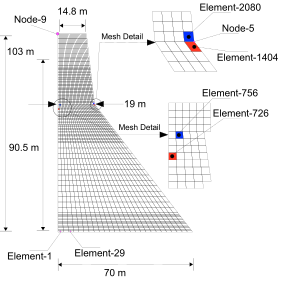{#fig-ch7-sec7-1}
:::

Further, the concrete material in the dam is modeled by using the co-axially rotating crack model (CRCM) which is described in the previous section. The material parameters for the concrete dam are selected as follows: The elastic modulus ($E$) is $31027$ MPa, the Poisson's ratio ($\nu$) is $0.2$, the mass density ($\rho$) is $2643$ Kg/m${}^{3}$, the ultimate tensile strength ($\sigma_{t}$) is $1.5$ MPa and the fracture energy ($G_{f}$) is $150$ N/m. Dynamic loading affects the concrete material parameters. Elastic modulus of concrete is generally considered to be less sensitive to strain rate than the tensile strength and fracture energy [@Bhattacharjee1993]. Due to strain rate effects, the tensile strength and the fracture energy are increased by $20\%$ approximately, leading to the values of $1.8$ MPa and $180$ N/m. Further, damping in the concrete dam is modeled by Rayleigh damping with critical damping ratio of $5\%$ in the fundamental vibration mode of the dam alone with no cracking. The resultant values of damping coefficients are $\alpha=0.0026$ and $\beta=0.9676$.

Numerical simulations are carried out for the horizontal and vertical components of the Koyna accelerogram (@fig-ch7-2) without considering the hydrodynamic interactions between the dam and reservoir. A uniform time step size $\Delta t=0.01$ s is adopted for time integration, and the resultant unsymmetrical system of linear equations is solved by using the GpBiCG algorithm with tolerance value of $1.0\times10^{-6}$. In this section, dynamic response of the dam is computed by using following three different v-ST/FEM schemes:

1.  *v-ST/FEM-1*, which represents the v-ST/FEM with a three-point Gauss-Lobatto integration rule for computing @eq-ch7-43 and @eq-ch7-46 (see also @eq-ch7-50). In finite element implementation of CRCM, average of spatial-integration point strains is taken as representative of the behavior of the spatial-element as a whole.

2.  *v-ST/FEM-2*, which represents the v-ST/FEM with a two-point Gauss-Legendre integration rule for computing @eq-ch7-43 and @eq-ch7-46 (see also @eq-ch7-49). In finite element implementation of CRCM, average of spatial-integration point strains is taken as representative of the behavior of the spatial-element as a whole.

3.  *v-ST/FEM-3*, which represents the v-ST/FEM with a two-point Gauss-Legendre integration rule for computing @eq-ch7-43 and @eq-ch7-46 (see also @eq-ch7-49). In finite element implementation of CRCM, average of space-time integration point strains is taken as representative of the behavior of the space-time element as a whole.

:::{.column-margin}
{#fig-ch7-sec7-2}
:::

## Results for *v-ST/FEM-1* scheme

This section examines the cracking effects of the concrete material on the seismic response of the concrete dam. In linear analysis isotropic, homogeneous, linear elastic stress-strain relationship is used for the concrete whereas for nonlinear analysis material behavior is modeled by CRCM. *v-ST/FEM-1* with tolerance in residual and velocity set to $1.0\times10^{-3}$ (see @eq-ch7-69 and @eq-ch7-70) is employed to compute the nonlinear response of the Koyna dam.

@fig-ch7-sec7-3 and  @fig-ch7-sec7-5 show the time history graphs of the horizontal and vertical components of the displacement, velocity, and acceleration at node-9 [^6] and node-5 [^7] of the dam, respectively. Due to the infinite rigidity of the foundation, a stress concentration induces a crack at the base of the dam. At time $t=1.89$ sec, the heel of the dam (element-1 in @fig-ch7-sec7-1) softens completely (i.e., $\eta \approx 0$) which corresponds to the case of complete fracture of that element, subsequently, the crack propagates horizontally in the downstream direction along the base of the dam. The cracks at the base of the dam then extend to an approximate distance of $13$ m from the heel of the dam. During the upstream movement of the dam around $t=2.94$ sec element-2080 in the dam starts softening. The crack, however, does not propagate instantaneously since more elements at the base of the dam continue softening. The spatial distribution of CRCM parameter $\eta$, which indicates the strength reduction of the material in the direction normal to the fractured plane, at time $t=2.73$ sec is depicted in @fig-ch7-sec7-9 and the corresponding deformed configuration of the dam is plotted in @fig-ch7-sec7-10.

[^6]: Node-9 corresponds to the crest of the dam see @fig-ch7-sec7-1

[^7]: Node-5 corresponds to the point at the downstream face of the dam where discontinuity in the slope of the downstream face occurs as shown in @fig-ch7-sec7-1

During the upstream movement of the dam, around time $t=3.91$ sec, a fully opened crack appears in the element-2080 which subsequently propagates in the horizontal direction towards the downstream face of the dam. This process forms a localized band of cracked elements in the neck-area of the dam which can be seen from the deformed configuration of the dam given in @fig-ch7-sec7-10 b. @fig-ch7-sec7-9 b depicts the spatial distribution of the CRCM parameter, $\eta$, at time $t=3.91$ sec, where it is noteworthy that due to the upstream movement of the dam cracks at the base are closed. The continued upstream movement of the dam causes the cracks in the neck-area of the dam to propagate in the downward direction towards the upstream face of the dam (see @fig-ch7-sec7-9 c and @fig-ch7-sec7-10 c). Subsequently, the downstream movement of the dam causes new cracks at the base and the upstream face of the dam. In addition during this time, the band of cracks near the element-2080 starts to close. Accordingly, the elements in this regime momentarily gain their original compressive strength (see @fig-ch7-sec7-7). Spatial distribution of the CRCM parameter, $\eta$, and deformed configuration of the dam at time $t=4.15$ sec are presented in @fig-ch7-sec7-9 d and @fig-ch7-sec7-10 d depict, respectively.

The maximum displacement at node-9 of the dam in the upstream direction occurs at time $t=4.35$ sec as depicted in @fig-ch7-sec7-3 . At this instant, the spatial distribution of the CRCM parameter, $\eta$, and the corresponding deformed configuration of the dam are illustrated in @fig-ch7-sec7-9 e and @fig-ch7-sec7-10 e, respectively. The maximum horizontal and vertical displacement of the node-9, which occurs at time $t=4.55$ sec as depicted in @fig-ch7-sec7-3, corresponds to the situation where element-726 at the upstream face of the dam undergoes a complete strain-softening. This is confirmed by the deformed configuration of the dam at time $t=4.55$ given in @fig-ch7-sec7-10 f. The spatial distribution of the parameter $\eta$, which is given in @fig-ch7-sec7-9 f, shows the localization of a crack band meeting the downstream crack profile in the dam interior. At this time, the cracks near the downstream face close as the dam swings towards the downstream direction. Accordingly, the maximum compressive principal stresses inside the element-2080 of the dam achieve a peak value of $9$ MPa around this time (see @fig-ch7-sec7-7). At this instant the entire neck of the dam is damaged, and the subsequent motion of the cracked dam is dominated by rigid-body rocking of the upper portion of the dam.

From the time-history graphs of displacement, velocity and acceleration plotted in @fig-ch7-sec7-3 (at node-9) and @fig-ch7-sec7-5 (at node-5) it is evident that the vibration period of the dam increases due to crack propagation in the dam. This effect is clearly visible in the corresponding Fourier spectrums presented in @fig-ch7-sec7-4 and @fig-ch7-sec7-6, where the cracking in concrete dam shifts the spectrum towards the lower frequency regime.

The time history graphs of the maximum tensile and compressive principal stresses occurred in the element-1, element-726, and element-2080 are plotted in @fig-ch7-sec7-7. [^8] The maximum tensile principal stresses for the linear case take larger peak values while the maximum peak values of those for the nonlinear case are about the tensile strength of the concrete. In @fig-ch7-sec7-7 it is visible that the tensile strength of an element is completely removed after the cracking. The maximum compressive principal stresses for linear case also generally take larger peak values than those for nonlinear case. However, in situations where a crack closes completely (i.e., $\mu \ge 0.95$), peak values of the maximum compressive principal stresses in nonlinear case are slightly more than the peak values of those for the linear case (see @fig-ch7-sec7-7). Lastly, the evolution of CRCM parameter $\eta$ in selected elements of the Koyna dam is depicted in @fig-ch7-sec7-8.

[^8]: Element-1 is located at the base of the dam, element-726 is located at upstream face of the dam, and element-2080 is located at the downstream face of the dam where the discontinuity in the slope occurs as shown in @fig-ch7-sec7-1.

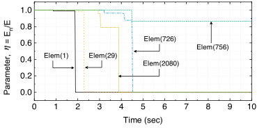{#fig-ch7-sec7-8}

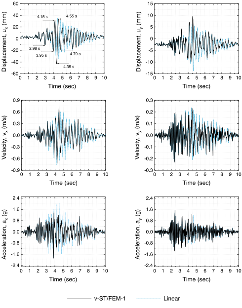{#fig-ch7-sec7-3}

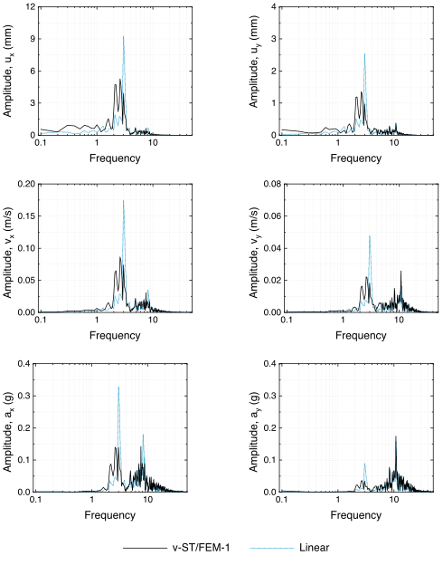{#fig-ch7-sec7-4}

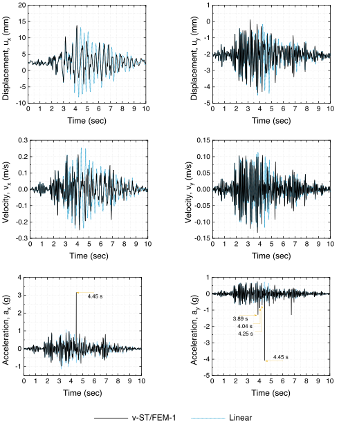{#fig-ch7-sec7-5}

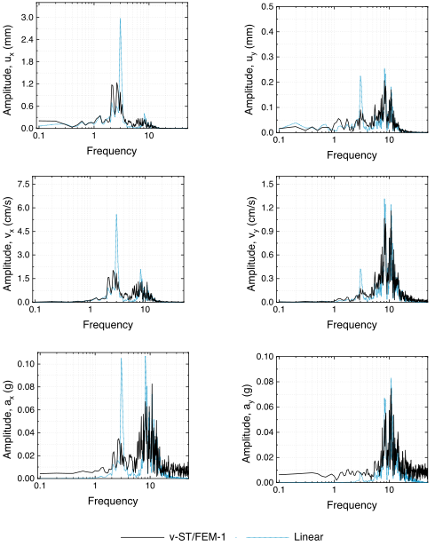{#fig-ch7-sec7-6}

{#fig-ch7-sec7-7}

{#fig-ch7-sec7-9}

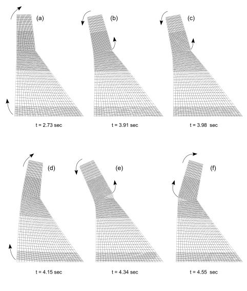{#fig-ch7-sec7-10}

## Results for *v-ST/FEM-2* scheme

In this section, the nonlinear dynamic response of the Koyna dam is computed by using the *v-ST/FEM-2* with the tolerance in residual and velocity is set to $1.0\times10^{-3}$. The analysis terminates at about $6.8$ sec because of an energy balance error during the rigid body rocking of the upper part of the dam body. @fig-ch7-sec7-11  and @fig-ch7-sec7-12 compare the temporal variation of the displacement, velocity and acceleration at node-9 and node-5 of the dam obtained by employing *v-ST/FEM-1* and *v-ST/FEM-2*. The results obtained by using *v-ST/FEM-2* are nearly identical to those obtained by using the *v-ST/FEM-1*. The spatial distribution of the CRCM parameter $\eta$ and the deformed configuration of the dam at selected times are given in @fig-ch7-sec7-14 and @fig-ch7-sec7-15, respectively, which is nearly identical to those obtained in case of $v-ST/FEM-1$ (see @fig-ch7-sec7-9) and @fig-ch7-sec7-10. The evolutions of CRCM parameter $\eta$ in element-726 and element-2080 obtained by using *v-ST/FEM-1* and *v-ST/FEM-2* are plotted in @fig-ch7-sec7-13 which further confirm that these two schemes predict the event of cracking nearly at the same time.

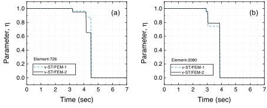{#fig-ch7-sec7-13}

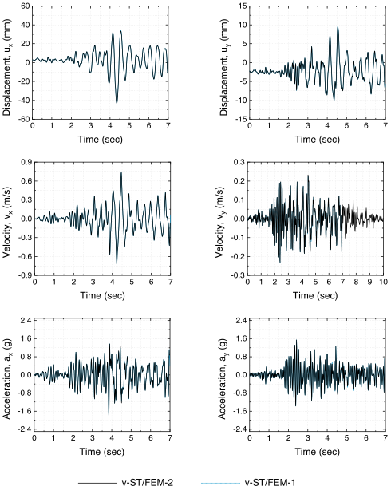{#fig-ch7-sec7-11}

{#fig-ch7-sec7-12}

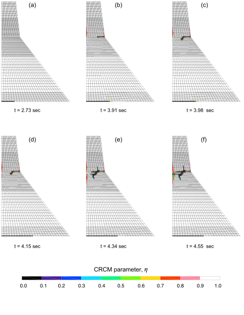{#fig-ch7-sec7-14}

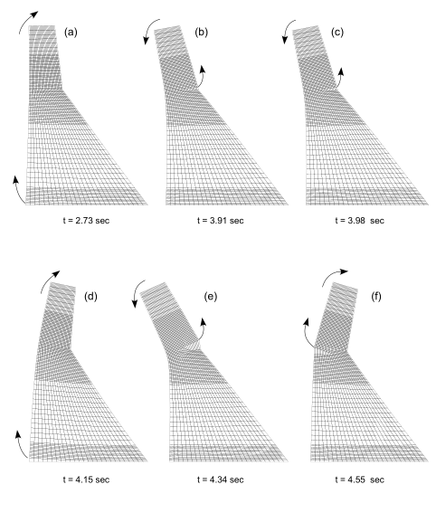{#fig-ch7-sec7-15}

## Results for *v-ST/FEM-3* scheme

In this section, the nonlinear dynamic response of the Koyna dam is computed by using the *v-ST/FEM-3* with the tolerance in residual and velocity is set to $1.0\times10^{-2}$. Unlike *v-ST/FEM-2* this scheme could converge for all the time steps. @fig-ch7-sec7-16 and @fig-ch7-sec7-17 compare the displacements, velocity, and acceleration time history at node-9 and node-5 obtained by using *v-ST/FEM-3* with those obtained by *v-ST/FEM-1* and *v-ST/FEM-2*.

The spatial distribution of the CRCM parameter (@fig-ch7-sec7-19), $\eta$, and the corresponding deformed configuration (@fig-ch7-sec7-20) of the dam obtained by using *v-ST/FEM-3* are consistent with those obtained by using other v-ST/FEM schemes. Evolution of the CRCM parameter, $\eta$, in different v-ST/FEM schemes is plotted in @fig-ch7-sec7-18 which confirms that the events of cracking predicted by the proposed schemes are nearly identical with the each other.

Furthermore, it should be noted that in case of *v-ST/FEM-3* the dynamic response is obtained at relatively low tolerance value. It is remarkable that the numerical solutions obtained by using the *v-ST/FEM-3* at low tolerance are nearly identical to those obtained by using the *v-ST/FEM-1* and *v-ST/FEM-2* at relatively high tolerance. In addition, the use of space-time averaged strains as representative of the behavior of the space-time element as a whole significantly improves the convergence of the numerical scheme.

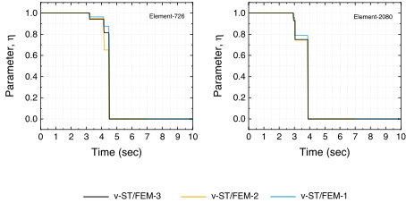{#fig-ch7-sec7-18}

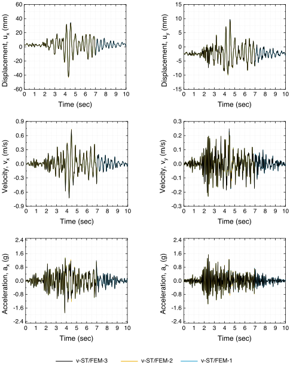{#fig-ch7-sec7-16}

{#fig-ch7-sec7-17}

{#fig-ch7-sec7-19}

{#fig-ch7-sec7-20}

## Dynamic response of nonlinear dam including hydrodynamic effects

In this section, the nonlinear dynamic fracture analysis of Koyna concrete gravity dam subjected to the earthquake motion is performed including the dynamic interactions between the dam and reservoir. The physical dimensions, finite element mesh and the material properties of the concrete dam are identical to the those presented in the previous section. The height of water in the reservoir, $H_{f}$, is assumed to be constant at a value of $90.5$ m. Reservoir domain is truncated by placing a viscous boundary at a distance of $412$ m, which is four times the height of the concrete dam, from the dam in the upstream direction. @fig-ch7-sec8-1 depicts the finite element mesh of the reservoir used for the numerical simulations. The speed of acoustic wave in water is $1439$ m/s, and the mass density of the water is $1000$ kg/m${}^{3}$. The wave reflection coefficient $\alpha _{b}$ for reservoir bottom is taken as unity (i.e., reservoir bottom acts as a perfect reflector for the hydrodynamic pressure waves). Numerical simulations are carried out for the horizontal and vertical components of the Koyna accelerograms plotted in @fig-ch7-sec7-2. The dam-reservoir interactions are modeled by solving the system of coupled equations using the v-ST/FEM and the block-iterative scheme presented in this chapter. For time integration a uniform time step size $\Delta t = 0.01$ sec is adopted, and GpBiCG algorithm with tolerance value of $1.0\times10^{-6}$ is used to solve the resultant unsymmetrical system of linear equations.

{#fig-ch7-sec8-1}

## Results for *v-ST/FEM-1* scheme (including hydrodynamic effects)

This section examines the cracking effects of the concrete material on the seismic response of the concrete dam. In linear analysis isotropic, homogeneous, linear elastic stress-strain relationship is used for the concrete whereas for nonlinear analysis material behavior is modeled by CRCM. *v-ST/FEM-1* with tolerance in residual and velocity set to $1.0\times10^{-3}$ (see @eq-ch7-69 and @eq-ch7-70) is employed to compute the nonlinear response of the Koyna dam.

@fig-ch7-sec8-2 and @fig-ch7-sec8-4 show the time history graphs of the horizontal and vertical components of the displacement, velocity, and acceleration at node-9 and node-5 of the dam, respectively. Around time $t=1.82$ sec, element-1 near the heel of the dam (see @fig-ch7-sec7-1) softens completely (i.e., $\eta \approx 0$). Due to the infinite rigidity of the foundation during the downstream motion of the dam, the cracks propagate in the downstream direction along the base of the dam. At time $t=2.30$ sec the cracks at the base of the dam extend to an approximate distance of $17$ m from the heel of the dam. 

During the upstream movement of the dam, around time $t=2.46$ sec, significant strain softening occurs (i.e., $\eta \approx 0$) in element-1404 located near the discontinuity in the slope of the downstream face (see @fig-ch7-sec8-7). The crack quickly propagates in the horizontal direction towards the downstream face of the dam. Thus a localized band of cracked elements forms in the neck-area of the dam. Both the deformed configuration of the dam given in @fig-ch7-sec8-9 a and the spatial distribution of the CRCM parameter, $\eta$, given in @fig-ch7-sec8-8 a confirms this. In the later figure, it is noteworthy that due to the upstream movement of the dam cracks at the base are closed. Subsequently, the downstream movement of the dam causes severe cracks at the upstream face. 

At time $t=2.70$ sec the crack profile and the corresponding deformed configuration of the dam are given in @fig-ch7-sec8-8 b and @fig-ch7-sec8-9 b, respectively. During this time, the cracks near the vicinity of element-1404 start closing. Therefore, elements in this regime momentarily gain their original compressible strength (see @fig-ch7-sec8-6). The maximum displacement at node-9 of the dam in the upstream direction occurs at time $t=4.00$ sec as shown in @fig-ch7-sec8-2. Consequently, during this time, vertical displacement at node-5 of the dam achieves a peak value (see @fig-ch7-sec8-4) which corresponds to the maximum opening state of the crack at the downstream face. At this instant, the spatial distribution of the CRCM parameter, $\eta$, and the corresponding deformed configuration of the dam are illustrated in @fig-ch7-sec8-8 d and @fig-ch7-sec7-9 d, respectively. 

Note that the cracks at the upstream face are in the closed state due to the upstream motion of the dam. However, these closed cracks open again when the dam swings back in the downstream direction leading to a maximum displacement of the node-9 in both horizontal and vertical directions (see @fig-ch7-sec8-2). The spatial distribution of the CRCM parameter, $\eta$, and the corresponding deformed configuration of the dam at time $t=4.17$ are given in @fig-ch7-sec8-8 e and @fig-ch7-sec8-9 e, respectively. The cracks at the downstream face are in the closed state due to the downstream motion of the dam. Accordingly, the maximum compressive principal stress inside the element-1404 of the dam achieve a peak value of $10$ MPa around this
time (see @fig-ch7-sec8-6). 

At this instant the entire neck of the dam is damaged, and the subsequent motion of the cracked dam is dominated by rigid-body rocking of the upper portion of the dam. From the time-history graphs of displacement, velocity and acceleration plotted in @fig-ch7-sec8-2 (at node-9) and @fig-ch7-sec8-4 (at node-5) it is evident that the vibration period of the dam increases due to crack propagation in the dam. This effect is clearly visible in the corresponding Fourier spectrums presented in @fig-ch7-sec8-3 and @fig-ch7-sec8-5, where the cracking in concrete dam shifts the spectrum towards the lower frequency regime. The time history graphs of the maximum tensile and compressive principal stresses occurred in the element-1 and element-1404 are plotted in @fig-ch7-sec8-6.[^9] 

The maximum tensile principal stresses for the linear case take larger peak values while the maximum peak values of those for the nonlinear case are about the tensile strength of the concrete. In @fig-ch7-sec8-6 it is visible that the tensile strength of an element is completely removed after the cracking. The maximum compressive principal stresses for linear case also generally take larger peak values than those for nonlinear case. However, in situations where a crack closes completely (i.e., $\mu \ge 0.95$), peak values of the maximum compressive principal stresses in nonlinear case are slightly more than the peak values of those for the linear case (see @fig-ch7-sec8-6). Lastly, the evolution of the CRCM parameter, $\eta$, in selected elements of the Koyna dam is depicted in @fig-ch7-sec8-7.

[^9]: Element-1 is located at the base of the dam, and element-1404 is located at the downstream face of the dam where the discontinuity in the slope occurs as shown in @fig-ch7-sec7-1.

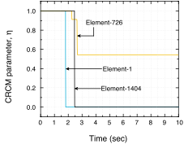{#fig-ch7-sec8-7}

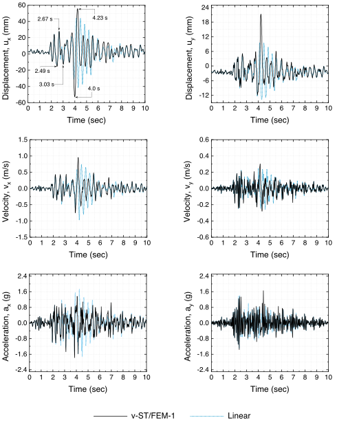{#fig-ch7-sec8-2}

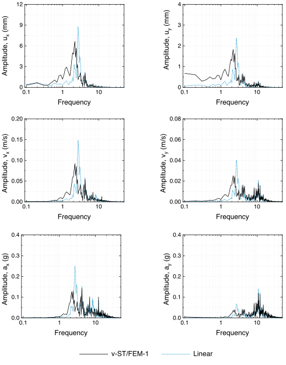{#fig-ch7-sec8-3}

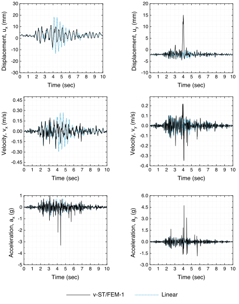{#fig-ch7-sec8-4}

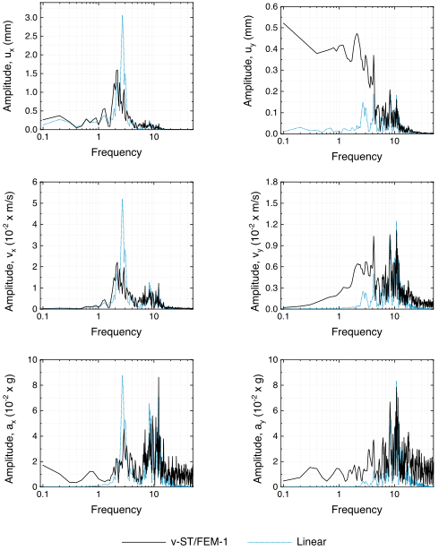{#fig-ch7-sec8-5}

{#fig-ch7-sec8-6}

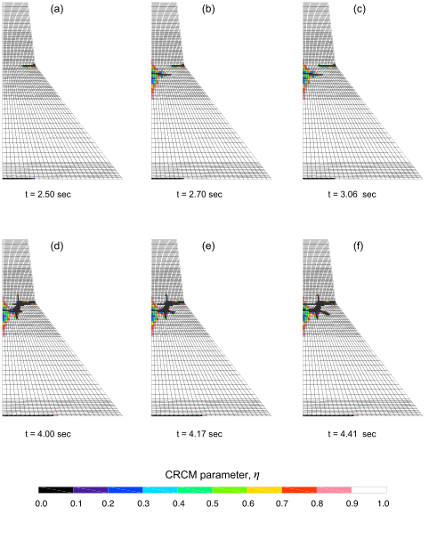{#fig-ch7-sec8-8}

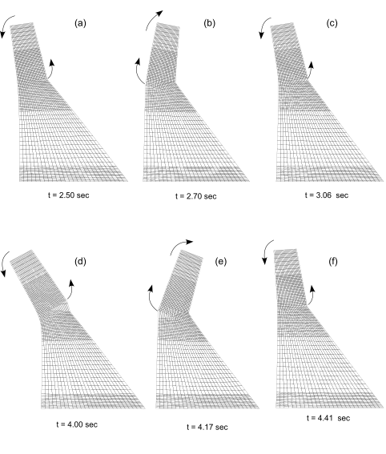{#fig-ch7-sec8-9}

## Results for *v-ST/FEM-3* scheme (including hydrodynamic effects)

In this section, the nonlinear dynamic response of the Koyna dam is computed by using the *v-ST/FEM-3* with the tolerance in residual and velocity $1.0\times10^{-2}$. @fig-ch7-sec8-10 and @fig-ch7-sec8-11 successfully compare the numerical solutions at node-9 and node-5 obtained by using the *v-ST/FEM-1* and *v-ST/FEM-3*. Spatial distribution of the CRCM parameter, $\eta$, and the deformed configuration of the dam are given in @fig-ch7-sec8-12 and @fig-ch7-sec8-13, respectively. The events of cracking predicted by the both schemes are nearly identical with the each other. Note that *v-ST/FEM-3* results are obtained at relatively low tolerance value compare to the *v-ST/FEM-1*. It is remarkable that the numerical solutions obtained by using the *v-ST/FEM-3* at low tolerance are nearly identical to those obtained by using the *v-ST/FEM-1*. In addition, the use of space-time averaged strains as representative of the behavior of the space-time element as a whole significantly improves the convergence of the numerical scheme.

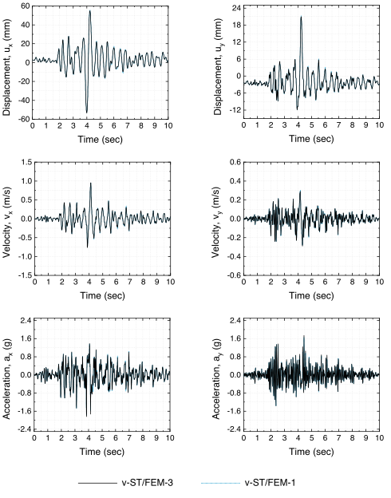{#fig-ch7-sec8-10}

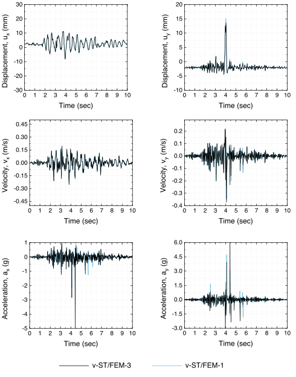{#fig-ch7-sec8-11}

{#fig-ch7-sec8-12}

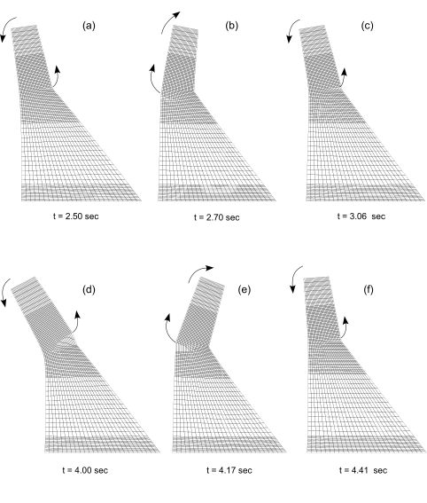{#fig-ch7-sec8-13}
