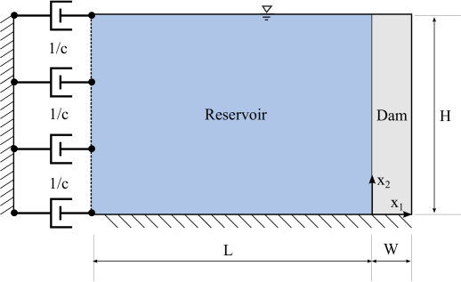
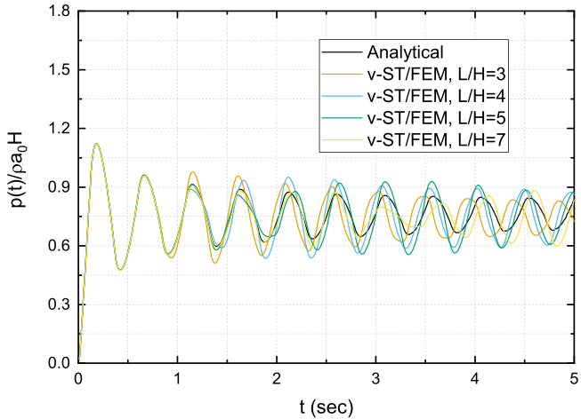
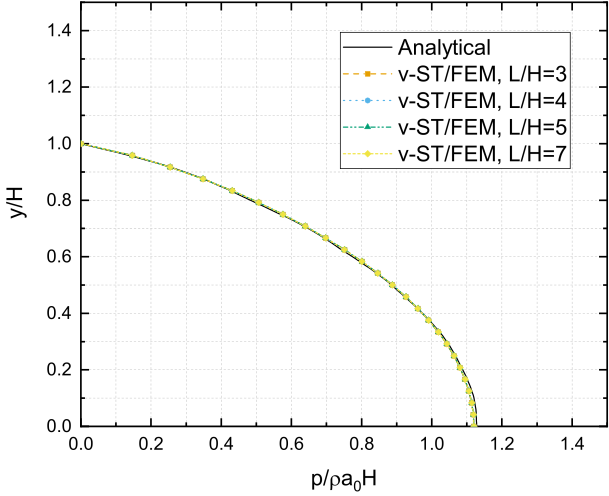
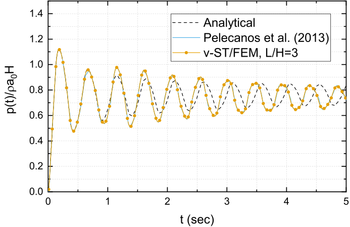
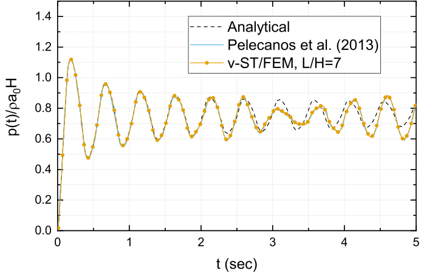
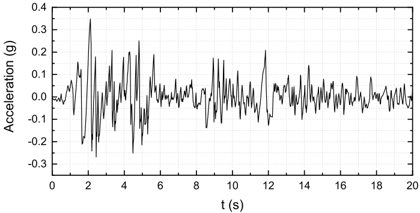
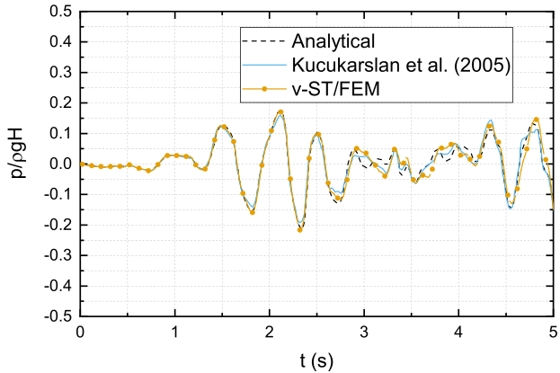
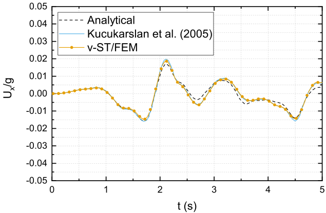
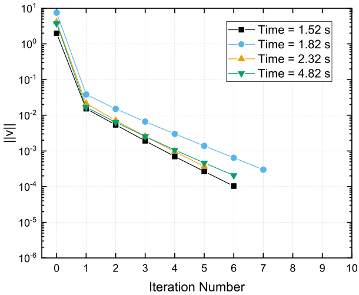
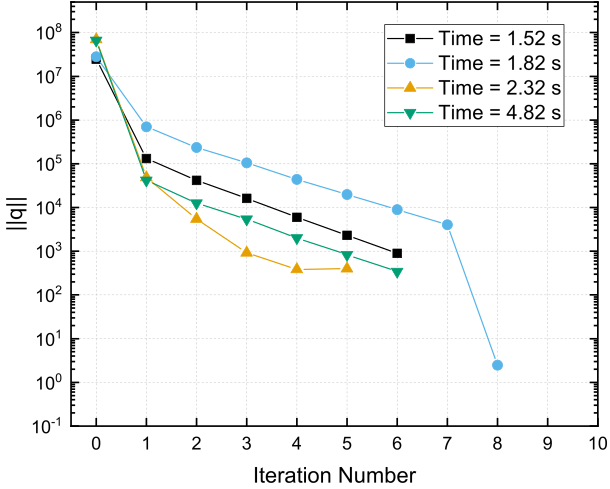

# VSTFEM for dynamic SSI in dam-reservoir system

This chapter discusses the problem of dynamic interaction in a dam-reservoir-soil system subjected to the earthquake motion. Both dam and the underlying soil domain is assumed to be linearly elastic, and material damping can be modeled by Rayleigh damping. The water in the reservoir is assumed to be inviscid, linearly compressible with a small amplitudes for the displacements and velocity. Therefore, the hydrodynamic pressure in the reservoir is modeled by the pressure wave equation. Viscous boundary conditions are employed to truncate the semi-infinite domain of reservoir and underlying soil-domain. The space-time finite element formulation for coupled problem is described in terms of velocity field in the solid domain and the auxiliary variable $q$ for the fluid domain, which denotes the first order time derivative of the hydrodynamic pressure field. Subsequently, a system of linearly coupled equations is obtained by the space-time finite element discretization of the weak form. The resultant system of linear equations is solved for the space-time nodal values of unknown fields $q$ and $\mathbf{v}$ by using a two stage block-iterative scheme. Due to this scheme the size of the coupled-problem significantly decreases but at the cost of around 5 to 10 iterations per time steps. In each iteration step, first, a system of linear equations (which corresponds to the solid domain) is solved to compute the trial values of velocity field, and then the space-time nodal values of auxiliary variable $q$ are computed by solving another system of linear equations (which corresponds to the fluid domain). The numerical performance of the proposed scheme is demonstrated by solving different types dam-reservoir interaction problems. The results obtained by the proposed scheme are successfully compared with results available in the literature.

Lastly, the response of a concrete gravity dam and reservoir with impounded water to the horizontal component of the earthquake motion is analyzed by using v-ST/FEM. Numerical simulations are performed for two cases; (i) DR, in which the interactions between the dam-reservoir and the underlying soil are ignored by assuming the ground to be perfectly rigid, (ii) DRS, in which the underlying soil domain is modeled as an isotropic, homogenous, linear elastic half space. Material damping in both dam and underlying soil domain is modeled by using Rayleigh damping. It is found that the dynamic interactions with the underlying deformable soil domain can significantly dampen the response of the dam-reservoir to the horizontal component of earthquake motion. The comparison of Fourier spectrum of acceleration response obtained for these two cases reveals an elongation of time period for DRS. In both cases, significant tensile stresses develop near the heel and at the downstream inclined face of the dam. The tensile and compressible stresses in the dam are much higher in case of DR than DRS. However, in both cases the tensile stress may exceed the ultimate tensile strength of the concrete which may cause cracking in the dam. Therefore, a nonlinear analysis of concrete gravity dam and reservoir system should be performed to evaluate the safety and performance of a specific dam design.

## v-ST/FEM formulation

Let $\Omega^{f}_{h}$, the set of finite spatial fluid-elements $\Omega^{f}_{e}, e=1,\cdots,n^{f}_{el}$, be the discretization of reservoir domain $\Omega^{f}$, where $n^{f}_{el}$ is the total number of spatial fluid elements in $\Omega^{f}_{h}$. Further, let $\Omega^{s}_{h}$, the set of finite spatial solid-elements $\Omega^{s}_{e}$, $e=1,\cdots, n_{el}$, be the discretization of solid domain $\Omega^{s}$, where $n_{el}$ is the total number of spatial elements in $\Omega_{h}$. Now, consider a non-uniform subdivision for the time domain $[0,T]$, $0=t_{0}<t_{1}<\cdots < t_{N}=T$ with $I_{n}=(t_{n},t_{n+1})$, $\Delta t = t_{n+1}-t_{n}$. The $n^{th}$ space-time slab for fluid domain $Q^{f}_{n}=\Omega^{f}_{h} \times I_{n}$ and for solid domain $Q^{s}_{n}=\Omega^{s}_{h} \times I_{n}$, and corresponding space-time finite element for fluid domain $Q^{f}_{n,e}=\Omega^{f}_{e}\times I_{n}, e=1,\cdots, n^{f}_{el}$, and for solid domain $Q^{s} _{n,e}=\Omega^{s}_{e} \times I_{n}, e=1,\cdots, n_{el}$.

Let us now consider $\mathcal{P}_{l}(Q_{n,e}^{f})$ and $\mathcal{P}_{l}(Q^{s}_{n,e})$, the collection of all polynomials defined on $Q_{n,e}^{f}$ and $Q^{s}_{n,e}$, respectively, with a total degree of no more than $l$. Let the space of piecewise continuous functions defined on domain $(\ast)$ is given by $C^{0}(\ast)$. Consider also the following collection of functions: 

$$
\mathfrak{F}_{l,h}^f: = \left\{ {\left. {{p^h}} \right|{p^h} \in {C^0}\left( {\bigcup\nolimits_{n = 0}^{N - 1} {Q_n^f} } \right),\left. {{p^h}} \right|Q_{n,e}^f \in {\mathcal{P}_l}\left( {Q_{n,e}^f} \right)} \right\}
$$ {#eq-ch6-23}

$$
{\mathfrak{F}^{s}_{l,h}}: = \left\{ {\left. {{{\mathbf{u}}^h}} \right|{{\mathbf{u}}^h} \in {C^0}{{\left( {\bigcup\nolimits_{n = 0}^{N - 1} {{Q^{s}_n}} } \right)}^2},\left. {{{\mathbf{u}}^h}} \right|Q^{s}_{n,e} \in {{\left( {{\mathcal{P}_l}\left( {Q_{n,e}^{s}} \right)} \right)}^2}} \right\}
$$ {#eq-ch6-24}

where ${\left. {{p^h}} \right|Q^{f}_{n,e}}$ and ${\left. {{{\mathbf{u}}^h}} \right|Q^{s}_{n,e}}$ is the restriction of $p^{h}(\mathbf{x},t)$ to $Q^{f}_{n,e}$ and restriction of $\mathbf{u}^{h}(\mathbf{x},t)$ to $Q^{s} _{n,e}$, respectively.

The space of the test functions for the fluid-domain is

$$
{\mathscr{Q}^h}: = \left\{ {\left. {{q^h}} \right|{q^h} \in \mathfrak{F}_{l,h}^f,{q^h} = 0,\forall \left( {{\mathbf{x}},t} \right) \in \Gamma _f^f \times {I_n}} \right\}
$$ {#eq-ch6-25}

and the space of trial functions is same as the space of test function, i.e. 

$$
S_p^h = {\mathscr{Q}^{h}}
$$ {#eq-ch6-26}

The space of the test functions for the solid domain is

$$
{V^h}: = \left\{ {\left. {{{\mathbf{v}}^h}} \right|{{\mathbf{v}}^h} \in \mathfrak{F}_{l,h},{{\mathbf{v}}^h} = 0,\forall \left( {{\mathbf{x}},t} \right) \in \Gamma _i^g \times {I_n}}, i=1,2 \right\}
$$ {#eq-ch6-27}

and the space of trial functions for solid domain is

$$
S_v^h: = \left\{ {\left. {{{\mathbf{v}}^h}} \right|{{\mathbf{v}}^h} \in \mathfrak{F}_{l,h},v_i^h = {{\dot g}_i},\forall \left( {{\mathbf{x}},t} \right) \in \Gamma _i^g \times {I_n},i = 1,2} \right\}
$$ {#eq-ch6-28}

In order to obtain the space-time weak form of pressure-wave equation Eq. [\[eq-ch6-1\]](#eq-ch6-1){reference-type="eqref" reference="eq-ch6-1"} is rewritten as 

$$
\frac{1}{{{c^2}}}\frac{{\partial q}}{{\partial t}} - \frac{{{\partial ^2}p}}{{\partial x_i^2}} = 0
$$ {#eq-ch6-29} 

where $q(\mathbf{x},t)$ is the auxiliary variable given by

$$
q=\frac{\partial p}{\partial t}
$$ {#eq-ch6-30}

and 

$$
p\left( {{\mathbf{x}},t} \right) = p\left( {{\mathbf{x}},{t_n}} \right) + \int_{{t_n}}^t {q\left( {{\mathbf{x}},\tau } \right)d\tau \quad \,\forall \left( {{\mathbf{x}},\tau } \right) \in {\Omega ^f} \times \left[ {{t_n},t} \right]}
$$ {#eq-ch6-31}

## v-ST/FEM weak form for dam-reservoir system

The v-ST/FEM weak-form of strong-form presented in the previous Chapter can be stated as; Find $\mathbf{v}\in S^{h}_{v}$ and $q\in S^{h}_{p}$ such that for all $\delta \mathbf{v}\in V^{h}$, $\delta q \in \mathscr{Q}^{h}$, and for all $n=1,\cdots , N-1$, @eq-ch6-32 and @eq-ch6-33 hold true.

$$
\begin{split}
& \int_{{I_n}}^{} {\int_{\Omega _h^f}^{} {\delta q\frac{1}{{{c^2}}}\frac{{\partial q}}{{\partial t}}d\Omega dt} } + \int_{\Omega _h^f}^{} {\delta q\left( {{\mathbf{x}},{t_n}} \right)\frac{1}{{{c^2}}}q\left( {{\mathbf{x}},t_n^ + } \right)d\Omega } \\
& - \int_{\Omega _h^f}^{} {\delta q\left( {{\mathbf{x}},{t_n}} \right)\frac{1}{{{c^2}}}q\left( {{\mathbf{x}},t_n^ - } \right)d\Omega } \\ 
& + \int_{{I_n}}^{} {\int_{\Omega _h^f}^{} {\frac{{\partial \delta q}}{{\partial {x_i}}}} \frac{{\partial p}}{{\partial {x_i}}}d\Omega dt}+ \int_{{I_n}}^{} {\int_{\Gamma _{fd}^f}^{} {\delta q{\rho ^f}\frac{{\partial {v_i}}}{{\partial t}}n_i^fdsdt} } \\
& + \int_{{I_n}}^{} {\int_{\Gamma _{fs}^f}^{} {\delta q{\rho ^f}a_i^gn_i^fdsdt} } + \int_{{I_n}}^{} {\int_{\Gamma _{fs}^f}^{} {\delta q{\rho ^f}{q_c}qdsdt} } \\
& + \int_{{I_n}}^{} {\int_{\Gamma _\infty ^f}^{} {\delta q\frac{1}{c}qdsdt} } - \int_{{I_n}}^{} {\int_{\Gamma _\infty ^f}^{} {\delta q\frac{1}{c}{q^f}dsdt} } = 0
\end{split}
$$ {#eq-ch6-32}

$$
\begin{split}
& \int_{{I_n}}^{} {\int_{{\Omega^{s}_h}}^{} {{\rho ^s}\delta {v_i} \frac{\partial {v_i}}{\partial t} d\Omega dt} } + \int_{{\Omega^{s}_h}}^{} {{\rho ^s}\delta {v_i}\left( {{\mathbf{x}},t_n^ + } \right){v_i}\left( {\mathbf{x},t_n^ + } \right)d\Omega } \\
& - \int_{{\Omega^{s}_h}}^{} {{\rho ^s}\delta {v_i}\left( {{\mathbf{x}},t_n^ + } \right){v_i}\left( {x,t_n^ - } \right)d\Omega } + \int_{{I_n}}^{} {\int_{{\Omega^{s}_h}}^{} {\frac{{\partial \delta {v_i}}}{{\partial {x_j}}}{C_{ijkl}}{\psi _{kl}}d\Omega dt} } \\ 
& - \int_{{I_n}}^{} {\int_{\Gamma_i^h}^{} {\delta {v_i}f_i^sdsdt} } - \int_{{I_n}}^{} {\int_{{\Omega^{s}_h}}^{} {{\rho ^s}\delta {v_i}{b_i}d\Omega dt} }  \\
& + \int_{{I_n}}^{} {\int_{\Omega _h^s}^{} {\frac{{\partial \delta {v_i}}}{{\partial {x_j}}}\sigma _{ij}^nd\Omega dt} }  + \int_{{I_n}}^{} {\int_{\Gamma _{fd}^s}^{} {\delta {v_i}\left( {p + {p_0}} \right)n_i^sdsdt} }  = 0
\end{split}
$${#eq-ch6-33}

In @eq-ch6-32 and @eq-ch6-33, $n^{f}_{i}$ and $n^{s}_{i}$ are the components of outward normal vector at the fluid and solid boundary, respectively. Hydrodynamic pressure $p$ and displacements $\mathbf{u}$ are obtained by consistent integration of $q$ and $\mathbf{v}$, respectively, and $q^{f}$ is related to the free-field hydrodynamic pressure by 

$$
{q^f} = \frac{{\partial {p^f}}}{{\partial t}}
$$ {#eq-ch6-34} 

In @eq-ch6-33 $C_{ijkl}$ and $\psi_{ij}$ are given by 

$$
{C_{ijkl}} = \lambda {\delta _{ij}}{\delta _{kl}} + \mu \left( {{\delta _{ik}}{\delta _{jl}} + {\delta _{il}}{\delta _{jk}}} \right)
$$ {#eq-ch6-35}

$$
{\psi _{ij}} = \int_{{t_n}}^t {\frac{{\partial {v_i}\left( {{\mathbf{x}},\tau } \right)}}{{\partial {x_j}}}d\tau \quad \,\forall t \in {I_n},\forall {\mathbf{v}} \in S_v^h}
$$ {#eq-ch6-36}

## v-ST/FEM weak form for dam-reservoir-soil system

The v-ST/FEM weak-form of strong-form presented in @sec-dynamic-ssi-drs-equations can be stated as; Find $\mathbf{v}\in S^{h}_{v}$ and $q\in S^{h}_{p}$ such that for all $\delta \mathbf{v}\in V^{h}$, $\delta q \in \mathscr{Q}^{h}$, and for all $n=1,\cdots , N-1$, @eq-ch6-37 and @eq-ch6-38 hold true.

$$
\begin{split}
& \int_{{I_n}}^{} {\int_{\Omega _h^f}^{} {\delta q\frac{1}{{{c^2}}}\frac{{\partial q}}{{\partial t}}d\Omega dt} } + \int_{\Omega _h^f}^{} {\delta q\left( {{\mathbf{x}},{t_n}} \right)\frac{1}{{{c^2}}}q\left( {{\mathbf{x}},t_n^ + } \right)d\Omega } \\
& - \int_{\Omega _h^f}^{} {\delta q\left( {{\mathbf{x}},{t_n}} \right)\frac{1}{{{c^2}}}q\left( {{\mathbf{x}},t_n^ - } \right)d\Omega } + \int_{{I_n}}^{} {\int_{\Omega _h^f}^{} {\frac{{\partial \delta q}}{{\partial {x_i}}}} \frac{{\partial p}}{{\partial {x_i}}}d\Omega dt} \\
& + \int_{{I_n}}^{} {\int_{\Gamma _{fd}^f}^{} {\delta q{\rho ^f}\frac{{\partial {v_i}}}{{\partial t}}n_i^fdsdt} } + \int_{{I_n}}^{} {\int_{\Gamma _{fs}^f}^{} {\delta q{\rho ^f}\frac{{\partial {v_i}}}{{\partial t}}n_i^fdsdt} } \\ 
& \int_{{I_n}}^{} {\int_{\Gamma _{fs}^f}^{} {\delta q{\rho ^f}{q_c}qdsdt} } + \int_{{I_n}}^{} {\int_{\Gamma _\infty ^f}^{} {\delta q\frac{1}{c}qdsdt} } - \int_{{I_n}}^{} {\int_{\Gamma _\infty ^f}^{} {\delta q\frac{1}{c}{q^f}dsdt} } = 0 
\end{split}
$$ {#eq-ch6-37}

$$
\begin{split}
& \int_{{I_n}}^{} {\int_{{\Omega^{s}_h}}^{} {\delta {v_i}\rho^{s}  \frac{\partial {v_i}}{\partial t} d\Omega dt} } + \int_{{\Omega^{s} _h}}^{} {\delta {v_i}\left( {{\mathbf{x}},t_n^ + } \right)\rho^{s} {v_i}\left( {x,t_n^ + } \right)d\Omega } \\ 
& - \int_{{\Omega^{s} _h}}^{} {\delta {v_i}\left( {{\mathbf{x}},t_n^ + } \right)\rho^{s} {v_i}\left( {x,t_n^ - } \right)d\Omega } - \int_{{I_n}}^{} {\int_{{\Omega^{s} _h}}^{} {\delta {v_i}\rho^{s} {b_i}d\Omega dt} } \\
& + \int_{{I_n}}^{} {\int_{{\Omega^{s} _h}}^{} {\frac{{\partial \delta {v_i}}}{{\partial {x_j}}}\sigma _{ij}^nd\Omega dt} } + \int_{{I_n}}^{} {\int_{{\Omega^{s} _h}}^{} {\frac{{\partial \delta {v_i}}}{{\partial {x_j}}}{C_{ijkl}}{\psi _{kl}}d\Omega dt} } \\
& - \int_{{I_n}}^{} {\int_{\Gamma _i^h}^{} {\delta {v_i}f_i^sdsdt} } + \int_{{I_n}}^{} {\int_{\Gamma _\infty ^R \cup \Gamma _\infty ^L}^{} {\delta {v_i}c_{ij}^v{v_j}dsdt} } \\ 
& + \int_{{I_n}}^{} {\int_{\Gamma _\infty ^B}^{} {\delta {v_i}c_{ip}^h{v_p}dsdt} } - \int_{{I_n}}^{} {\int_{\Gamma _\infty ^R \cup \Gamma _\infty ^L}^{} {\delta {v_i}\left( {c_{ij}^v v^{f}_{j} + {\sigma^{f}_{ij}}{n_j}} \right)dsdt} } \\
& - \int_{{I_n}}^{} {\int_{\Gamma _\infty ^B}^{} {\delta {v_i}2c_{ij}^hv_j^{in}dsdt} } + \int_{{I_n}}^{} {\int_{\Gamma _{fd}^s}^{} {\delta {v_i}(p+p_0)n_i^sdsdt} } + \int_{{I_n}}^{} {\int_{\Gamma _{fb}^s}^{} {\delta {v_i}(p+p_{0})n_i^sdsdt} } = 0 
\end{split}
$$ {#eq-ch6-38}

It is noteworthy that in @eq-ch6-37 the boundary integral defined on upstream truncated boundary $\Gamma^{f}_{\infty}$ corresponds to the @eq-ch6-6. This equation does not include the term $\nabla p^{f} \cdot \mathbf{n}^{f}$ as the dynamic interaction of reservoir-soil is ignored while computing the free-field response.

## Space-time finite element discretization

Let $n_{e}$ and $n^{f}_{e}$ be the total number of nodes in spatial finite element for solid and fluid domain, respectively. Let $v_{i}(\mathbf{x},t_{n}^{+})$ and $v_{i}(\mathbf{x},t_{n+1}^{-})$ be the spatial velocities on the bottom and top faces of space-time slab $Q_{n}$, respectively. Similarly, let $q(\mathbf{x},t_{n}^{+})$ and $q(\mathbf{x},t_{n+1}^{-})$ be the spatial velocities on the bottom and top faces of space-time slab $Q^{f}_{n}$, respectively. Linear interpolation of time $t\in I_{n}$ is given by 

$$
t=T_{1}(\theta) t_{n} + T_{2}(\theta)t_{n+1}, \quad \forall \theta \in [-1,1]
$$ {#eq-ch6-39}

where,

$$
\begin{aligned}
T_{1}(\theta)&=\frac{1-\theta}{2} &
T_{2}(\theta)&=\frac{1+\theta}{2}
\end{aligned}
$$ {#eq-ch6-40}

The test and trial function for velocity defined on $Q_{n,e}$ are given by 

$$
\delta {v_i}\left( {{\mathbf{x}},t} \right){ = ^a}\delta {v_{iI}}{T_a}\left( \theta  \right){N^I}\left( {\xi ,\eta } \right)
$$ {#eq-ch6-41}

$$
{v_i}\left( {{\mathbf{x}},t} \right){ = ^a}{v_{iI}}{T_a}\left( \theta  \right){N^I}\left( {\xi ,\eta } \right)
$$ {#eq-ch6-42}

The displacement field $\mathbf{u}(\mathbf{x},t)$ is computed by consistent integration of @eq-ch6-42.

$$
{u_i}\left( {{\mathbf{x}},t} \right) = {u_i}\left( {{\mathbf{x}},{t_n}} \right) + {{\tilde T}_1}\left( \theta  \right){v_i}\left( {{\mathbf{x}},{t_n}} \right) + {{\tilde T}_2}\left( \theta  \right){v_i}\left( {{\mathbf{x}},{t_{n + 1}}} \right)
$$ {#eq-ch6-43}

further, @eq-ch6-36 becomes

$$
{\psi _{ij}}\left( {{\mathbf{x}},t} \right) = {{\tilde T}_1}\left( \theta  \right)\frac{{\partial {v_i}}}{{\partial {x_j}}}\left( {{\mathbf{x}},{t_n}} \right) + {{\tilde T}_2}\left( \theta  \right)\frac{{\partial {v_i}}}{{\partial {x_j}}}\left( {{\mathbf{x}},{t_{n + 1}}} \right)
$$ {#eq-ch6-44}

where 

$$
\begin{aligned}
{{\tilde T}_1}\left( \theta  \right) &= \frac{{\Delta {t_n}}}{2}\left[ {1 - T_1^2\left( \theta  \right)} \right]
&
{{\tilde T}_2}\left( \theta  \right) &= \frac{{\Delta {t_n}}}{2}T_2^2\left( \theta  \right)
\end{aligned}
$$ {#eq-ch6-45}

The test and trial function for $q(\mathbf{x},t)$ defined on $Q_{n,e}$ are given by 

$$
\delta q\left( {{\mathbf{x}},t} \right){ = ^a}\delta {q_I}{T_a}\left( \theta  \right)N_f^I\left( {\xi ,\eta } \right)
$$ {#eq-ch6-46} 

$$
q\left( {{\mathbf{x}},t} \right){ = ^a}{q_I}{T_a}\left( \theta  \right)N_f^I\left( {\xi ,\eta } \right)
$$ {#eq-ch6-47}

Using @eq-ch6-47 in @eq-ch6-31 to determine the hydrodynamic pressure $p$,

$$
p\left( {{\mathbf{x}},t} \right) = p\left( {{\mathbf{x}},{t_n}} \right) + {{\tilde T}_1}\left( \theta  \right)q\left( {{\mathbf{x}},{t_n}} \right) + {{\tilde T}_2}\left( \theta  \right)q\left( {{\mathbf{x}},{t_{n + 1}}} \right)
$$ {#eq-ch6-48}

In @eq-ch6-39 -- @eq-ch6-48, $i=1,2$ denotes the spatial component along $x_1$ and $x_{2}$ direction, $a=1,2$ denotes the temporal node number, $\theta \in [-1,1]$ denotes the local temporal coordinate, and $(\xi, \eta)$ denotes the local coordinates in the spatial finite element. In @eq-ch6-41 -- @eq-ch6-42 $I=1,\cdots, n_{e}$, and in @eq-ch6-46 -- @eq-ch6-47 $I=1,\cdots, n_{e}^{f}$ denote the local node number of a spatial finite element for dam and reservoir, respectively. The shape function for an $I^{th}$ spatial local node is denoted by $N^{I}$ and $N^{I}_{f}$ for solid and fluid domain, respectively.

## v-ST/FEM discretization for dam-reservoir system

By using the space-time interpolation for $\mathbf{v}$, $\delta \mathbf{v}$, $\mathbf{u}$, $\psi_{ij}$, $p$, $q$, and $\delta q$ in @eq-ch6-32  and @eq-ch6-33 one can obtain the following system of discrete equations.

$$
\left[ {{\mathbf{K}}_{st}^f} \right] \cdot \left\{ {{\mathbf{\tilde q}}} \right\} + \left[ {{\mathbf{H}}_{fd}^f} \right] \cdot \left\{ {{\mathbf{\tilde v}}} \right\} = \left\{ {{{\mathbf{J}}^f}} \right\}
$$ {#eq-ch6-49}

$$
\left[ {{\mathbf{K}}_{st}^s} \right] \cdot \left\{ {{\mathbf{\tilde v}}} \right\} + \left[ {{\mathbf{H}}_{fd}^s} \right] \cdot \left\{ {{\mathbf{\tilde q}}} \right\} = \left\{ {{{\mathbf{J}}^s}} \right\}
$$ {#eq-ch6-50}

where

$$
\left[ {{\mathbf{K}}_{st}^f} \right] = \left[ {{\mathbf{M}}_{}^f} \right] + \left[ {{\mathbf{K}}_{}^f} \right] + \left[ {{\mathbf{C}}_{fs}^f} \right] + \left[ {{\mathbf{C}}_\infty ^f} \right]
$$ {#eq-ch6-51}

$$
\left[ {{\mathbf{K}}_{st}^s} \right] = \left[ {{{\mathbf{M}}^s}} \right] + \left[ {{{\mathbf{K}}^s}} \right]
$$ {#eq-ch6-52}

$$
\left\{ {{{\mathbf{J}}^f}} \right\} = \left\{ {{\mathbf{J}}_0^f} \right\} + \left\{ {{\mathbf{J}}_f^f} \right\} - \left\{ {{\mathbf{J}}_{g}^{fs}} \right\} - \left\{ {{\mathbf{J}}_{{p^n}}^f} \right\}
$$ {#eq-ch6-53}

$$
\left\{ {{{\mathbf{J}}^s}} \right\} = \left\{ {{\mathbf{J}}_{ext}^s} \right\} + \left\{ {{\mathbf{J}}_0^s} \right\} - \left\{ {{\mathbf{J}}_{{\sigma ^n}}^s} \right\} - \left\{ {{\mathbf{J}}_{{p^n}}^{fd}} \right\}
-\left\{ {{\mathbf{J}}_{{p_0}}^{fd}} \right\}
$$ {#eq-ch6-54}

Further, if Rayleigh damping is used to model the material damping in solid domain then Eq. [\[eq-ch6-52\]](#eq-ch6-52){reference-type="eqref" reference="eq-ch6-52"} becomes, 

$$
\left[ {{\mathbf{K}}_{st}^s} \right] = \left[ {{{\mathbf{M}}^s}} \right] + \left[ {{{\mathbf{K}}^s}} \right] + \alpha \left[ {{\mathbf{M}}_R^s} \right] + \beta \left[ {{\mathbf{K}}_R^s} \right]
$$ {#eq-ch6-55}

in which $\alpha$ and $\beta$ are the Rayleigh damping coefficients.

Further, in @eq-ch6-49 and @eq-ch6-50 $\left\{ {{\mathbf{\tilde q}}} \right\}$ is used to denote the space-time nodal values of auxiliary variable $q$, and $\left\{ {{\mathbf{\tilde v}}} \right\}$ which denotes the space-time nodal values of velocity field are the primary unknowns for the fluid and solid domain, respectively. The finite element structure of these unknown vectors are given by 

$$
\begin{aligned} 
\left\{ {{\mathbf{\tilde q}}} \right\} &= \left\{ {\begin{array}{cc}
  {{{{\mathbf{\tilde q}}}^1}} \\
  {{{{\mathbf{\tilde q}}}^2}}
\end{array}} \right\}
&
\left\{ {{\mathbf{\tilde v}}} \right\} &= \left\{ {\begin{array}{cc}
  {{{{\mathbf{\tilde v}}}^1}} \\
  {{{{\mathbf{\tilde v}}}^2}}
\end{array}} \right\}
&
\left\{ {{{{\mathbf{\tilde v}}}^1}} \right\} &= \left\{ {\begin{array}{cc}
  {{\mathbf{\tilde v}}_1^1} \\
  {{\mathbf{\tilde v}}_2^1}
\end{array}} \right\}
&
\left\{ {{{{\mathbf{\tilde v}}}^2}} \right\} &= \left\{ {\begin{array}{cc}
  {{\mathbf{\tilde v}}_1^2} \\
  {{\mathbf{\tilde v}}_2^2}
\end{array}} \right\}
\end{aligned}
$$ 

in which $\left\{ {{{{\mathbf{\tilde q}}}^1}} \right\}$ and $\left\{ {{{{\mathbf{\tilde q}}}^2}} \right\}$ are the space-nodal values of $q$ at time $t=t_{n}^{+}$ (bottom space-time slab) and time $t=t_{n+1}^{-}$ (top space-time slab), respectively. Similarly, $\left\{ {{{{\mathbf{\tilde v}}}^1}} \right\}$ and $\left\{ {{{{\mathbf{\tilde v}}}^2}} \right\}$ are the space-nodal values of $\mathbf{v}$ at time $t=t_{n}^{+}$ and time $t=t_{n+1}^{-}$, respectively. Furthermore, $\left\{ {{{{\mathbf{\tilde v}}}^a_{1}}} \right\}$ and $\left\{ {{{{\mathbf{\tilde v}}}^a_{2}}} \right\}$ (for $a=1,2$) stand for the space-nodal values of spatial component of velocity field along $x_{1}$ and $x_{2}$ direction, respectively.

In @eq-ch6-49 and @eq-ch6-51, $\left[ {{{\mathbf{M}}^f}} \right]$ denotes the space-time mass matrix for the fluid domain, $\left[ {{{\mathbf{K}}^f}} \right]$ corresponds to the space-time diffusion matrix for fluid domain, $\left[ {{{\mathbf{C}}^f_{fs}}} \right]$ is the space-time matrix which is related to the reservoir bottom absorption effect, $\left[ {{{\mathbf{C}}^f_{\infty}}} \right]$ is the space-time matrix corresponding to the dashpots placed at the truncated upstream boundary of reservoir, and $\left[ {{{\mathbf{H}}^f_{fd}}} \right]$ is the coupling matrix which relates the hydrodynamic pressure in the reservoir with the dynamic response of dam. Further, in @eq-ch6-53, the space-time nodal vector $\left\{ {{\mathbf{J}}_{0}^{f}} \right\}$ corresponds to the value of $q$ at time $t=t_{n}$, $\left\{ {{\mathbf{J}}_{f}^{f}} \right\}$ is related to the free-field hydrodynamic response of the reservoir, $\left\{ {{\mathbf{J}}_{g}^{fs}} \right\}$ is related to the motion of underlying rigid-foundation, and $\left\{ {{\mathbf{J}}_{p^{n}}^{f}} \right\}$ is related to the pressure-gradient in the reservoir at time $t=t_{n}$.

In @eq-ch6-52 and @eq-ch6-55, $\left[ {{{\mathbf{M}}^s}} \right]$ denotes the space-time mass matrix for the solid domain, $\left[ {{{\mathbf{K}}^s}} \right]$ is the space-time tangent stiffness matrix for the solid domain, $\left[ {{{\mathbf{M}}^s_{R}}} \right]$ and $\left[ {{{\mathbf{K}}^s_{R}}} \right]$ are the mass-proportional and stiffness-proportional space-time Rayleigh damping matrix, respectively, and $\left[ {{{\mathbf{H}}^s_{fd}}} \right]$ is the coupling matrix which relates the hydrodynamic pressure in the reservoir with the dynamic response of dam. Further, in @eq-ch6-53, $\left\{ {{\mathbf{J}}_{0}^{s}} \right\}$ corresponds to the velocity of the dam at time $t=t_{n}$, $\left\{ {{\mathbf{J}}_{ext}^{s}} \right\}$ is related to the external body force and surface acting on the dam, $\left\{ {{\mathbf{J}}_{\sigma^{n}}^{s}} \right\}$ is related to the stresses in the dam at time $t=t_{n}$, and the vectors $\left\{ {{\mathbf{J}}_{p^{n}}^{fd}} \right\}$ and $\left\{ {{\mathbf{J}}_{p_{0}}^{fd}} \right\}$ correspond to the hydrodynamic pressure and hydrostatic pressure due to reservoir, respectively.

The finite element expressions of the terms present in @eq-ch6-49 -- @eq-ch6-55 are depicted in @tbl-ch6-1 and @tbl-ch6-2.

## v-ST/FEM discretization for dam-reservoir-soil system

After using space-time interpolation for $\mathbf{v}$, $\delta \mathbf{v}$, $\mathbf{u}$, $\psi_{ij}$, $p$, $q$ and $\delta q$ in the weak form which is described by @eq-ch6-37 and @eq-ch6-38 one can obtain the following discrete form.

$$
\left[ {{\mathbf{K}}_{st}^f} \right] \cdot \left\{ {{\mathbf{\tilde q}}} \right\} + \left[ {{\mathbf{H}}_{fd}^f} \right] \cdot \left\{ {{\mathbf{\tilde v}}} \right\} + \left[ {{\mathbf{H}}_{fs}^f} \right] \cdot \left\{ {{\mathbf{\tilde v}}} \right\} = \left\{ {{{\mathbf{J}}^f}} \right\}
$$ {#eq-ch6-56}

$$
\left[ {{\mathbf{K}}_{st}^s} \right] \cdot \left\{ {{\mathbf{\tilde v}}} \right\} + \left[ {{\mathbf{H}}_{fd}^s} \right] \cdot \left\{ {{\mathbf{\tilde q}}} \right\} + \left[ {{\mathbf{H}}_{fs}^s} \right] \cdot \left\{ {{\mathbf{\tilde q}}} \right\} = \left\{ {{{\mathbf{J}}^s}} \right\}
$$ {#eq-ch6-57}

where 

$$
\left[ {{\mathbf{K}}_{st}^f} \right] = \left[ {{{\mathbf{M}}^f}} \right] + \left[ {{{\mathbf{K}}^f}} \right] + \left[ {{\mathbf{C}}_{fs}^f} \right] + \left[ {{\mathbf{C}}_\infty ^f} \right]
$$ {#eq-ch6-58}

$$
\left[ {{\mathbf{K}}_{st}^s} \right] = \left[ {{{\mathbf{M}}^s}} \right] + \left[ {{{\mathbf{K}}^s}} \right] + \left[ {{{\mathbf{C}}_{L\infty }}} \right] + \left[ {{{\mathbf{C}}_{R\infty }}} \right] + \left[ {{{\mathbf{C}}_{B\infty }}} \right]
$$ {#eq-ch6-59}

$$
\left\{ {{{\mathbf{J}}^f}} \right\} = \left\{ {{\mathbf{J}}_0^f} \right\} + \left\{ {{\mathbf{J}}_f^f} \right\} - \left\{ {{\mathbf{J}}_{{p^n}}^f} \right\}
$$ {#eq-ch6-60}

$$
\begin{split}
\left\{ {{{\mathbf{J}}^s}} \right\} &= \left\{ {{\mathbf{J}}_{ext}^s} \right\} + \left\{ {{\mathbf{J}}_0^s} \right\} - \left\{ {{\mathbf{J}}_{{\sigma ^n}}^s} \right\} + \left\{ {{\mathbf{J}}_f^s} \right\} + \left\{ {{\mathbf{J}}_{in}^s} \right\} \\
& - \left\{ {{\mathbf{J}}_{{p^n}}^{fd}} \right\} - \left\{ {{\mathbf{J}}_{{p^n}}^{fs}} \right\} - \left\{ {{\mathbf{J}}_{{p_0}}^{fd}} \right\} - \left\{ {{\mathbf{J}}_{{p_0}}^{fs}} \right\}
\end{split}
$$ {#eq-ch6-61}

Further, if Rayleigh damping is employed to model the material damping then @eq-ch6-59 becomes 

$$
\left[ {{\mathbf{K}}_{st}^s} \right] = \left[ {{{\mathbf{M}}^s}} \right] + \left[ {{{\mathbf{K}}^s}} \right] + \alpha \left[ {{\mathbf{M}}_R^s} \right] + \beta \left[ {{\mathbf{K}}_R^s} \right] + \left[ {{{\mathbf{C}}_{L\infty }}} \right] + \left[ {{{\mathbf{C}}_{R\infty }}} \right] + \left[ {{{\mathbf{C}}_{B\infty }}} \right]
$$ {#eq-ch6-62}

where $\alpha$ and $\beta$ are the Rayleigh damping coefficients.

In @eq-ch6-57, $\left[ {{{\mathbf{H}}^f_{fd}}} \right]$ is the coupling matrix which relates the hydrodynamic pressure in the reservoir with the dynamic response of dam, and $\left[ {{{\mathbf{H}}^f_{fs}}} \right]$ is the coupling matrix which relates the hydrodynamic pressure in the reservoir with the dynamic response of soil domain. In @eq-ch6-58, $\left[ {{{\mathbf{M}}^f}} \right]$ denotes the space-time mass matrix for the fluid domain, $\left[ {{{\mathbf{K}}^f}} \right]$ corresponds to the space-time diffusion matrix for fluid domain, $\left[ {{{\mathbf{C}}^f_{fs}}} \right]$ is the space-time matrix which is related to the reservoir bottom absorption effect, and $\left[ {{{\mathbf{C}}^f_{\infty}}} \right]$ is the space-time matrix corresponding to the dashpots placed at the truncated upstream boundary of reservoir. Further, in @eq-ch6-60, the space-time nodal vector $\left\{ {{\mathbf{J}}_{0}^{f}} \right\}$ corresponds to the value of $q$ at time $t=t_{n}$, $\left\{ {{\mathbf{J}}_{f}^{f}} \right\}$ is related to the free-field hydrodynamic response of the reservoir, and $\left\{ {{\mathbf{J}}_{p^{n}}^{f}} \right\}$ is related to the pressure-gradient in the reservoir at time $t=t_{n}$.

In @eq-ch6-56, $\left[ {{{\mathbf{H}}^s_{fd}}} \right]$ is the coupling matrix which relates the hydrodynamic pressure in the reservoir with the dynamic response of dam, and $\left[ {{{\mathbf{H}}^s_{fs}}} \right]$ is the coupling matrix which relates the hydrodynamic pressure in the reservoir with the dynamic response of soil domain. In @eq-ch6-59 and @eq-ch6-62, $\left[ {{{\mathbf{M}}^s}} \right]$ denotes the space-time mass matrix for the solid domain, $\left[ {{{\mathbf{K}}^s}} \right]$ is the space-time tangent stiffness matrix for the solid domain, $\left[ {{{\mathbf{M}}^s_{R}}} \right]$ and $\left[ {{{\mathbf{K}}^s_{R}}} \right]$ are the mass-proportional and stiffness-proportional space-time Rayleigh damping matrix, respectively, $\left[ {{{\mathbf{C}}^{}_{L\infty}}} \right]$, $\left[ {{{\mathbf{C}}^{}_{R\infty}}} \right]$ and $\left[ {{{\mathbf{C}}^{}_{B\infty}}} \right]$ are the space-time damping matrices due to dashpots placed at the left, right and bottom side of the truncated soil-domain. Further, in @eq-ch6-61, $\left\{ {{\mathbf{J}}_{0}^{s}} \right\}$ corresponds to the velocity of the solid domain at time $t=t_{n}$, $\left\{ {{\mathbf{J}}_{ext}^{s}} \right\}$ is related to the external body force and surface acting on the solid domain, $\left\{ {{\mathbf{J}}_{\sigma^{n}}^{s}} \right\}$ is related to the stresses in the solid domain at time $t=t_{n}$, and the vectors $\left\{ {{\mathbf{J}}_{p^{n}}^{fd}} \right\}$, $\left\{ {{\mathbf{J}}_{p^{n}}^{fs}} \right\}$ correspond to the hydrodynamic pressure in the reservoir acting over $\Gamma_{fd}^{s}$ and $\Gamma_{fs}^{s}$, respectively. $\left\{ {{\mathbf{J}}_{p_{0}}^{fd}} \right\}$ and $\left\{ {{\mathbf{J}}_{p_{0}}^{fs}} \right\}$ correspond to the hydrostatic pressure in the reservoir acting over $\Gamma_{fd}^{s}$ and $\Gamma_{fs}^{s}$, respectively.

The finite element expressions of the terms present in @eq-ch6-56 -- @eq-ch6-62 are depicted in  @tbl-ch6-1 and @tbl-ch6-2.

:::{#tbl-ch6-1}

| Matrix notation | Component notation | Expression |
| --------------- | ------------------ | ---------- |
| $\left[ {\mathbf{M}^{s}_{}} \right]$ | $\left[ M^{s}_{} \right]_{ij}^{ab}\left( {I,J} \right)$ | ${\delta _{ij}}\int_{{I_n}}^{} {\int_{\Omega_{h}^{s}} {{N^I}{T_a} \rho^{s} \frac{{\partial {N^J}{T_b}}}{{\partial t}}dtd\Omega } }+{\delta _{ij}}{\delta _{1a}}{\delta _{1b}}\int_{\Omega_{h}^{s}}{{N^I}\rho^{s}{N^J}d\Omega }$ |
| $\left[ {\mathbf{K}^{s}} \right]$ | $\left[ K^{s} \right]_{ij}^{ab}\left( {I,J} \right)$ | $\int_{{I_n}}^{} {\int_{\Omega_{h}^{s}} ^{} {\frac{{\partial {N^I}{T_a}}}{{\partial {x_p}}}{C_{pijq}}\frac{{\partial {N^J}{{\tilde T}_b}}}{{\partial {x_q}}}d\Omega dt} }$ |
| $\left[ {{{\mathbf{M}}_R^{s}}} \right]$ | $\left[ {{M_R^{s}}} \right]_{ij}^{ab}\left( {I,J} \right)$ | ${\delta _{ij}}\int_{{I_n}}^{} {\int_{\Omega_{h}^{s}} ^{} {{N^I}{T_a}\rho {N^J}{T_b}d\Omega dt} }$ |
| $\left[ {{{\mathbf{K}}_R^{s}}} \right]$ | $\left[ {{K_R^{s}}} \right]_{ij}^{ab}\left( {I,J} \right)$ | $\int_{{I_n}}^{} {\int_{\Omega_{h}^{s}} ^{} {\frac{{\partial {N^I}{T_a}}}{{\partial {x_p}}}{C_{pijq}}\frac{{\partial {N^J}{T_b}}}{{\partial {x_q}}}d\Omega dt} }$ |
| $\left[ {\mathbf{M}^{f}_{}} \right]$ | $\left[ M^{f}_{} \right]^{ab}\left( {I,J} \right)$ | $\int_{{I_n}}^{} {\int_{\Omega_{h}^{f}} {{N^I_{f}}{T_a} \frac{1}{c^{2}} \frac{{\partial {N^J_{f}}{T_b}}}{{\partial t}}dtd\Omega } }+{\delta _{1a}}{\delta _{1b}}\int_{\Omega_{h}^{s}} {{N^I_{f}}\frac{1}{c^{2}}{N^J_{f}}d\Omega}$ | 
| $\left[ {\mathbf{K}^{f}} \right]$ | $\left[ K^{f} \right]^{ab}\left( {I,J} \right)$ | $\int_{{I_n}}^{} {\int_{\Omega _h^f}^{} {{T_a}{{\tilde T}_b}\frac{{\partial N_f^I}}{{\partial {x_i}}}\frac{{\partial N_f^J}}{{\partial {x_i}}}d\Omega dt} }$ |
| $\left[ {\mathbf{C}^{f}_{fs}} \right]$ | $\left[ C^{f}_{fs} \right]^{ab}\left( {I,J} \right)$ | $\int_{{I_n}}^{} {\int_{\Gamma _{fs}^f}^{} {N_f^I{T_a}{\rho ^f}{q_c}N_f^J{T_b}dsdt} }$ |
| $\left[ {\mathbf{C}^{f}_{\infty}} \right]$ | $\left[ C^{f}_{\infty} \right]^{ab}\left( {I,J} \right)$ | $\int_{{I_n}}^{} {\int_{\Gamma _\infty ^f}^{} {N_f^I{T_a}\frac{1}{c}N_f^J{T_b}dsdt} }$ |
| $\left[ {\mathbf{C}^{}_{L\infty}} \right]$ | $\left[ C^{}_{L\infty} \right]^{ab}_{ij}\left( {I,J} \right)$ | $\int_{{I_n}}^{} {\int_{\Gamma _\infty ^L}^{} {{N^I}{T_a}c_{ij}^v{N^J}{T_b}dsdt} }$ |
| $\left[ {\mathbf{C}^{}_{R\infty}} \right]$ | $\left[ C^{}_{R\infty} \right]^{ab}_{ij}\left( {I,J} \right)$ | $\int_{{I_n}}^{} {\int_{\Gamma _\infty ^R}^{} {{N^I}{T_a}c_{ij}^v{N^J}{T_b}dsdt} }$ |
| $\left[ {\mathbf{C}^{}_{B\infty}} \right]$ | $\left[ C^{}_{B\infty} \right]^{ab}_{ij}\left( {I,J} \right)$ | $\int_{{I_n}}^{} {\int_{\Gamma _\infty ^B}^{} {{N^I}{T_a}c_{ij}^h{N^J}{T_b}dsdt} }$ |
| $\left[ {\mathbf{H}^{f}_{fd}} \right]$ | $\left[ H^{f}_{fd} \right]^{ab}_{i}\left( {I,J} \right)$ | $\int_{{I_n}}^{} {{T_a}\frac{{\partial {T_b}}}{{\partial t}}dt\int_{\Gamma _{fd}^f}^{} {N_f^I{\rho ^f}N_{}^Jn_i^fds} }$ |
| $\left[ {\mathbf{H}^{f}_{fs}} \right]$ | $\left[ H^{f}_{fs} \right]^{ab}_{i}\left( {I,J} \right)$ | $\int_{{I_n}}^{} {{T_a}\frac{{\partial {T_b}}}{{\partial t}}dt\int_{\Gamma _{fs}^f}^{} {N_f^I{\rho ^f}N_{}^Jn_i^fds} }$|
| $\left[ {\mathbf{H}^{s}_{fd}} \right]$ | $\left[ H^{s}_{fd} \right]^{ab}_{i}\left( {I,J} \right)$ | $\int_{{I_n}}^{} {{T_a}{{\tilde T}_b}dt\int_{\Gamma _{fd}^s}^{} {{N^I}N_f^Jn_i^sds} }$ |
| $\left[ {\mathbf{H}^{s}_{fs}} \right]$ | $\left[ H^{s}_{fs} \right]^{ab}_{i}\left( {I,J} \right)$ | $\int_{{I_n}}^{} {{T_a}{{\tilde T}_b}dt\int_{\Gamma _{fs}^s}^{} {{N^I}N_f^Jn_i^sds} }$ |

: Description of the space-time finite element matrices used in the v-ST/FEM for the linear seismic analysis of the dam-reservoir and dam-reservoir-soil system.

:::

:::{#tbl-ch6-2}

| Matrix notation | Component notation | Expression |
| --------------- | ------------------ | ---------- |
| $\left\{ {{{\mathbf{J}}^{s}_{ext}}} \right\}$ | $\left\{ {{J^{s}_{ext}}} \right\}_i^a\left( I \right)$ | $\int_{{I_n}}^{} {\int_{\Omega_{h}^{s}} ^{} {{N^I}{T_a}\rho^{s} {b_i}d\Omega dt} } + \int_{{I_n}}^{} {\int_{\Gamma _i^h}^{} {{N^I}{T_a} f_i^sd\Omega dt}}$|
| $\left\{ {{{\mathbf{J}}_0^{s}}} \right\}$ | $\left\{ {{J_0^{s}}} \right\}_i^a\left( I \right)$ | ${\delta _{a1}} {\int_{\Omega^{s}_{h}} ^{} {{N^I}\rho^{s} v_i^0d\Omega } }$ |
| $\left\{ {{{\mathbf{J}}^{s}_{{\sigma^n}}}} \right\}$ | $\left\{ {{J^{s}_{{\sigma ^n}}}} \right\}_i^a\left( I \right)$ | $\int_{{I_n}}^{} {\int_{\Omega^{s}_{h}} ^{} {\frac{{\partial {N^I}{T_a}}}{{\partial {x_j}}}\sigma _{ij}^nd\Omega dt} }$ |
| $\left\{ {{{\mathbf{J}}^{fd}_{p^{n}}}} \right\}$ | $\left\{ {{J^{fd}_{p^{n}}}} \right\}_i^a\left( I \right)$ | $\int_{{I_n}}^{} {\int_{\Gamma _{fd}^s}^{} {{T_a}{N^I}{p^n}n_i^sds} } dt$ |
| $\left\{ {{{\mathbf{J}}^{fs}_{p^{n}}}} \right\}$ | $\left\{ {{J^{fs}_{p^{n}}}} \right\}_i^a\left( I \right)$ | $\int_{{I_n}}^{} {\int_{\Gamma _{fs}^s}^{} {{T_a}{N^I}{p^n}n_i^sds} } dt$|
| $\left\{ {{{\mathbf{J}}^{fd}_{p_{0}}}} \right\}$ | $\left\{ {{J^{fd}_{p_{0}}}} \right\}_i^a\left( I \right)$ | $\int_{{I_n}}^{} {\int_{\Gamma _{fd}^s}^{} {{T_a}{N^I}{p_0}n_i^sds} } dt$ |
| $\left\{ {{{\mathbf{J}}^{fs}_{p_{0}}}} \right\}$ | $\left\{ {{J^{fs}_{p_{0}}}} \right\}_i^a\left( I \right)$ | $\int_{{I_n}}^{} {\int_{\Gamma _{fs}^s}^{} {{T_a}{N^I}{p_0}n_i^sds} } dt$ |
|$\left\{ {{{\mathbf{J}}^{f}_{0}}} \right\}$ | $\left\{ {{J^{f}_{0}}} \right\}^a\left( I \right)$ | ${\delta _{1a}}\int_{\Omega _h^f}^{} {N_f^I\frac{1}{{{c^2}}}{q^0}d\Omega }$ |
| $\left\{ {{{\mathbf{J}}^{f}_{f}}} \right\}$ | $\left\{ {{J^{f}_{f}}} \right\}^a\left( I \right)$ | $\int_{{I_n}}^{} {\int_{\Gamma _\infty ^f}^{} {N_f^I{T_a}\frac{1}{c}{q^f}dsdt}}$ |
| $\left\{ {{{\mathbf{J}}^{fs}_{g}}} \right\}$ | $\left\{ {{J^{fs}_{g}}} \right\}^a\left( I \right)$ | $\int_{{I_n}}^{} {\int_{\Gamma _{fs}^f}^{} {N_f^I{T_a}{\rho ^f}a_i^gn_i^fdsdt} }$ |
| $\left\{ {{{\mathbf{J}}^{f}_{p^{n}}}} \right\}$ | $\left\{ {{J^{f}_{p^{n}}}} \right\}^a\left( I \right)$ | $\int_{{I_n}}^{} {\int_{\Omega _h^f}^{} {{T_a}\frac{{\partial N_f^I}}{{\partial {x_i}}}\frac{{\partial {p^n}}}{{\partial {x_i}}}d\Omega dt} }$ |
| $\left\{ {{{\mathbf{J}}^{s}_{f}}} \right\}$ | $\left\{ {{J^{s}_{f}}} \right\}^a\left( I \right)$ | $\int_{{I_n}}^{} {\int_{\Gamma _\infty ^L}^{} {{N^I}{T_a}\left( {c_{ij}^v{v^{f}_{j}} - \sigma _{i1}^f} \right)dsdt} } + \int_{{I_n}}^{} {\int_{\Gamma _\infty ^R}^{} {{N^I}{T_a}\left( {c_{ij}^v{v^{f}_{j}} + \sigma _{i1}^f} \right)dsdt} }$ |
| $\left\{ {{{\mathbf{J}}^{s}_{in}}} \right\}$ | $\left\{ {{J^{s}_{in}}} \right\}^a\left( I \right)$ | $\int_{{I_n}}^{} {\int_{\Gamma _\infty ^B}^{} {{N^I}{T_a}2c_{ij}^hv_j^{in}dsdt}}$ |

: Description of the space-time nodal vectors used in the v-ST/FEM for the linear seismic analysis of the dam-reservoir and dam-reservoir-soil system.

:::

## v-ST/FEM implementation

In case of dam-reservoir system, if rigid-ground motion contains the vertical movement then free-field hydrodynamic pressure $p^{f}$ should be computed first in order to compute the total hydrodynamic pressure in the reservoir. The free-field response of reservoir is computed by solving a one-dimensional wave equation (cf. @eq-ch6-21) with appropriate boundary conditions (cf. @eq-ch6-22). Similarly, in case of dam-reservoir-soil system, the free-field response of soil-domain ($\mathbf{u}^{f}, \mathbf{v}^{f}, \mathbf{\sigma}^{f}$) and free-field response of reservoir ($p^{f},q^{f}$) is needed to compute the total response of dam-reservoir-soil system. Recalling that soil-column problem should be solved for determining the free-field response of soil-domain. 

In a given time step (i.e., $I_{n}=(t_{n}, t_{n+1})$), once the space-time nodal values of ($\mathbf{u}^{f}, \mathbf{v}^{f}, \mathbf{\sigma}^{f}$) on $\Gamma^{L}_{\infty}\cup\Gamma^{R}_{\infty}\cup\Gamma^{B}_{\infty}$ and ($p^{f},q^{f}$) on $\Gamma^{f}_{\infty}$ are determined the total response of reservoir (in the form of primary unknown $q$), and the total velocity field for the solid-domain $\mathbf{v}$ can be computed by solving the linear system of coupled-equations; @eq-ch6-49, @eq-ch6-50, for the dam-reservoir (DR) system, and @eq-ch6-56, @eq-ch6-57 for the dam-reservoir-soil (DRS) system. Here it is important to note that the primary unknowns to be determined are ${q}$ and $\mathbf{v}$. Further, it is possible to solve the coupled-equations simultaneously, however, this implementation strategy is undesirable as the number of unknowns increases drastically. Therefore, a block-iterative algorithm is devised to solve the system of coupled-equations given by @eq-ch6-49, @eq-ch6-50 or @eq-ch6-56, @eq-ch6-57 iteratively. In this strategy the solution of the coupled system can be obtained by solving the two systems (fluid domain and solid domain) separately with interaction effects enforced by iteration. The major advantage of this approach is that coupled field problems can be handled in a sequential manner. The structure of block-iterative algorithm is explicated as follows.

::: {#tip-algorithm-1 .callout-tip title="Algorithm"}
- **Initialization** Step-1: Get the initial value of nodal displacement $\left\{ {{{{\mathbf{\tilde u}}}^0}} \right\}$, and velocity $\left\{ {{{{\mathbf{\tilde v}}}^0}} \right\}$, set $\left\{ {{{{\mathbf{\tilde p}}}^0}} \right\} =0$, and $\left\{ {{{{\mathbf{\tilde q}}}^0}} \right\}=0$ 
- Step-2: Compute space-time tangent matrices for fluid and solid domain $\left[ \mathbf{K}_{st}^{s}\right]$ and $\left[ \mathbf{K}_{st}^{f}\right]$ 
- Step-3: Compute coupling matrices for solid and fluid domain $\left[ \mathbf{H}_{}^{s}\right]$ and $\left[ \mathbf{H}_{}^{f}\right]$
- Time Step Loop: For $n=0, N-1$
  - Step-4: Solve soil-column problem and compute $\mathbf{u}^{f}, \mathbf{v}^{f}, \sigma^{f}$. Compute the $\mathbf{J}^{s}_{f}$ (DRS only)
  - Step-5: Compute $\mathbf{J}^{s}_{ext}$
  - Step-6: Compute $\mathbf{J}^{s}_{0}$ using $\left\{ {{{{\mathbf{\tilde v}}}^0}} \right\}$
  - Step-7: Compute stress $\sigma^{n}$ using $\left\{ {{{{\mathbf{\tilde u}}}^0}} \right\}$, and then compute $\mathbf{J}^{s}_{\sigma^{n}}$ using the $\sigma^{n}$
  - Step-8: Compute $\mathbf{J}^{s}_{in}$ from incoming seismic motion (DRS only)
  - Step-9: Compute $\mathbf{J}^{fd}_{p^{n}}$ using $\left\{ {{{{\mathbf{\tilde p}}}^0}} \right\}$
  - Step-10: Compute $\mathbf{J}^{fs}_{p^{n}}$ using $\left\{ {{{{\mathbf{\tilde p}}}^0}} \right\}$ (DRS only)
  - Step-11: Compute $\mathbf{J}^{f}_{0}$ using the initial nodal values of $\left\{ {{{{\mathbf{\tilde q}}}^0}} \right\}$
  - Step-12: Solve fluid-column problem and compute ${p}^{f}, {q}^{f}$, then compute $\mathbf{J}^{f}_{f}$ using ${q}^{f}$
  - Step-13: Compute $\mathbf{J}^{f}_{p^{n}}$ using $\left\{ {{{{\mathbf{\tilde p}}}^0}} \right\}$
  - Step-14: Compute $\mathbf{J}^{f}_{g}$ using the rigid-ground motion $\mathbf{a}^{g}(t)$ (DR only)
  - Step-15: Set $\left\{ {{\mathbf{\tilde v}}} \right\}=0$, $\left\{ {{\mathbf{\tilde q}}} \right\}=0$
:::

Without the loss of generality let's write Eq. ([\[eq-ch6-49\]](#eq-ch6-49){reference-type="ref" reference="eq-ch6-49"}, [\[eq-ch6-50\]](#eq-ch6-50){reference-type="ref" reference="eq-ch6-50"}) and Eq. ([\[eq-ch6-56\]](#eq-ch6-56){reference-type="ref" reference="eq-ch6-56"}, [\[eq-ch6-57\]](#eq-ch6-57){reference-type="ref" reference="eq-ch6-57"}) in the following form 

$$
\left[ {{\mathbf{K}}_{st}^f} \right] \cdot \left\{ {{\mathbf{\tilde q}}} \right\} + \left[ {{\mathbf{H}}_{}^f} \right] \cdot \left\{ {{\mathbf{\tilde v}}} \right\} = \left\{ {{{\mathbf{J}}^f}} \right\}
$$ {#eq-ch6-63}

$$
\left[ {{\mathbf{K}}_{st}^s} \right] \cdot \left\{ {{\mathbf{\tilde v}}} \right\} + \left[ {{\mathbf{H}}_{}^s} \right] \cdot \left\{ {{\mathbf{\tilde q}}} \right\} = \left\{ {{{\mathbf{J}}^s}} \right\}
$$ {#eq-ch6-64}

where

$$
\begin{aligned}
\left[ {{\mathbf{H}}_{}^f} \right] &= \left[ {{\mathbf{H}}_{fd}^f} \right] &
\left[ {{\mathbf{H}}_{}^s} \right] &= \left[ {{\mathbf{H}}_{fd}^s} \right]
\end{aligned}
$$ {#eq-ch6-65}

in the case of dam-reservoir system, and

$$
\begin{aligned}
\left[ {{\mathbf{H}}_{}^f} \right] &= \left[ {{\mathbf{H}}_{fd}^f} \right] + \left[ {{\mathbf{H}}_{fs}^f} \right] &
\left[ {{\mathbf{H}}_{}^s} \right] &= \left[ {{\mathbf{H}}_{fd}^s} \right] + \left[ {{\mathbf{H}}_{fs}^s} \right]
\end{aligned}
$$ {#eq-ch6-66}

in the case of dam-reservoir-dam system.

Consider a time step corresponding to $I_{n}=(t_{n},t_{n+1})$, and iteration number $k$. Let the space-time nodal values of $q$ and $\mathbf{v}$ in $k^{th}$ iteration be denoted by ${\left\{ {{\mathbf{\tilde q}}} \right\}^{\left( k \right)}}$ and ${\left\{ {{\mathbf{\tilde v}}} \right\}^{\left( k \right)}}$, respectively. The block-iterative algorithm for solving the @eq-ch6-63 and @eq-ch6-64 can be described as

$$
\left[ {{\mathbf{K}}_{st}^s} \right] \cdot {\left\{ {{\mathbf{\tilde v}}} \right\}^{\left( k \right)}} = \left\{ {{{\mathbf{J}}^s}} \right\} - \left[ {{\mathbf{H}}_{}^s} \right] \cdot {\left\{ {{\mathbf{\tilde q}}} \right\}^{\left( {k - 1} \right)}}{\text{ }}
$$ {#eq-ch6-67}

$$
\left[ {{\mathbf{K}}_{st}^f} \right] \cdot {\left\{ {{\mathbf{\tilde q}}} \right\}^{\left( k \right)}} = \left\{ {{{\mathbf{J}}^f}} \right\} - \left[ {{\mathbf{H}}_{}^f} \right] \cdot {\left\{ {{\mathbf{\tilde v}}} \right\}^{\left( k \right)}}
$$ {#eq-ch6-68}

The proposed block-iterative scheme can be viewed as a two-stage iterative algorithm in which the analysis is carried out for each field ($q$ and $\mathbf{v}$) and interaction effect is accommodated by updating the variables of the fields in the respective coupling terms. In first-stage, see @eq-ch6-67, ${\left\{ {{\mathbf{\tilde q}}} \right\}^{\left( {k - 1} \right)}}$ is utilized to compute the velocity field ${\left\{ {{\mathbf{\tilde v}}} \right\}^{\left( {k - 1} \right)}}$ in the solid-domain. At this stage, one can start by setting $q$ to be zero, that is ${\left\{ {{\mathbf{\tilde q}}} \right\}^{\left( 0 \right)}}=\mathbf{0}$. After computing the trial value of velocity field ${\left\{ {{\mathbf{\tilde v}}} \right\}^{\left( k \right)}}$, the trial displacement of solid domain at time $t=t_{n+1}$ is computed by using the relation given in @eq-ch6-43. 

$$
{\left\{ {{{{\mathbf{\tilde u}}}^2}} \right\}^{\left( k \right)}} = \left\{ {{{{\mathbf{\tilde u}}}^1}} \right\} + \frac{{\Delta {t_n}}}{2}\left( {{{\left\{ {{{{\mathbf{\tilde v}}}^1}} \right\}}^{\left( k \right)}} + {{\left\{ {{{{\mathbf{\tilde v}}}^2}} \right\}}^{\left( k \right)}}} \right)
$$ {#eq-ch6-69}

where $\left\{ {{{{\mathbf{\tilde u}}}^1}} \right\}$ denotes the space-nodal values of displacement field at time $t=t_{n}$, and $\left\{ {{{{\mathbf{\tilde u}}}^1}} \right\}^{(k)}$ denotes the trial space-nodal values of displacement field at time $t=t_{n+1}$.

In second-stage, see @eq-ch6-68, the velocity field ${\left\{ {{\mathbf{\tilde v}}} \right\}^{\left( {k} \right)}}$ is used for computing the ${\left\{ {{\mathbf{\tilde q}}} \right\}^{\left( {k} \right)}}$. Subsequently, the space-nodal values of hydrodynamic-pressure at time $t=t_{n+1}$ is computed by employing the 
@eq-ch6-48.

$$
{\left\{ {{{{\mathbf{\tilde p}}}^2}} \right\}^{\left( k \right)}} = \left\{ {{{{\mathbf{\tilde p}}}^1}} \right\} + \frac{{\Delta {t_n}}}{2}\left( {{{\left\{ {{{{\mathbf{\tilde q}}}^1}} \right\}}^{\left( k \right)}} + {{\left\{ {{{{\mathbf{\tilde q}}}^2}} \right\}}^{\left( k \right)}}} \right)
$$ {#eq-ch6-70}

where $\left\{ {{{{\mathbf{\tilde p}}}^1}} \right\}$ denotes the space-nodal values of hydrodynamic pressure in reservoir at time $t=t_{n}$, and $\left\{ {{{{\mathbf{\tilde p}}}^2}} \right\}$ denotes the trial space-nodal values of pressure field at time $t=t_{n+1}$.

In each iteration step, after computing trial values of $q$ and $\mathbf{v}$, convergence of sequences formed by the trial space-time nodal values $\left\{ {{\mathbf{\tilde q}}} \right\}^{(k)}$ and $\left\{ {{\mathbf{\tilde v}}} \right\}^{(k)}$ should be checked. In present study following convergence criterion has been adopted

$$
\left\| {{{\left\{ {{\mathbf{\tilde q}}} \right\}}^{\left( k \right)}}} \right\| - \left\| {{{\left\{ {{\mathbf{\tilde q}}} \right\}}^{\left( {k - 1} \right)}}} \right\| \leqslant {\epsilon_q}\left\| {{{\left\{ {{\mathbf{\tilde q}}} \right\}}^{\left( 0 \right)}}} \right\|
$$ {#eq-ch6-71}

$$
\left\| {{{\left\{ {{\mathbf{\tilde v}}} \right\}}^{\left( k \right)}}} \right\| - \left\| {{{\left\{ {{\mathbf{\tilde v}}} \right\}}^{\left( {k - 1} \right)}}} \right\| \leqslant {\epsilon_v}\left\| {{{\left\{ {{\mathbf{\tilde v}}} \right\}}^{\left( 0 \right)}}} \right\|
$$ {#eq-ch6-72}

in which $\epsilon_{q}$ and $\epsilon_{v}$ denote the tolerance for convergence in $q$ and $\mathbf{v}$, respectively. $\left\| {\cdot} \right\|$ denotes Euclidean norm of space-time vectors. Note that @eq-ch6-71 and @eq-ch6-72 define the local convergence criterion for the sequence $\left\{ {{\mathbf{\tilde q}}} \right\}^{(k)}$ and $\left\{ {{\mathbf{\tilde v}}} \right\}^{(k)}$, respectively. The global convergence is defined when both @eq-ch6-71  and @eq-ch6-72 are true. In this way, for any given time-step, iterations are performed until global convergence is achieved.

Note that in @eq-ch6-67 and @eq-ch6-68 the space-time nodal vectors $\left\{ {{{\mathbf{J}}^s}} \right\}$ and $\left\{ {{{\mathbf{J}}^f}} \right\}$, and the space-time matrices $\left[ {{\mathbf{K}}_{st}^s} \right]$, $\left[ {{\mathbf{K}}_{st}^f} \right]$, $\left[ {{\mathbf{H}}_{}^s} \right]$ and $\left[ {{\mathbf{H}}_{}^f} \right]$ remain fixed during the iteration in a given time-step. Therefore, aforesaid space-time vectors and matrices only need to be computed once in the beginning of the iteration for a given time-step. Further, if a uniform time-step size $\Delta t_{n} = \Delta t, \forall n=0,N-1$ is employed then the space-time matrices need to be computed only once for all the time-step. Furthermore, the space-time tangent matrix $\left[ {{\mathbf{K}}_{st}^s} \right]$ in @eq-ch6-67 and $\left[ {{\mathbf{K}}_{st}^f} \right]$ in @eq-ch6-68 yield unsymmetrical system of linear equations. These linear equations are solved by using GpBiCG algorithm [@Zhang1997]. The algorithm is implemented in an element by element manner thus avoiding the assembly of global space-time tangent matrix. Lastly, the complete procedure to solve the problem of dynamic interaction of dam-reservoir system and dam-reservoir-soil system is given in @tip-algorithm-1.

## Numerical examples

In this section, three types of dam-reservoir interaction problems are solved to demonstrate the performance of the present approach. The first problem is related to the dynamic interaction between a reservoir and a vertical faced rigid dam. The second problem is related to the dynamic interaction between a reservoir and a vertical faced deformable dam. In aforementioned problems, the foundation underneath the dam-reservoir system is taken to be rigid. For the verification of the proposed scheme results obtained by using v-ST/FEM are compared with the available results in the literature. Lastly, linear seismic analysis of the concrete gravity dam including the hydrodynamic effects of the reservoir is performed by using the v-ST/FEM.

## Vertical faced rigid dam

@fig-ch6-7 depicts a vertical faced rigid dam and a reservoir of constant height extending up to infinity in upstream direction. The height of the dam and reservoir, $H$, is $180$ m, and the width of the dam, $W$, is $15$ m. The reservoir domain is truncated by placing an absorbing boundary at a distance $L$ from the dam in the upstream direction. The dam is subjected to a ramp acceleration in negative $x_{1}$ direction as shown in @fig-ch6-8, where $a_0=1$ $m/s^{2}$ is the maximum ramp acceleration. The speed of acoustic wave in water is $c=1439$ m/s, and water is assumed to be inviscid and compressible with a mass density of $1000$ kg/m${}^{3}$. The wave reflection coefficient $\alpha_{b}$ for reservoir bottom is taken as $1$ (i.e. reservoir bottom acts as a perfect reflector for the pressure waves). In order to model a rigid-dam the elastic modulus of dam is set to a very high value $E=2.2\times10^{17}$, the Poisson's ratio and mass density for dam is taken as $\nu=0$ and $\rho^{s}=2600$ $kg/m^{3}$ , respectively.

:::{.column-margin}
{#fig-ch6-7}
:::

:::{.column-margin}
{#fig-ch6-8}
:::

The finite element model of the present problem uses four-node quadrilateral elements (Quad4) to discretize both fluid and solid domain. All simulations are performed with a uniform time step size $\Delta t = 0.01$ sec for total time duration of $5$ seconds. In block iterative algorithm, tolerance for $q$ and $\mathbf{v}$ is set to $0.01\%$. The resultant unsymmetrical system of linear equation is solved using the GpBiCG algorithm with tolerance value $1.0\times 10^{-6}$. Further, in order to evaluated the effectiveness of the viscous (or Sommerfeld) boundary condition (cf. @eq-ch6-6) at the upstream truncated boundary of reservoir, numerical simulations are performed for four cases corresponding to the different length of reservoir; $L = 3H$, $L= 4H$, $L=5H$, and $L=7H$ (where $H=180$m is the height of water in reservoir). @fig-ch6-9 shows the finite element mesh of dam and reservoir used in the numerical simulations. Note that the finite element mesh for vertical faced dam remains identical in all cases corresponding to different $L/H$ values.

{#fig-ch6-9}

:::{.column-margin}
{#fig-ch6-10}
:::

:::{.column-margin}
{#fig-ch6-11}
:::

The analytical solution for hydrodynamic pressures on a rigid dam with a vertical upstream face due to rectangular reservoir under general horizontal ground acceleration is given by [@Tsai1990], 

$$
\label{eq:ch6-eq-73}
p\left( {{x_1},{x_2},t} \right) = \frac{{ - 2{\rho ^w}c}}{H}\left\{ {\sum\limits_{k = 1}^\infty  {\frac{{{{\left( { - 1} \right)}^k}\cos \left( {{\lambda _k}{x_2}} \right)}}{{{\lambda _k}}}\int\limits_0^t {{a_1}\left( \tau  \right){J_0}\left[ {{\lambda _k}c\left( {t - \tau } \right)} \right]d\tau } } } \right\}
$$

where $\lambda_{k}=(2k-1)\pi/2H$ is the $k^{th}$ wavelength, $H$ is the height of the fluid and $J_{0}(\cdot)$ is the Bessel function of first kind. $a_{1}(t)$ is the horizontal ground acceleration (see @fig-ch6-8), $c$ is the speed of sound in water, $\rho^{w}$ is the mass density of water. $x_{1}$ and $x_{2}$ are the spatial coordinates along horizontal and vertical direction; $x_{1}=0$ corresponds to the vertical face the dam, and $x_{2}=0$ correspond to the base of dam and reservoir.

The hydrodynamic pressure at the base of the rigid dam obtained by employing v-ST/FEM formulation, for different values of $L/H$, are compared with the analytical results. @fig-ch6-10 shows the time history of the *normalized hydrodynamic pressures* [^2] at the base of the dam for different values of the reservoir lengths. It can be observed that as the length of the reservoir increases the difference between computed and analytical solution decreases. In @fig-ch6-10, it is remarkable that the peak value of hydrodynamic pressure is attained during the first cycle of pressure wave, and in all cases the first cycle of hydrodynamic pressure wave is predicted correctly. In addition, for smaller values of $L/H$ the increase in the amplitude of the pressure fluctuations and shortening of time period occurs much earlier than that for large values of $L/H$.

[^2]: Normalized hydrodynamic pressure is given by the ratio of hydrodynamic pressure $p(t)$ to the $\rho^{w} a_{0} H$, where $a_{0}$ is the maximum value of ramp acceleration

@fig-ch6-11 compares the distribution of the maximum hydrodynamic pressure on the upstream face of the rigid-dam for all $L/H$ values with the analytical solution. Interestingly, in all cases the distribution of maximum hydrodynamic pressure on the vertical face of rigid-dam is in good agreement with the analytical result. This is because the maximum pressure at any point on the face of the dam occurs during the first half cycle of pressure wave, and from @fig-ch6-10 it can be seen that, for all values of $L/H$ ratio, the computed peak hydrodynamic pressure is nearly same as the analytical result.

:::{.column-margin}
{#fig-ch6-12}
:::

:::{.column-margin}
{#fig-ch6-13}
:::

@fig-ch6-12 and @fig-ch6-13 compare the hydrodynamic pressures computed by v-ST/FEM approach at the base of the rigid dam for $L/H=3$ and $L/H=7$ with both the analytical solution given by @eq-ch6-73 and the finite element solution obtained by [@Pelecanos2013]. It can be observed that results obtained from present approach are nearly identical to the finite element results of [@Pelecanos2013], which implies that the discrepancy between the analytical solutions and the computed results is mainly due to the viscous boundary condition given by @eq-ch6-6.

[Hydrodynamic pressure field in the reservoir of length $L=3H$, $L=5H$, and $L=7H$, computed by using v-ST/FEM at time $t=0.19$ seconds due to ramp acceleration](./figures/ch6_fig-p1-8.svg){#fig-ch6-14}

{#fig-ch6-15}

Lastly, the hydrodynamic pressure fields in the reservoir of length, $L=3H$, $L=5H$, and $L=7H$, computed by using v-ST/FEM approach at time $t=0.19$s and $t=1.6$s are given in @fig-ch6-14 and @fig-ch6-15, respectively. At time $t=0.19$s, the spatial variation of pressure field in the reservoir of different lengths is almost identical. At time $t=1.6$s, however, the hydrodynamic pressure in the reservoir of smaller length is more than the hydrodynamic pressure in reservoir of the larger length. This is because, the viscous boundary condition (cf. @eq-ch6-6), especially in case of small-length reservoir, is inadequate for perfectly absorbing the impinging pressure waves. Consequently, some fraction of incident energy will be reflected back into the truncated reservoir domain, which in turn will amplify the hydrodynamic pressure waves in the truncated reservoir domain.

## Vertical faced flexible dam

A vertical faced flexible dam and a reservoir (see @fig-ch6-7) of constant height extending to infinity in upstream direction is analyzed under horizontal component of earthquake motion . The height of the dam and reservoir, $H$, is $180$ m, and the width of the dam is $15$ m. The reservoir domain is truncated by placing an absorbing boundary at a distance $L=900$ m from the dam in the upstream direction. The horizontal component of earthquake motion is selected as north-south component of El Centro (1940) ground motion and is depicted in @fig-ch6-16, where $g$ denotes the acceleration due to gravity. The speed of acoustic wave in water is $c=1439$ $m/s$, and the water is assumed to be inviscid and compressible with a mass density of $1000$ kg/m${}^{3}$. The wave reflection coefficient $\alpha_{b}$ for reservoir bottom is taken as unity (i.e. reservoir bottom acts as a perfect reflector for the pressure waves). The foundation underlying the dam and reservoir is assumed to be rigid. The elastic modulus, Poisson's ratio, and mass density of dam is given by $E=3.43\times 10^{11}$ $N/m^{2}$, $\nu=0.0$, and $\rho^{s}=2400$ $kg/m^{3}$, respectively.

:::{.column-margin}
{#fig-ch6-16 .lightbox}
:::

The spatial domain of dam and reservoir are discretized by using four-node quadrilateral elements (see @fig-ch6-9). A uniform time step size $\Delta t = 0.02$ s is used to discretized the time domain. The simulation is performed for total time duration of $5$ seconds. In block iterative algorithm, tolerance for $q$ and $\mathbf{v}$ are set to $0.01 \%$. The resultant unsymmetrical system of linear equation is solved by using the GpBiCG algorithm with tolerance value of $1.0 \times 10^{-6}$. 

:::{#fig-ch6-17-18 layout-ncol=2}
{#fig-ch6-17}

{#fig-ch6-18}

Comparison of results of a vertical faced flexible dam subjected to 1940 El Centro ground motion (horizontal component only) with the analytical solution of @Lee1991 and the finite element solution of @Kuccukarslan2005
:::

:::{.column-margin}
{#fig-ch6-19}
:::

The analytical solutions of the present problem are given by [@Lee1991], and [@Kuccukarslan2005] analyze the same problem by using a finite element procedure. @fig-ch6-17 successfully compares the *normalized hydrodynamic pressure*[^3] computed by using the v-ST/FEM at the base of the vertical faced flexible dam with both the analytical solutions of [@Lee1991] and the finite element solutions of [@Kuccukarslan2005]. 

[^3]: Normalized hydrodynamic pressure is defined as the ratio of hydrodynamic pressure $p(t)$ to the hydrostatic pressure at the of the vertical faced dam $p_0=\rho^{w}gH$ 

@fig-ch6-18 successfully compares the *normalized horizontal displacement*[^4] at top of vertical dam with both the analytical solutions of [@Lee1991] and the finite element solutions of [@Kuccukarslan2005]. The hydrodynamic pressure fields in the reservoir computed by using v-ST/FEM approach at different times $t = 1.52$ s, $t = 1.82$ s, $t = 2.32$ s, and $t = 1.52$ s are depicted in @fig-ch6-19, where it can be observed that the absolute maximum value of hydrodynamic pressure always occurs at the base of vertical faced dam.

[^4]: Normalized horizontal displacement denotes the ratio of relative horizontal displacement $u_x$ to the acceleration due to gravity $g$.

::: {#fig-convg-of-vstfem layout-ncol=2}

{#fig-ch6-20}

{#fig-ch6-21}

Convergence of v-STFEM method using the block-iterative scheme for vertical faced flexible dam problem.
:::

Let us discuss now the Convergence of v-ST/FEM method using the block-iterative scheme. The convergence histories of velocity field $\mathbf{v}$ and the auxiliary variable $q$ at various time steps are plotted in @fig-ch6-20 and @fig-ch6-21, respectively. The convergence histories of the solutions in @fig-ch6-20 and suggest that the global convergence of the proposed scheme is mainly controlled by the local convergence in the velocity field. Further, the total number of iterations required to attain the global convergence (i.e. convergence in both $\mathbf{v}$ and $q$) in a given time-step approximately varies between $5$ to $10$ iterations. The convergence tolerance in velocity field and $q$ has been set to $0.01\%$ to obtain the results presented in this section, although it is worthwhile to mention that almost the same accuracy is obtained with a tolerance of $0.1\%$, which reduces the number of iteration almost by $50\%$, making this approach much more cost-effective.

## Concrete gravity dam

In this section the dynamic response of a concrete gravity dam subjected to the horizontal component of earthquake motion is computed by using the v-ST/FEM approach. Numerical simulations are performed for following two situations,

1. *Dam-reservoir system* (DR): In this case, the unbounded soil domain underneath the dam-reservoir system is assumed to be rigid, therefore neglecting the interaction between dam-reservoir system and the underlying foundation. The dam-reservoir interaction is modeled by the discretizing the dam and reservoir domain using finite elements.

2. *Dam-reservoir-soil system* (DRS): In this case, all interactions of dam-reservoir-soil system are considered. The fluid domain and unbounded soil domain are truncated by using the viscous boundaries.

The physical dimensions of the dam and reservoir are given in @fig-ch6-22. The height of the vertical upstream face of the dam is $50$ m, and the width of the base is $40$ m. The spatial domain of dam is discretized by using $658$ number of three-node triangular (Tria3) finite elements (see @fig-ch6-23). Further, it is assumed that the depth of water in the reservoir, $H^f$, remains constant at value $44$ m. The computation domain for the semi-infinite reservoir is obtained by placing a viscous boundary at a distance of $200$ m from the dam in the upstream direction. Finite element mesh of the reservoir consists of $1144$ number of four-node rectangular (Quad4) finite elements (see @fig-ch6-23). Similarly, the unbounded soil domain is truncated by using the horizontal and vertical viscous boundaries; the length of the soil domain in $x_1$ and $x_2$ direction is $440$ m and $150$ m, respectively. Finite element mesh of the soil domain which contains $6448$ number of four-node rectangular finite elements is depicted in @fig-ch6-23. In finite element modeling of unbounded soil domain, the free field responses of the soil domain are obtained by using the soil-columns (with constrained vertical motion) placed next to the vertical artificial boundaries, and the effective seismic input is described in terms of traction boundary condition at the bottom truncated boundary.

{#fig-ch6-22}

{#fig-ch6-23}

It is assumed that the material behavior of dam as well as the soil is given by an isotropic, homogenous, linear elastic stress-strain relationship. For the concrete-dam, the elastic modulus $E=28.0$GPa, mass-density $\rho=2347.0$ kg/m ${}^3$, and the Poisson's ratio $\nu=0.20$. For the soil, $E=40.0$GPa, $\rho=2551.0$ kg/m${}^3$, and $\nu=0.20$. Further, material damping is modeled by Rayleigh damping with $\xi=5\%$ viscous damping specified for the soil and dam separately. The resultant values of damping coefficients $(\alpha, \beta)$ for the dam and soil are given by $(4.1314, 4.8\times10^{-4})$ and $(1.612, 1.47\times10^{-3})$, respectively. The speed of acoustic wave in water is $c = 1439$ m/s, and the water is assumed to be inviscid and compressible with a mass density of $1000$ kg/m${}^3$. The wave reflection coefficient $\alpha_b$ for reservoir bottom is taken as unity (i.e., reservoir bottom acts as a perfect reflector for the pressure waves).

{#fig-ch6-24}

The simulations are carried out for the horizontal component of the earthquake motion recorded at some control point on the free surface (see @fig-ch6-22). Total time duration of ground motion is $45$ seconds in which acceleration is set to zero after $40$ seconds. @fig-ch6-24 a depicts the time history of the earthquake motion; the maximum and minimum values of acceleration are $396.7$cm/s${}^{2}$ and $-449.6$cm/s${}^{2}$, respectively. The Fourier spectrum of acceleration is plotted in @fig-ch6-24 b; the dominating dominating amplitudes $21.9$ cm/s${}^{2}$ and $19.4$cm/s${}^{2}$ occur at frequencies $1.24$ Hz and $2.0$Hz, respectively. It is worthwhile to mention that in the case of dam-reservoir system (DR), the earthquake motion plotted in @fig-ch6-22 is directly used as a boundary condition at the base of concrete-dam. On the other hand, for numerical simulation of DS and DRS the input seismic acceleration is taken as half that of acceleration at the free surface. All numerical simulations are performed with a uniform time step size $\Delta t = 0.01$ s for total time duration of $40$ seconds. The initial value of displacement and stress field is obtained by solving corresponding static problem. The convergence tolerance for $q$ and $\mathbf{v}$ in block iterative algorithm are set to $0.01\%$. The resultant unsymmetrical system of linear equation is solved by using the GpBiCG algorithm with tolerance value of $1.0 \times 10^{-6}$.

{#fig-ch6-25}

Let us now focus on the effect of interaction between dam-reservoir system (with impounded water) and the underlying soil-domain on the response of dam to horizontal component of the earthquake motion. For this purpose the results obtained in the case of DR (where the underlying soil is modeled as rigid foundation) and DRS (in which underlying soil is modeled as flexible foundation) are compared.

The acceleration response at the crest of the concrete-dam (Node-2) obtained in the case of DR and DRS is plotted in @fig-ch6-25. The acceleration response obtained in case of DRS is significantly lower than the one obtained in case of DR. In case of DRS the absolute maximum value of horizontal and vertical component of acceleration is $1489.89$ Gal and $597.47$ Gal, respectively, whereas for DR these values correspond to $3897.10$ Gal and $1274.65$ Gal, respectively. Fourier spectrum of the acceleration response at the crest of the dam reveals that for DRS there is significant decay in the amplitudes, and the entire spectrum shifts towards the lower frequencies indicating the elongation of time period in acceleration time history (see @fig-ch6-25).

{#fig-ch6-26}

The effect of neglecting the interaction between dam-reservoir system and the underlying soil on the hydrodynamic pressure at the base of the concrete-dam is illustrated in @fig-ch6-26. It can be observed that the assumption of rigid foundation leads to an amplification of hydrodynamic pressure at upstream face of the concrete dam. The reservoir-soil interaction also alter the hydrodynamic pressure distribution in the reservoir domain as shown in @fig-ch6-27.

{#fig-ch6-27}

The temporal variation of the maximum and minimum principal stress, $\sigma_1$ and $\sigma_2$ respectively, at the base of the dam (which corresponds to the Gauss point of triangular Element-A), which is given in see @fig-ch6-28, indicates that the incomprehension of the dynamic interaction between underlying soil and structure may cause large compressive and tensile stresses in the dam. In @fig-ch6-28, the peak value of $\sigma_1$ and $\sigma_2$ for DRS is given by $2.24$ MPa and $-3.09$ MPa, respectively, whereas for DR these values are given by $6.08$ MPa and $-5.97$ MPa, respectively. In both cases, tensile stress at the base of the dam may exceed the ultimate tensile strength of the concrete, which may cause cracking in the concrete-dam. Further, the stress distribution inside the dam obtained in the case of DR and DRS differs significantly from each other as shown in @fig-ch6-29. In both cases, however, large tensile stresses develop near the heel of the dam and at the downstream inclined face of the dam.

{#fig-ch6-28}

{#fig-ch6-29}

Based on the results obtained in this section, it may be concluded that interactions between the dam-reservoir and the underlying soil significantly decay the response of concrete-dam reservoir system to the horizontal component of the ground motion. This is because for DR radiation of energy can occur only through the upstream artificial truncated boundary of the reservoir domain, and the pressure and displacement waves impinging the rigid-foundation are completely reflected back into the dam-reservoir domain, which is responsible for the amplification of the response. On the other hand, in case of DRS the flexible foundation provides additional mechanisms for the radiation of energy through the soil strata, which in turn reduces the overall response of the dam-reservoir system.
