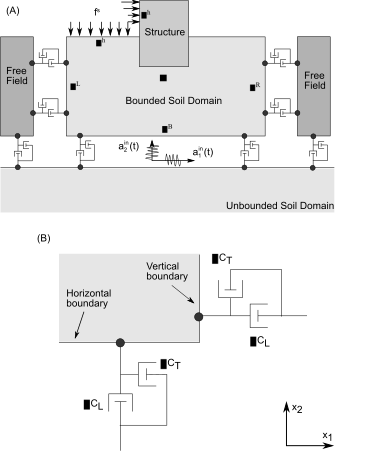
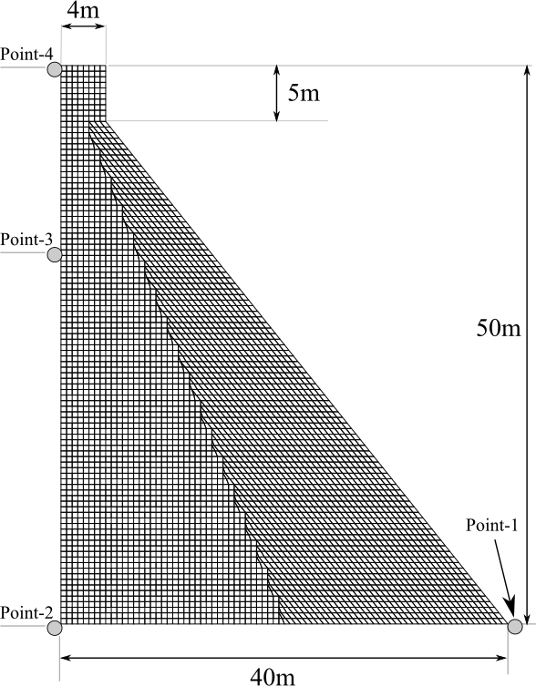
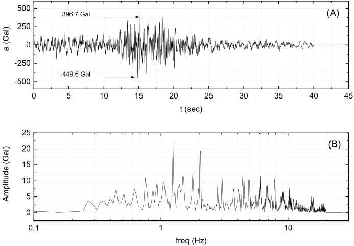
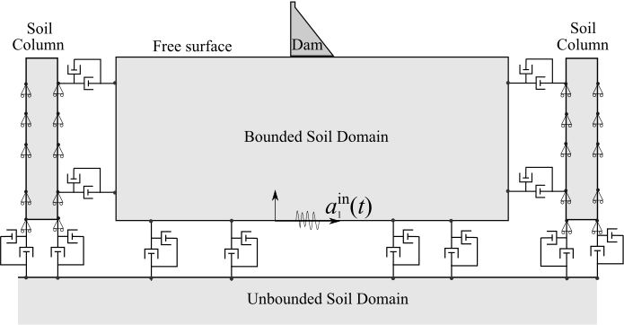
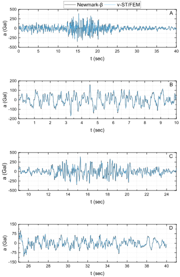
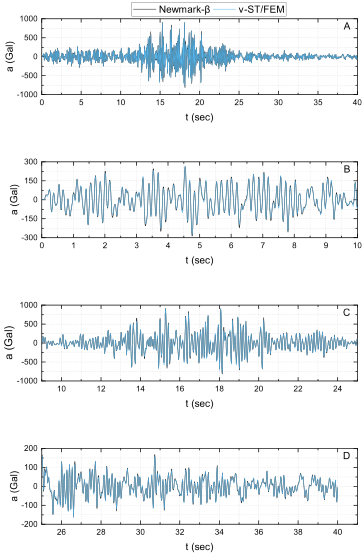
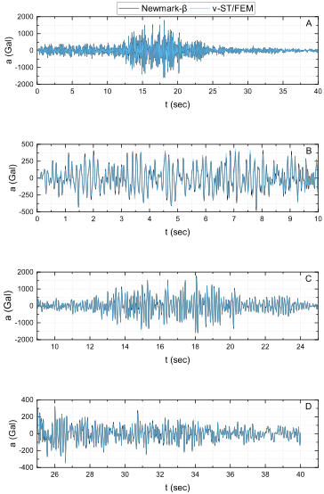
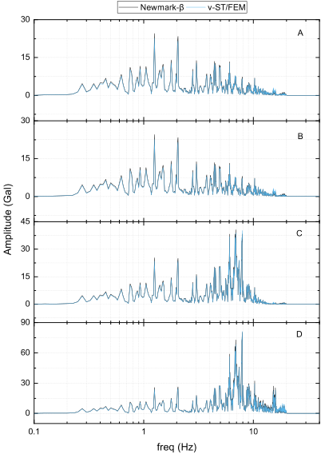
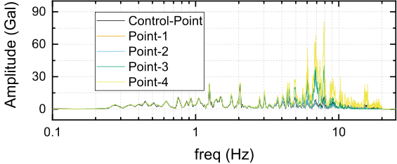

# v-STFEM for Dynamic-soil-structure interaction {#sec-dynamic-ssi-vstfem}

## Introduction

The seismic behaviour of a structure is highly influenced not only by the dynamic response of the superstructure, but also by the response of the underlying soil [@Kausel2010]. The problem of dynamic soil-structure interaction (SSI) had already been studied as early as 1935 in Japan by Katsutada Sezawa and Kiyoshi Kanai who published a truly remarkable, pioneering paper on the subject [@Sezawa1935a; @Sezawa1935b; @Sezawa1935c; @Sezawa1935d]. Analytical solutions for the problem of dynamic interaction between superstructure (with regular shaped foundation) and underlying isotropic, homogenous, linear elastic half-space have been presented by many researchers [@Arnold1955; @Bycroft1956; @Richardson1971; @Warburton1971; @Luco1973; @Trifunac1972; @Wong1974; @Saito1977]. However, in practice, the close form solutions are applicable only under certain circumstances, for example when the superstructure is considered as rigid and/or massless, and the shape of the foundation is circular, rectangular, or elliptical. Undoubtedly, it becomes indispensable to study the effect of soil-structure interaction for heavy structures such as concrete gravity dams.

In the previous chapter, it is shown that the dynamic SSI problem can be tackled as a wave-propagation (or wave-scattering) problem in an unbounded soil domain. In order to work with the finite computational domain artificial boundaries with appropriate absorbing boundary conditions are used to truncate the unbounded soil-domain. Finite element methods (FEM) have been widely used to solve dynamic SSI problem. FEM based on frequency domain are only applicable to the linear problem, therefore, incorporation of nonlinear material behavior will be a prohibitive task for them. FEM in time domain, on the other hand, do not suffer from such limitations. Finite element methods coupled with boundary element methods (FEM-BEM) in time domain have also been developed for dynamic SSI problems [@Touhei1993; @Yazdchi1999; @Chuhan1995]. In FEM-BEM, the domain is divided into near-field and far-field domain, subsequently, finite elements are used to model near-field while far-field is modeled by using boundary elements. FEM equipped with the infinite elements, a natural extension of finite elements to handle unbounded domains, have been proposed to solve wave propagation in unbounded domain [@Bettess1977; @Medina1982; @Valliappan1992; @Zhao1992]. In this approach, the near field is modeled by FEM and the far field is modeled by infinite elements.

This chapter extends the v-ST/FEM presented in @sec-elastodynamics-vstfem  for the dynamic soil-structure interaction problems. In dynamic SSI problem, unbounded soil domain is truncated by placing artificial boundaries at some distance from the area of interest. Viscous boundary condition of Lysmer-Kuhlemeyer [@Lysmer1969] is modified by introducing additional boundary terms related to the free-field response of unbounded soil domain to facilitate the energy flow from far field to computation domain. In the computer program, modified viscous boundary condition is treated as a combination of various traction boundary conditions; traction boundary condition due to dashpots, free-field motion, and input seismic motion. It is found that the traction boundary condition due to dashpots introduces space-time dashpot matrices $\left[ \mathbf{C}_{\infty}\right]$ which contribute to the space-time tangent matrix. The traction boundary condition due to input seismic motion and free-field motion introduce corresponding space-time nodal vectors. Furthermore, it is shown how multiple soil-column problems can be solved (with various boundary conditions) in order to compute the free-field response. Moreover, the computation of free-field response does not depend upon the total response of soil and structure. Thanks to this weak coupling, the soil-column problem can be solved first, and then the total response of soil and structure can be computed by using this free-field response. In this way, the proposed space-time finite element formulation is applicable to a wide class of soil-structure interaction problem.

Afterwards, a dynamic dam-soil interaction problem is considered to validate the formulation and computer implementation of v-ST/FEM. In this problem, a dam (without the reservoir) resting on an elastic half-space is subjected to the horizontal component of the earthquake motion. The material damping in both dam and soil domain is modeled using the Rayleigh damping. The results obtained by proposed scheme are validated by solving the same problem using the semi-discrete FEM with classical Newmark-$\beta$ method. Results obtained by two methods are compared and found to be nearly identical.

## Statement of problem

@fig-dynamic-ssi-concept illustrates the computational setup for a typical two dimensional soil-structure interaction problem. The structure is allowed to exhibit nonlinear behavior and is partially (or fully) embedded in the unbounded domain. However, for clarity of v-ST/FEM formulation it will be assumed that the structure behaves linearly. The bounded and unbounded soil domain are assumed to behave linearly. In practice, the structure can represent a tunnel, a gravity dam with its foundation, a high-rise buildings, a thermal-nuclear power plant, among others. Let $\Omega$ be the truncated computational domain that contains both the structure and the linear bounded soil domain (see, @fig-dynamic-ssi-concept). Let $\Gamma_{\infty}^{+}$ denotes the artificial boundary of $\Omega$ where the viscous boundary conditions are imposed. $\Gamma_{\infty}^{+}$ is divided into left viscous boundary $\Gamma_{\infty}^{L}$, right viscous boundary $\Gamma_{\infty}^{R}$, and bottom viscous boundary $\Gamma_{\infty}^{B}$. Further, it is assumed that the seismic excitations are represented by vertically propagating waves and entering the computation domain $\Omega$ from the bottom viscous boundary only $\Gamma_{\infty}^{B}$. Let $a_{i}^{in}(t)$ and $v_{i}^{in}(t)$, with $i=1,2$, denote the component of input acceleration and velocity, respectively. [^1]

[^1]: Here, $i=1$ and $i=2$ denote the components along $x_{1}$-axis and $x_{2}$-axis, respectively.

The strong form of the initial-boundary value problem of elastodynamics [^2] can be stated as, given the functions

[^2]: This strong form is described in Chapter 3, however, for the sake of completeness the form is repeated here.

$$
b_{i}:\Omega\times [0,T]\rightarrow\mathbb{R}
$$

$$
g_{i}:\Gamma_{i}^{g}\times [0,T]\rightarrow\mathbb{R}
$$

$$
h_{i}:\Gamma_{\infty}^{+}\cup\Gamma_{i}^{h}\times [0,T]\rightarrow\mathbb{R}
$$

$$
u_{i}^{0}:\Omega\rightarrow\mathbb{R}
$$

$$
v_{i}^{0}:\Omega\rightarrow\mathbb{R}
$$

$$
\rho:\Omega\rightarrow \mathbb{R}
$$

find $u_{i}:\bar \Omega \times [0,T] \rightarrow \mathbb{R}$ such that

$$
\rho \frac{{{\partial^2}{u_i}}}{{\partial {t^2}}} - \frac{{\partial {\sigma _{ij}}}}{{\partial {x_j}}} - \rho {b_i} = 0\quad \,\forall \left( {{\mathbf{x}},t} \right) \in \Omega  \times \left( {0,T} \right)
$$ {#eq-ch5-1}

$$
u_{i}(\mathbf{x},t)=g_{i}(\mathbf{x},t)\quad \forall(\mathbf{x},t) \in \Gamma_i^{g}\times(0,T)
$$ {#eq-ch5-2}

$$
\sigma_{ij}n_{j}=h_{i} \quad \forall(\mathbf{x},t) \in \Gamma_{\infty}^{+}\cup \Gamma_i^{h}\times(0,T)
$$ {#eq-ch5-3}

$$
u_{i}(\mathbf{x},0)=u_{i}^{0}(\mathbf{x})\quad \forall \mathbf{x} \in \Omega
$$ {#eq-ch5-4}

$$
\frac{\partial u_{i}}{\partial t}(\mathbf{x},0)=v_{i}^{0}(\mathbf{x})\quad \forall \mathbf{x} \in \Omega
$$ {#eq-ch5-5}

where $\rho$ denotes the mass density, $b_{i}$ denotes the body force, $g_{i}$ is the prescribed displacement on Dirichlet-boundary $\Gamma_{i}^{g}$, $h_{i}$ denotes the boundary traction, $u_{i}^{0}$ and $v_{i}^{0}$ is the initial value of the velocity field. Here $i=1,2$ denotes the $i^{th}$ spatial component.

:::{.column-margin}
{#fig-dynamic-ssi-concept}
:::

The traction boundary condition given in @eq-ch5-3 can be used to classify the types of dynamic soil-structure interaction (SSI) problems. Some of the traction boundary conditions related to the dynamic SSI problem are given below.

:::{.callout-note appearance="simple"}

Traction condition due to the externally applied surface load on the boundary $\Gamma_{i}^{h}$ (see @fig-dynamic-ssi-concept) is given by

$$
\sigma_{ij}n_{j}=f^{s}_{i}\quad \,on\quad \Gamma_{i}^{h}
$$ {#eq-ch5-6}

:::

:::{.callout-tip appearance="simple"}

Traction boundary conditions due to the series of dashpots arranged at the truncated absorbing (viscous) boundary $\Gamma_{\infty}^{+}$ in parallel and normal direction are derived in @eq-lk-abc-normal -- @eq-lk-abc-tangent and here rewritten as,

$$
\sigma_{n}=-\rho c_{L} v_{n}\\
$$ {#eq-ch5-7}

$$
\tau = -\rho c_{T} v_{s}
$$ {#eq-ch5-8}

Recalling that in a typical two-dimensional SSI problem, the unbounded soil-domain is usually truncated by placing vertical and horizontal artificial boundaries at some distance from the area of interest.

The tensor component form of viscous boundary conditions @eq-ch5-7 -- @eq-ch5-8 for vertical boundaries $\Gamma_{\infty}^{L}$ and $\Gamma_{\infty}^{R}$ is given by

$$
\sigma _{ij}{n_j} = -c_{ip}^v{v_p}\quad \,on \quad  \Gamma_{\infty}^{L} \cup \Gamma_{\infty}^{R}
$$ {#eq-ch5-9}

Similarly, viscous boundary condition on the bottom horizontal truncated boundary $\Gamma_{\infty}^{B}$ can be written as,

$$
\sigma _{ij}{n_j} = -c_{ip}^h{v_p}\quad \,on \quad  \Gamma_{\infty}^{B}
$$ {#eq-ch5-11}

In @eq-ch5-9 -- @eq-ch5-11, ${{\mathbf{c}}^v}$ and ${{\mathbf{c}}^h}$ denote the damping coefficients matrix for the dashpots that are placed at the vertical and horizontal truncated boundaries (see @fig-dynamic-ssi-concept). These matrices are described as follows.

$$
{{\mathbf{c}}^v} = \left[ {\begin{array}{cc}
  {\rho {c_L}}&0 \\
  0&{\rho {c_T}}
\end{array}} \right]
$$ {#eq-ch5-10}

$$
{{\mathbf{c}}^h} = \left[ {\begin{array}{cc}
  {\rho {c_T}}&0 \\
  0&{\rho {c_L}}
\end{array}} \right]
$$ {#eq-ch5-12}

in which, $c_{L}$ and $c_{T}$ are the speed of longitudinal wave (P-wave) and transverse wave (S-wave) in the unbounded medium, respectively.

:::

:::{.callout-note appearance="simple"}

Traction boundary conditions for vertical artificial boundaries due to the free field motion are derived in the previous Chapter (see @eq-lk-abc-freefield-normal2) and @eq-lk-abc-freefield-tangent2), where it is shown that additional boundary terms should be included in @eq-ch5-9 for viscous boundaries to allow the energy flow from far-field to the computation domain. The additional boundary terms are formulated in terms of free field motion $(\mathbf{u}^{f}, \mathbf{v}^{f}, \sigma^{f})$ and given by

$$
\sigma _{ij}{n_j} = c_{ip}^v v^{f}_{p} + {\sigma_{ip}^{f}}{n_p} \quad \,on \quad  \Gamma_{\infty}^{L} \cup \Gamma_{\infty}^{R}
$$ {#eq-ch5-13}

where, $n_p$ is the $p^{th}$ spatial component of outward normal vector at the artificial boundary, and the matrix $\mathbf{c}^h$ is same as the one given in @eq-ch5-12.

:::

:::{.callout-tip appearance="simple"}

Traction boundary condition at the bottom artificial boundary due to the incoming seismic waves, which allow the vertically propagating seismic waves to enter the computation, are derived in the previous Chapter (see @eq-lk-abc-effective-6 and @eq-lk-abc-effective-7). The tensor component form of these boundary condition is given by

$$
\sigma _{ij}^{in}{n_j} = 2c_{ip}^hv_p^{in} \quad \,on \quad \Gamma_{\infty}^{B}
$$ {#eq-ch5-14}

where $\mathbf{v}^{in}$ is the incoming velocity wave.

:::

For situations where the source of excitation resides in the computation domain the traction boundary conditions at the artificial boundary are due to the dashpots only, accordingly one can avoid @eq-ch5-13 and @eq-ch5-14 in the traction boundary condition. Moreover, if only @eq-ch5-6 is used to impose the traction boundary condition then the problem becomes identical to the one discussed in the previous Chapter.

The final form of traction boundary conditions used in this chapter are given by

$$
\sigma_{ij}n_{j}=f^{s}_{i}\quad \,on\quad \Gamma_{i}^{h}
$$ {#eq-ch5-15}

$$
\sigma _{ij}{n_j} = -c_{ip}^v{v_p} + c_{ip}^v v^{f}_{p} + \sigma_{ip}^{f}{n_p} \quad \,on \quad  \Gamma_{\infty}^{L} \cup \Gamma_{\infty}^{R}
$$ {#eq-ch5-16}

$$
\sigma _{ij}{n_j} = -c_{ip}^h{v_p} + 2c_{ip}^hv_p^{in} \quad \,on \quad  \Gamma_{\infty}^{B}
$$ {#eq-ch5-17}

The vector form is described by

$$
\sigma \cdot {\mathbf{n}} = {{\mathbf{f}}^s}\quad \,on\quad \,\Gamma _{}^h\\
$$ {#eq-ch5-18}

$$
\sigma  \cdot {\mathbf{n}} =  - {{\mathbf{c}}^v} \cdot {\mathbf{v}} + {{\mathbf{c}}^v} \cdot {{\mathbf{v}}^{f}} + {\sigma^{f}} \cdot {\mathbf{n}}\quad \,on\quad \,\Gamma _\infty ^L \cup \Gamma_\infty ^R\\
$$ {#eq-ch5-19}

$$
\sigma  \cdot {\mathbf{n}} =  - {\mathbf{c}}_{}^h{\mathbf{v}} + 2{{\mathbf{c}}^h} \cdot {{\mathbf{v}}^{in}}\quad \,on\quad \,\Gamma_\infty ^B
$$ {#eq-ch5-20}

## v-ST/FEM formulation

Let $\Omega_{h}$, the set of finite spatial elements $\Omega_{e}$, $e=1,\cdots, n_{el}$, be the discretization of spatial domain $\Omega$, where $n_{el}$ is the total number of spatial elements in $\Omega_{h}$. Consider a non-uniform subdivision for the time domain $[0,T]$, $0=t_{0}<t_{1}<\cdots < t_{N}=T$ with $I_{n}=(t_{n},t_{n+1})$, $\Delta t = t_{n+1}-t_{n}$. The $n^{th}$ space-time slab $Q_{n}=\Omega_{h} \times I_{n}$, and the space-time finite element $Q_{n,e}=\Omega_{e}\times I_{n}, e=1,\cdots, n_{el}$.

Consider $\mathcal{P}_{l}(Q_{n,e})$, the collection of all polynomials defined on $Q_{n,e}$ with a total degree of no more than $l$, and $C^{0}(\ast)$, the space of piecewise continuous functions defined on domain $(\ast)$. Consider also the following collection of functions:

$$
{\mathfrak{F}_{l,h}}: = \left\{ {\left. {{{\mathbf{u}}^h}} \right|{{\mathbf{u}}^h} \in {C^0}{{\left( {\bigcup\nolimits_{n = 0}^{N - 1} {{Q_n}} } \right)}^2},\left. {{{\mathbf{u}}^h}} \right|Q_{n,e}^{} \in {{\left( {{\mathcal{P}_l}\left( {Q_{n,e}^{}} \right)} \right)}^2}} \right\}
$$ {#eq-ch5-21}

where $\left. {{{\mathbf{u}}^h}} \right|Q_{n,e}^{}$ is the restriction of $\mathbf{u}^{h}(\mathbf{x},t)$ to $Q _{n,e}$. The space of the test functions for the v-ST/FEM formulation is written as

$$
{V^h}: = \left\{ {\left. {{{\mathbf{v}}^h}} \right|{{\mathbf{v}}^h} \in \mathfrak{F}_{l,h}^{},{{\mathbf{v}}^h} = 0,\forall \left( {{\mathbf{x}},t} \right) \in \Gamma_i^g \times {I_n}} \right\}
$$ {#eq-ch5-22}

The space of trial functions for the v-ST/FEM formulation is given by

$$
S_v^h: = \left\{ {\left. {{{\mathbf{v}}^h}} \right|{{\mathbf{v}}^h} \in \mathfrak{F}_{l,h}^{},v_i^h = {{\dot g}_i},\forall \left( {{\mathbf{x}},t} \right) \in \Gamma _i^g \times {I_n},i = 1,2} \right\}
$$ {#eq-ch5-23}

Following the procedure described in the previous Chapter, and noting the traction boundary conditions @eq-ch5-15 -- @eq-ch5-17), the weak form for v-ST/FEM is given by; Find $\mathbf{v}\in S_{v}^{h}$ such that for all $\delta \mathbf{v}\in V^{h}$, and for all $n=1,\cdots,N-1$, @eq-ch5-24 holds.

$$
\begin{split}
& \int_{{I_n}}^{} {\int_{{\Omega _h}}^{} {\delta {v_i}\rho \frac{\partial v_i}{\partial t} d\Omega dt} } + \int_{{\Omega _h}}^{} {\delta {v_i}\left( {{\mathbf{x}},t_n^ + } \right)\rho {v_i}\left( {x,t_n^ + } \right)d\Omega } \int_{{\Omega _h}}^{} {\delta {v_i}\left( {{\mathbf{x}},t_n^ + } \right)\rho {v_i}\left( {x,t_n^ - } \right)d\Omega } \\
&- \int_{{I_n}}^{} {\int_{{\Omega _h}}^{} {\delta {v_i}\rho {b_i}d\Omega dt} } \int_{{I_n}}^{} {\int_{{\Omega _h}}^{} {\frac{{\partial \delta {v_i}}}{{\partial {x_j}}}\sigma _{ij}^nd\Omega dt} } \int_{{I_n}}^{} {\int_{{\Omega _h}}^{} {\frac{{\partial \delta {v_i}}}{{\partial {x_j}}}{C_{ijkl}}{\psi _{kl}}d\Omega dt} }\\
&- \int_{{I_n}}^{} {\int_{\Gamma _i^h}^{} {\delta {v_i}f_i^sdsdt} } \int_{{I_n}}^{} {\int_{\Gamma _\infty ^R \cup \Gamma _\infty ^L}^{} {\delta {v_i}c_{ij}^v{v_j}dsdt} } + \int_{{I_n}}^{} {\int_{\Gamma _\infty ^B}^{} {\delta {v_i}c_{ip}^h{v_p}dsdt} } \\
&- \int_{{I_n}}^{} {\int_{\Gamma _\infty ^R \cup \Gamma _\infty ^L}^{} {\delta {v_i}\left( {c_{ij}^v v^{f}_{j} + {\sigma^{f}_{ij}}{n_j}} \right)dsdt} }  - \int_{{I_n}}^{} {\int_{\Gamma _\infty ^B}^{} {\delta {v_i}2c_{ij}^hv_j^{in}dsdt} }  = 0
\end{split}
$$ {#eq-ch5-24}

where

$$
{\psi _{ij}} = \int_{{t_n}}^t {\frac{{\partial {v_i}\left( {{\mathbf{x}},\tau } \right)}}{{\partial {x_j}}}d\tau \quad \,\forall t \in {I_n},\quad \,\forall {\mathbf{v}} \in S_v^h}
$$ {#eq-ch5-25}

## v-ST/FEM discretization

Consider $Q_{n,e}=\Omega_{e}\times I_{n}$ denoting the space-time finite element. Let $n_{e}$ be the total number of spatial nodes in $\Omega_{e}$. Let $v_{i}(\mathbf{x},t_{n}^{+})$ and $v_{i}(\mathbf{x},t_{n+1}^{-})$ be the spatial velocities on the bottom and top faces of space-time slab $Q_{n}$, respectively. The time $t\in I_{n}$ is given by

$$
t=T_{1}(\theta) t_{n} + T_{2}(\theta)t_{n+1}, \quad \forall \theta \in [-1,1]
$$ {#eq-ch5-26}

where

$$
\begin{aligned}
T_{1}(\theta)&=\frac{1-\theta}{2} &
T_{2}(\theta)&=\frac{1+\theta}{2}
\end{aligned}
$$ {#eq-ch5-27}

The test and trial function for velocity defined on $Q_{n,e}$ are given by

$$
\delta {v_i}\left( {{\mathbf{x}},t} \right){ = ^a}\delta {v_{iI}}{T_a}\left( \theta  \right){N^I}\left( {\xi ,\eta } \right)
$$ {#eq-ch5-28}

$$
{v_i}\left( {{\mathbf{x}},t} \right){ = ^a}{v_{iI}}{T_a}\left( \theta  \right){N^I}\left( {\xi ,\eta } \right)
$$ {#eq-ch5-29}

The displacement field $\mathbf{u}(\mathbf{x},t)$ is computed by consistent integration of @eq-ch5-29

$$
{u_i}\left( {{\mathbf{x}},t} \right) = {u_i}\left( {{\mathbf{x}},{t_n}} \right) + {{\tilde T}_1}\left( \theta  \right){v_i}\left( {{\mathbf{x}},{t_n}} \right) + {{\tilde T}_2}\left( \theta  \right){v_i}\left( {{\mathbf{x}},{t_{n + 1}}} \right)
$$ {#eq-ch5-30}

further, @eq-ch5-25 becomes

$$
{\psi _{ij}}\left( {{\mathbf{x}},t} \right) = {{\tilde T}_1}\left( \theta  \right)\frac{{\partial {v_i}}}{{\partial {x_j}}}\left( {{\mathbf{x}},{t_n}} \right) + {{\tilde T}_2}\left( \theta  \right)\frac{{\partial {v_i}}}{{\partial {x_j}}}\left( {{\mathbf{x}},{t_{n + 1}}} \right)
$$ {#eq-ch5-31}

where

$$
\begin{aligned}
{{\tilde T}_1}\left( \theta  \right) &= \frac{{\Delta {t_n}}}{2}\left[ {1 - T_1^2\left( \theta  \right)} \right]
&
{{\tilde T}_2}\left( \theta  \right) &= \frac{{\Delta {t_n}}}{2}T_2^2\left( \theta  \right)
\end{aligned}
$$ {#eq-ch5-32}

In @eq-ch5-26 -- @eq-ch5-32, $i=1,2$ denotes the component in $x_1$ and $x_{2}$ direction, $a=1,2$ denotes the temporal node number, $I=1,\cdots, n_{e}$ denotes the spatial node number, $(\xi, \eta)$ are the local spatial coordinates, and $\theta \in [-1,1]$ denotes the local temporal coordinate.

Following the procedure as described in the previous Chapter for descretizing the weak form @eq-ch5-24, one can obtain the following system of equation

$$
\begin{split}
&
\left[ M \right]_{ij}^{ab}\left( {I,J} \right)\left\{ v \right\}_i^a\left( J \right) + \left[ K \right]_{ij}^{ab}\left( {\operatorname{I} ,J} \right)\left\{ v \right\}_i^a\left( J \right) + \left[ {{C_{\infty }}} \right]_{ij}^{ab}\left( {I,J} \right)\left\{ v \right\}_i^a\left( J \right)
\\
&
= \left\{ {{J_{ext}}} \right\}_i^a\left( I \right) + \left\{ {{J_0}} \right\}_i^a\left( I \right) - \left\{ {{J_{{\sigma ^n}}}} \right\}_i^a\left( I \right) + \left\{ {{J_f}} \right\}_i^a\left( I \right) + \left\{ {{J_{in}}} \right\}_i^a\left( I \right)
\end{split}
$$ {#eq-ch5-33}

the vector form

$$
\left[ {{{\mathbf{K}}_{st}}} \right]\left\{ {{\mathbf{\tilde v}}} \right\} = \left\{ {\mathbf{J}} \right\}
$$ {#eq-ch5-34}

where

$$
\left[ {{{\mathbf{K}}_{st}}} \right] = \left[ {\mathbf{M}} \right] + \left[ {\mathbf{K}} \right] + \left[ {{{\mathbf{C}}_\infty }} \right]
$$ {#eq-ch5-35}

and

$$
\left\{ {\mathbf{J}} \right\} = \left\{ {{{\mathbf{J}}_{ext}}} \right\} + \left\{ {{{\mathbf{J}}_0}} \right\} - \left\{ {{{\mathbf{J}}_{{\sigma ^n}}}} \right\} + \left\{ {{{\mathbf{J}}_f}} \right\} + \left\{ {{{\mathbf{J}}_{in}}} \right\}
$$ {#eq-ch5-36}

where the space-time nodal vector $\left\{ {{{\mathbf{J}}_{ext}}} \right\}$ contains the contribution of external body force and external boundary traction, $\left\{ {{{\mathbf{J}}_{0}}} \right\}$ contains the contribution of initial velocity, $\left\{ {{{\mathbf{J}}_{\sigma^{n}}}} \right\}$ contains the contribution of initial stress $\sigma^{n}$, $\left\{ {{{\mathbf{J}}_{f}}} \right\}$ contains the contribution of free-field motion, $\left\{ {{{\mathbf{J}}_{in}}} \right\}$ contains the contribution of incoming seismic velocity. In @eq-ch5-24 $\left\{ {{\mathbf{\tilde v}}} \right\}$ denotes the unknown space-time nodal values of velocity field

$$
\left\{ {{\mathbf{\tilde v}}} \right\} = \left\{ {\begin{array}{cc}
  {{{{\mathbf{\tilde v}}}^1}} \\
  {{{{\mathbf{\tilde v}}}^2}}
\end{array}} \right\}
$$ {#eq-ch5-37}

$$
\left\{ {{{{\mathbf{\tilde v}}}^a}} \right\} = \left\{ {\begin{array}{cc}
  {{\mathbf{\tilde v}}_1^a} \\
  {{\mathbf{\tilde v}}_2^a}
\end{array}} \right\}
$$ {#eq-ch5-38}

where $\left\{ {{{{\mathbf{\tilde v}}}^1}} \right\}$ and $\left\{ {{{{\mathbf{\tilde v}}}^2}} \right\}$ denote the space-nodal values of velocity field at time $t_{n}^{+}  = \mathop {\lim }\limits_{\epsilon \to 0} \left( {{t_n} + \epsilon} \right)$ and $t_{n + 1}^{-}  = \mathop {\lim }\limits_{\epsilon \to 0} \left( {{t_n} - \epsilon} \right)$, respectively, and ${\left\{ {{\mathbf{\tilde v}}_1^{(\cdot)}} \right\}}$ and ${\left\{ {{\mathbf{\tilde v}}_2^{(\cdot)}} \right\}}$ denote the space-nodal values of $x_{1}$ and $x_{2}$ components of velocity field. If Rayleigh damping is consider then the damping matrix,

$$
\left[ {{{\mathbf{C}}_R}} \right] = \alpha \left[ {{{\mathbf{M}}_R}} \right] + \beta \left[ {{{\mathbf{K}}_R}} \right]
$$ {#eq-ch5-39}

where $\alpha$ and $\beta$ are the Rayleigh damping coefficients, should be added to the space-time tangent matrix $\left[ {{{\mathbf{K}}_{st}}} \right]$, and subsequently @eq-ch5-35 becomes

$$
\left[ {{{\mathbf{K}}_{st}}} \right] = \left[ {\mathbf{M}} \right] + \left[ {\mathbf{K}} \right] + \left[ {{{\mathbf{C}}_\infty }} \right] + \left[ {{{\mathbf{C}}_R}} \right]
$$ {#eq-ch5-40}

In what follows we have succinctly provided the details about the terms present in the expression for space-time tangent matrix $\left[ {{{\mathbf{K}}_{st}}} \right]$ and right-hand side vector $\left\{ {\mathbf{J}} \right\}$, respectively.

:::{.callout-note title="Space time mass matrix"}

$$
\left[ {\mathbf{M}} \right] = \left[ M \right]_{ij}^{ab}\left( {I,J} \right) = {\delta _{ij}}\int_{{I_n}}^{} {\int_\Omega ^{} {{N^I}{T_a}\rho \frac{{\partial {N^J}{T_b}}}{{\partial t}}dtd\Omega } } + {\delta _{ij}}{\delta_{1a}}{\delta _{1b}}\int_\Omega ^{} {{N^I}\rho{N^J}d\Omega }
$$

:::

:::{.callout-note title="Space time stiffness matrix"}

$$
\left[ {\mathbf{K}} \right] = \left[ K \right]_{ij}^{ab}\left( {I,J} \right) = \int_{{I_n}}^{} {\int_\Omega ^{} {\frac{{\partial {N^I}{T_a}}}{{\partial {x_p}}}{C_{pijq}}\frac{{\partial {N^J}{{\tilde T}_b}}}{{\partial {x_q}}}d\Omega dt} }
$$

:::

:::{.callout-note title="Space time damping matrix"}
$$
\left[ {{{\mathbf{C}}_\infty }} \right] = \left[ {{C_{\infty }}} \right]_{ij}^{ab}\left( {I,J} \right) = \left[ {{{\mathbf{C}}_{L\infty }}} \right] + \left[ {{{\mathbf{C}}_{R\infty }}} \right] + \left[ {{{\mathbf{C}}_{B\infty }}} \right]
$$
:::

:::{.callout-note title="Space time damping matrix for left vertical boundaries"}

$$
\left[ {{{\mathbf{C}}_{L\infty }}} \right] = \left[ {{C_{L\infty }}} \right]_{ij}^{ab}\left( {I,J} \right) =
\int_{{I_n}}^{} {\int_{\Gamma _\infty ^L}^{} {{N^I}{T_a}c_{ij}^v{N^J}{T_b}dsdt} }
$$

:::

:::{.callout-note title="Space time damping matrix for right vertical boundaries"}

$$
\left[ {{{\mathbf{C}}_{R\infty }}} \right] = \left[ {{C_{R\infty }}} \right]_{ij}^{ab}\left( {I,J} \right) = \int_{{I_n}}^{} {\int_{\Gamma _\infty ^R}^{} {{N^I}{T_a}c_{ij}^v{N^J}{T_b}dsdt} }
$$

:::

:::{.callout-note title="Space time damping matrix for bottom horizontal boundaries"}

$$
\left[ {{{\mathbf{C}}_{B\infty }}} \right] = \left[ {{C_{B\infty }}} \right]_{ij}^{ab}\left( {I,J} \right) = \int_{{I_n}}^{} {\int_{\Gamma _\infty ^B}^{} {{N^I}{T_a}c_{ij}^h{N^J}{T_b}dsdt} }
$$

:::

:::{.callout-note title="Space time matrix for Rayleigh damping"}

$$
\left[ {{{\mathbf{C}}_R}} \right] = \left[ {{C_R}} \right]_{ij}^{ab}\left( {I,J} \right) = \alpha \left[ {{{\mathbf{M}}_R}} \right] + \beta \left[ {{{\mathbf{K}}_R}} \right]
$$

:::

:::{.callout-note title="Mass proportional Rayleigh damping matrix"}

$$
\left[ {{{\mathbf{M}}_R}} \right] = \left[ {{M_R}} \right]_{ij}^{ab}\left( {I,J} \right) = {\delta _{ij}}\int_{{I_n}}^{} {\int_\Omega ^{} {{N^I}{T_a}\rho {N^J}{T_b}d\Omega dt} }
$$

:::

:::{.callout-note title="Stiffness proportional Rayleigh damping matrix"}
$$
\left[ {{{\mathbf{K}}_R}} \right]=\left[ {{K_R}} \right]_{ij}^{ab}\left( {I,J} \right) = \int_{{I_n}}^{} {\int_\Omega ^{} {\frac{{\partial {N^I}{T_a}}}{{\partial {x_p}}}{C_{pijq}}\frac{{\partial {N^J}{T_b}}}{{\partial {x_q}}}d\Omega dt} }
$$
:::

:::{.callout-note appearance = "simple"}
$$
\begin{aligned}
\left\{ {{{\mathbf{J}}_{ext}}} \right\} &= \left\{ {{J_{ext}}} \right\}_i^a\left( I \right) \\
& = \int_{{I_n}}^{} {\int_\Omega ^{} {{N^I}{T_a}\rho {b_i}d\Omega dt} }  \\
& \quad + \int_{{I_n}}^{} {\int_{\Gamma_i^h}^{} {{N^I}{T_a} f_i^sd\Omega dt} }
\end{aligned}
$$
:::

:::{.callout-note appearance = "simple"}
$$
\left\{ {{{\mathbf{J}}_0}} \right\} = \left\{ {{J_0}} \right\}_i^a\left( I \right) = {\delta _{a1}} {\int_\Omega ^{} {{N^I}\rho v_i^0d\Omega } }
$$
:::

:::{.callout-note appearance = "simple"}
$$
\left\{ {{{\mathbf{J}}_{{\sigma ^n}}}} \right\} = \left\{ {{J_{{\sigma ^n}}}} \right\}_i^a\left( I \right) = \int_{{I_n}}^{} {\int_\Omega ^{} {\frac{{\partial {N^I}{T_a}}}{{\partial {x_j}}}\sigma _{ij}^nd\Omega dt} }
$$
:::

:::{.callout-note appearance = "simple"}
$$
\begin{aligned}
\left\{ {{{\mathbf{J}}_f}} \right\} & = \left\{ {{J_f}} \right\}_i^a\left( I \right) \\
& = \int_{{I_n}}^{} {\int_{\Gamma _\infty ^L}^{} {{N^I}{T_a}\left( {c_{ij}^v{v^{f}_{j}} - \sigma _{i1}^f} \right)dsdt} } \\
& + \int_{{I_n}}^{} {\int_{\Gamma _\infty ^R}^{} {{N^I}{T_a}\left( {c_{ij}^v{v^{f}_{j}} + \sigma_{i1}^f} \right)dsdt} }
\end{aligned}
$$
:::

:::{.callout-note appearance = "simple"}
$$
\left\{ {{{\mathbf{J}}_{in}}} \right\} = \left\{ {{J_{in}}} \right\}_i^a\left( I \right) = \int_{{I_n}}^{} {\int_{\Gamma _\infty ^B}^{} {{N^I}{T_a}2c_{ij}^hv_j^{in}dsdt} }
$$
:::

## Computation of free-field motion

In order to solve @eq-ch5-34 for velocity field $\left\{ {{\mathbf{\tilde v}}} \right\}$ contribution of the free-field motion, in the form of $\left\{ {{\mathbf{J}}}_{f} \right\}$, should be computed at first. Noting that $\left\{ {{\mathbf{J}}}_{f} \right\}$ involves the boundary integral over the left and right viscous boundary, only the space-time nodal values of free-field velocity $\mathbf{v}^{f}$ and stress $\sigma^{f}$ defined on $\Gamma_{\infty}^{L}$ and $\Gamma_{\infty}^{R}$ should be stored. Besides, $\mathbf{v}^{f}$ and $\sigma^{f}$ are computed by solving an elastodynamics problem defined for the auxiliary state as discussed in the previous chapter.

Further, under following assumptions the computation of free-field response simplifies significantly.

:::{.callout-note title="Assumption 1"}
The seismic motion is described by vertically propagating body waves (P-wave and S-wave)
:::

:::{.callout-note title="Assumption 2"}
The unbounded soil domain is represented by an isotropic, linear elastic layered half-space.
:::

With these assumptions a multi-dimension auxiliary state problem effectively transform into a soil-column problem [@Nielsen2006; @Zienkiewicz1989; @Zhang2003; @Miura1989; @Saouma2011] where the body waves propagate through a layered soil-column (see @fig-ch5-fig2). The governing equation for the soil-column problem is given by @eq-ch5-1 with the modified Dirichlet boundary condition (as discussed below). The top surface of the soil-column $\Gamma_{t}^{sc}$ is a stress-free boundary. The traction boundary condition at bottom surface of soil-column,$\Gamma_{b}^{sc}$ is due to the incoming seismic motion and the dashpots (see @fig-ch5-fig2). The analysis of soil-column problem could be performed as follows:

:::{.callout-note appearance="simple"}

If only horizontal component of the seismic excitation is present then free-field displacement and velocity are computed while vertical displacement of all nodes of soil-column mesh is constrained (thus allowing only the shear deformation of soil-column, see @fig-ch5-fig2 b . The Dirichlet boundary condition @eq-ch5-2 becomes

$$
u_{2}(\mathbf{x},t)=0\quad \forall(\mathbf{x},t) \in \Omega^{sc} \times(\mathbf{x},t)
$$ {#eq-ch5-41}

The traction boundary condition on the top and bottom surface of soil-column

$$
\sigma \cdot \mathbf{n}=0 \quad \forall(\mathbf{x},t) \in \Gamma_{t}^{sc}\times(\mathbf{x},t)
$$ {#eq-ch5-42}

$$
\sigma \cdot \mathbf{n}= \mathbf{c}^{h}\cdot \left( -\mathbf{v} + 2\mathbf{v}^{in}\right) \quad \forall(\mathbf{x},t) \in \Gamma_{b}^{sc}\times(\mathbf{x},t)
$$ {#eq-ch5-43}

where $x_{2}$ components of incoming seismic motion $\mathbf{v}^{in}$ is zero.
:::

:::{.callout-tip appearance="simple"}

If only vertical component of the seismic excitation is present then the response $(\mathbf{u}^{f}, \mathbf{v}^{f}, \mathbf{\sigma}^{f})$ is computed while horizontal displacement of all nodes of soil-column mesh is constrained (thus allowing only the axial deformation of soil-column, see @fig-ch5-fig2 c). The Dirichlet boundary condition is defined as

$$
u_{1}(\mathbf{x},t)=0\quad \forall(\mathbf{x},t) \in \Omega^{sc} \times(\mathbf{x},t)
$$ {#eq-ch5-44}

The traction boundary condition on the top and bottom surface of soil-column becomes,

$$
\sigma \cdot \mathbf{n} = 0 \quad \forall(\mathbf{x},t) \in \Gamma_{t}^{sc}\times(\mathbf{x},t)
$$ {#eq-ch5-45}

$$
\sigma \cdot \mathbf{n} = \mathbf{c}^{h}\cdot \left( -\mathbf{v} + 2\mathbf{v}^{in}\right) \quad \forall(\mathbf{x},t) \in \Gamma_{b}^{sc}\times(\mathbf{x},t)
$$ {#eq-ch5-46}

where $x_{1}$ components of incoming seismic motion $\mathbf{v}^{in}$ is zero.
:::

:::{.callout-note appearance="simple"}
If both components are present then the computation of soil-column problem should be carried out in two stages. In first stage horizontal response is computed; only the horizontal seismic motion is applied at the base of the soil-column while constraining the vertical displacement of all nodes, and problem is analyzed (see @fig-ch5-fig2 b). In second stage vertical response of soil-column is computed; only the vertical seismic motion is applied at the base of the soil-column while constraining the horizontal displacement of all nodes, and problem is analyzed (see @fig-ch5-fig2 c). Subsequently, the total response is obtained by superimposing the results of these two stages.
:::

{#fig-ch5-fig2}

Following the space-time discretization procedure for the soil-column
problem one can obtain the matrix-vector form

$$
\left[ {{\mathbf{K}}_{st}^{sc}} \right]\left\{ {{\mathbf{\tilde v}}_{}^{f}} \right\} = \left\{ {{\mathbf{J}}_{}^{sc}} \right\}
$$ {#eq-ch5-47}

where the space-time tangent matrix is given by

$$
\left[ {{\mathbf{K}}_{st}^{sc}} \right] = \left[ {{\mathbf{M}}_{}^{sc}} \right] + \left[ {{\mathbf{K}}_{}^{sc}} \right] + \left[ {{\mathbf{C}}_{B\infty }^{sc}} \right] + \left[ {{\mathbf{C}}_R^{sc}} \right]
$$ {#eq-ch5-48}

and the right hand side,

$$
\left\{ {{{\mathbf{J}}^{sc}}} \right\} = \left\{ {{\mathbf{J}}_{ext}^{sc}} \right\} + \left\{ {{\mathbf{J}}_0^{sc}} \right\} - \left\{ {{\mathbf{J}}_{{\sigma ^n}}^{sc}} \right\} + \left\{ {{\mathbf{J}}_{in}^{sc}} \right\}
$$ {#eq-ch5-49}

In @eq-ch5-48, $\left[ {{\mathbf{M}}_{}^{sc}} \right]$ denotes the space-time mass matrix, $\left[ {{\mathbf{K}}_{}^{sc}} \right]$ is the space-time tangent stiffness matrix, $\left[ {{\mathbf{C}}_{B\infty}^{sc}} \right]$ is the space-time dashpot matrix for the bottom viscous boundary, and $\left[ {{\mathbf{C}}_{R}^{sc}} \right]$ is the space-time Rayleigh damping matrix for the soil-column. The brief description about these matrices (corresponding to the subscript used in the matrix notation) is given in the previous sections.  In @eq-ch5-49, the space-time nodal vector $\left\{ {{\mathbf{J}}_{ext}^{sc}} \right\}$ contains the contribution of external body force, $\left\{ {{{\mathbf{J}}_{0}^{sc}}} \right\}$ contains the contribution of initial velocity, $\left\{ {{{\mathbf{J}}_{\sigma^{n}}^{sc}}} \right\}$ contains the contribution of initial stress $\sigma^{n}$, and $\left\{ {{{\mathbf{J}}_{in}^{sc}}} \right\}$ contains the contribution of incoming seismic velocity.

## v-ST/FEM implementation

@eq-ch5-34 and @eq-ch5-47 involve unsymmetrical tangent matrix. These unsymmetrical system of linear equations are solved using GpBiCG algorithm [@Zhang1997]. The algorithm is implemented in an element by element manner thus avoiding the assembly of global tangent matrix. Further, in each time step the soil-column problem @eq-ch5-47 is solved first to compute the free field response $\left\{ {{\mathbf{\tilde v}}_{}^f} \right\}$. Subsequently, the space-time nodal values $\left\{ \mathbf{J}_{f} \right\}$ in @eq-ch5-36 can be computed using the expression given in the previous section. After computing the $\left\{ \tilde{\mathbf{v}} \right\}$ the space-nodal values of displacement at time $t_{n+1}$, $\left\{ {{\tilde{\mathbf{u}}^2}} \right\}$, is computed by

$$
\left\{ {{{{\mathbf{\tilde u}}}^2}} \right\} = \left\{ {{{{\mathbf{\tilde u}}}^1}} \right\} + \frac{{\Delta {t_n}}}{2}\left( {\left\{ {{{{\mathbf{\tilde v}}}^1}} \right\} + \left\{ {{{{\mathbf{\tilde v}}}^2}} \right\}} \right)
$$ {#eq-ch5-50}

Accordingly, the stress is computed, at element level, from the updated displacement using the isotropic linear elastic stress-strain relationship

$$
{\sigma _{ij}} = \lambda \frac{{\partial {u_p}}}{{\partial {x_p}}}{\delta_{ij}} + \mu \left( {\frac{{\partial {u_i}}}{{\partial {x_j}}} + \frac{{\partial {u_j}}}{{\partial {x_i}}}} \right)
$$ {#eq-ch5-51}

Then the updated stress is used to compute the $\left\{ \mathbf{J}_{\sigma^{n}} \right\}$ in @eq-ch5-36 for the next time-step. @eq-ch5-50 and @eq-ch5-51 are also utilized to update the displacement and stress for the soil-column test. The steps involved in solving the dynamic soil-structure interaction problem using the v-ST/FEM method are presented in Algorithm [\[algo:ch5-algo-1\]](#algo:ch5-algo-1){reference-type="ref" reference="algo:ch5-algo-1"}.

::: {.callout-note title="Algorithm"}

- Step-1: **Initialization** : Get the initial value of nodal displacement ($\mathbf{u}^{0}$) and velocity ($\mathbf{v}^{0}$)
- *Step-2*: Compute, $\left[ \mathbf{M}\right]$, $\left[ \mathbf{K}\right]$, $\left[ \mathbf{C}_{R}\right]$ for soil and structure elements
- *Step-3*: Compute the space-time boundary element matrices $\left[ \mathbf{C}_{L\infty}\right]$, $\left[ \mathbf{C}_{R\infty}\right]$, $\left[ \mathbf{C}_{B\infty}\right]$ for left, right, and bottom viscous boundaries
- *Step-4*: Compute the space-time tangent matrix $\left[ \mathbf{K}_{ST}\right]$ using element matrices from *step-2* and *step-3* according to @eq-ch5-40.

**Time Step Loop** For $n=0, N-1$

  - Step-5a: Solve soil-column problem and compute $\mathbf{u}^{f}, \mathbf{v}^{f}, \sigma^{f}$
  - Step-5b: Compute the $\mathbf{J}_{f}$
  - Step-6: Compute $\mathbf{J}_{0}$ using the initial velocity $\mathbf{v}^{n}$
  - Step-7: Compute stress $\sigma^{n}$ using $\mathbf{u}^{n}$ and isotropic linear elasticity relationship
  - Step-8: Compute $\mathbf{J}_{\sigma^{n}}$ using the $\sigma^{n}$
  - Step-9: Compute $\mathbf{J}_{in}$ from incoming seismic motion
  - Step-10: Compute $\mathbf{J}$ according to @eq-ch5-36
  - Step-11: Solve $\left[ \mathbf{K}_{st}\right]\mathbf{v}=\mathbf{J}$ using GpBiCG iterative solver algorithm
  - Step-12: Update the displacement $\mathbf{u}^{n}$
  - Step-13: Update the velocity $\mathbf{v}^{n}$
  - Step-14: Go to next time step; $n = n + 1$
:::

## Numerical example

In this section linear seismic analysis of concrete dam is performed by employing the v-ST/FEM algorithm. To assess the performance of v-ST/FEM for the soil-structure interaction problem (with modified viscous boundaries) the effect of reservoir will not be pursued here. Besides, the effect of reservoir will be discussed in next chapter.

  @fig-ch5-fig3 depicts a concrete gravity dam on an unbounded soil domain. The physical dimension of the dam is given in @fig-ch5-fig4. It is assumed that the material behavior of the dam as well as the soil is given by an isotropic, homogeneous, linear elastic stress-strain relationship. For the concrete-dam, the elastic modulus $E=28.0$ GPa, mass-density $\rho=$ 2347.0 kg/m${}^{3}$, and the Poisson's ratio $\nu=0.20$. For the soil, $E=40$ GPa, $\rho=2551.0$ kg/m${}^{3}$, and $\nu=0.20$. Further, material damping is modeled by Rayleigh damping with $\xi = 5$% viscous damping specified for the soil and dam separately; the resultant values of damping coefficients $\alpha$ and $\beta$ for the dam and soil are given in @tbl-ch5-3.

::: {.column-margin}
{#fig-ch5-fig3}
:::

::: {#tbl-ch5-3}

| Name | Elastic modulus, $E$, (GPa) |  Poisson's ratio $\nu$ | Mass density $\rho$ (kg/m3) | $\alpha$ | $\beta$ |
| --- | --- | --- | --- | --- | --- | --- |
| Dam |  $28.0$ |       $0.2$ |        $2347.0$ |           $4.1314$ |        $4.8\times 10^{-4}$ |
| Soil | $40.0$ |       $0.2$ |         $2551.0$ |          $1.612$ |        $1.47\times 10^{-3}$ |

:Material parameters of the dam and soil domain ($\alpha$ and $\beta$ are Rayleigh damping coefficients)

:::

:::{.column-margin}
{#fig-ch5-fig4}
:::

:::{.column-margin}
{#fig-ch5-fig7}
:::

@fig-ch5-fig4 illustrates the physical dimension and finite element mesh of the truncated computational domain ($\Omega$). The length of soil domain in $x_{1}$-direction is nine times the length of base of the dam, and the length in $x_{2}$-direction is three times the height of the dam. The computational domain is descritised using $19,176$ number of four node quadrilateral (Quad4) elements and $453$ number of three-node linear triangle (Tria3) elements (see @fig-ch5-fig4). There are total $19,559$ number of nodes in the mesh, hence the total number of primary unknowns to be determined are $78,236$ (four times the total number of nodes).

The simulation is carried out for the horizontal seismic motion recorded at some control point on the free surface (see @fig-ch5-fig7. Total time duration of ground motion is $45$ seconds in which acceleration is set to zero after $40$ seconds. @fig-ch5-fig7 a depicts the time history of the recorded acceleration; the maximum and minimum values of acceleration are $396.7$ cm/s${}^{2}$ and $-449.6$ cm/s${}^{2}$, respectively. The Fourier spectrum of acceleration is depicted in @fig-ch5-fig7 b where the dominating amplitudes $21.9$ cm/s${}^{2}$ and $19.4$ cm/s${}^{2}$ occur for frequencies $1.24$ Hz and $2.0$ Hz, respectively. The input seismic acceleration $a_{1}^{in}(t)$ for the numerical simulation is taken as half that of acceleration at the free surface.

@fig-ch5-fig6 illustrates the configuration of the components required for the computation of present problem. Dashpots are placed on the bottom and vertical boundaries of computation domain. Recall that, in this situation, only a single soil-column problem needs to be solved for determining the free-field response. In the soil-column problem vertical motion of all nodes is constrained while dashpots are placed at the bottom (see @fig-ch5-fig6) surface only. Furthermore, material properties of the soil column (including Rayleigh damping coefficients $\alpha$ and $\beta$) are identical to that of soil-domain (see @tbl-ch5-3)

{#fig-ch5-fig6}

For the validation of v-ST/FEM, the same problem is solved using semi-discrete FEM with Newmark-$\beta$ direct time integration algorithm. A uniform time-step of size $\Delta t = 0.01$ sec is adopted for both methods. In case of v-ST/FEM, the tolerance for GpBiCG (iterative linear solver) is set to $\epsilon = 1.0\times 10^{-6}$. The observation points selected for the comparison of results are shown in @fig-ch5-fig4. The spatial coordinates of these points are; point-1 $(40.0,0.0)$, point-2 $(0.0, 0.0)$, point-3 $(0.0, 35.0)$, and point-4 $(0.0, 50.0)$. Temporal variation of horizontal component of acceleration at observation points computed by employing v-ST/FEM and Newmark-$\beta$ method are plotted in @fig-ch5-point-e-all-in-one -- @fig-ch5-point-j-all-in-one . In case of point-1 and point-2 the results computed by present method are almost identical to that of Newmark-$\beta$ method (see @fig-ch5-point-e-all-in-one) and @fig-ch5-point-g-all-in-one.

In case of point-3 and point-4, however, due to the algorithmic damping of v-ST/FEM the response obtained by v-ST/FEM is slightly lower than the one obtained by the Newmark-$\beta$ method[^3]. To further explain this point, frequency content of the acceleration response at the observation points is plotted in @fig-ch5-vstfem-vs-nb-freq-all-in-one, where it can be seen that the dominating frequencies for point-1 and point-2 are in between $1$ Hz and $2$ Hz, and for point-3 and point-4 are in between $6$ Hz and $8$ Hz. In the previous Chapter, it is shown that the v-ST/FEM has relatively large numerical damping for high-frequency content, therefore, the response of point-3 and point-4 is more damped than the response of point-1 and point-2.

[^3]: The algorithmic damping is due to the numerical dissipation introduced by the iterative linear solver (GpBiCG) used in the v-ST/FEM. The numerical damping is more pronounced for high-frequency content of the response.

In @fig-ch5-vstfem-freq-all-in-one the frequency content of horizontal acceleration obtained by v-ST/FEM is illustrated. At the base of the dam (i.e. point-1 and point-2 in @fig-ch5-fig4) the frequency content is similar to the recorded acceleration, and the dominating frequencies are also located in between $1$ Hz and $2$ Hz. The high frequency content in the dynamic response of the dam starts dominating as one moves away from the base towards the crest of the dam. This is because a significant part of wave energy that enter the dam through dam-soil interface gets trapped inside the dam-region due to multiple reflections within the dam. To further understand this point, consider the boundaries of the dam, the three free surfaces of the dam (upstream face, downstream face and top surface) act as a perfect reflector. From @tbl-ch5-3 it is clear that the the mechanical impedance of the soil is more than that of dam. Therefore, when a wave, which is coming from the dam-region, impinges the dam-soil interface it partially gets reflected back into the dam-region.

{#fig-ch5-point-e-all-in-one .lightbox}

{#fig-ch5-point-g-all-in-one .lightbox}

{#fig-ch5-point-i-all-in-one .lightbox}

{#fig-ch5-point-j-all-in-one .lightbox}

{#fig-ch5-vstfem-vs-nb-freq-all-in-one .lightbox}

{#fig-ch5-vstfem-freq-all-in-one .lightbox}
