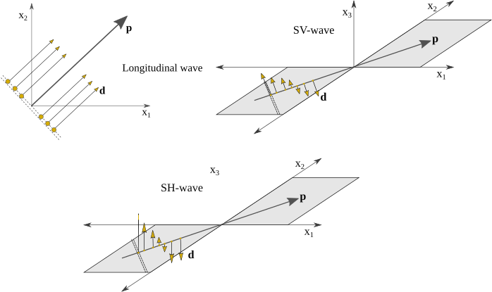
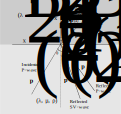

# Body waves in elastic solids {#sec-body-waves-in-solid}

## Governing equations of motion

Consider a body $\mathfrak{B}$ occupying a regular domain $\Omega \subset \mathbb{R}^{n_{sd}}$ in the space which may be bounded or unbounded. $n_{sd}$ is the number of spatial dimensions. Let $\Gamma$ denotes the boundary of the domain, and $\bar \Omega = \Omega \cup \Gamma$ be the closure of $\Omega$. Let indices ${i,j,k,l}$ take values from $1,\cdots, n_{sd}$. The system of equations describing the motion of a homogeneous, isotropic, linearly elastic body consists of the Cauchy's equation of the motion, generalized Hooke's law and linear strain-displacement relationship:

$$
\frac{{\partial {\sigma _{ij}}}}{{\partial {x_j}}} + \rho {b_i} = \rho \frac{{{\partial ^2}{u_i}}}{{\partial {t^2}}}
$$ {#eq-momentum}

$$
\sigma_{ij} = \lambda \epsilon_{kk} \delta_{ij} + 2 \mu \epsilon_{ij}
$$ {#eq-hooke}

$$
\epsilon_{ij} = \frac{1}{2}\left( {\frac{{\partial {u_i}}}{{\partial {x_j}}} + \frac{{\partial {u_j}}}{{\partial {x_i}}}} \right)
$${#eq-strain-disp}

Here, $\lambda$ and $\mu$ are the Lame's parameters. Subsequently, the displacement equation of motion
@eq-momentum-disp-form can be obtained by using Eq. @eq-hooke and @eq-strain-disp in Eq. @eq-momentum

$$
\mu \frac{{{\partial ^2}{u_i}}}{{\partial x_j^2}} + \left( {\lambda  + \mu } \right)\frac{{{\partial ^2}{u_j}}}{{\partial {x_j}\partial {x_i}}} + \rho {b_i} = \rho \frac{{{\partial ^2}{u_i}}}{{\partial {t^2}}}
$$ {#eq-momentum-disp-form}

To obtain a unique solution of the problem boundary conditions on the boundary $\Gamma$ and initial state of the body must be prescribed. Some of the commonly used boundary conditions are mentioned below.

:::{.callout-note appearance="simple"}

*Displacement boundary conditions*: Components of displacement field $u_i(\mathbf{x},t)$ are prescribed on the boundary

$$
u_i(\mathbf{x},t) = g_i(\mathbf{x},t) \quad \textit{on} \quad \Gamma
$$
:::

:::{.callout-tip appearance="simple"}

*Traction boundary conditions*: This boundary condition relates the stress $\sigma_{ij}$ to the externally applied surface force $t_i$ using the Cauchy's formula

$$
\sigma_{ij}{n_j} = t_{i} \quad \textit{on} \quad \Gamma
$$

:::

:::{.callout-note appearance="simple"}

*Mixed boundary conditions*: On a part of the boundary $\Gamma_{i}^{g}\subset \Gamma$ displacement $u_i$ is prescribed and on the remaining part of the boundary $\Gamma_{i}^{h} \subset \Gamma$ traction boundary condition is imposed.

$$
u_i(\mathbf{x},t) = g_i(\mathbf{x},t) \quad \textit{on} \quad \Gamma_{i}^{g}
$$

$$
\sigma_{ij}{n_j} = t_{i} \quad \textit{on} \quad \Gamma_{i}^{h}
$$

with

$$
\Gamma_{i}^{g} \cup \Gamma_{i}^{h} = \Gamma \quad \textit{and} \quad \Gamma_{i}^{g} \cap \Gamma_{i}^{h} = \phi
$$
:::

The initial state of the body, the displacement and velocity field at time $t=0$, must be well defined to complete the problem.

$$
u_i(\mathbf{x},0) = u_{i}^{0}(\mathbf{x}) \quad \forall \mathbf{x} \in \bar{\Omega}
$$

$$
\dot{u_i}(\mathbf{x},0) = v_{i}^{0}(\mathbf{x}) \quad \forall \mathbf{x} \in \bar{\Omega}
$$

The ordered pair $\left( {{\mathbf{u}},\sigma } \right)$ defines the elastodynamic state on $\left( \bar{\Omega}  \times T \right)$ with the displacement field $\mathbf{u}$ and the stress field $\sigma$, corresponding to given external body force density $\mathbf{b}$, the mass density $\rho \in \mathbb{R}^{+}$ and the Lame parameters $\lambda, \mu \in \mathbb{R}^{+}$, if ${\mathbf{u}} \in {C^{2}}\left( {\Omega  \times T} \right) \cap {C^1}\left( {\bar{\Omega}  \times T} \right)$, $\sigma  \in {C^1}\left( {\bar \Omega  \times T} \right)$ and ${\mathbf{b}} \in {C^1}\left( {\bar \Omega  \times T} \right)$, and @eq-momentum -- @eq-strain-disp is satisfied for all $(\mathbf{x},t) \in \Omega \times T$ along with prescribed initial and boundary conditions.

## Displacement potentials

The displacement equation of motion @eq-momentum-disp-form couples all the displacement components $u_i(\mathbf{x},t)$. This equation, however, can be decoupled by introducing the concept of displacement potentials [@Achenbach1973a]. For brevity, @eq-momentum-disp-form is first written in its vector form.

$$
\mu {\nabla ^2}{\mathbf{u}} + \left( {\lambda  + \mu } \right)\nabla  \otimes \left( {\nabla  \cdot {\mathbf{u}}} \right) + \rho {\mathbf{b}} = \rho \frac{{{\partial ^2}{\mathbf{u}}}}{{\partial {t^2}}}
$${#eq-momentum-disp-vec-form}

Let ${\mathbf{u}} \in {C^2}\left( {\Omega  \times T} \right)$ and ${\mathbf{b}} \in {C^{1}}\left( {\Omega  \times T} \right)$ satisfies @eq-momentum-disp-vec-form for all $\left( {{\mathbf{x}},t} \right) \in \Omega  \times T$. Let the Helmholtz decomposition of the external body force density $\mathbf{b}$[^1] is given by

$$
\mathbf{b} = c_{L}^{2}\nabla{F} + c_{T}^{2}\nabla \times \mathbf{G}
$${#eq-helmholtz-b}

Then there exists a scalar function $\phi :\Omega  \times T \to \mathbb{R}$ and a vector-valued function $\boldsymbol{\psi}:\Omega  \times T \to \mathbb{R}^{n_{sd}}$ such that the displacement field can be described by

$$
{\mathbf{u}} = \nabla \phi  + \nabla  \times \boldsymbol{\psi}
$${#eq-helmholz-disp-vec-form}

Further, the displacement potential $\boldsymbol{\psi}$ usually satisfies the following constraint equation.

$$
\nabla \cdot \boldsymbol{\psi} = 0
$$

After substituting @eq-helmholtz-b -- @eq-helmholz-disp-vec-form into @eq-momentum-disp-vec-form one can obtain the following two uncoupled wave equations.

$$
{\nabla ^2}\phi + F = \frac{1}{{c_L^2}}\frac{{{\partial ^2}\phi }}{{\partial {t^2}}}
$${#eq-wave-phi}

and

$$
{\nabla ^2}\boldsymbol{\psi} + \mathbf{G}  = \frac{1}{{c_T^2}}\frac{{{\partial ^2}\boldsymbol{\psi} }}{{\partial {t^2}}}
$${#eq-wave-psi}

@eq-wave-phi is a scalar wave equation and @eq-wave-psi represents wave equation in $n_{sd}$ components of $\boldsymbol{\psi}$. The characteristic-speed $c_L$ and $c_T$ is given by @eq-longi-wave-speed and @eq-trans-wave-speed, respectively.

$$
{c_L} = \sqrt {\frac{{\lambda  + 2\mu }}{\rho }}
$${#eq-longi-wave-speed}

$$
{c_T} = \sqrt {\frac{{\mu }}{\rho }}
$${#eq-trans-wave-speed}

## Longitudinal and transverse plane waves

Consider a plane displacement wave traveling with phase velocity $c$ in the direction $\mathbf{p}$ is given by

$$
{\mathbf{u}} = {\mathbf{d}}f\left( {\mathbf{x}} \cdot {\mathbf{p}} - ct  \right)
$${#eq-plane-wave-1}

where $\mathbf{d}$ is the direction of motion of the particles, $\mathbf{x}$ is the position vector of the particle in the space and the argument of $f(\cdot)$ is called the phase of the wave and given by

$$
\eta  = {\mathbf{x}} \cdot {\mathbf{p}} - ct
$$ {#eq-phase-eta}

It is evident from @eq-plane-wave-1 that at any given time $t$ the plane of constant phase, i.e. $\mathbf{x}\cdot \mathbf{p} =$ constant, are normal to the direction of wave propagation. Further, the planes moves in the direction $\mathbf{p}$ with phase-velocity $c$.

Furthermore, the displacement given by @eq-plane-wave-1 can satisfy the wave equation @eq-momentum-disp-form only in two cases:

:::{.callout-note title="Longitudinal wave"}

In this case the motion of particles is in the direction of the wave propagation (see @fig-plane-wave-motion) and phase-velocity is given by @eq-longi-wave-speed. Mathematically speaking,

$$
{\mathbf{d}} =  \pm {\mathbf{p}}; \quad c = c_L
$$ {#eq-longi-wave-cond}

and

$$
{\mathbf{u}} = \pm {\mathbf{p}}f\left( {\mathbf{x}} \cdot {\mathbf{p}} - c_{L}t  \right)
$$ {#eq-plane-wave-longi}

:::

:::{.callout-tip title="Transverse wave"}

In this case the motion of particles of media is restricted in the plane that is normal to the direction of wave propagation (see @fig-plane-wave-motion) and the phase velocity $c$ is given by @eq-trans-wave-speed.

$$
{\mathbf{p}} \cdot {\mathbf{d}} = 0; \quad c = {c_T}
$$

:::

The transverse waves further categorized into *SV-waves* and *SH-waves* depending upon the plane in which particle motion resides. Let's say the wave is traveling in $\left( x_1, x_2 \right)$ plane then in case of the *SV-waves* particle motion resides in the same $\left( x_1, x_2 \right)$ plane but normal to the direction of wave propagation. Therefore, $\mathbf{d}$ can be represented by

$$
{\mathbf{d}} = {{\mathbf{e}}_3} \times {\mathbf{p}}
$$ {#eq-sv-wave-cond}

However, in the case of *SH-waves* particles will move in the $x_3$ direction, i.e.,

$$
\mathbf{d} = \mathbf{e}_{3}
$$ {#eq-sh-wave-cond}

where ${{\mathbf{e}}_3} = {\left[ {0,0,1} \right]^T}$.

Finally, a complete classification of plane waves can be found in @fig-plane-wave-types. For clarity the plane wave propagation in unbounded elastic domain and the corresponding particle motions are depicted in @fig-plane-wave-motion.

{#fig-plane-wave-types}

{#fig-plane-wave-motion .lightbox}

A special case of plane waves is plane harmonic waves; material points on the plane of constant phase performs harmonic motion. The studies on plane harmonic waves in a linearly elastic medium are of interest by the virtue of the applicability of linear superimposition. By the use of Fourier series, harmonic waves can be used to describe the propagation of periodic disturbances. For plane harmonic waves @eq-plane-wave-1 becomes

$$
{\mathbf{u}} = A{\mathbf{d}}\exp \left[ {ik\left( {{\mathbf{x}} \cdot {\mathbf{p}} - ct} \right)} \right]
$$ {#eq-plane-harmonic-1}

where $A \in \mathbb{R}$ is the amplitude of the particle motion, $i = \sqrt{-1}$, $k=\omega c \in \mathbb{R}$ is called the wave number, $c \in \mathbb{R}$ is the phase velocity, $\omega \in \mathbb{R}$ is the circular frequency of the harmonic motion of the material points, $\mathbf{d} \in \mathbb{R}^{n_{sd}}$ is the direction of motion of particle and $\mathbf{p}$ is direction of propagation of wavefront. Since the phase velocity does not depend upon the wave number (or the wavelength), the plane harmonic waves in unbounded homogeneous, isotropic, linearly elastic media are not dispersive.

Noting @eq-longi-wave-cond and @eq-plane-harmonic-1 the longitudinal plane harmonic wave traveling in $\left( x_{1}, x_{2}\right)$ plane in the direction $\mathbf{p}=\left[ \sin\theta, \cos\theta,0 \right]$ can be described as follows

$$
{\mathbf{u}} = A\left[ {\begin{array}{cc}
  {\sin \theta } \\
  {\cos \theta } \\
  0
\end{array}} \right]\exp \left[ {ik\left( {{x_1}\sin {\theta_1} + {x_2}\cos {\theta_2} - {c_L}t} \right)} \right]
$$ {#eq-longi-plane-harmonic}

Similarly, using @eq-sv-wave-cond in @eq-plane-harmonic-1 the *SV-wave* traveling in $\left( x_{1}, x_{2}\right)$ plane and in the direction $\mathbf{p}=\left[ \sin\theta, \cos\theta,0 \right]$ is given by

$$
{\mathbf{u}} = A\left[ {\begin{array}{cc}
  { - \cos \theta } \\
  {\sin \theta } \\
  0
\end{array}} \right]\exp \left[ {ik\left( {{x_1}\sin \theta  + {x_2}\cos \theta  - {c_T}t} \right)} \right]
$$ {#eq-SV-plane-harmonic}

The equation of SH-wave propagating in the direction $\mathbf{p}=\left[ \sin\theta, \cos\theta,0 \right]$ can be obtained by using @eq-sh-wave-cond

$$
{u_3} = A\exp \left[ {ik\left( {{x_1}\sin \theta  + {x_2}\cos \theta  - {c_T}t} \right)} \right]
$$ {#eq-SH-plane-harmonic}

For the displacement given by @eq-plane-harmonic-1 the stresses generated in the elastic body are computed using the Hooke's law (see Eq. @eq-hooke -- @eq-strain-disp)

$$
\sigma  = ikA\left[ {\lambda {\mathbf{d}} \cdot {\mathbf{p}} + \mu \left( {{\mathbf{d}} \otimes {\mathbf{p}} + {\mathbf{p}} \otimes {\mathbf{d}}} \right)} \right]\exp \left[ {ik\left( {{\mathbf{x}} \cdot {\mathbf{p}} - ct} \right)} \right]
$$ {#eq-plane-harmonic-stress}

## Reflection and refraction of plane waves

The presence of different materials significantly affects the systems of waves propagating through that medium. When waves reach the interface between two medium with different material properties, part of the wave is reflected and the part is transmitted through the interface [@Achenbach1973a]. The ratio of the mechanical impedances of two media completely determines the nature of the reflection and the transmission at the interface.

In such system of material discontinuity, system of plane waves --- reflected and refracted waves at the interface --- can be superposed to represent an incident wave. For a given incident wave, the amplitude $A$, the unit propagation vectors $\mathbf{p}$ and the wave numbers $k$ of the reflected and refracted waves are computed by satisfying the continuity conditions on the displacements and stress at the interface between two media.

Consider two joined elastic half-spaces in $\left( x_1, x_2 \right)$ plane. Let $x_2 = 0$ be the interface plane between these two media. The material properties of the medium carrying the incident and reflected waves (i.e. $x_2<0$) are the Lame elastic constants $\lambda$ and $\mu$, velocity of longitudinal wave $c_L$, velocity of transverse wave $c_T$ and the mass density $\rho$. Similarly, the material constants of the medium into which refraction takes place are $\lambda^{B}, \mu^{B}, c^{B}_{L}, c^{B}_{T}, \rho^{B}$. The superscript with a number $n=1,2,3,4$ enclosed in parenthesis is used for denoting the reflected and refracted waves. The number 0 is used for denoting the incidental wave.

### Reflection and refraction of SH-wave:

Consider the following incidental *SH-wave* traveling in the direction $\mathbf{p}=\left[ \sin\theta, \cos\theta,0 \right]$ (see @fig-sh-wave-reflection).

$$
u_3^{\left( 0 \right)} = {A_0}\exp \left[ {i{k_0}\left( {{x_1}\sin {\theta _0} + {x_2}\cos {\theta _0} - {c_T}t} \right)} \right]
$$ {#eq-sh-wave-in}

{#fig-sh-wave-reflection}

The reflection and refraction of *SH-wave* at the interface generates the *SH-wave*. The system of waves should satisfy the continuity of the displacement and stress at the interface; displacement (stress) due to the incidental and reflected wave should be equal to the displacement(stress) due to the refracted wave. Accordingly, the equations of reflected and refracted wave are given by

$$
u_3^{\left( 2 \right)} =  {A_2}\exp \left[ {i{k_0}\left( {{x_1}\sin {\theta_0} + {x_2}\cos {\theta_0} - {c_T}t} \right)} \right]
$$ {#eq-sh-wave-reflected}

$$
u_3^{\left( 4 \right)} =  {A_4}\exp \left[ {i{k_4}\left( {{x_1}\sin {\theta_4} + {x_2}\cos {\theta_4} - {c_{T}^{B}}t} \right)} \right]
$$ {#eq-sh-wave-refracted}

where $A_2, A_4, \theta_4, k_4$ are given by following relations

$$
\frac{{{A_2}}}{{{A_0}}} = \frac{{\mu \cos {\theta _0} - {\mu ^B}\left( {{c_T}/c_T^B} \right)\cos {\theta_4}}}{{\mu \cos {\theta _0} + {\mu ^B}\left( {{c_T}/c_T^B} \right)\cos {\theta_4}}}
$$ {#eq-ch4-28}

$$
\frac{{{A_4}}}{{{A_0}}} = \frac{{2\mu \cos {\theta _0}}}{{\mu \cos {\theta_0} + {\mu ^B}\left( {{c_T}/c_T^B} \right)\cos {\theta _4}}}
$$

$$
{k_4} = \frac{{{c_T}}}{{c_T^B}}{k_0}
$$

$$
\sin {\theta _4} = \frac{{c_T^B}}{{{c_T}}}\sin {\theta_0}
$$ {#eq-ch4-31}

The inspection of @eq-ch3-25 -- @eq-ch3-31 leads to several observations:

:::{.callout-note appearance="simple"}
The reflected wave is in phase with the incident wave and the wave-number and phase-velocity of incident and reflected wave are the same.
:::

:::{.callout-tip appearance="simple"}
Refracted wave separates from the incident wave while moving away from the normal if $c_{T}^{B}>c_{T}$, and it moves towards the normal in case $c_{T}^{B}<c_{T}$.
:::

:::{.callout-note appearance="simple"}
The wave is completely transmitted (i.e. $A_2=0$) if

$$
\mu \cos {\theta _0} - {\mu ^B}\left( {{c_T}/c_T^B} \right)\cos {\theta_4} = 0
$$

which leads to

$$
\cos {\theta _0} = \sqrt {\frac{{1 - {{\left( {{c_T}/c_T^B} \right)}^2}}}{{1 - {{\left( {\mu /{\mu ^B}} \right)}^2}}}}
$$

Therefore, a combination of angle of incidence and material properties is possible for which no *SH-wave* is reflected.
:::

:::{.callout-tip appearance="simple"}
If the half-space $x_{2}>0$ is vacuum (i.e., the interface is boundary of elastic half-space) then there will be no reflected waves. Further, if the boundary condition condition at $x_2=0$ is such that total displacement vanishes then the reflected wave will have $180\,^{\circ}$ phase difference with the incident wave. Furthermore, if the total stress at the boundary vanishes then the reflected wave is in phase with the incident wave.
:::

### Reflection and refraction of longitudinal wave

As mentioned earlier, in case of longitudinal wave (or *P-wave*) material points move in the direction of wave propagation (see @eq-plane-wave-longi). The equation of incidental longitudinal wave traveling in the direction $\mathbf{p}=\left[ \sin\theta, \cos\theta,0 \right]$ is given by

$$
{{\mathbf{u}}^{\left( 0 \right)}} = \left[ {\begin{array}{cc}
  {\sin {\theta _0}} \\
  {\cos {\theta_0}} \\
  0
\end{array}} \right]{A_0}\exp \left[ {i{k_0}\left( {{x_1}\sin {\theta_0} + {x_2}\cos {\theta_0} - {c_L}t} \right)} \right]
$$ {#eq-p-wave-in}

{#fig-p-wave-reflection}

When a *P-wave* encounters a material interface two reflected (a *P-wave* and a *SV-wave*) and two refracted waves (a *P-wave* and a *SV-wave*) are possible. The motion of system of waves is depicted in @fig-p-wave-reflection. The equation of reflected *P-wave* and *SV-wave* is given by @eq-p-wave-reflected and @eq-sv-wave-reflected, respectively.

$$
{{\mathbf{u}}^{\left( 1 \right)}} = \left[ {\begin{array}{cc}
  {\sin {\theta _1}} \\
  { - \cos {\theta_1}} \\
  0
\end{array}} \right]{A_1}\exp \left[ {i{k_1}\left( {{x_1}\sin {\theta_1} - {x_2}\cos {\theta_1} - {c_L}t} \right)} \right]
$$ {#eq-p-wave-reflected}

$$
{{\mathbf{u}}^{\left( 2 \right)}} = \left[ {\begin{array}{cc}
  {\cos {\theta _2}} \\
  {\sin {\theta_2}} \\
  {0}
\end{array}} \right]{A_2}\exp \left[ {i{k_2}\left( {{x_1}\sin {\theta_2} - {x_2}\cos {\theta_2} - {c_T}t} \right)} \right]
$$ {#eq-sv-wave-reflected}

The equation of refracted *P-wave* and *SV-wave* is given by @eq-p-wave-refracted and @eq-sv-wave-refracted, respectively.

$$
{{\mathbf{u}}^{\left( 3 \right)}} = \left[ {\begin{array}{cc}
  {\sin {\theta _3}} \\
  {\cos {\theta_3}} \\
  0
\end{array}} \right]{A_3}\exp \left[ {i{k_3}\left( {{x_1}\sin {\theta_3} + {x_2}\cos {\theta_3} - c_L^Bt} \right)} \right]
$$ {#eq-p-wave-refracted}

$$
{{\mathbf{u}}^{\left( 4 \right)}} = \left[ {\begin{array}{cc}
  { - \cos {\theta _4}} \\
  {\sin {\theta_4}} \\
  0
\end{array}} \right]{A_4}\exp \left[ {i{k_4}\left( {{x_1}\sin {\theta_4} + {x_2}\cos {\theta_4} - c_T^Bt} \right)} \right]
$$ {#eq-sv-wave-refracted}

This system of waves should satisfy four continuity equations at the interface; one for each $u_{1}, u_{2}, \sigma_{12}, \sigma_{22}$. In other words, total displacement (total stress) due to system of incident and reflected waves must be equal to the total displacement (total stress) due to the system of refracted waves. Accordingly, one can obtain following results for the wave-numbers and direction of wave propagation.

$${k_1} = {k_0};\quad \,{\theta _1} = {\theta _0}$$

$${k_2} = {k_0}\frac{{{c_L}}}{{{c_T}}};\quad \,\sin {\theta _2} = \frac{{{c_T}}}{{{c_L}}}\sin {\theta _0}$$

$${k_3} = {k_0}\frac{{{c_L}}}{{c_L^B}};\quad \,\sin {\theta _3} = \frac{{c_L^B}}{{{c_L}}}\sin {\theta _0}$$

$${k_4} = {k_0}\frac{{{c_L}}}{{c_T^B}};\quad \,\sin {\theta _4} = \frac{{c_T^B}}{{{c_L}}}\sin {\theta _0}$$

Subsequently, the aforementioned four continuity equations results in four linear equations for the amplitudes $A_{1}, A_{2}, A_{3}$ and $A_{4}$. In matrix form the system can be represented by

$$\mathbf{T}\mathbf{A}=\mathbf{A}_{0}$$

where

$$
{\mathbf{T}} = \left[ {\begin{array}{cc}
  { - \sin {\theta _1}}&{ - \cos {\theta_2}}&{\sin {\theta _3}}&{ - \cos {\theta_4}} \\
  {\cos {\theta _1}}&{ - \sin {\theta_2}}&{\cos {\theta _3}}&{\sin {\theta_4}} \\
  {\sin 2{\theta _1}}&{\frac{{{c_L}}}{{{c_T}}}\cos 2{\theta_2}}&{\frac{{{\mu ^B}}}{\mu }\frac{{{c_L}}}{{c_L^B}}\sin 2{\theta _3}}&{ - \frac{{{\mu ^B}}}{\mu }\frac{{{c_L}}}{{c_T^B}}\cos 2{\theta_4}} \\
  { - {{\left( {\frac{{{c_L}}}{{{c_T}}}} \right)}^2}\cos 2{\theta _2}}&{\frac{{{c_L}}}{{{c_T}}}\sin 2{\theta_2}}&{\frac{{{\mu ^B}}}{\mu }\frac{{{c_L}{c^B}_L}}{{{{\left( {c_T^B} \right)}^2}}}\cos 2{\theta_4}}&{\frac{{{\mu ^B}}}{\mu }\frac{{{c_L}}}{{c_T^B}}\sin 2{\theta _4}}
\end{array}} \right]
$$

$$
{\mathbf{A}} = {\left[ {\begin{array}{cc}
  {{A_1}}&{{A_2}}&{{A_3}}&{{A_4}}
\end{array}} \right]^T}
$$

$$
{{\mathbf{A}}_0} = {A_0}\left[ {\begin{array}{cc}
  {\sin {\theta _0}}&{\cos {\theta_0}}&{\sin 2{\theta _0}}&{{{\left( {\frac{{{c_L}}}{{{c_T}}}} \right)}^2}\cos 2{\theta_2}}
\end{array}} \right]^{T}
$$

In case of normal incident of *P-wave* (i.e., $\theta_{0}=0$) the reflected and refracted waves contains only a *P-wave*, i.e.

$$A_{2}=A_{4}=0$$

and

$$
\frac{{{A_1}}}{{{A_0}}} = \frac{{{\rho ^B}c_L^B - \rho {c_L}}}{{{\rho ^B}c_L^B + \rho {c_L}}}
$$ {#eq-ch4-44}

$$
\frac{{{A_3}}}{{{A_0}}} = \frac{{2\rho {c_L}}}{{{\rho ^B}c_L^B + \rho {c_L}}}
$$ {#eq-ch4-45}

From @eq-ch4-44 and @eq-ch4-45 it is clear that in case of normal incidence of *P-wave* the amplitude of reflected and refracted *P-wave* depends entirely on the mechanical impedance, the product of mass density and phase speed, of the two media. If both media have the same mechanical impedance then there will be no reflected wave. Further, if upper half-space has more impedance then lower half-space then the reflected *P-wave* will be out of phase with the incident wave.

In case upper half-space is vacuum -- the interface becomes the boundary of elastic half-space -- then there will be no refracted waves and system of reflected wave will consist a P-wave and a SV-wave. The nature of reflected waves then depends upon the boundary conditions. If the total displacement at the boundary vanishes then the reflected P-wave and SV-wave are given by @eq-p-wave-reflected and @eq-sv-wave-reflected, respectively, with amplitudes,

$$
\frac{{{A_1}}}{{{A_0}}} = \frac{{\cos \left( {{\theta _0} + {\theta_2}} \right)}}{{\cos \left( {{\theta _0} - {\theta_2}} \right)}}
$$ {#eq-p-wave-clamp-a1}

$$
\frac{{{A_2}}}{{{A_0}}} = \frac{{\sin 2{\theta _0}}}{{\cos \left( {{\theta_0} - {\theta _2}} \right)}}
$$ {#eq-p-wave-clamp-a2}

If the total stress at the boundary vanishes (i.e., stress free surface) then the amplitude ratio becomes

$$
\frac{{{A_1}}}{{{A_0}}} = \frac{{\sin 2{\theta _0}\sin 2{\theta_2} - {\kappa ^2}{{\cos }^2}{\theta _2}}}{{\sin 2{\theta_0}\sin 2{\theta _2} + {\kappa ^2}{{\cos }^2}2{\theta_2}}}
$$ {#eq-p-wave-free-a1}

$$
\frac{{{A_2}}}{{{A_0}}} = \frac{{2\kappa \sin 2{\theta _0}\cos 2{\theta_2}}}{{\sin 2{\theta _0}\sin 2{\theta_2} + {\kappa ^2}{{\cos }^2}2{\theta _2}}}
$$ {#eq-p-wave-free-a2}

From @eq-p-wave-free-a1 -- @eq-p-wave-free-a2 it is observed that normal incident, $\theta_{0}=0$, and grazing incident, $\theta_{0}=\pi/2$, of *P-wave* generates only a reflected *P-wave* as $A_2=0$. In former case the reflected *P-wave* is in the phase, and in later case reflected *P-wave* is out of phase with incident wave.
