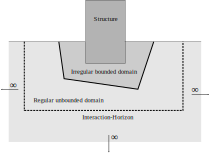
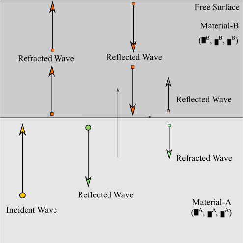

# Radiation boundary conditions for elastic waves

## Review of artificial boundary conditions

Dynamic soil-structure problems can be viewed as a wave propagation problem. Consider a structure (finite dimension) embedded in the unbounded domain of semi-infinite soil (see @fig-ssi). The soil domain can further be divided into two regions; (i) the irregular bounded region near to the structure, and (ii) the regular unbounded region extending to infinity. Both structure and irregular bounded region are allowed to exhibit nonlinear behaviour. However, note that the regular unbounded region must remain linear[^5]. Henceforth the term *structure* will be used to denote system of irregular bounded region and structure and the term *unbounded domain* will be used for denoting the regular unbounded region. The dynamic soil-structure interaction occurs through the interface between unbounded domain and structure.

:::{.column-margin}

{#fig-ssi}

:::

For finite element analysis of dynamic SSI problems, a superficial surface called *interaction-horizon* that encloses the structure and forms the boundary of the computational domain has to be selected [@Wolf1996]. The key issue of this approach is to impose the so called artificial boundary conditions (ABC) so that the *interaction-horizon* can model the radiation damping accurately and spurious reflections from the boundaries can be prohibited. In literature these boundary conditions have been known as *absorbing*, *non-reflecting*, *transparent*, *silent*, and *one-way* boundary conditions. Further, the use of ABC's enables one to get rid of the exterior unbounded domain from the computations.

To appreciate the radiation damping, consider a vertically propagating SV-wave in a elastic half-space with two layers of soil (see Fig. [6](#fig:Vertical-Shear-Wave-Two-Layer){reference-type="ref" reference="fig:Vertical-Shear-Wave-Two-Layer"}). The normal incidence of SV-wave at the interface of two layers produces reflected and refracted SV-waves. As it was shown earlier the partition of the wave depends upon the mechanical impedance of the two media. The wave reflected to lower half-space never returns to the interface due to its infinite extension in $x_2$-direction. This loss of energy is known as radiation damping [@Kramer2014]. Further, refracted wave approaches the free surface layered system and subsequently reflected back towards the interface. At the interface when this wave reaches again a part of energy is reflected back and a part of the energy is transmitted to the lower half-space and therefore it will be lost in the semi-infinite domain of bottom layer. This loss of energy represents again the radiation damping. One of the big challenges of dynamic finite element analysis is to model correctly this radiation damping. Further, difficulties arises due to the presence of structures (such as dam, tunnel, buildings etc.) in or on the half-space that causes multiple reflection and refraction of incoming
waves.

:::{.column-margin}

{#fig-vertical-shear-wave-two-layer}

:::

The minimal requirements of ABC's presented by [@Givoli1991] are; (a) the problem in truncated domain with ABC should be mathematically well posed, (b) ABC's should allow the waves that come from inside the computational domain to go out[^6] and produces little spurious reflections at the artificial boundaries, (c) the solutions of truncated problem in some sense should be close enough to the original problem in unbounded domain, (d) the combination of a numerical scheme and ABC's should yield a stable numerical method, (e) ABC should be easy to implement and the cost of implementation should not be huge.

Kausel and Tassoulas in their review paper [@Kausel1981] grouped ABC's into following three categories;

:::{.callout-note title="Elementary boundaries"}

This type of boundary conditions are also known as Dirichlet, Neumann and Mixed boundary conditions. Displacements and stresses are prescribed in the case of Dirichlet and Neumann boundary condition, respectively. In case of mixed boundary conditions some components of displacement and stress are prescribed (for example roller boundary condition). Recalling that such boundary conditions act as the perfect reflector waves as no energy is absorbed or transmitted. Therefore, adoption of such boundary conditions to model the unbounded domain will cause spurious reflections and spoil the accuracy of the solutions. Elementary boundaries will be adequate only under certain circumstances: (i) when the problem can be regarded as pseudo-static; frequency of excitation is below the natural frequency of a soil stratum problem, (ii) when the internal damping of the soil is sufficient to suppress the reflected wave before it return to the region of study, (iii) when the time duration of numerical simulation is shorter than the time required for a wave to return to the area of interest.

:::

:::{.callout-tip title="Local boundaries"}

The main characteristic of local boundaries is that the boundary conditions involve only spatial and temporal points in the neighbourhood of the boundary point under consideration at the time of evaluation. Further, these boundaries are based upon the physical or mathematical approximations.

:::

:::{.callout-note title="Consisting (nonlocal) transmitting boundaries"}

These boundaries are perfect absorbers of any kind of waves impinging with arbitrary incidence. The conditions imposed by such boundaries are essentially nonlocal in nature. Most of these boundaries are frequency-dependent and thus in time domain analysis they are restricted to steady state problems.

:::

## Local artificial boundary conditions

The first attempt to simulate radiation with simple local boundaries was presented by [@Lysmer1969]. These authors developed viscous boundary conditions based on physical consideration. In essence, these conditions can be interpreted as dashpots connected to the boundary points. The damping coefficient was given by the mechanical impedance of the soil to which dashpots were attached to. The derivation of this type of boundary condition is considered in the next section.

[@Smith1974] used the principle of superposition to filter out the contribution of spurious reflections from the solutions. Two solutions were obtained corresponding to the two types of boundary conditions; one in which tangential displacement and normal stresses vanishes, another in which normal displacement and tangential stresses vanishes. The reflected P-wave and S-wave corresponding to these boundary conditions have the same amplitude but they have phase difference of $180 \,^{\circ}$. However, this approach is computationally not efficient, moreover this approach is limited to the linear problem only.

[@Engquist1977] and [@Clayton1977a], developed a set of time-dependent *local-ABC* of increasing order based on paraxial approximations of the scalar and elastic wave equation. In their technique they approximated the irrational dispersion relation by a rational function to obtain the local differential operator from the nonlocal pseudodifferential operators. In this way by using rational approximations of increasing order, they obtain local boundary conditions of increasing accuracy. Further, they mentioned that a higher order paraxial approximation based on Taylor series expansions induces numerical instability. Although this difficulty can be overcome by use of Pade approximations instead of Taylor series expansions, the presence of higher order derivatives in boundary conditions greatly complicates its implementation. Another set of local boundary conditions with adjustable free parameters was proposed by [@Clayton1980]. Later, [@Cohen1980] showed that the paraxial boundary becomes unstable when Poisson's ratio exceeds $0.33$. A modified version of paraxial boundary called extended-paraxial boundary and its finite element implementation was provided by [@Cohen1983; @Cohen1981]. It was also shown that the performance of extended-paraxial boundary is only slightly superior to the standard-viscous boundary. [@Stacey1988] presented three new paraxial approximations superior to those presented by Clayton and Engquist while avoiding the higher order derivatives. Better finite-difference equations for internal boundaries and corners were also presented in this research.

[@Bayliss1980] presented the sequence of local absorbing boundary conditions in spherical coordinates by employing the asymptotic expansion of the solution of scalar wave equation at large distances. The radiation conditions are given by hierarchy of differential operators $B_{m}$ which annihilate the first $m$ terms in the asymptotic expansion of the solution. The boundary conditions are given by

$$
{B_m}u = \left[ {\prod\limits_{k = 1}^m {\left( {\frac{1}{c}\frac{\partial }{{\partial t}} + \frac{\partial }{{\partial r}} + \frac{{2j - 1}}{R}} \right)} } \right]u = 0
$$ {#eq-bayliss1980}

where $R$ is the radius of the artificial boundary. This higher order local boundary condition, like previous schemes given by other researchers, contains the higher order derivatives which makes their practical implementation near to impossible.

[@Higdon1986] considered the two-dimensional wave equation in a rectangular truncated domain $\Omega$. In his work scalar wave equation was first discretized in space and time domain using finite difference scheme. Subsequently, some discrete boundary conditions were derived for the artificial boundary. He then presented the analytical boundary condition corresponding to the discrete one. The $p$-order boundary condition, for a boundary vertical boundary located at some $x>0$, is described by the product type differential operators $H_{p}$

$$
{H_p}u = \left[ {\prod\limits_{j = 1}^p {\left( {\cos {\theta _j}\frac{\partial }{{\partial t}} + c\frac{\partial }{{\partial x}}} \right)} } \right]u = 0
$$ {#eq-higdon-bc-1}

where $c$ is some reference wave-speed and $\theta_{j}$ is the angle of
incident and
$\left| {{\theta _j}} \right| < \pi /2,\quad \,\forall j = 1, \cdots ,p$.
In literature $H_{p}$ is know as *Higdon-boundary operator*, and Eq.
[\[eq:Higdon-BC-1\]](#eq:Higdon-BC-1){reference-type="eqref"
reference="eq:Higdon-BC-1"} is called the Higdon absorbing boundary
condition (Higdon ABC). The alternatively form of this boundary
condition is given by

$$\label{eq:Higdon-BC-2}
{H_p}u = \left[ {\prod\limits_{j = 1}^p {\left( {\frac{\partial }{{\partial t}} + {C_j}\frac{\partial }{{\partial x}}} \right)} } \right]u = 0$$

where $C_{j}=c/cos\theta_{j}; \quad C_{j} \ge c$ signify the phase speed
in the $x$-direction.

Higdon ABC is perfectly absorbing for a plane wave hitting the
artificial boundary at one the angles $\pm \theta_{j}$ for
$j=1,\cdots, p$ with speed $c$. Therefore, *Higdon-boundary* will appear
absolutely transparent at the discrete angle of incidence
$\pm \theta_{1}, \cdots, \pm \theta_{p}$. The second order Higdon ABC
(i.e. $p=2$ in Eq.
[\[eq:Higdon-BC-1\]](#eq:Higdon-BC-1){reference-type="eqref"
reference="eq:Higdon-BC-1"}) corresponds to the linear space time
interpolation of solution at the artificial boundary. Higdon also
demonstrated that p-order Engquist-Majda condition is special case of
Eq. [\[eq:Higdon-BC-1\]](#eq:Higdon-BC-1){reference-type="eqref"
reference="eq:Higdon-BC-1"} with
$\theta_{j}=0,\quad \forall j=1,\cdots, p$ [for more general description
see @Higdon1986 Propostition 9.1].

Through several numerical experiments it was demonstrated that the
amount of spurious reflection is not very sensitive to the choice of the
$\theta_j$ [@Higdon1987]. Therefore, the fact that $\theta_{j}$ are not
known a priori is not a major restriction for the Higdon ABC. Further,
Higdon ABC is very general as they are applicable to variety of wave
problems including waves in dispersive media [@Higdon1994] and
stratified media [@Higdon1992]. Moreover, the condition is exact in the
sense that when the order $p$ in Eq.
[\[eq:Higdon-BC-1\]](#eq:Higdon-BC-1){reference-type="eqref"
reference="eq:Higdon-BC-1"} increases to infinity, it gives a global
formulation. Unfortunately, the $p$-order Higdon ABC will contain
$p$-order space and time derivatives. Therefore, high order conditions
are impractical beyond 2nd or 3rd order from the implementation point of
view. Finally, it is noteworthy that Higdon ABC is local in space and
time.

[@Higdon1990; @Higdon1991] extended the Higdon ABC for the case of
elastic wave propagating in two-dimensional space. In the case of
elastic waves *Higdon-boundary operator* is written by

$$\label{eq:Higdon-BC-3}
{H_p}{\mathbf{u}} = \left[ {\prod\limits_{j = 1}^p {\left( {{\beta _j}\frac{\partial }{{\partial t}} + {c_L}\frac{\partial }{{\partial x}}} \right)} } \right]{\mathbf{u}} = 0$$

where $c_{L}$ is phase-velocity of longitudinal plane wave (cf. Eq.
[\[eq: longi-wave-speed\]](#eq: longi-wave-speed){reference-type="eqref"
reference="eq: longi-wave-speed"}) and $\beta_{j}>0,\forall j$ resemble
to the cosine of angle of incident. The $j$th operator in Eq.
[\[eq:Higdon-BC-3\]](#eq:Higdon-BC-3){reference-type="eqref"
reference="eq:Higdon-BC-3"} is perfectly absorbing for P-waves traveling
at angle of incidence $\pm {\cos ^{ - 1}}{\beta _j}$ and S-wave
traveling at angle of incidence
$\pm {\cos ^{ - 1}}\left( {{\beta _j}{c_T}/{c_L}} \right)$. If
$\beta_{j} \le 1,\forall j$, then Eq.
[\[eq:Higdon-BC-3\]](#eq:Higdon-BC-3){reference-type="eqref"
reference="eq:Higdon-BC-3"} is oriented mainly to absorb P-waves but
also helps to absorb S-waves. If $\beta_j$'s are are all near the ratio
$c_{L}/c_{T}>1$ then Eq.
[\[eq:Higdon-BC-3\]](#eq:Higdon-BC-3){reference-type="eqref"
reference="eq:Higdon-BC-3"} is oriented mainly to absorb S-waves but
helps absorb P-wave. In addition, Higdon showed that Higdon ABC is
stable for all values of the ratio $c_{L}/c_{T}$ while the second order
Engquist-Majda boundary conditions is unstable for large value of
$c_{L}/c_{T}$.

[@Underwood1981] presented a local transmitting boundary condition for a
structure embedded in the elastic medium problem. Their method was based
on a substructure approach in which to model the effect of infinite
domain *interaction-horizon* was placed at the soil-structure interface.
The soil-structure interaction was approximated by first order doubly
asymptotic boundary element techniques. The following relation was used
for surface force vector $\left\{ {{{\mathbf{f}}^s}} \right\}$
associated with the scattered waves

$$\label{eq:Underwood-ABC-1}
\left\{ {{{\mathbf{f}}^s}} \right\} = \left[ {{\mathbf{K}}_b^0} \right]\left\{ {\mathbf{u}} \right\} + \left[ {{\mathbf{C}}_b^\infty } \right]\left\{ {\mathbf{v}} \right\}$$

where $\left\{ {\mathbf{u}} \right\}$ and $\left\{ {\mathbf{v}}\right\}$
is the vector of nodal displacement and velocity, respectively. From Eq.
[\[eq:Underwood-ABC-1\]](#eq:Underwood-ABC-1){reference-type="eqref"
reference="eq:Underwood-ABC-1"} it can be observed that in high (low
frequency) limit the unbounded domain is modelled as an array of
dashpots (springs). The boundary stiffness matrix
$\left[ {{\mathbf{K}}_b^0} \right]$ is non-symmetric and it couples all
the nodes at the *interaction-horizon*, therefore, this approach is
local in time but non-local in space. The method behaves poorly in
intermediate range of frequency. Moreover, this approach can only absorb
the waves propagating normal to the *interaction-horizon*.

Later [@Wolf1995] combined the doubly asymptotic approach of
[@Underwood1981] and Higdon ABC to derive the *doubly asymptotic
multi-directional* (DAMD) ABC. In his approach Eq.
[\[eq:Underwood-ABC-1\]](#eq:Underwood-ABC-1){reference-type="eqref"
reference="eq:Underwood-ABC-1"} additionally contains the surface force
vector $\left\{ {{\mathbf{Q}}_b^s} \right\}$ which represents the
remaining interaction forces. These forces were computed from the
second-order Higdon ABC (cf. Eq.
[\[eq:Higdon-BC-1\]](#eq:Higdon-BC-1){reference-type="eqref"
reference="eq:Higdon-BC-1"}) while replacing $u$ with the $Q$. Explicit
finite difference scheme was employed to calculate
$\left\{ {{\mathbf{Q}}_b^s} \right\}$ and then used in finite element
formulation of the total dynamic system to compute the displacement and
velocity field. By numerical examples, they showed that the approach is
rigorous for both low and high frequency limit in all preselected angles
of incidence. In addition, DAMD-ABC is highly accurate for plane waves
at intermediate frequency and at other angles. The main disadvantage of
this approach is that it uses explicit finite difference scheme to solve
Higdon ABC which obviously makes entire scheme conditionally stable even
if one uses unconditionally stable direct time integration scheme for
finite element analysis. Therefore, a very small time step must be
selected to ensure the overall stability. Of course one can use implicit
unconditionally stable schemes but then this will increase the overall
computational cost.

Following the Bayliss-Turkel conditions, [@Hagstrom1998] derived a
sequence of local boundary conditions for isotropic problems (i.e.
non-dispersive case). In contrast to previous high-order schemes their
conditions avoids the use of higher order derivatives in the normal
direction and in the preferred wave propagation direction. This was made
possible due to the use of auxiliary functions; the local conditions of
arbitrary order are expressed recursively using auxiliary functions.
This way practical use of higher order ABC is possible. However, the
scheme was only applicable in the case of spherical symmetry and axial
symmetry.

[@Collino1993] presented the first use of high order asymptotic boundary
conditions, within finite difference framework, for two-dimensional
time-dependent waves in rectangular domain. Corner compatibility
conditions were also provided in their formulation. [@Givoli2001]
presented a general approach to construct local arbitrary high-order
boudary conditions (AHOC) with a symmetric structure and with only low
order spatial and/or temporal derivatives. This enables the practical
use of ABCs of arbitrarily high order.

Later, [@Givoli2003] reformulated the sequence of ABCs proposed by
Higdon to obtain the arbitrary high-order local ABCs. This scheme is
similar to the one proposed by [@Hagstrom1998] only in the sense that it
eliminates the higher order derivatives by use of special auxiliary
variables. In this case, however, the auxiliary variables are defined by
simple recursive relations. Moreover, the formulation was presented in
Cartesian coordinates for rectangular domain.

The standard ($C^{0}$ continuous) finite element implementation of this
scheme was presented in [@Givoli2003a] for the case of linear
inhomogeneous dispersive wave (Klein-Gordon) equation. It was shown that
the scheme is stable even for equal-order nodal interpolation for all
the variables. Besides, the computational effort associated with the
boundary condition grows only linearly with the order of accuracy.

[@VanJoolen2005] applied the Givoli-Neta boundary conditions for
exterior time-dependent wave problems in two-dimensional unbounded
domain. They reported long-time instability of the method and suggested
that the special compatibility conditions at the corner of rectangular
domain should be include in the auxiliary-variable formulation.

The corner compatibility conditions for wave equation with artificial
boundary conditions were discussed by [@vacus2005].

Following the work of [@Givoli2003], [@Hagstrom2004] presented a new
auxiliary variable formulation which includes the special corner
compatibility conditions. Hangstrom and Warburton conditions can be
considered as the symmetrized modification of the Givoli-Neta conditions
with enhanced stability characteristics. Their formulation was also
based in Cartesian coordinate system with rectangular truncated domain.
In the paper they presented a finite difference formulation of their
approach. The finite element implementation of Hagstrom-Warburton
formulation is presented by [@Givoli2006] for exterior time-dependent
wave problems governed by the scalar wave equation.

[@Samii2012; @Samii2013] implemented the Hagstrom-Warburton ABC for the
dam-reservoir interaction problem using finite element methods.
[@Hagstrom2008] employed the Hagstrom-Warburton ABC for dispersive
medium for which the Klein-Gordon wave equation governs. They also
extended the boundary conditions to take into account of evanescent
modes. [@Rabinovich2011] extended the Hagstrom-Warburton ABC for time
dependent elastic wave in unbounded domain and presented a variational
formulation for the finite element implementation. However, their scheme
suffers from long-time instability. Later, [@Baffet2012] suggested that
the cause of this instability may be due to the use of only Higdon-type
ABC for elastic wave problem. In their formulation they combined
Lysmer-Kuhlemeyer type boundary operator with the Higdon-type operators.
This modification leads to the long-time stability of their formulation.

[@Kellezi2000] developed a cone boundary condition for the vibration
problems on the surface of a half-space where the generated waves
propagates in an area that increases with depth. This boundary condition
can be considered as an extension of the standard viscous boundary
condition of [@Lysmer1969]. Physically, cone boundary condition
represents a series of dashpots and springs placed in the normal and
tangential direction of the truncated boundary. Due to the inclusion of
the additional springs, the cone boundary condition approximates the
stiffness of the unbounded soil domain and therefore it eliminates the
permanent movement which occurs with the viscous boundary condition at
low frequencies [@Kontoe2009]. However, a drawback of the cone boundary
is that the stiffness coefficients of the springs depend on the distance
of the boundary from the source of excitation. Therefore, its use is
restricted to problems with surface excitations where the distance of
the boundary from the source is known.

[@Lysmer1969] first proposed the artificial boundary condition for
elastic waves (henceforth known as LK-ABC). In this section LK-ABC is
first derived for the case of one-dimensional longitudinal wave (P-wave)
impinging normally at the boundary, then the condition is derived for
the case of vertically propagating SV-wave again impinging normally at
the boundary. Finally, the LK-condition is derived for plane wave
impinging at some angle $\theta$ at the artificial boundary.

## LK-ABC for normal incidence of P-wave

Consider an isotropic, homogeneous, linear elastic half-space, initially
at rest, subjected to the uniform pressure $p(t)$ at the plane
$x_{1} = 0$ (see Fig. [7](#fig:LK-ABC-Half-Space-1){reference-type="ref"
reference="fig:LK-ABC-Half-Space-1"}a). Here any plane parallel to the
$x_{1}$-axis is a plane of symmetry, therefore, the displacement can be
described by $\mathbf{u}=\left[ u_{1}(x_{1},t),0,0 \right]$.
Additionally, the wave-fronts are normal to $x_{1}$-axis. By using
strain-displacement relationship Eq.
[\[eq:Strain-Disp\]](#eq:Strain-Disp){reference-type="eqref"
reference="eq:Strain-Disp"} it can be shown that the present situation
is a case of one-dimensional longitudinal strain; only non-trivial
strain component is $\epsilon_{11}$. Accordingly, the equation of motion
Eq. [\[eq:Momentum\]](#eq:Momentum){reference-type="eqref"
reference="eq:Momentum"} becomes a one-dimensional wave equation of the
form

$$\label{eq:P-Wave-Eq-1D}
\frac{{{\partial ^2}{u_1}}}{{\partial x_1^2}} = \frac{1}{{c_L^2}}\frac{{{\partial ^2}{u_1}}}{{\partial {t^2}}}$$

where $c_{L}$ is the phase velocity of longitudinal wave and given by
Eq.
[\[eq: longi-wave-speed\]](#eq: longi-wave-speed){reference-type="eqref"
reference="eq: longi-wave-speed"}. Initial conditions and boundary
conditions are given by Eq.
[\[eq:IC-1\]](#eq:IC-1){reference-type="eqref" reference="eq:IC-1"} and
Eq. [\[eq:BC-1\]](#eq:BC-1){reference-type="eqref" reference="eq:BC-1"},
respectively.

$$\label{eq:IC-1}
{u_1}\left( {{x_1},0} \right) = 0;\quad \,{v_1}\left( {{x_1},0} \right) = 0$$

$$\label{eq:BC-1}
{\sigma _{11}}\left( {0,t} \right) =  - p\left( t \right)
\qquad  p(t)=0 \quad \textit{for} \quad t<0$$

<figure id="fig:LK-ABC-Half-Space-1">

<figcaption>Illustration of (A) a half-space subjected to uniform
pressure, (B) truncation of unbounded domain by introducing artificial
boundary to obtain finite computational domain, (C) satisfying radiation
condition by placing series of dashpots along the artificial
boundary.</figcaption>
</figure>

The general form of solution to the wave equation Eq.
[\[eq:P-Wave-Eq-1D\]](#eq:P-Wave-Eq-1D){reference-type="eqref"
reference="eq:P-Wave-Eq-1D"} is given by

$$\label{eq:u1-1D-1}
{u_1}\left( {{x_1},t} \right) = f\left( {t - \frac{{{x_1}}}{{{c_L}}}} \right) + g\left( {t + \frac{{{x_1}}}{{{c_L}}}} \right)$$

where $f(\cdot)$ and $g(\cdot)$ denote the wave traveling positive and
negative $x_{1}$-direction, respectively. Obviously, in the present case
no wave will travel in the negative $x_{1}$-direction [see
@Achenbach1973a chapter 2], hence

$$\label{eq:u1-1D-2}
{u_1}\left( {{x_1},t} \right) = f\left( {t - \frac{{{x_1}}}{{{c_L}}}} \right)$$

Employing Eq. [\[eq:Hooke\]](#eq:Hooke){reference-type="eqref"
reference="eq:Hooke"} and Eq.
[\[eq:u1-1D-2\]](#eq:u1-1D-2){reference-type="eqref"
reference="eq:u1-1D-2"} the non-trivial components of stress tensor
become

$$\label{eq:sigma11-1D-1}
\sigma_{11}(x_{1},t) =  - \frac{{\left( {\lambda  + 2\mu } \right)}}{{{c_L}}}{f^{'}}\left( {t - \frac{x_{1}}{{{c_L}}}} \right) = -\rho {c_L}{f^{'}}\left( {t - \frac{x_{1}}{{{c_L}}}} \right)$$

$$\label{eq:sigma22-1D-1}
{\sigma _{22}}(x_{1},t) = {\sigma _{33}} =  - \frac{\lambda }{{{c_L}}}{f^{'}}\left( {t - \frac{x_{1}}{{{c_L}}}} \right)$$

Futher, the velocity is given by

$$\label{eq:v1-1D-1}
{v_1}\left( {{x_1},t} \right) = {f^{'}}\left( {t - \frac{x_{1}}{{{c_L}}}} \right)$$

Noting Eq.
[\[eq:sigma11-1D-1\]](#eq:sigma11-1D-1){reference-type="eqref"
reference="eq:sigma11-1D-1"} and Eq.
[\[eq:v1-1D-1\]](#eq:v1-1D-1){reference-type="eqref"
reference="eq:v1-1D-1"} we can obtain the following relation between
normal stress $\sigma_{11}$ and normal velocity $v_{1}$ (here space,
time coordinates are omitted for clarity of expressions).

$$\label{eq:sig11-v1}
{\sigma _{11}} =  - \rho {c_L}{v_1}$$

Eq. [\[eq:sig11-v1\]](#eq:sig11-v1){reference-type="eqref"
reference="eq:sig11-v1"} is the *LK boundary condition* for the case of
one-dimensional P-wave propagation. In this relation the term
$\rho c_{L}$ is called the *mechanical impedance* of the medium.
*Mechanical impedance* is the property of the medium which measures the
stress that is required to generate the motion of particles
[@Achenbach1973a]. In simple terms, Eq.
[\[eq:sig11-v1\]](#eq:sig11-v1){reference-type="eqref"
reference="eq:sig11-v1"} signifies the amount of stress required to
completely transfer the motion (linear momentum and energy) of a plane
to the next plane. Consequently, the wave will be reflected (partially
or completely) if the stress does not satisfy the above relation.
Further, Eq. [\[eq:sig11-v1\]](#eq:sig11-v1){reference-type="eqref"
reference="eq:sig11-v1"} is a characteristic equation of a *dashpot*
with damping coefficient equal to the *mechanical impedance*. Therefore,
it is possible to work with the finite computational domain by
introducing the artificial boundary with boundary condition given by Eq.
[\[eq:sig11-v1\]](#eq:sig11-v1){reference-type="eqref"
reference="eq:sig11-v1"}. In this way unbounded domain can be replaced
by a series of dashpot normal to artificial boundary as depicted in Fig.
[7](#fig:LK-ABC-Half-Space-1){reference-type="ref"
reference="fig:LK-ABC-Half-Space-1"}c.

## LK-ABC for normal incidence of S-wave

Fig. [8](#fig:LK-ABC-Half-Space-2){reference-type="ref"
reference="fig:LK-ABC-Half-Space-2"}a illustrates the vertically
propagating SV-wave in an isotropic, homogeneous, linear elastic
half-space. The system is initially at rest and subjected to the uniform
surface traction $s(t)$ at the plane $x_{2} = 0$. In this case
displacement is described by
$\mathbf{u}=\left[ u_{1}(x_{2},t),0,0 \right]$. Additionally, the
wave-fronts are normal to $x_{2}$-axis. $\epsilon_{12}$ is the only
non-trivial strain component (cf. Eq.
[\[eq:Strain-Disp\]](#eq:Strain-Disp){reference-type="eqref"
reference="eq:Strain-Disp"}). The equation of motion is given by
following one-dimensional wave equation.

$$\label{eq:SV-Wave-Eq-1D}
\frac{{{\partial ^2}{u_1}}}{{\partial x_2^2}} = \frac{1}{{c_T^2}}\frac{{{\partial ^2}{u_1}}}{{\partial {t^2}}}$$

where $c_{T}$ is the phase velocity of transverse wave and given by Eq.
[\[eq: trans-wave-speed\]](#eq: trans-wave-speed){reference-type="eqref"
reference="eq: trans-wave-speed"}.

<figure id="fig:LK-ABC-Half-Space-2">

<figcaption>Schematic diagram of (A) vertically propagating SV-wave in
half-space subjected to uniform surface traction, (B) truncation of
unbounded domain by introducing artificial boundary to obtain finite
computational domain, (C) satisfying radiation condition by placing
series of dashpots along the artificial boundary.</figcaption>
</figure>

The general solution of Eq.
[\[eq:SV-Wave-Eq-1D\]](#eq:SV-Wave-Eq-1D){reference-type="eqref"
reference="eq:SV-Wave-Eq-1D"} should represent a wave propagating in the
$x_{2}$-direction. This solution can be described by

$$\label{eq:u1-1D-3}
{u_1}\left( {{x_2},t} \right) = f\left( {t - \frac{{{x_2}}}{{{c_T}}}} \right)$$

The non-trivial stress component $\sigma_{12}$ and velocity $v_{1}$ are
given by

$$\label{eq:sigma12-1D-1}
{\sigma _{12}}\left( {{x_2},t} \right) =  - \rho c_{T}{f^{'}}\left( {t - \frac{{{x_2}}}{{{c_T}}}} \right)$$

$$\label{eq:v1-1D-2}
{v_1}\left( {{x_2},t} \right) = {f^{'}}\left( {t - \frac{x_{2}}{{{c_L}}}} \right)$$

Accordingly, the following relationship between tangential stress
$\sigma_{12}$ and tangential velocity $v_{1}$ is self evident.

$$\label{eq:sig12-v1}
{\sigma _{12}} =  - \rho {c_T}{v_1}$$

Eq. [\[eq:sig12-v1\]](#eq:sig12-v1){reference-type="eqref"
reference="eq:sig12-v1"} is the *LK boundary condition* for the case of
one-dimensional S-wave propagation. In this relation the term
$\rho c_{T}$ again denotes the *mechanical impedance* of the medium. It
can observed that Eq.
[\[eq:sig12-v1\]](#eq:sig12-v1){reference-type="eqref"
reference="eq:sig12-v1"}, analogues to Eq.
[\[eq:sig11-v1\]](#eq:sig11-v1){reference-type="eqref"
reference="eq:sig11-v1"}, represents a *dashpot* with damping
coefficient equal to $\rho c_{T}$. Further, the unbounded domain can be
truncated by placing an artificial boundary parallel to the $x_{1}$-axis
as depicted in Fig. [8](#fig:LK-ABC-Half-Space-2){reference-type="ref"
reference="fig:LK-ABC-Half-Space-2"}b. In the present case, the
artificial boundary will perfectly absorb the normally impinging S-wave
given Eq. [\[eq:sig12-v1\]](#eq:sig12-v1){reference-type="eqref"
reference="eq:sig12-v1"} is imposed on it. Physically, the unbounded
media (outside the computational domain) resembles to a situation in
which an array of dashpots is placed in tangential to the truncated
boundary as shown in Fig.
[8](#fig:LK-ABC-Half-Space-2){reference-type="ref"
reference="fig:LK-ABC-Half-Space-2"}c.

## LK-ABC for general case of plane waves

In preceding two subsections LK-ABC is derived for the case of normal
incidence of a P-wave and a S-wave. In such cases LK-ABC is exact; it
perfectly absorbs the incident wave. If, however, incident wave is
impinging the boundary at some angle ($\theta <\pi/2$) some amount of
reflection is expected. [@Lysmer1969] suggested to use following
absorbing boundary conditions in order to minimize such spurious
reflection.

$$\label{eq:LK-ABC-normal}
\sigma_{n}=-a\rho c_{L} v_{n}$$

$$\label{eq:LK-ABC-tangent}
\tau=-b\rho c_{T} v_{s}$$

where $\sigma_{n}$ and $\tau$ are the normal and tangential stress at
the boundary, respectively. Similarly, $v_{n}$ and $v_{s}$ are the
normal and tangential velocity at the boundary, respectively. As seen
earlier, this condition corresponds to a situation in which a series of
dashpots are placed at the absorbing boundary in parallel and normal
direction (see Fig. [9](#fig:LK-ABC-Half-Space-4){reference-type="ref"
reference="fig:LK-ABC-Half-Space-4"}b).

<figure id="fig:LK-ABC-Half-Space-4">

<figcaption>(A) Illustration of a plane-wave impinging at the artificial
boundary at some angle <em>θ</em>0, (B) Interpretation of
the LK-ABC as a series of dashpots configured parallel and normal to
artificial boundary.</figcaption>
</figure>

## Reflection of a P-wave at the LK-boundary

Fig. [9](#fig:LK-ABC-Half-Space-4){reference-type="ref"
reference="fig:LK-ABC-Half-Space-4"}a shows a P-wave approaching the
boundary at some angle $\theta_{0}$. The wave will be reflected as a
P-wave and a SV-wave [see @Achenbach1973a chapter 5]. The displacement
and velocity field due to incident and reflected waves is represented by

$$\label{eq:LK-ABC-u1}
{{\mathbf{u}}^{\left( n \right)}} = {A_n}\left[ {\begin{array}{cc}
  {d_1^{\left( n \right)}} \\
  {d_2^{\left( n \right)}}
\end{array}} \right]\exp \left[ {i{k_n}\left( {{x_1}p_1^{\left( n \right)} + {x_2}p_2^{\left( n \right)} - {c_n}t} \right)} \right]$$

$$\label{eq:LK-ABC-v1}
{{\mathbf{v}}^{\left( n \right)}} =  - i{k_n}{c_n}{A_n}\left[ {\begin{array}{cc}
  {d_1^{\left( n \right)}} \\
  {d_2^{\left( n \right)}}
\end{array}} \right]\exp \left[ {i{k_n}\left( {{x_1}p_1^{\left( n \right)} + {x_2}p_2^{\left( n \right)} - {c_n}t} \right)} \right]$$

where the unit vectors
${{\mathbf{d}}^{\left( n \right)}} = {\left[ {d_1^{\left( n \right)},d_2^{\left( n \right)}} \right]^T}$
and
${{\mathbf{p}}^{\left( n \right)}} = {\left[ {p_1^{\left( n \right)},p_2^{\left( n \right)}} \right]^T}$
denote the direction of motion of particle and wave propagation,
respectively (see Table
[1](#tab:LK-ABC-Parameter-P-Wave){reference-type="ref"
reference="tab:LK-ABC-Parameter-P-Wave"} and Fig.
[9](#fig:LK-ABC-Half-Space-4){reference-type="ref"
reference="fig:LK-ABC-Half-Space-4"}). The number $n=0,1,2$ is used to
denote the type of wave. More details about Eq.
[\[eq:LK-ABC-u1\]](#eq:LK-ABC-u1){reference-type="eqref"
reference="eq:LK-ABC-u1"} can be found in section
[2.3](#subsec:Longi-Trans-Plane-Wave){reference-type="ref"
reference="subsec:Longi-Trans-Plane-Wave"}.

::: {#tab:LK-ABC-Parameter-P-Wave}
  Wave-type           n   $c_{n}$                      $\mathbf{p}^{n}$                                       $\mathbf{d}^{n}$
  ------------------- --- --------- ------------------------------------------------------ ------------------------------------------------------
  Incident P-wave     0   $c_{L}$    $\left( \sin\theta_{0}, \cos\theta_{0} \right)^{T}$    $\left( \sin\theta_{0}, \cos\theta_{0} \right)^{T}$
  Reflected P-wave    1   $c_{L}$    $\left( \sin\theta_{1}, -\cos\theta_{1} \right)^{T}$   $\left( \sin\theta_{1}, -\cos\theta_{1} \right)^{T}$
  Reflected SV-wave   2   $c_{T}$    $\left( \sin\theta_{2}, -\cos\theta_{2} \right)^{T}$   $\left( \cos\theta_{2}, \sin\theta_{2} \right)^{T}$

  : Parameters for the impinging P-wave, reflected P-wave and reflected
  SV-wave
:::

Using Eq.
[\[eq:plane-harmonic-stress\]](#eq:plane-harmonic-stress){reference-type="eqref"
reference="eq:plane-harmonic-stress"}, the normal stress
$\sigma_n=\sigma_{22}$ and tangential stress $\tau=\sigma_{12}$ at the
artificial boundary $x_{2}=0$ can be computed. These expressions are
given in Table [2](#tab:LK-ABC-Stress-P-Wave){reference-type="ref"
reference="tab:LK-ABC-Stress-P-Wave"} where the variable $\eta_{n}$ is
given by

$$\eta_{n}=k_{n}\left( x_{1}p^{n}_{1} - c_{n}t \right)$$

::: {#tab:LK-ABC-Stress-P-Wave}
  n                                                       $\sigma^{(n)}_{22}$                                                                                               $\sigma^{(n)}_{12}$
  ------- ------------------------------------------------------------------------------------------------------------------- ----------------------------------------------------------------------------------------------------------------
  \(0\)    $i{k_0}{A_0}\left( {\lambda  + 2\mu {{\cos }^2}{\theta _0}} \right)\exp \left( {i{{\overline \eta  }_0}} \right)$                     $i{k_0}{A_0}\mu \sin 2{\theta _0}\exp \left( {i{{\bar \eta }_0}} \right)$
  \(1\)       $i{k_1}{A_1}\left( {\lambda  + 2\mu {{\cos }^2}{\theta _1}} \right)\exp \left( {i{{\bar \eta }_1}} \right)$                       $- i{k_1}{A_1}\mu \sin 2{\theta _1}\exp \left( {i{{\bar \eta }_1}} \right)$
  \(2\)                       $- i{k_2}{A_2}\mu \sin 2{\theta _2}\exp \left( {i{{\bar \eta }_2}} \right)$                      $\sigma _{12}^{\left( 2 \right)} =  - i{k_2}{A_2}\mu \cos 2{\theta _2}\exp \left( {i{{\bar \eta }_2}} \right)$

  : Expression for normal and tangential stress at $x_{2}=0$ due to
  impinging P-wave (n=0), reflected P-wave (n=1) and reflected SV-wave
  (n=2)
:::

The system of incident and reflected waves should satisfy the continuity
of normal and tangential stress at the truncated boundary. This
condition is given by

$$\label{eq:LK-ABC-Continuity-Normal-Stress}
\sigma _{22}^{\left( 0 \right)} + \sigma _{22}^{\left( 1 \right)} + \sigma _{22}^{\left( 2 \right)} =  - a\rho {c_L}\left( {v_2^{\left( 0 \right)} + v_2^{\left( 1 \right)} + v_2^{\left( 2 \right)}} \right)$$

$$\label{eq:LK-ABC-Continuity-Tangent-Stress}
\sigma _{12}^{\left( 0 \right)} + \sigma _{12}^{\left( 1 \right)} + \sigma _{12}^{\left( 2 \right)} =  - b\rho {c_T}\left( {v_1^{\left( 0 \right)} + v_1^{\left( 1 \right)} + v_1^{\left( 2 \right)}} \right)$$

Using Eq. [\[eq:LK-ABC-u1\]](#eq:LK-ABC-u1){reference-type="eqref"
reference="eq:LK-ABC-u1"}, Eq.
[\[eq:LK-ABC-v1\]](#eq:LK-ABC-v1){reference-type="eqref"
reference="eq:LK-ABC-v1"}, Table
[1](#tab:LK-ABC-Parameter-P-Wave){reference-type="ref"
reference="tab:LK-ABC-Parameter-P-Wave"} and Table
[2](#tab:LK-ABC-Stress-P-Wave){reference-type="ref"
reference="tab:LK-ABC-Stress-P-Wave"} in above stress continuity
equations one can get two linear equations in $A_{1}$ and $A_{2}$

::: split
[]{#eq:LK-ABC-LinearSys-Eq1 label="eq:LK-ABC-LinearSys-Eq1"} A_1( s\^2 -
2\^2\_0 + as\^2 ) - A_2( s + as )\
= A_0( as\^2 - s\^2 + 2\^2\_0 )
:::

::: split
[]{#eq:LK-ABC-LinearSys-Eq2 label="eq:LK-ABC-LinearSys-Eq2"} A_1(  + bs
) + A_2( s + bs )\
= A_0(  - bs )
:::

where $A_{1}$ and $A_{2}$ are the amplitude of reflected P-wave and
SV-wave, respectively. Note that Eq.
([\[eq:LK-ABC-LinearSys-Eq1\]](#eq:LK-ABC-LinearSys-Eq1){reference-type="ref"
reference="eq:LK-ABC-LinearSys-Eq1"} --
[\[eq:LK-ABC-LinearSys-Eq2\]](#eq:LK-ABC-LinearSys-Eq2){reference-type="ref"
reference="eq:LK-ABC-LinearSys-Eq2"}) are obtained using the following
intermediate results

$$s = \frac{{{c_L}}}{{{c_T}}}$$

$$\begin{aligned}
\theta_{1} &=\theta_{0} & k_{1}&=k_{0}
\end{aligned}$$

$$\begin{aligned}
\sin {\theta _2} &= \frac{{\sin {\theta _0}}}{s} & {k_2} &= {k_0}s
\end{aligned}$$

In order to measure the ability of LK-ABC to absorb impinging elastic
waves *energy-ratio* --- the ratio between the transmitted energy of the
reflected waves ($E_{r}$) and the transmitted energy of the incident
wave ($E_{i}$) --- can be used [@Lysmer1969]. Consequently, a unit
energy ratio denotes the perfect reflection while a zero energy ratio
denotes the complete absorption of the incident wave. The time averaged
stress-power[^7] for impinging and reflected waves is given by

$$\label{eq:LK-ABC-Stress-Power}
\left\langle {{\mathscr{P}^{\left( n \right)}}} \right\rangle  = \frac{1}{2}\rho {c_n}{\omega_{n} ^2}{A_n}$$

where $\omega_{n}=k_{n}c_{n}$. The incident energy is given by

$$\label{eq:LK-ABC-Incoming-Energy}
E_{i}=\left\langle {{\mathscr{P}^{\left( 0 \right)}}} \right\rangle \cos\theta_{0}$$

Similarly, the reflected energy is

$$\label{eq:LK-ABC-Reflected-Energy}
E_{r}=\left\langle {{\mathscr{P}^{\left( 1 \right)}}} \right\rangle \cos\theta_{1}
+ \left\langle {{\mathscr{P}^{\left( 2 \right)}}} \right\rangle \cos\theta_{2}$$

and the energy ratio becomes

$$\label{eq:LK-ABC-Energy-ratio}
\mathscr{E}:=\frac{{{E_r}}}{{{E_i}}} = {\left( {\frac{{{A_1}}}{{{A_0}}}} \right)^2} + \frac{1}{s}\frac{{\cos {\theta _2}}}{{\cos {\theta _0}}}{\left( {\frac{{{A_2}}}{{{A_0}}}} \right)^2}$$

From Eq.
[\[eq:LK-ABC-Energy-ratio\]](#eq:LK-ABC-Energy-ratio){reference-type="eqref"
reference="eq:LK-ABC-Energy-ratio"} it can be observed that for a given
choice of $a$ and $b$ the energy ratio depends only in the angle of
incidence $\theta_{0}$ and the Poisson's ratio $\nu$.

{#fig:LK-ABC-P-Wave-Energy-vs-ab
width="70%"}

{#fig:LK-ABC-P-Wave-Energy-vs-Poisson
width="70%"}

{#fig:LK-ABC-P-Wave-Amp-vs-angle
width="70%"}

Fig. [10](#fig:LK-ABC-P-Wave-Energy-vs-ab){reference-type="ref"
reference="fig:LK-ABC-P-Wave-Energy-vs-ab"} depicts the effect of choice
of free parameters $a,b$ on the performance of LK-ABC (Poisson's ratio
=$0.25$). It can be observed that the choice of $a=b=1.0$ provides
highly efficient LK-ABC as it gives the maximum absorption. The
absorption cannot be made perfect over the whole rage of incident angles
by any choice of $a$ and $b$. This is further confirmed by Fig.
[12](#fig:LK-ABC-P-Wave-Amp-vs-angle){reference-type="ref"
reference="fig:LK-ABC-P-Wave-Amp-vs-angle"} which present the variation
of amplitudes with the angle of incidence at $a=b=1.0$ and Poisson's
ratio=0.25. Further, nearly perfect absorption is attained in the range
$0<\theta<60{}^{\circ{}}$ for $a=b=1$. [@Lysmer1969] showed that the
LK-ABC for $a=b=1$ is $98.5$ % effective in absorbing the impinging
P-waves. Besides, Fig.
[11](#fig:LK-ABC-P-Wave-Energy-vs-Poisson){reference-type="ref"
reference="fig:LK-ABC-P-Wave-Energy-vs-Poisson"} shows that LK-ABC is
almost insensitive to the value of Poisson's ratio.

## Reflection of a SV-wave at the LK-boundary {#sec:ch4_sec4-5}

Consider a SV-wave impinging the LK-boundary at an angle $\theta_{0}$
with the normal as shown in Fig.
[9](#fig:LK-ABC-Half-Space-4){reference-type="ref"
reference="fig:LK-ABC-Half-Space-4"}a. The displacement and velocity of
the incident and reflected waves is given by Eq.
[\[eq:LK-ABC-u1\]](#eq:LK-ABC-u1){reference-type="eqref"
reference="eq:LK-ABC-u1"} and Eq.
[\[eq:LK-ABC-v1\]](#eq:LK-ABC-v1){reference-type="eqref"
reference="eq:LK-ABC-v1"}, respectively. Note that in present case the
unit vector $\mathbf{d}^{(0)}$ and $\mathbf{p}^{(0)}$ in Table
[1](#tab:LK-ABC-Parameter-P-Wave){reference-type="ref"
reference="tab:LK-ABC-Parameter-P-Wave"} are given by Eq.
[\[eq:LK-ABC-d0-SV\]](#eq:LK-ABC-d0-SV){reference-type="eqref"
reference="eq:LK-ABC-d0-SV"} and $c_{0}=c_{T}$ while other entries
related to the reflected waves remain the same.

$$\begin{aligned}
\label{eq:LK-ABC-d0-SV}
{{\mathbf{d}}^{\left( 0 \right)}} &= {\left( { - \cos {\theta _0},\sin {\theta _0}} \right)^T} & {{\mathbf{p}}^{\left( 0 \right)}} &= {\left( {\sin {\theta _0},\cos {\theta _0}} \right)^T}
\end{aligned}$$

In Table [2](#tab:LK-ABC-Stress-P-Wave){reference-type="ref"
reference="tab:LK-ABC-Stress-P-Wave"} the normal and tangential stress
at LK-boundary due to impinging SV-wave are given by

$$\label{eq:LK-ABC-sigma220-SV}
\sigma _{22}^{\left( 0 \right)} = i{k_0}{A_0}\mu \sin 2{\theta _0}\exp \left( {i{{\bar \eta }_0}} \right)$$

$$\label{eq:LK-ABC-sigma120-SV}
\sigma _{12}^{\left( 0 \right)} =  - i{k_0}{A_0}\mu \cos 2{\theta _0}\exp \left( {i{{\bar \eta }_0}} \right)$$

After satisfying the continuity of normal and tangential stress at
LK-boundary (see Eq.
[\[eq:LK-ABC-Continuity-Normal-Stress\]](#eq:LK-ABC-Continuity-Normal-Stress){reference-type="ref"
reference="eq:LK-ABC-Continuity-Normal-Stress"} and Eq.
[\[eq:LK-ABC-Continuity-Tangent-Stress\]](#eq:LK-ABC-Continuity-Tangent-Stress){reference-type="ref"
reference="eq:LK-ABC-Continuity-Tangent-Stress"}) one can obtain the
following linear equations in amplitudes $A_{1}$ and $A_{2}$.

::: split
[]{#eq:LK-ABC-LinearSys-Eq3 label="eq:LK-ABC-LinearSys-Eq3"} A_1( s\^2 -
2\^2\_1 + as\^2 ) - A_2( s + as\^2 )\
= A_0( as\^2 - s )
:::

::: split
[]{#eq:LK-ABC-LinearSys-Eq4 label="eq:LK-ABC-LinearSys-Eq4"} A_1(  + bs
) + A_2( s + bs )\
= A_0( bs - s )
:::

Eq.
[\[eq:LK-ABC-LinearSys-Eq3\]](#eq:LK-ABC-LinearSys-Eq3){reference-type="eqref"
reference="eq:LK-ABC-LinearSys-Eq3"} and Eq.
[\[eq:LK-ABC-LinearSys-Eq4\]](#eq:LK-ABC-LinearSys-Eq4){reference-type="eqref"
reference="eq:LK-ABC-LinearSys-Eq4"} are obtained using the following
intermediate results

$$\begin{aligned}
\theta_{2} &=\theta_{0} & k_{2}&=k_{0}
\end{aligned}$$

$$\begin{aligned}
\label{eq:LK-ABC-SV-Theta1}
\sin {\theta _1} &= {s} \sin {\theta _0} & {k_1} &= {k_0}/s
\end{aligned}$$

Accordingly, the energy ratio becomes

$$\label{eq:LK-ABC-SV-Energy-ratio}
\mathscr{E}:=\frac{{{E_r}}}{{{E_i}}} = {\left( {\frac{{{A_2}}}{{{A_0}}}} \right)^2} + {s}\frac{{\cos {\theta _1}}}{{\cos {\theta _0}}}{\left( {\frac{{{A_1}}}{{{A_0}}}} \right)^2}$$

In case of impinging SV-wave, a special case occurs when the angle of
incidence $\theta_{0}$ is greater than some critical angle $\theta_{cr}$
defined by

$${\theta _{cr}} = {\sin ^{ - 1}}\left( {1/s} \right)$$

In this situation (i.e. $\theta_{0}>\theta_{cr}$) Eq.
([\[eq:LK-ABC-SV-Theta1\]](#eq:LK-ABC-SV-Theta1){reference-type="ref"
reference="eq:LK-ABC-SV-Theta1"}a) shows that $\sin\theta_{1}>1$,
consequently $\cos\theta_{1}$ and $\mathbf{p}^{(1)}$ (see Table
[1](#tab:LK-ABC-Parameter-P-Wave){reference-type="ref"
reference="tab:LK-ABC-Parameter-P-Wave"}) should be described by a
complex number. It is noteworthy that critical angle depends only on the
Poisson's ratio of the medium. Table
[3](#tab:LK-ABC-Critical-Angle-S-Wave){reference-type="ref"
reference="tab:LK-ABC-Critical-Angle-S-Wave"} shows that $\theta_{cr}$
decreases with increasing Poisson's ratio. Further, amplitudes $A_{1}$
and $A_{2}$ are also given by complex numbers.

$$\begin{aligned}
\label{eq:LK-ABC-SV-A1-A2}`
{A_1} &= A_1^R + iA_1^I & {A_2} &= A_2^R + iA_2^I
\end{aligned}$$

Noting these changes in Eq.
[\[eq:LK-ABC-LinearSys-Eq3\]](#eq:LK-ABC-LinearSys-Eq3){reference-type="eqref"
reference="eq:LK-ABC-LinearSys-Eq3"} and
[\[eq:LK-ABC-LinearSys-Eq4\]](#eq:LK-ABC-LinearSys-Eq4){reference-type="eqref"
reference="eq:LK-ABC-LinearSys-Eq4"} the system of linear equations in
real and imaginary components of amplitudes takes the form

$$\left[ {\mathbf{A}} \right]\left\{ {\mathbf{x}} \right\} = \left\{ {\mathbf{b}} \right\}$$

where

:::: split
=\

::: matrix
( s\^2 - 2\^2\_1 )& - as\^2& - ( s + as\^2 )&0\
as\^2&s\^2 - 2\^2\_1&0& - ( s + as\^2 )\
bs& - 2&( s + bs )&0\
2&bs&0&( s + bs )
:::
::::

$$\begin{aligned}
\left\{ {\mathbf{x}} \right\} &= \left[ {\begin{array}{cc}
  {A_1^R} \\
  {A_1^I} \\
  {A_2^R} \\
  {A_2^I}
\end{array}} \right]
&
\left\{ {\mathbf{b}} \right\} &= \left[ {\begin{array}{cc}
  {a{s^2}\sin {\theta _0} - s\sin 2{\theta _0}} \\
  0 \\
  {bs\cos {\theta _0} - s\cos 2{\theta _0}} \\
  0
\end{array}} \right]
\end{aligned}$$

::: {#tab:LK-ABC-Critical-Angle-S-Wave}
  $\nu$      $\theta_{cr}$      $\nu$         $\theta_{cr}$
  ------- -------------------- ------- --------------------
  0.10     ${41.8}^{\circ{}}$   0.30     ${32.3}^{\circ{}}$
  0.15     ${39.9}^{\circ{}}$   0.35     ${28.7}^{\circ{}}$
  0.20     ${37.8}^{\circ{}}$   0.40     ${24.0}^{\circ{}}$
  0.25     ${35.3}^{\circ{}}$   0.45     ${17.5}^{\circ{}}$

  : Critical angle of incidence ($\theta_{cr}$) for different values of
  Poisson's ratio ($\nu$)
:::

The physical significance of the complex amplitudes (or
$\sin\theta_{1}>1$) is that a reflected P-wave does not exist and,
instead, a surface wave appears. The amplitude of the surface wave
decays exponentially in the normal direction to the surface.
Accordingly, in computation of energy-ratio the energy due to surface
wave should be excluded as this wave travels parallel to the surface.
Eq.
[\[eq:LK-ABC-SV-Energy-ratio\]](#eq:LK-ABC-SV-Energy-ratio){reference-type="eqref"
reference="eq:LK-ABC-SV-Energy-ratio"} now becomes

$$\label{eq:LK-ABC-SV-Energy-ratio-surface}
\mathscr{E}= {\left( {\frac{{{A_2}}}{{{A_0}}}} \right)^2}={\left( {\frac{{A_2^R}}{{{A_0}}}} \right)^2} + {\left( {\frac{{A_2^I}}{{{A_0}}}} \right)^2}$$

From Fig. [13](#fig:LK-ABC-S-Wave-Energy-vs-ab){reference-type="ref"
reference="fig:LK-ABC-S-Wave-Energy-vs-ab"} it can be observed that the
choice of $a=b=1.0$ provides highly efficient LK-ABC. [@Lysmer1969]
showed that for $a=b=1.0$ the LK-ABC is $95$% effective in absorbing the
S-waves. Fig. [15](#fig:LK-ABC-S-Wave-Amp-vs-angle){reference-type="ref"
reference="fig:LK-ABC-S-Wave-Amp-vs-angle"} depicts the variation of
real and imaginary part of amplitudes with the angle of incidence at
$a=b=1.0$ and Poisson's ratio=0.25. In all cases the performance of
LK-ABC decreases significantly when the angle of incidence becomes
greater than the critical angle. It indicates that LK-ABC are not very
efficient for the absorbing the surface waves. Further, Fig.
[14](#fig:LK-ABC-S-Wave-Energy-vs-Poisson){reference-type="ref"
reference="fig:LK-ABC-S-Wave-Energy-vs-Poisson"} suggests that the
performance of LK-ABC is nearly independent of the Poisson's ratio.
Finally, it can be concluded that the performance of LK-ABC mainly
depends upon the angle of incidence. In particular, the LK-ABC performs
reasonably well when the angle of incidence is in the range
$0<\theta_{0}<60{}^{\circ{}}$ for $a=b=1$.

{#fig:LK-ABC-S-Wave-Energy-vs-ab
width="70%"}

{#fig:LK-ABC-S-Wave-Energy-vs-Poisson
width="70%"}

{#fig:LK-ABC-S-Wave-Amp-vs-angle
width="70%"}

## Free field response and effective seismic input

When the source of excitation is present inside the truncated
computation domain, as discussed in previous section, the mechanical
disturbance generates inside the domain and propagates towards the
infinity through the artificial boundaries. In such cases, consequently,
the dynamic response of structure does not depend upon the response of
exterior unbounded domain. Accordingly, the prescribed boundary
condition on artificial boundary should satisfy the radiation damping
with significant accuracy in order to simulate this one-way interaction.

In practical cases, such as earthquake excitation, blast engineering,
vibrations due to high-speed railways and road-traffic among others, the
source of dynamic loading may be present outside of computational
domain. Consequently, the response of structure is coupled with the
dynamic response of the unbounded domain. It is clear that, irrespective
of the type of ABC employed to truncate the domain, the response of
unbounded domain with the structure present will differ significantly
from that of the free field ground motion [@Bielak1984]. Thereby, to
correctly model the dynamic SSI one has to ensure not only the
absorption of the outgoing scattered wave motion using appropriate ABC
but also the input of the free field ground motion into the numerical
model. Unfortunately, the seismic excitation cannot be specified
directly at the artificial boundaries as this would render any absorbing
boundary ineffective [@Lokke2017]. Thus it is necessary to prescribe the
seismic excitation in the form of effective generalized earthquake
forces.

Bielak and his coworkers
[@Bielak1984; @Bielak2003; @Yoshimura2003; @Cremonini1988] presented a
two step procedure for an effective seismic input while treating the
dynamic SSI as a scattering problem. In first step, effective seismic
forces were expressed in terms of free-field tractions and displacements
in unperturbed soil-medium. In second step, the effective forces are
applied as input over the domain slightly bigger to contain both
structure and absorbing boundary. Their method seems to be very
efficient for reducing the size of computation domain as it requires to
store free-field displacements only in a single layer of elements next
to the soil-structure interface. Clearly, their method has the advantage
of eliminating the need to transmit seismic excitation through the
artificial boundary into the region of interest, in this way absorbing
boundary need to only absorb the outgoing waves. However, implementation
of such schemes requires a significant change in the existing finite
element programs.

Alternatively, the LK-ABC can be engineered to allow sesimic excitation
to enter the computation domain. Such procedures are very simple, quite
effective and require little changes in the existing computer programs
[@Miura1989; @Zienkiewicz1989; @Saouma2011; @Lokke2017; @Nielsen2006; @Zhang2003].

<figure id="fig:LK-ABC-Half-Space-5">
<embed src="./figures/LK-ABC-Half-Space-5.eps" />
<figcaption>Illustration of soil-structure interaction as a scattering
problem</figcaption>
</figure>

Fig. [16](#fig:LK-ABC-Half-Space-5){reference-type="ref"
reference="fig:LK-ABC-Half-Space-5"}a illustrates the situation where a
structure (possibly with nonlinear material behaviour) embedded inside a
linear elastic half-space is subjected to the earthquake excitation. The
auxiliary state of the system is defined by elastic-half space without
the structure (see Fig.
[16](#fig:LK-ABC-Half-Space-5){reference-type="ref"
reference="fig:LK-ABC-Half-Space-5"}b). The term *free field* response
will used for the dynamic response of the auxiliary state under seismic
loading.

As described earlier in this chapter, once the wave reaches at the free
surface (and/or interface between two soil layers) reflection will
occur. Hence, the free field variables
($\mathbf{u}_{0}, \mathbf{v}_{0}, \sigma_{0}$) contains the contribution
due to both incoming and reflected waves. If some structure is embedded
inside the half-space then it will perturbed the free-field response.
The degree of perturbation, of course, depends upon the dynamic response
of the structure itself. Clearly, the dynamic SSI can be scrutinized
from the point of view of scattering problem
[@Bielak1984; @Bielak2003; @Yoshimura2003; @Cremonini1988; @Lokke2017; @Basu2004].
In the following subsection this concept will be utilized to modify the
viscous boundary condition, Eq.
[\[eq:LK-ABC-normal\]](#eq:LK-ABC-normal){reference-type="eqref"
reference="eq:LK-ABC-normal"} and Eq.
[\[eq:LK-ABC-tangent\]](#eq:LK-ABC-tangent){reference-type="eqref"
reference="eq:LK-ABC-tangent"}, so that LK ABC can absorb the outgoing
scattered waves while allowing the energy inflow from the outer free
fields.

## Viscous boundary condition for free field input {#sec:ch4_sec5-1}

Let $\Omega_{0}$ be some fictitious finite domain of the auxiliary state
which will contain the structure in the future (see Fig.
[16](#fig:LK-ABC-Half-Space-5){reference-type="ref"
reference="fig:LK-ABC-Half-Space-5"}). Let $\Gamma_{\infty}^{+}$ denotes
that part of the boundary of $\Omega_{0}$ which will eventually coincide
with the absorbing boundaries. Let
$\mathbf{u}_{0}, \mathbf{v}_{0}, \sigma_{0}$ be the free field
displacement, velocity and stress, respectively. Let
$\Omega_{\infty}^{+}$ be the regular unbounded domain exterior to the
$\Gamma_{\infty}^{+}$. One should keep in mind that that the auxiliary
state does not correspond to any physical state but is introduced to
formulate the appropriate absorbing boundary condition. Fig.
[16](#fig:LK-ABC-Half-Space-5){reference-type="ref"
reference="fig:LK-ABC-Half-Space-5"}c depicts the actual computation
domain $\Omega$ separated from the $\Omega_{\infty}^{+}$ through the
viscous boundary $\Gamma_{\infty}^{+}$. $\mathbf{u}, \mathbf{v}, \sigma$
denote the total displacement, total velocity and total stress,
respectively, inside the computation domain $\Omega$. On contrary, the
variables ${\mathbf{\tilde u}},{\mathbf{\tilde v}},\tilde \sigma$
represent the scattered motion in the exterior unbounded domain
$\Omega_{\infty}^{+}$. Further, the total displacement and velocity can
be decomposed in terms of scattered solution and free-field solution
[@Bielak1984]. $$\begin{aligned}
\label{eq:LK-ABC-uv-decomp}
{\mathbf{u}} &= {\mathbf{\tilde u}} + {{\mathbf{u}}_0}
&{\mathbf{v}} &= {\mathbf{\tilde v}} + {{\mathbf{v}}_0}
\end{aligned}$$ Noting the fact that the material in the vicinity of the
absorbing boundary behaves linearly, the stress at the boundary can be
written as $$\label{eq:LK-ABC-sigma-decomp}
\sigma\cdot \mathbf{n} = \tilde \sigma \cdot \mathbf{n} + \sigma_0 \cdot \mathbf{n} \quad \texttt{on} \quad \Gamma_{\infty}^{+}$$
where $\tilde{\sigma}$ denotes the stress corresponding to
$\mathbf{\tilde u}$ and $\mathbf{n}$ is the unit outward normal to
$\Gamma_{\infty}^{+}$.

To simulate the effect of unbounded domain viscous boundary should
absorb the outgoing scattered waves, accordingly Eq.
[\[eq:LK-ABC-normal\]](#eq:LK-ABC-normal){reference-type="eqref"
reference="eq:LK-ABC-normal"} and Eq.
[\[eq:LK-ABC-tangent\]](#eq:LK-ABC-tangent){reference-type="eqref"
reference="eq:LK-ABC-tangent"} becomes

$$\label{eq:LK-ABC-freefield-normal1}
\tilde{\sigma}_{n}= -a \rho c_{L} \tilde{v}_{n}$$

$$\label{eq:LK-ABC-freefield-tangent1}
\tilde{\tau}= -b \rho c_{T} \tilde{v}_{s}$$

where $\tilde{\sigma}_{n}$ and $\tilde{\tau}$ are the normal and
tangential boundary traction and $\tilde{v}_{n}, \tilde{v}_{s}$ are the
normal and tangential scattered velocity components. Finally, using Eq.
[\[eq:LK-ABC-uv-decomp\]](#eq:LK-ABC-uv-decomp){reference-type="eqref"
reference="eq:LK-ABC-uv-decomp"} and Eq.
[\[eq:LK-ABC-sigma-decomp\]](#eq:LK-ABC-sigma-decomp){reference-type="eqref"
reference="eq:LK-ABC-sigma-decomp"} in the above two equation

$$\label{eq:LK-ABC-freefield-normal2}
{\sigma _n} =  - a\rho {c_L}{v_n} + a\rho {c_L}{\left( {{v_0}} \right)_n} + {\left( {{\sigma _0}} \right)_n}$$

$$\label{eq:LK-ABC-freefield-tangent2}
\tau  =  - b\rho {c_T}{v_s} + b\rho {c_T}{\left( {{v_0}} \right)_s} + {\tau _0}$$

The presence of last two terms in Eq.
[\[eq:LK-ABC-freefield-normal2\]](#eq:LK-ABC-freefield-normal2){reference-type="eqref"
reference="eq:LK-ABC-freefield-normal2"} and Eq.
[\[eq:LK-ABC-freefield-tangent2\]](#eq:LK-ABC-freefield-tangent2){reference-type="eqref"
reference="eq:LK-ABC-freefield-tangent2"} will allow the energy to flow
from the exterior domain $\Omega_{\infty}^{+}$ into the computation
domain $\Omega_{0}$ through the viscous boundaries
$\Gamma_{\infty}^{+}$. At this point it is critical to note that the
modified viscous boundary requires information of the free field
response ($\mathbf{u}_{0}, \mathbf{v}_{0}$) only at the absorbing
boundary.

## Effective seismic input {#sec:ch4_sec5-2}

In order to compute the effective seismic input using Eq.
[\[eq:LK-ABC-freefield-normal2\]](#eq:LK-ABC-freefield-normal2){reference-type="eqref"
reference="eq:LK-ABC-freefield-normal2"} and Eq.
[\[eq:LK-ABC-freefield-tangent2\]](#eq:LK-ABC-freefield-tangent2){reference-type="eqref"
reference="eq:LK-ABC-freefield-tangent2"} it is necessary to determine
the free field motion ($\mathbf{u}_{0}, \mathbf{v}_{0}$). There are
various methodologies to compute $\mathbf{u}_{0}$. For example, if the
informations about the rupture characteristics of earthquake faults, the
geological material between the earthquake source and the site, and
local site conditions is available then one can conduct a large-scale 3D
simulation of seismic wave propagation from an earthquake source to
region near the structure [@Bao1998]. This level of details, however, is
rarely available, therefore such simulation are impractical at present.

One of the practical ways, is to define the ground motion at the some
control point based on a design spectrum. Probabilistic seismic hazard
analysis, artificially generated motions, recorded ground motions, among
other techniques can be used to generate earthquake motions. Further,
these motions can be scaled and modified to match the target spectrum in
some sense [@Hariri2016; @Zhang2003]. Furthermore, under the assumption
of vertically propagating body waves and homogeneous or layered soil
stratum, the free-field motion $\mathbf{u}_{0}$ at the boundary
$\Gamma_{\infty}^{+}$ can be obtained by one-dimensional deconvolution
of the ground motion at the control point [@Schnabel1972; @Hashash2009].
In principle, the motion of every nodal point on $\Gamma_{\infty}^{+}$
can computed usig the the deconvolution analysis, but in practice this
approach may become a computational burden for a large number of
elevations.

The above problem related to the deconvolution technique can be avoided
under the condition that the body waves (P-wave and S-wave) due to the
seismic excitation propagates in the vertical direction in an isotropic,
homogeneous, elastic half space. To derive the expression for effective
seismic input consider a vertically propagating SV-wave as described in
Section [4.2](#sec:ch4_sec4-2){reference-type="ref"
reference="sec:ch4_sec4-2"}. Let absorbing boundary be placed at
$x_{2}=0$ where the seismic wave is entering the system. Total
displacement of the particle will be

$$\label{eq:LK-ABC-effective-1}
{u_1}\left( {{x_2},t} \right) = f\left( {t - \frac{{{x_2}}}{{{c_T}}}} \right) + g\left( {t + \frac{{{x_2}}}{{{c_T}}}} \right)$$

and the velocity

$$\label{eq:LK-ABC-effective-2}
{v_1}\left( {{x_2},t} \right) = {f^{'}}\left( {t - \frac{{{x_2}}}{{{c_T}}}} \right) + {g^{'}}\left( {t + \frac{{{x_2}}}{{{c_T}}}} \right)$$

or

$$\label{eq:LK-ABC-effective-3}
{v_1} = v_1^I + v_1^R$$

where $v_1^I=f^{'}(\cdot)$ and $v_1^R=g^{'}(\cdot)$ denote incoming and
outgoing velocity wave. Noting that $\sigma_{12}$ is the only non-zero
stress component and $\mathbf{n}=(0,-1)^{T}$ at the boundary $x_{2}=0$,
the tangential boundary traction becomes

$$\label{eq:LK-ABC-effective-4}
\tau  =  - {\sigma _{12}} =  - \rho {c_T}\left( { - v_1^I + v_1^R} \right)$$

using Eq.
[\[eq:LK-ABC-effective-3\]](#eq:LK-ABC-effective-3){reference-type="eqref"
reference="eq:LK-ABC-effective-3"} in Eq.
[\[eq:LK-ABC-effective-4\]](#eq:LK-ABC-effective-4){reference-type="eqref"
reference="eq:LK-ABC-effective-4"}

$$\label{eq:LK-ABC-effective-5}
\tau  =  - \rho {c_T}{v_1} + \rho {c_T}2v_1^I$$

adopting $v_{s}^{I}=v_{1}^{I}$ and $v_{s}=v_{1}$ for the component of
incoming and total velocity tangential to the boundary $x_{2}=0$,
respectively.

$$\label{eq:LK-ABC-effective-6}
\tau  =  - \rho {c_T}{v_s} + \rho {c_T}2v_s^I$$

Following the same procedure for the vertically propagating P-wave one
can obtain

$$\label{eq:LK-ABC-effective-7}
{\sigma _n} =  - \rho {c_L}{v_n} + \rho {c_L}2v_n^I$$

Comparing Eq.
[\[eq:LK-ABC-effective-6\]](#eq:LK-ABC-effective-6){reference-type="eqref"
reference="eq:LK-ABC-effective-6"} with Eq.
[\[eq:LK-ABC-freefield-tangent2\]](#eq:LK-ABC-freefield-tangent2){reference-type="eqref"
reference="eq:LK-ABC-freefield-tangent2"} and Eq.
[\[eq:LK-ABC-effective-7\]](#eq:LK-ABC-effective-7){reference-type="eqref"
reference="eq:LK-ABC-effective-7"} with Eq.
[\[eq:LK-ABC-freefield-normal2\]](#eq:LK-ABC-freefield-normal2){reference-type="eqref"
reference="eq:LK-ABC-freefield-normal2"} it can be seen that under the
assumption of vertically propagating body waves in an isotropic,
homogeneous, linear elastic-half space the equivalent forces due to
seismic motion on the bottom boundary can be described completely in
terms of the incoming velocity at $x_{2}=0$. In this way the incoming
velocity at the bottom can be computed through the deconvolution of the
ground motion at the control point. Furthermore, from Eq.
[\[eq:LK-ABC-effective-6\]](#eq:LK-ABC-effective-6){reference-type="eqref"
reference="eq:LK-ABC-effective-6"} and Eq.
[\[eq:LK-ABC-effective-7\]](#eq:LK-ABC-effective-7){reference-type="eqref"
reference="eq:LK-ABC-effective-7"} it is evident that the incident
velocity $v^{I}$ is half of the total velocity at the free surface[^8].

## Summary

In this chapter, a concise presentation regarding the theory of wave
propagation in an elastic solid is given. After briefly discussing the
reflection and refraction of a plane harmonic waves it is shown that the
problem of dynamic soil-structure interaction can be viewed as a
wave-scattering phenomenon, in which the free-field response of an
elastic half-space is perturbed by the existing structure. Furthermore,
the chapter presents some of the most popular boundary conditions for
solving wave propagation problems in the unbounded domain. In addition,
the viscous boundary conditions first proposed by [@Lysmer1969] are
derived, and a comprehensive discussion related to the numerical
characteristics of the viscous boundary conditions is made. Lastly, the
viscous boundary conditions are reviewed to allow seismic excitation to
enter the computational domain.

[^1]: In Eq.
    [\[eq: Helmholtz-b\]](#eq: Helmholtz-b){reference-type="eqref"
    reference="eq: Helmholtz-b"} $F$ and $\mathbf{G}$ are bounded and
    continuous, and are differentiable at interior points where $b$ is
    continuous.

[^2]: In literature longitudinal waves are also known as the
    primary-wave, a P-wave, a pressure-wave, a irrotational-wave, or a
    dilatation-wave

[^3]: In literature transverse waves are also known as the
    secondary-wave, a shear-wave, a S-wave, or a distortional-wave.

[^4]: The numbers 2 and 4 have been used for denoting the reflected and
    refracted waves, respectively.

[^5]: As the amplitudes of all body and surface waves decay due to
    geometric spreading, the nonlinearity will be limited to the
    irregular bounded medium

[^6]: In some physical situations where the source is located outside
    the computational domain the artificial boundaries should allow the
    waves to come inside the computational domain.

[^7]: Stress-power denotes the instantaneous rate of work done by the
    surface traction acting on the surface element of unit area. It is
    given by the scalar product of surface traction and particle
    velocity. Moreover, it denotes the energy flux across the surface
    element.

[^8]: This result can be obtain by setting zero traction at the free
    surface using Eq.
    [\[eq:LK-ABC-effective-6\]](#eq:LK-ABC-effective-6){reference-type="eqref"
    reference="eq:LK-ABC-effective-6"} and Eq.
    [\[eq:LK-ABC-effective-7\]](#eq:LK-ABC-effective-7){reference-type="eqref"
    reference="eq:LK-ABC-effective-7"}
