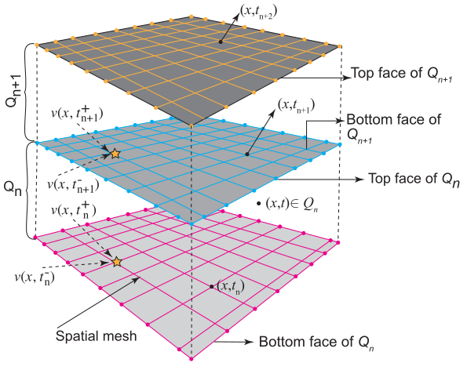
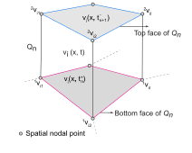

# TDG/STFEM for Elastodynamics {#sec-elastodynamics-vstfem}

## Continuum theory of elastodynamics

Let $\Omega\subset\mathbb{R}^{n_{sd}}$ be an open and bounded region occupied by an elastic body at time $t$, where $n_{sd}$ is the number of spatial dimensions. The boundary of $\Omega$ is denoted by $\Gamma$. Let $\bar{\Omega}=\Omega\cup\Gamma$ denote the closure of $\Omega$. Further, let indices $i,j,k$ and $l$ take values from $1,\cdots,n_{sd}$, and the Einstein summation convention applies to the repeated indices $i,j,k,$ and $l$ only. Furthermore, consider the nonoverlapping partitions, $\Gamma_{i}^{g}$ and $\Gamma_{i}^{h}$, of the boundary $\Gamma$ such that

$$\begin{aligned}
\Gamma & =\Gamma_{i}^{g}\cup\Gamma_{i}^{h}, & \Gamma_{i}^{g}\cap\Gamma_{i}^{h} & =\phi, & i & =1,\cdots,n_{sd}
\end{aligned}
$$

The displacement, velocity, and stress field are denoted by $\mathbf{u}$, $mathbf{v}$, and $\sigma$, respectively. The infinitesimal strain tensor, $\varepsilon$, and stretching tensor, $\mathbf{d}$, are given by

$$
\begin{aligned}
\varepsilon:={\mathbf{e}}\left({\mathbf{u}}\right) & =\frac{1}{2}\left({{\mathbf{u}}\otimes{\nabla_{x}}}\right)+\frac{1}{2}\left({{\nabla_{x}}\otimes{\mathbf{u}}}\right), & {\varepsilon_{ij}} & ={e_{ij}}\left({\mathbf{u}}\right)=\frac{1}{2}\left({\frac{{\partial{u_{i}}}}{{\partial{x_{j}}}}+\frac{{\partial{u_{j}}}}{{\partial{x_{i}}}}}\right)
\end{aligned}
$${#eq-ch3-119}

$$
\begin{aligned}
{\mathbf{d}}:={\mathbf{e}}\left({\mathbf{v}}\right) & =\frac{1}{2}\left({{\mathbf{v}}\otimes{\nabla_{x}}}\right)+\frac{1}{2}\left({{\nabla_{x}}\otimes{\mathbf{v}}}\right), & {d_{ij}} & ={e_{ij}}\left({\mathbf{v}}\right)=\frac{1}{2}\left({\frac{{\partial{v_{i}}}}{{\partial{x_{j}}}}+\frac{{\partial{v_{j}}}}{{\partial{x_{i}}}}}\right)
\end{aligned}
$${#eq-ch3-120}

in which $\varepsilon_{ij}$, $d_{ij}$, $u_{i}$ and $v_{i}$ denote the Cartesian components of $\varepsilon$, $\mathbf{d}$, $\mathbf{u}$, and $\mathbf{v}$, respectively.

In the small strain framework, the linear elastic constitutive relationship is described as,

$$
\begin{aligned} \dot{\sigma}_{ij} & =C_{ijkl}d_{kl}, & \sigma_{ij} & =C_{ijkl}\varepsilon_{kl}
\end{aligned}
$${#eq-ch3-121}

where $\dot{\sigma}_{ij}$ denotes the first-order time derivative of the stress field, and $C_{ijkl}$ is the fourth-order elasticity tensor. In the case of an isotropic material, the elasticity tensor is expressed using the Lame parameters, $\lambda,\mu$:

$$
C_{ijkl}:=\lambda\delta_{ij}\delta_{kl}+2\mu\left(\frac{\delta_{ik}\delta_{jl}+\delta_{il}\delta_{jk}}{2}\right)
$${#eq-ch3-122}

in which $\delta_{ij}$ represents the Kronecker-delta function. If $i=j$ then $\delta_{ij}=1$, otherwise $\delta_{ij}=0$.

The strong form of the initial-boundary value problem of elastodynamics
can be stated as: given the functions

$$b_{i}:\Omega\times\left[0,T\right]\rightarrow\mathbb{R},$$

$$g_{i}:\Gamma_{i}^{g}\times\left[0,T\right]\rightarrow\mathbb{R},$$

$$f_{i}^{s}:\Gamma_{i}^{h}\times\left[0,T\right]\rightarrow\mathbb{R},$$

$${u_{0}}_{i}:\Omega\rightarrow\mathbb{R},$$

$${v_{0}}_{i}:\Omega\rightarrow\mathbb{R},$$

$$\rho:\Omega\rightarrow\mathbb{R},$$

find $u_{i}:\bar{\Omega}\times\left[0,T\right]\rightarrow\mathbb{R}$, such that

$$
\begin{aligned}
\rho\frac{{{\partial^{2}}{u_{i}}}}{{\partial{t^{2}}}}-\frac{{\partial{\sigma_{ij}}}}{{\partial{x_{j}}}}-\rho{b_{i}} & =0, & \forall(\mathbf{x},t)\in\Omega\times(0,T)
\end{aligned}
$${#eq-ch3-123}

$$
\begin{aligned}
{u_{i}} & ={g_{i}}, & \forall(\mathbf{x},t)\in\Gamma_{i}^{g}\times(0,T)
\end{aligned}
$${#eq-ch3-124}

$$
\begin{aligned}
{\sigma_{ij}}{n_{j}} & =f_{i}^{s}, & \forall(\mathbf{x},t)\in\Gamma_{i}^{h}\times(0,T)
\end{aligned}
$${#eq-ch3-125}

$$
\begin{aligned}
{u_{i}}\left({{\mathbf{x}},0}\right) & ={u_{0i}}, & \forall\mathbf{x}\in\Omega
\end{aligned}
$${#eq-ch3-126}

$$\begin{aligned}
\frac{{\partial{u_{i}}\left({{\mathbf{x}},0}\right)}}{{\partial t}} & ={v_{0i}}, & \forall\mathbf{x}\in\Omega
\end{aligned}
$${#eq-ch3-127}

where $\rho$ is the mass density of the elastic body, $b_{i}$ is the body force density, $g_{i}$ is the prescribed displacement on the Dirichlet-boundary $\Gamma_{i}^{g}$, $f_{i}^{s}$ is the prescribed traction on the Neumann-boundary $\Gamma_{i}^{h}$, $u_{0i}$ is the initial value of the displacement field, and $v_{0i}$ is the initial value of the velocity field.

## Space-time notations

Let $\Omega_{h}$, the set of finite spatial elements $\Omega_{e},e=1,\cdots,n_{el}$, be the discretization of spatial domain $\Omega$, where $n_{el}$ is the total number of spatial elements in $\Omega_{h}$. Furthermore, consider a non-uniform subdivision for the time domain $\left[0,T\right]$,

$$
0=t_{0}<t_{1}<\cdots<t_{N}=T
$$

with

$$
I_{n}=(t_{n},t_{n}+1),\quad\Delta t_{n}=t_{n+1}-t_{n},\quad\Delta t=\mathop{\max}\limits_{0\leqslant n\leqslant N-1}\Delta{t_{n}}.
$$

The space-time slab $Q_{n}$ and the space-time finite element $Q_{n,e}$ are given by following expressions,

$$
\begin{aligned} Q_{n} & :=\Omega_{h}\times I_{n}, & Q_{n,e} & :=\Omega_{e},\quad e=1,\cdots,n_{el}
\end{aligned}
$$

Accordingly,

$$
{\mathbb{Q}_{h}}:=\bigcup\limits_{n=0}^{N-1}{{Q_{n}}}
$$

denotes the discretization of the entire space-time domain.

In TDG/ST/FEM, the unknown fields remains continuous in the spatial domain $\Omega_{h}$, and discontinuity in time occurs at times that belong to the finite set,

$$
{D_{t}}:=\left\{ {{t_{0}},{t_{1}},\ldots,{t_{N}}}\right\}.
$$

Therefore, at the discrete times $t\in D_{t}$ the solution have two values, and the jump discontinuity in time for some unknown scalar field $q(\mathbf{x},t)$ at time $t_{n}\in D_{t}$ is given by @eq-ch3-128

$$
{\left[\kern-0.15em \left[{q\left({\mathbf{x}}\right)}\right]\kern-0.15em \right]_{n}}=q_{n}^{+}\left({\mathbf{x}}\right)-q_{n}^{-}\left({\mathbf{x}}\right)
$${#eq-ch3-128}

where

$$
\begin{aligned}
q_{n}^{+}\left({\mathbf{x}}\right) & =\mathop{\lim}\limits_{\varepsilon\to0}q\left({{\mathbf{x}},{t_{n}}+\varepsilon}\right), & q_{n}^{-}\left({\mathbf{x}}\right) & =\mathop{\lim}\limits_{\varepsilon\to0}q\left({{\mathbf{x}},{t_{n}}-\varepsilon}\right)
\end{aligned}
$${#eq-ch3-129}

denote the right and left limits of the unknown field $q(\mathbf{x},t)$ at time $t=t_{n}$, respectively.

Let us now consider ${\wp_{l}}\left({Q_{n,e}^ {}}\right)$, the collection of all polynomials defined on $Q_{n,e}$ with a total degree of no more than $l$, and $C^{0}(\star)$, the space of piecewise continuous functions defined on domain $(\star)$. Consider also the following collection of functions:

$$
\Im_{l}^{h}:=\left\{ {\left.{{{\mathbf{u}}^{h}}}\right|{{\mathbf{u}}^{h}}\in{C^{0}}{{\left({\bigcup\limits_{n=0}^{N-1}{{Q_{n}}}}\right)}^{{n_{sd}}}},\left.{{{\mathbf{u}}^{h}}}\right|{Q_{n,e}}\in{{\left({{\wp_{l}}\left({{Q_{n,e}}}\right)}\right)}^{{n_{sd}}}}}\right\}
$${#eq-ch3-130}

where ${\left.{{{\mathbf{u}}^{h}}}\right|{Q_{n,e}}}$ is the restriction of $\mathbf{u}^{h}$ to $Q_{n,e}$. Lastly, the space of the test functions for the TDG/ST/FEM is given as

$$
{V^{h}}:=\left\{ {\left.{{{\mathbf{u}}^{h}}}\right|{{\mathbf{u}}^{h}}\in\Im_{l}^{h},u_{i}^{h}=0,\forall\left({{\mathbf{x}},t}\right)\in\Gamma_{i}^{g}\times{I_{n}},{\text{for }}i=1,\cdots,{n_{sd}}}\right\}
$${#eq-ch3-131}

In what follows, a general introduction to the two-field TDG/ST/FEM is provided, then the weak-form for the v-ST/FEM is derived by using the two-field formulation.

## Two-field TDG/ST/FEM

In the two-field formulation, both the displacement field and velocity field are taken as primary unknowns. Accordingly, the weak form should satisfy the following conditions in the weak sense:

1.  Balance of the linear momentum, @eq-ch3-123
2.  Essential and natural boundary conditions, @eq-ch3-123 and @eq-ch3-125
3.  Traction continuity in space;
4.  Continuity of the velocity field in time;

$$
{\left[\kern-0.15em \left[{{{\mathbf{v}}^{h}}\left({\mathbf{x}}\right)}\right]\kern-0.15em \right]_{n}}=0
$$

5.  Continuity of the displacement field in time;

$$
{\left[\kern-0.15em \left[{{{\mathbf{u}}^{h}}\left({\mathbf{x}}\right)}\right]\kern-0.15em \right]_{n}}=0
$$

6.  Displacement-velocity compatibility condition;

$$
\frac{{\partial{{\mathbf{u}}^{h}}}}{{\partial t}}-{{\mathbf{v}}^{h}}=0
$$

Here, Conditions (i)--(iii) are always satisfied as the weak form is derived by employing the Galerkin method [@Hughes2012]. Conditions (iv) and (v) necessary due to the time-discontinuous approximation of the displacement and velocity field, respectively. Condition (vi) is due to the independent approximation of the displacement field and velocity field.

The displacement-velocity two-field weak-form for TDG/ST/FEM in its original form as presented by @Hughes1988 is described as follows.

:::{.callout-note title="Weak form"}

Find $\mathbf{u}\in S_{u}^{h}$ and $\mathbf{v}\in S_{v}^{h}$ such that for all $\delta\mathbf{u}\in V^{h}$ and $\delta\mathbf{v}\in V^{h}$, and for all $n=1,\cdots,N-1$ @eq-ch3-132 holds.

$$
\begin{split} & \int_{{I_{n}}}^ {}{\int_{{\Omega_{h}}}^ {}{\delta{v_{i}}\rho\frac{{\partial{v_{i}}}}{{\partial t}}d\Omega}dt}+\int_{{\Omega_{n}}}^ {}{\delta{v_{i}}\left({{\mathbf{x}},t_{n}^{+}}\right)\rho{{\left[\kern-0.15em \left[{{v_{i}}\left({\mathbf{x}}\right)}\right]\kern-0.15em \right]}_{n}}d\Omega}\\
 & +\int_{{I_{n}}}^ {}{\int_{{\Omega_{h}}}^ {}{\frac{{\partial\delta v_{i}^ {}}}{{\partial{x_{j}}}}{\sigma_{ij}}\left({{\mathbf{x}},t}\right)d\Omega}dt}-\int_{{I_{n}}}^ {}{\int_{\Gamma_{i}^{h}}^ {}{\delta{v_{i}}f_{i}^{s}ds}dt}\\
 & -\int_{{I_{n}}}^ {}{\int_{{\Omega_{h}}}^ {}{\delta{v_{i}}\rho{b_{i}}d\Omega}dt}+\int_{{I_{n}}}^ {}{\int_{{\Omega_{h}}}^ {}{\frac{{\partial\delta{u_{i}}}}{{\partial{x_{j}}}}{C_{ijkl}}\frac{\partial}{{\partial{x_{l}}}}\left({\frac{{\partial{u_{k}}}}{{\partial t}}-{v_{k}}}\right)d\Omega}dt}\\
 & +\int_{{\Omega_{h}}}^ {}{\frac{{\partial\delta{u_{i}}\left({{\mathbf{x}},{t_{n}}}\right)}}{{\partial{x_{j}}}}{C_{ijkl}}\frac{{\partial{{\left[\kern-0.15em \left[{{u_{k}}\left({\mathbf{x}}\right)}\right]\kern-0.15em \right]}_{n}}}}{{\partial{x_{l}}}}d\Omega}=0
\end{split}
$${#eq-ch3-132}

where $S_{u}^{h}$ and $S_{v}^{h}$ denote the collections of trial functions for the displacement field and velocity field, respectively, and given by

$$
S_{u}^{h}:=\left\{ {\left.{\mathbf{u}}\right|{\mathbf{u}}\in\Im_{l}^{h},{u_{i}}={g_{i}},\forall\left({{\mathbf{x}},t}\right)\in\Gamma_{i}^{g}\times{I_{n}},i=1,\cdots,{n_{sd}}}\right\}
$${#eq-ch3-133}

$$
S_{v}^{h}:=\left\{ {\left.{\mathbf{v}}\right|{\mathbf{v}}\in\Im_{l}^{h},{v_{i}}=\frac{{\partial{g_{i}}}}{{\partial t}},\forall\left({{\mathbf{x}},t}\right)\in\Gamma_{i}^{g}\times{I_{n}},i=1,\cdots,{n_{sd}}}\right\}
$${#eq-ch3-134}
:::

It is noteworthy that in the above-mentioned weak-form, Conditions (v) and (vi) are satisfied by using a strain-energy norm and Condition (iv) is satisfied by using a kinetic energy norm.

## Velocity based TDG/ST/FEM: v-ST/FEM

In the velocity based time-discontinuous space-time finite element method (v-ST/FEM) displacement-velocity compatibility condition is strongly enforced by computing the displacement field from the consistent time-integration of the velocity field. Accordingly, displacement field remains continuous in time while velocity field still remains discontinuous at the discrete times.

The weak-form for the v-ST/FEM can be stated as:

:::{.callout-note title="Weak form"}
Find $\mathbf{v}\in S_{v}^{h}$ such that for all $\delta\mathbf{v}\in V^{h}$, and for all $n=1,\cdots,N-1$, @eq-ch3-135 holds.

$$
\begin{split} & \int_{{I_{n}}}^ {}{\int_{{\Omega_{h}}}^ {}{\delta{v_{i}}\rho\frac{{\partial{v_{i}}}}{{\partial t}}d\Omega}dt}+\int_{{\Omega_{n}}}^ {}{\delta{v_{i}}\left({{\mathbf{x}},t_{n}^{+}}\right)\rho{v_{i}}\left({{\mathbf{x}},t_{n}^{+}}\right)d\Omega}\\
 & +\int_{{I_{n}}}^ {}{\int_{{\Omega_{h}}}^ {}{\frac{{\partial\delta v_{i}^ {}}}{{\partial{x_{j}}}}{\sigma_{ij}}\left({{\mathbf{x}},t}\right)d\Omega}dt}-\int_{{I_{n}}}^ {}{\int_{\Gamma_{i}^{h}}^ {}{\delta{v_{i}}f_{i}^{s}ds}dt}\\
 & -\int_{{I_{n}}}^ {}{\int_{{\Omega_{h}}}^ {}{\delta{v_{i}}\rho{b_{i}}d\Omega}dt}-\int_{{\Omega_{n}}}^ {}{\delta{v_{i}}\left({{\mathbf{x}},t_{n}^{+}}\right)\rho{v_{i}}\left({{\mathbf{x}},t_{n}^{-}}\right)d\Omega}=0
\end{split}
$${#eq-ch3-135}

:::

The displacement field is computed by

$$
{\mathbf{u}}\left({{\mathbf{x}},t}\right)={\mathbf{u}}\left({{\mathbf{x}},{t_{n}}}\right)+\int_{{t_{n}}}^{t}{{\mathbf{v}\left({{\mathbf{x}},{\tau}}\right)}d\tau},\qquad\forall\left({{\mathbf{x}},t}\right)\in{Q_{n}},\quad\forall{\mathbf{v}}\in S_{v}^{h}
$$ {#eq-ch3-136}

In the case of hyperelastic material law, the stress is computed by first computing the displacement field (see  @eq-ch3-119 and @eq-ch3-121). Alternatively, if the constitutive relationship is given in the rate form (e.g., hypoelastic form) then stress field can be obtained by time integration of the rate form. In latter case, computation of displacement field can be avoided. In the realm of small strain theory, however, these two techniques of stress recovery are equivalent, and the stress field in a space-time slab takes the form

$$
{\sigma_{ij}}\left({{\mathbf{x}},t}\right)={\sigma_{ij}}\left({{\mathbf{x}},{t_{n}}}\right)+{C_{ijkl}}{\psi_{kl}}\left({{\mathbf{v}},t}\right),\qquad\forall\left({{\mathbf{x}},t}\right)\in{Q_{n}},\forall v\in S_{v}^{h}
$$ {#eq-ch3-137}

where

$$
{\psi_{ij}}\left({{\mathbf{v}},t}\right)=\int_{{t_{n}}}^{t}{\frac{{\partial{v_{i}}}}{{\partial{x_{j}}}}d\tau,}\qquad\forall t\in{I_{n}},\forall{\mathbf{v}}\in S_{v}^{h}
$$ {#eq-ch3-138}

Subsequently, by substituting the expression for the stress given in @eq-ch3-137 into the weak-form, Eq. @eq-ch3-135, the following weak-form for v-ST/FEM is obtained;

:::{.callout-note title="Weak form"}
Find $\mathbf{v}\in S_{v}^{h}$ such that for all
$\delta\mathbf{v}\in V^{h}$, and for all $n=1,\cdots,N-1$, Eq.
[\[eq-ch3-139\]](#eq-ch3-139){reference-type="eqref"
reference="eq-ch3-139"} holds.
$$\begin{split} & \int_{{I_{n}}}^ {}{\int_{{\Omega_{h}}}^ {}{\delta{v_{i}}\rho\frac{{\partial{v_{i}}}}{{\partial t}}d\Omega}dt}+\int_{{\Omega_{n}}}^ {}{\delta{v_{i}}\left({{\mathbf{x}},t_{n}^{+}}\right)\rho{v_{i}}\left({{\mathbf{x}},t_{n}^{+}}\right)d\Omega}\\
 & +\int_{{I_{n}}}^ {}{\int_{{\Omega_{h}}}^ {}{\frac{{\partial\delta v_{i}^ {}}}{{\partial{x_{j}}}}{\sigma_{ij}}\left({{\mathbf{x}},{t_{n}}}\right)d\Omega}dt}+\int_{{I_{n}}}^ {}{\int_{{\Omega_{h}}}^ {}{\frac{{\partial\delta v_{i}^ {}}}{{\partial{x_{j}}}}{C_{ijkl}}{\psi_{kl}}d\Omega}dt}\\
 & -\int_{{I_{n}}}^ {}{\int_{\Gamma_{i}^{h}}^ {}{\delta{v_{i}}f_{i}^{s}ds}dt}-\int_{{I_{n}}}^ {}{\int_{{\Omega_{h}}}^ {}{\delta{v_{i}}\rho{b_{i}}d\Omega}dt}\\
 & -\int_{{\Omega_{n}}}^ {}{\delta{v_{i}}\left({{\mathbf{x}},t_{n}^{+}}\right)\rho{v_{i}}\left({{\mathbf{x}},t_{n}^{-}}\right)d\Omega}=0
\end{split}
$$ {#eq-ch3-139}
:::

::: {#rmk-12}
In the two-field TDG/ST/FEM, both displacement and velocity are the primary unknown. This approach usually yields a large system of linear equations which in turn increases the computation cost. In this case, special procedures are required to reduce the size of the problem. Such procedures are mainly based on the predictor-multicorrector schemes [@Bonelli2002; @Bonelli2003; @Mancuso2003; @Kunthong2005].
:::

::: {#rmk-13}
In v-ST/FEM, velocity field is the primary unknown, therefore, the resultant system of linear equations will be significantly smaller than the one in case of two-field TDG/ST/FEM. Accordingly, the computation cost of v-ST/FEM is lower than the two-field TDG/ST/FEM, however, the cost is still higher than the classical semi-discrete schemes.
:::

## Implementation of v-ST/FEM

Consider $Q_{n,e}=\Omega_{e}\times I_{n}$ denoting the space-time finite element. Let $n_{e}$ be the total number of spatial nodes in the spatial finite element $\Omega_{e}$. Let $v_{i}(\mathbf{x},t_{n}^{+})$ and $v_{i}(\mathbf{x},t_{n+1}^{-})$ be the spatial nodal velocities on the bottom and top faces of space-time slab $Q_{n}$, respectively (see @fig-ch3-17). Furthermore, time $t\in I_{n}$ is given by

$$
t=T_{1}(\theta)t_{n}+T_{2}(\theta)t_{n+1},\quad\forall\theta\in\left[-1,1\right]
$$ {#eq-ch3-140}

where

$$
\begin{aligned}
T_{1}(\theta) & =\frac{1-\theta}{2} & T_{2}(\theta) & =\frac{1+\theta}{2}
\end{aligned}
$$ {#eq-ch3-141}

{#fig-ch3-17 width="50%" .lightbox}

{#fig-ch3-18}

The linear trial functions for the velocity defined on $Q_{n,e}$ are give by

$$
{v_{i}}\left({{\mathbf{x}},t}\right)={}_{}^{a}{v_{iI}}{T_{a}}\left(\theta\right){N^{I}}\left({\xi,\eta}\right),\quad\,a=1,2;\quad\,I=1,\cdots,{n_{e}}
$$ {#eq-ch3-142}

where $_{}^{a}{v_{iI}}$ denotes the space-time nodal values of velocity; $a=1$ and $a=2$ correspond to the bottom and top face (i.e., temporal nodes) of the space-time element, and $I=1,\cdots,n_{e}$ denotes the spatial node of the space-time element (see @fig-ch3-18). $N^{I}(\xi,\eta)$ are the spatial shape functions defined on the local domain. Accordingly, $v_{i}(\mathbf{x},t_{n}^{+})$ and $v_{i}(\mathbf{x},t_{n+1}^{-})$ are given by @eq-ch3-143 and @eq-ch3-144, respectively.

$$
{v_{i}}\left({{\mathbf{x}},t_{n}^{+}}\right)={}_{}^{1}{v_{iI}}{N^{I}}\left({\xi,\eta}\right)
$$ {#eq-ch3-143}

$$
{v_{i}}\left({{\mathbf{x}},t_{n+1}^{-}}\right)={}_{}^{2}{v_{iI}}{N^{I}}\left({\xi,\eta}\right)
$$ {#eq-ch3-144}

The displacement field corresponding to the above-mentioned local interpolation for the velocity field (cf. @eq-ch3-144) is obtained by using @eq-ch3-136.

$$
{u_{i}}\left({{\mathbf{x}},t}\right)={u_{i}}\left({{\mathbf{x}},{t_{n}}}\right)+{\tilde{T}_{1}}\left(\theta\right){v_{i}}\left({{\mathbf{x}},{t_{n}}}\right)+{\tilde{T}_{2}}\left(\theta\right){v_{i}}\left({{\mathbf{x}},{t_{n+1}}}\right)
$$ {#eq-ch3-145}

where

$$
\begin{aligned}
{{\tilde{T}}_{1}}\left(\theta\right) & =\frac{{\Delta{t_{n}}}}{2}\left[{1-T_{1}^{2}\left(\theta\right)}\right], & {{\tilde{T}}_{2}}\left(\theta\right) & =\frac{{\Delta{t_{n}}}}{2}T_{2}^{2}\left(\theta\right)\label{eq-ch3-146}
\end{aligned}
$$

are the quadratic shape function defined on $\left[-1,1\right]$. Subsequently, $\psi_{ij}$ in @eq-ch3-138 becomes,

$$
{\psi_{ij}}\left({{\mathbf{x}},t}\right)={}^{a}{v_{iI}}{{\tilde{T}}_{a}}\frac{{\partial{N^{I}}}}{{\partial{x_{j}}}}\label{eq-ch3-147}
$$

By using the expression for $psi_{ij}$ in @eq-ch3-137 the stress $\sigma_{ij}$ inside the space-time element is described as,

$$
\begin{aligned}
{\sigma_{ij}}\left({{\mathbf{x}},t}\right) & ={\sigma_{ij}}\left({{\mathbf{x}},{t_{n}}}\right)+{{\tilde{T}}_{a}}{C_{ijkl}}\frac{{\partial{N^{I}}}}{{\partial{x_{l}}}}{}^{a}{v_{kI}}, & \forall(\mathbf{x},t)\in Q_{n,e}
\end{aligned}
$$ {#eq-ch3-148}

Lastly, the test functions for the velocity field are desribed as

$$
{\delta v_{i}}\left({{\mathbf{x}},t}\right)={}_{}^{a}{\delta v_{iI}}{T_{a}}\left(\theta\right){N^{I}}\left({\xi,\eta}\right),\quad\,a=1,2;\quad\,I=1,\cdots,{n_{e}}
$$ {#eq-ch3-149}

Using @eq-ch3-140 -- @eq-ch3-149 for the space-time finite element discretization of the weak-form which is given in Eq. @eq-ch3-139.

$$
\begin{split} & ^{a}\delta{v_{iI}}\left[{\int_{{I_{n}}}^ {}{\int_{{\Omega_{h}}}^ {}{{N^{I}}{T_{a}}\rho\frac{{\partial{N^{J}}{T_{b}}}}{{\partial t}}d\Omega}dt}}\right]{}^{b}{v_{iJ}}{+^{a}}\delta{v_{iI}}\left[{{\delta_{1a}}{\delta_{1b}}\int_{{\Omega_{n}}}^ {}{{N^{I}}\rho{N^{J}}d\Omega}}\right]{}^{b}{v_{iJ}}\\
 & {+^{a}}\delta v_{iI}^ {}\left\{ {\int_{{I_{n}}}^ {}{{T_{a}}\int_{{\Omega_{h}}}^ {}{\frac{{\partial{N^{I}}}}{{\partial{x_{j}}}}\sigma_{ij}^{n}d\Omega}dt}}\right\} {+^{a}}\delta v_{iI}^ {}\left[{\int_{{I_{n}}}^ {}{{T_{a}}{{\tilde{T}}_{b}}\int_{{\Omega_{h}}}^ {}{\frac{{\partial{N^{I}}}}{{\partial{x_{j}}}}{C_{ijkl}}\frac{{\partial{N^{J}}}}{{\partial{x_{l}}}}d\Omega}dt}}\right]{}^{b}{v_{kJ}}\\
 & -^{a}\delta{v_{iI}}\left\{ {\int_{{I_{n}}}^ {}{\int_{\Gamma_{i}^{h}}^ {}{{T_{a}}{N^{I}}f_{i}^{s}ds}dt}}\right\} -{}^{a}\delta{v_{iI}}\left\{ {\int_{{I_{n}}}^ {}{\int_{{\Omega_{h}}}^ {}{{T_{a}}{N^{I}}\rho{b_{i}}d\Omega}dt}}\right\} \\
 & -^{a}\delta{v_{iI}}\left[{{\delta_{1a}}\int_{{\Omega_{n}}}^ {}{{N^{I}}\rho{N^{J}}d\Omega}}\right]v_{iJ}^{-}=0
\end{split}
$$ {#eq-ch3-150}

Let us now use the following notation for representing the global space-time nodal vector,

$$
\left\{ {\mathbf{J}}\right\} :=\left\{ J\right\} _{i}^{a}\left(I\right)
$$

here $a=1,2$ corresponds to the temporal nodes, $I=1,\cdots$ corresponds to the $I^{th}$ spatial node, and $i=1,2$ corresponds to spatial components. Accordingly, $a=1$ corresponds to the spatial nodal values of the vector defined at the bottom space-time slab (i.e., at time $t_{n}^{+}$). Similarly, $a=2$ corresponds to the spatial nodal values of the vector at the top space-time slab (i.e., at time $t_{n+1}^{-}$).

A typical space-time finite element matrix will be denoted as:

$$
\left[{\mathbf{K}}\right]:=\left[K\right]_{ij}^{ab}\left({I,J}\right)
$$

where $a,b=1,2$ corresponds to the temporal nodes, $I=1,\cdots,n_{e}$ corresponds to the spatial node, and $i,j=1,2$ corresponds to the spatial components.

By using these notations @eq-ch3-150 can be expressed as:

$$
\left\{ {\delta v}\right\} _{i}^{a}\left(I\right)\cdot\left(\begin{gathered}\left[M\right]_{ij}^{ab}\left({I,J}\right)\cdot\left\{ v\right\} _{j}^{b}\left(J\right)+\left[K\right]_{ij}^{ab}\left({I,J}\right)\cdot\left\{ v\right\} _{j}^{b}\left(J\right)\\
+\left\{ {{J_{{\sigma^{n}}}}}\right\} _{i}^{a}\left(I\right)-\left\{ {{J_{ext}}}\right\} _{i}^{a}\left(I\right)-\left\{ {{J_{0}}}\right\} _{i}^{a}\left(I\right)
\end{gathered}
\right)=0
$$ {#eq-ch3-151}

Since above equation is true for all values of $\left\{ \delta v\right\} _{i}^{a}$ one can obtain the following the system of linear equations:

$$
\left[M\right]_{ij}^{ab}\left({I,J}\right)\cdot\left\{ v\right\} _{j}^{b}\left(J\right)+\left[K\right]_{ij}^{ab}\left({I,J}\right)\cdot\left\{ v\right\} _{j}^{b}\left(J\right)=\left\{ {{J_{ext}}}\right\} _{i}^{a}\left(I\right)+\left\{ {{J_{0}}}\right\} _{i}^{a}\left(I\right)-\left\{ {{J_{{\sigma^{n}}}}}\right\}_{i}^{a}\left(I\right)
$$ {#eq-ch3-152}

Matrix-vector form of above equation is given as,

$$
\left[{\mathbf{M}}\right]\cdot\left\{ {{\mathbf{\tilde{v}}}}\right\} +\left[{\mathbf{K}}\right]\cdot\left\{ {{\mathbf{\tilde{v}}}}\right\} =\left\{ {{{\mathbf{J}}_{ext}}}\right\} +\left\{ {{{\mathbf{J}}_{0}}}\right\} -\left\{ {{{\mathbf{J}}_{{\sigma^{n}}}}}\right\}
$$ {#eq-ch3-153}

If Rayleigh damping is used to model the material damping then above
equation becomes:

$$
\left[{\mathbf{M}}\right]\cdot\left\{ {{\mathbf{\tilde{v}}}}\right\} +\left[{\mathbf{K}}\right]\cdot\left\{ {{\mathbf{\tilde{v}}}}\right\} +\alpha\left[{{{\mathbf{M}}_{R}}}\right]\cdot\left\{ {{\mathbf{\tilde{v}}}}\right\} +\beta\left[{{{\mathbf{K}}_{R}}}\right]\cdot\left\{ {{\mathbf{\tilde{v}}}}\right\} =\left\{ {{{\mathbf{J}}_{ext}}}\right\} +\left\{ {{{\mathbf{J}}_{0}}}\right\} -\left\{ {{{\mathbf{J}}_{{\sigma^{n}}}}}\right\}
$$ {#eq-ch3-154}

where $\alpha$ and $\beta$ are the Rayleigh damping coefficients.

In @eq-ch3-153 -- @eq-ch3-154, $\left\{ {{\mathbf{\tilde{v}}}}\right\}$ denotes the space-time nodal vector of velocity, $\left[{\mathbf{M}}\right]$ denotes the space-time mass matrix, $\left[{\mathbf{K}}\right]$ denotes the space-time tangent stiffness matrix, $\left[{{{\mathbf{M}}_{R}}}\right]$ is the mass proportional Rayleigh damping matrix, and $\left[{{{\mathbf{K}}_{R}}}\right]$ is the stiffness proportional Rayleigh damping matrix. Furthermore, $\left\{ {{{\mathbf{J}}_{ext}}}\right\}$ denotes the space-time nodal vectors which contains the contribution of external body force and external boundary traction, $\left\{ {{{\mathbf{J}}_{0}}}\right\}$ contains the contribution of initial velocity, and $\left\{ {{{\mathbf{J}}_{\sigma}^{n}}}\right\}$ contains the contribution of initial stress $\sigma^{n}$. In what follows the finite element expressions for these matrices and vectors are described.

$$
\left[{\mathbf{M}}\right]:=\left[M\right]_{ij}^{ab}\left({I,J}\right)={\delta_{ij}}\int_{{I_{n}}}^ {}{{T_{a}}\frac{{\partial{T_{b}}}}{{\partial t}}\int_{{\Omega_{h}}}^ {}{{N^{I}}\rho{N^{J}}d\Omega}dt}+{\delta_{ij}}{\delta_{1a}}{\delta_{1b}}\int_{{\Omega_{n}}}^ {}{{N^{I}}\rho{N^{J}}d\Omega}
$$ {#eq-ch3-155}

$$
\left[{\mathbf{K}}\right]:=\left[K\right]_{ij}^{ab}\left({I,J}\right)=\int_{{I_{n}}}^ {}{{T_{a}}{{\tilde{T}}_{b}}\int_{{\Omega_{h}}}^ {}{\frac{{\partial{N^{I}}}}{{\partial{x_{p}}}}{C_{pijq}}\frac{{\partial{N^{J}}}}{{\partial{x_{q}}}}d\Omega}dt}
$$ {#eq-ch3-156}

$$
\left[{{{\mathbf{M}}_{R}}}\right]:=\left[{{M_{R}}}\right]_{ij}^{ab}\left({I,J}\right)={\delta_{ij}}\int_{{I_{n}}}^ {}{{T_{a}}{T_{b}}\int_{{\Omega_{h}}}^ {}{{N^{I}}{N^{J}}d\Omega}dt}
$${#eq-ch3-157}

$$
\left[{{{\mathbf{K}}_{R}}}\right]:=\left[{{K_{R}}}\right]_{ij}^{ab}\left({I,J}\right)=\int_{{I_{n}}}^ {}{{T_{a}}{T_{b}}\int_{{\Omega_{h}}}^ {}{\frac{{\partial{N^{I}}}}{{\partial{x_{p}}}}{C_{pijq}}\frac{{\partial{N^{J}}}}{{\partial{x_{q}}}}d\Omega}dt}
$$ {#eq-ch3-158}

$$
\left\{ {{{\mathbf{J}}_{ext}}}\right\} :=\left\{ {{J_{ext}}}\right\} _{i}^{a}\left(I\right)=\int_{{I_{n}}}^ {}{\int_{{\Omega_{h}}}^ {}{{N^{I}}{T_{a}}\rho{b_{i}}}d\Omega dt}+\int_{{I_{n}}}^ {}{\int_{\Gamma_{i}^{h}}^ {}{{N^{I}}{T_{a}}\rho f_{i}^{s}}dsdt}
$$ {#eq-ch3-159}

$$
\left\{ {{{\mathbf{J}}_{0}}}\right\} :=\left\{ {{J_{0}}}\right\} _{i}^{a}\left(I\right)={\delta_{1a}}{\delta_{ij}}\left[{\int_{{\Omega_{h}}}^ {}{{N^{I}}\rho{N^{J}}d\Omega}}\right]\left\{ {^{0}{v_{jJ}}}\right\}
$${#eq-ch3-160}

where, $\left\{ {^{0}{v_{jJ}}}\right\}$ denotes the initial velocity for the space-time slab $Q_{n}$, i.e., spatial nodal velocity at time $t_{n}^{-}$. Note that this velocity vector is known from the computation in the previous space-time slab $Q_{n-1}$.

$$
\left\{ {{{\mathbf{J}}_{{\sigma^{n}}}}}\right\} :=\left\{ {{J_{{\sigma^{n}}}}}\right\} _{i}^{a}\left(I\right)=\int_{{I_{n}}}^ {}{{T_{a}}\int_{{\Omega_{h}}}^ {}{\frac{{\partial{N^{I}}}}{{\partial{x_{j}}}}\sigma_{ij}^{n}d\Omega}dt}
$${#eq-ch3-161}

where $\sigma^{n}:=\sigma(\mathbf{x},t_{n})$ is the stress at time $t_{n}$ which is usually computed from the displacement field at time $t_{n}$.

This section briefly discusses the space-time matrices and vectors, however, a detailed description about the derivation of the space-time matrices and space-time vectors can be found in Appendix.
