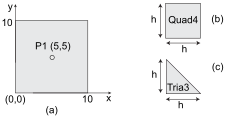
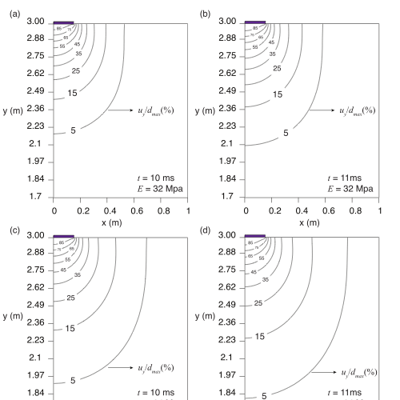

# Numerical examples {#sec-elastodynamics-numerical-examples}

## Primary wave propagation in homogeneous linear elastic medium

A theoretical model of homogenous isotropic linear elastic media occupying a square domain, $\Omega=\left[0,L\right] \times \left[0,L\right]$, is considered in this section for a numerical analysis of v-ST/FEM. The governing equations of the problem are given by @eq-ch3-123 -- @eq-ch3-127.

Further, it is assumed that the elastic media is subjected to the periodic boundary conditions with no external body force (i.e., $b_i=0$ in @eq-ch3-123. The initial conditions for displacement and velocity field corresponding to @eq-ch3-126 and @eq-ch3-127 are given by:

$$
\begin{align}
    {{\mathbf{u}}_0}\left( {\mathbf{x}} \right) &= {{\mathbf{d}}_0}\cos \left( {k{\mathbf{x}} \cdot {\mathbf{\hat r}}} \right),&
    {{\mathbf{v}}_0}\left( {\mathbf{x}} \right) &= ck{{\mathbf{d}}_0}\sin \left( {k{\mathbf{x}} \cdot {\mathbf{\hat r}}} \right)
\end{align}
$${#eq-ch3-162}

where $k$ is the wave-number, $\hat{\mathbf{r}}$ is the direction vector of the wave propagation, $\mathbf{d}_0 \in \mathbb{R}^2$ denotes the direction of the motion of particles of the medium, and $c$ is related to the speed of the wave in the medium.

The above-mentioned initial conditions create a plane P-wave if $\hat{\mathbf{r}}$ vector is parallel to $\mathbf{d}_0$. The analytical solutions for displacement and velocity can be given by [@Achenbach1973a]:

$$
\begin{align}
    {\mathbf{u}}\left( {{\mathbf{x}},t} \right) &= {{\mathbf{d}}_0}\cos \left[ {k\left( {{\mathbf{x}} \cdot {\mathbf{\hat r}} - {c_p}t} \right)} \right]&
    {\mathbf{v}}\left( {{\mathbf{x}},t} \right) = {c_p}k{{\mathbf{d}}_0}\sin \left[ {k\left( {{\mathbf{x}} \cdot {\mathbf{\hat r}} - {c_p}t} \right)} \right]
\end{align}
$${#eq-ch3-163}

where

$${c_p} = \sqrt {\frac{{\lambda  + 2\mu }}{\rho }}$$

is the speed of the P-wave.

The values of constants and the parameters used for solving the problem are given in @tbl-ch3-2  and @fig-ch3-19 depicts the physical dimensions of the problem. All variables have been dimensionless. Letting $\mathbf{u}^h(\mathbf{x},t)$ and $\mathbf{v}^h(\mathbf{x},t)$ denote the numerical solutions computed by employing the v-ST/FEM, the error in displacement field ${E_u}\left( {{t_n}} \right)$ and the error in velocity field ${E_v}\left( {{t_n}} \right)$ are then defined as:

$$
\begin{align}
    {E_u}\left( {{t_n}} \right) &: = {\left\| {{{\mathbf{u}}^h}\left( {{\mathbf{x}},{t_n}} \right) - {\mathbf{u}}\left( {{\mathbf{x}},{t_n}} \right)} \right\|_2},&
    {E_v}\left( {{t_n}} \right)&: = {\left\| {{{\mathbf{v}}^h}\left( {{\mathbf{x}},t_n^ - } \right) - {\mathbf{v}}\left( {{\mathbf{x}},{t_n}} \right)} \right\|_2}
\end{align}
$${#eq-ch3-164}

where $\left\| {\, \cdot \,} \right\|_2$ denotes the $L_2$ norm given by

$$
\begin{equation}
    {\left\| {\mathbf{u}} \right\|_2} = {\left[ {\int_\Omega ^{} {{\mathbf{u}}\left( {{\mathbf{x}},t} \right) \cdot {\mathbf{u}}\left( {{\mathbf{x}},t} \right)d\Omega } } \right]^{1/2}}
\end{equation}
$${#eq-ch3-165}

{#fig-ch3-19}

{#fig-ch3-20}

{#fig-ch3-21}

The numerical experiments for determining the convergence rate of the solution in the space domain are performed on two sequences of regular linear triangular (Tria3) and bilinear quadrilateral (Quad4) meshes (see Fig. @fig-ch3-19), while keeping the time-step fixed $\Delta t=0.1$ sec.

Each sequence consists of four meshes with a decreasing mesh size. In @fig-ch3-20, the L2 norm of the errors in the displacement and velocity fields at time $t=1.0$ sec are given in relation to mesh spacing parameter $h$. Based on the convergence results, it can be stated that the v-ST/FEM formulation is nearly second-order accurate in the space for both Quad4 and Tria3 elements. In @fig-ch3-20, it is observed that the error for the triangular spatial mesh (Tria3) is less than that of the quadrilateral spatial element (Quad4) for the same mesh spacing. This can be attributed to the perfect alignment of the diagonal of the triangular elements with the characteristic lines of the wave propagation.

{#fig-ch3-22}

Furthermore, the convergence of the solutions (displacement and velocity) in the time domain is illustrated in @fig-ch3-21. It can be seen that both displacement and velocity fields computed by the present method are third order accurate in time. Note that the results presented in @fig-ch3-21 are consistent with @eq-ch3-114.

@fig-ch3-22 illustrates the spatial variation of the displacement and velocity fields obtained by v-ST/FEM. The results are obtained at time $t=35$ seconds with linear triangular mesh of size $h=0.25$ and uniform time-step of size $\Delta t = 0.1$ sec. The results advocate the ability of v-ST/FEM to maintain the high-order accuracy of the long-term solutions, especially the displacement and velocity waveforms. This can be attributed to the very low numerical dissipation and dispersion characteristics of the present method (see also @fig-ch3-15 and @fig-ch3-16). To further emphasize the accuracy of the long-term solutions, the time histories of the computed displacement and velocity at the midpoint P1 (see @fig-ch3-19) and the corresponding relative errors are presented in @fig-ch3-23.

{#fig-ch3-23}

## Impulsive response of a fixed-free pile

In this section, we consider a pile of length $L=50$ m with a unit cross-section area having one fixed end and one end loaded by an axial impulsive force given by a step function, as shown in Fig. [6](#fig-ch3-24){reference-type="ref" reference="fig-ch3-24"}. The mass density $\rho$ is $2500.0$ $kg/m^3$ and the Young's modulus $E$ is $1.0\times 10^{10}$ $N/m^2$. The magnitude of the implusive force is $1.0 \times 10^6$ $N$. Under these circumstances, the analytical solutions for the stress and velocity fields are discontinuous in the spatial domain and given by the step functions. Furthermore, the displacements are given by the piecewise continuous linear functions [@Cormeau1991; @Li1998; @Verruijt2009].

{#fig-ch3-24}

To solve the problem by using v-ST/FEM, uniform linear spatial elements of size $h=0.1m$ and a uniform time-step size $\Delta t = 10^{-4}$ sec have been adopted for discretizing the space and time domain, respectively. To assess the performance of the present method, the problem is also solved with semi-discretized FEM techniques using the same mesh parameters. In the latter case, the trapezoidal rule and the HHT-$\alpha$ method (with $\alpha=-1/3$) have been used as the time-stepping algorithms. The results of the stress field, velocity field, and displacement field obtained by different schemes are compared in @fig-ch3-25, @fig-ch3-26, and @fig-ch3-27, respectively. 

It is observed that the solutions for the stress and velocity fields obtained by the semi-discrete algorithms contain severe oscillations. Even worse, no improvement whatsoever is obtained when refining the mesh spacing or the time-step size. Further, in the case of the Newmark-beta method, these oscillations are present in the whole spatial domain; and thus, the accuracy of the stress and velocity fields deteriorate over time (see Fig. [7](#fig-ch3-25){reference-type="ref" reference="fig-ch3-25"} and Fig. [8](#fig-ch3-26){reference-type="ref" reference="fig-ch3-26"}). The poor performance with the Newmark-beta method is due to the absence of algorithmic damping, as discussed in previous sections. The HHT-$\alpha$ method improves the solutions by attenuating higher frequencies; however, the results are not satisfactory for the selected time-step size as the oscillations are still present. It is remarkable that v-ST/FEM completely localizes the oscillations in the stress and velocity fields near the point of discontinuity and yields very accurate solutions. The localization phenomenon can be attributed to the presence of jump discontinuity in the velocity field. The jump in the velocity field adds artificial viscous damping to the system, subsequently, increasing the accuracy and stabilizing the solutions [@Hulbert1990; @Johnson1993]. Furthermore, the presence of overshooting and undershooting around the point of discontinuity is related to the famous Gibbs phenomenon in the Fourier analysis [@Olver2016].

{#fig-ch3-25}

{#fig-ch3-26}

{#fig-ch3-27}

## Dynamic plate load test (DPLT)

In this section, an attempt is made to validate v-ST/FEM by simulating the dynamic plate loading test (DPLT) using a light falling weight deflectometer (LFWD). DPLT using LFWD is a non-destructive technique for a quick assessment of the field compaction quality. In DPLT, a rigid circular loading plate of radius $0.15$ m is placed on the soil surface and subjected to an impulse load generated by the falling weight from a specified height onto the plate. Subsequently, the induced soil movements are recorded and the dynamic resilience modulus of the tested material is computed by some empirical relations. A complete description of the test can be found elsewhere [@Adam2009; @Tawfik2017].

{#fig-ch3-28}

In the present study, DPLT is simulated by a two-dimensional axisymmetric v-ST/FEM model, where the center of the loading plate is positioned along the axis of symmetry. The geometry, boundary conditions, and spatial mesh of the finite element model are depicted in @fig-ch3-28. There are $5201$ linear triangular elements (Tria3) and $2688$ nodes present in the spatial mesh. The impulse load due to the falling weight is modeled by using an equivalent uniform vertical stress pulse of amplitude $100$ kPa and a time duration of $20$ ms [@Adam2009]. The stress pulse $h(t)$ acting on the loading plate is defined by a half sine wave as:

$$
h(t)=-10^{5} \sin(50 \pi t) \, \text{N/m}{}^2
$$

The total simulation time $T$ is set to $30$ ms, and the linear time elements of size $\Delta t = 1$ ms have been adopted for discretizing the time domain. Subsequently, the results computed by the proposed method are compared with the two DPLT studies available in the literature. The first study is denoted as S1 where the in-situ LFWD test was conducted by [@Tawfik2017], and the second study is denoted by S2 in which the numerical investigation was conducted by [@Adam2009] using the Boundary Element Method (BEM). In these studies (i.e., S1 and S2), the soils have different values for Young's modulus $E$ and common values for Poisson's ratio $\nu$ and mass density $\rho$, as shown in @tbl-ch3-3.

::: {#tbl-ch3-3}

|  Elastic parameters   |     Method         |  $d_{max}$  | $p_{max}$    |
| --------------------- | ------------------ | ----------- | ------------ |
| $E=65$ Mpa            |      v-ST/FEM      |  $0.33$ mm  |   $90.0$ kPa |
| $\nu = 0.212$         |    In-situ study (S1) |    $0.35$ mm   |  $100$ kPa |
| $\rho = 2000$ $kg/m^3$|                    |             |              |
| $E=32$ Mpa            |         v-ST/FEM   |   $0.67$ mm |   $90.0$ kPa |
| $\nu = 0.212$         |  BEM study (S2)    |  $0.65$ mm  |  $93.1$ kPa  |

:  List of elastic material parameters, and the results of maximum plate deflection and maximum soil-plate normal contact stress obtained by different schemes.

:::

The results of the time histories of the vertical displacement and the velocity of the loading plate, and the soil-plate contact stress are plotted in @fig-ch3-29. The maximum deflection of the plate $d_{max}$ obtained by v-ST/FEM is about $0.33$ mm and $0.67$ mm corresponding to the material parameters used in the studies S1 and S2, respectively. From @tbl-ch3-3, it is evident that these computed values for $d_{max}$ are in good agreement with those reported in studies S1 and S2. In the present study, the maximum soil-plate normal contact stress $p_{max}$ is about $90$ kPa; which lower than the values reported in studies S1 and S2 (see @tbl-ch3-3). This may be due to the use of linear triangular elements and the absence of the soil-plate interface elements in the present formulation. Furthermore, the maximum deflection of the plate occurs at time $t_d = 11$ ms, and the maximum contact stress $p_{max}$ occurs at time $t_p =10$ ms. The displacement contours at these time steps are depicted in @fig-ch3-30, where displacements are normalized with respect to the maximum deflection of the plate.

{#fig-ch3-29}

{#fig-ch3-30}
