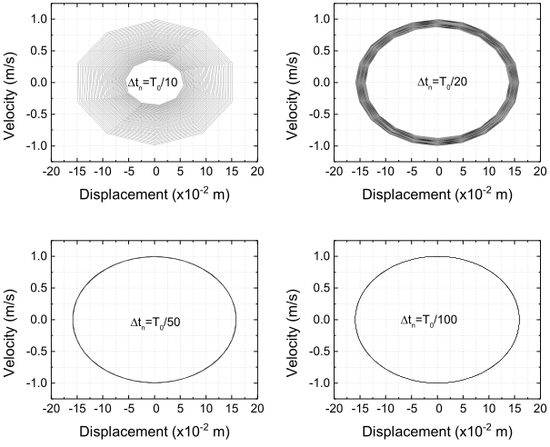
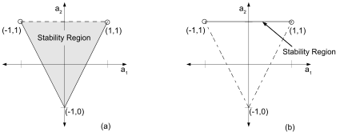
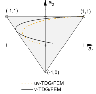

# TDG/FEM for the second order ODE

<!-- {#sec-tdg-fem-second-order-ode} -->

Consider a mass-spring-dashpot system as depicted in @fig-ch3-5 . The governing equation of motion is described by the following second order initial value problem in time.

$$
\begin{split}\frac{{{d^{2}}u}}{{d{t^{2}}}}+2\zeta{\omega_{n}}\frac{{du}}{{dt}}+\omega_{n}^{2}u & =f\left(t\right)\quad\forall t\in\left[0,T\right]\\
u(0) & =u_{0}\\
\frac{du(0)}{dt} & =v_{0}
\end{split}
$${#eq-ch3-44}

where $u:=u(t)$ is the unknown displacement, $f(t)$ is the external force acting on the system. Further, $u_{0}$ and $v_{0}$ are the prescribed initial values of the displacement and velocity, respectively. Damping ratio $\zeta$ and the natural frequency of vibration $\omega_{n}$ of the system are related to the mass $m$, stiffness of the spring $k$, and damping coefficient $c$ by:

$$
\begin{aligned}
\omega_{n} & =\sqrt{k/m}, & \zeta & =\frac{c}{2m\omega_{n}}=\frac{c}{2\sqrt{mk}}
\end{aligned}
$${#eq-ch3-45}

{#fig-ch3-5}

Further, the TDG/FEM for solving the second order ODE can be arranged into two categories; the displacement-velocity based two-field TDG/FEM, and the single-field TDG/FEM. These strategies are discussed in the following sections.

## Two-field TDG/FEM

In the two-field TDG/FEM, both the displacement ($u$) and the velocity ($v$) are independently interpolated using the piecewise polynomials. [^7] The interpolation is performed such that within a time-slab $I_{n}$ the solutions remain continuous, and at the end-points (i.e., $t_{n}$ and $t_{n+1}$) the solutions are discontinuous. Accordingly, the set $\left\{ t_{1},t_{2},\cdots,t_{N}\right\}$ denotes the locations in time where discontinuity in solutions occur. Thus, the displacement and velocity are the primary unknowns in the uv-TDG/FEM.

Therefore, the critical step in solving the second order initial value problem using the uv-TDG/FEM involves recasting of @eq-ch3-44 into a system of two first-order ODEs. The new system is then described by

$$
\frac{{dv}}{{dt}}+2\zeta{\omega_{n}}v+\omega_{n}^{2}u=f\left(t\right)\quad\forall t\in[0,T]
$${#eq-ch3-46}

$$
\frac{{du}}{{dt}}-v=0\quad\forall t\in[0,T]
$$ {#eq-ch3-47}

$$
u(0)={u_{0}},\quad v(0)={v_{0}}
$${#eq-ch3-48}

@eq-ch3-46 and @eq-ch3-47 represent the first order ODE, and the first order ODE, and the TDG/FEM described in the previous section can be employed directly. However, note that these two equations cannot be solved independently due to the coupling between displacement and velocity.

Following the same procedure as described in the previous section, the weak-form of the uv-TDG/FEM can be stated as:

:::{.callout-note title="Weak form"}
_Weak-form 1_. Find $u^{h}\in\Im_{l}^{h}$ and $v^{h}\in\Im_{l}^{h}$,
such that for all $\delta u^{h}\in\Im_{l}^{h}$ and
$\delta v^{h}\in\Im_{l}^{h}$, and for all $n=0,\cdots,N-1$ @eq-ch3-49 holds.

$$
\begin{split} & \int_{{I_{n}}}^ {}{\delta{v^{h}}}\left({\frac{{d{v^{h}}}}{{dt}}+2\zeta{\omega_{n}}{v^{h}}+\omega_{n}^{2}{u^{h}}-f\left(t\right)}\right)dt+\delta{v^{h}}\left({{t_{n}}}\right){\left[\kern-0.15em \left[{{v^{h}}}\right]\kern-0.15em \right]_{n}}\\
 & +\int_{{I_{n}}}^ {}{\delta{u^{h}}\left({\frac{{d{u^{h}}}}{{dt}}-{v^{h}}}\right)dt+\delta{u^{h}}\left({{t_{n}}}\right){{\left[\kern-0.15em \left[{{u^{h}}}\right]\kern-0.15em \right]}_{n}}=0}
\end{split}
$${#eq-ch3-49}
:::

A careful examination of uv-TDG/FEM weak-form leads to the following remarks.

:::{#rem-3}
In the above weak-form, the presence of jump discontinuity in time for the displacement, ${{{\left[\kern-0.15em \left[{{u^{h}}}\right]\kern-0.15em \right]}_{n}}}$, and for the velocity, ${{{\left[\kern-0.15em \left[{{v^{h}}}\right]\kern-0.15em \right]}_{n}}}$, correspond to the weakly enforced initial condition for the displacement and velocity, respectively.
:::

:::{#rem-4}
Since the selection of the test functions, $\delta u^{h}$ and $\delta v^{h}$, are independent from each other @eq-ch3-49 can be depicted by the combination of following two variational forms.

$$
\int_{{I_{n}}}^ {}{\delta{v^{h}}}\left({\frac{{d{v^{h}}}}{{dt}}+2\zeta{\omega_{n}}{v^{h}}+\omega_{n}^{2}{u^{h}}-f\left(t\right)}\right)dt+\delta{v^{h}}\left({{t_{n}}}\right){\left[\kern-0.15em \left[{{v^{h}}}\right]\kern-0.15em \right]_{n}}=0
$${#eq-ch3-50}

$$
\int_{{I_{n}}}^ {}{\delta{u^{h}}\left({\frac{{d{u^{h}}}}{{dt}}-{v^{h}}}\right)dt+\delta{u^{h}}\left({{t_{n}}}\right){{\left[\kern-0.15em \left[{{u^{h}}}\right]\kern-0.15em \right]}_{n}}=0}
$${#eq-ch3-51}

From @eq-ch3-51 it follows that in two-field TDG/FEM, the
displacement-velocity compatibility relationship is satisfied in weak
form.
:::

:::{#rem-5}
It is of course possible to use the different order interpolation for the displacement and velocity in the above weak-form. Only equal order interpolations, however, yield useful and efficient algorithms [@Hulbert1992].
:::

Let us now focus on the discretization of the two-field TDG weak-form. The discretization will be performed by using the locally defined $p$-order test and trial functions of the form,

$$
\begin{aligned}
{u^{h}} & =\sum\limits_{a=1}^{p+1}{T_{a}^{\left(p\right)}u_{a}^{(n)}}, & \delta{u^{h}} & =\sum\limits_{a=1}^{p+1}{T_{a}^{\left(p\right)}\delta u_{a}^{(n)}}, & \forall t\in I_{n}
\end{aligned}
$$

{#eq-ch3-52}

$$
\begin{aligned}
{v^{h}} & =\sum\limits_{a=1}^{p+1}{T_{a}^{\left(p\right)}v_{a}^{(n)}}, & \delta{v^{h}} & =\sum\limits_{a=1}^{p+1}{T_{a}^{\left(p\right)}\delta v_{a}^{(n)}}, & \forall t\in I_{n}
\end{aligned}
$${#eq-ch3-53}

where ${T_{a}^{\left(p\right)}}$ are the $p$-order Lagrange polynomials, and given by @eq-ch3-16. Besides, in above equation, following conventions have been used.

$$
\begin{aligned}
u_{1}^{(n)} & =u_{n}^{+}, & u_{2}^{(n)} & =u_{n+1}^{-}, & v_{1}^{(n)} & =v_{n}^{+}, & v_{2}^{(n)} & =v_{n+1}^{-}
\end{aligned}
$$

where, $(u_{n}^{+},u_{n+1}^{-})$ and $(v_{n}^{+},v_{n+1}^{-})$ denote the discontinuous values of the displacement and velocity, respectively.

Subsequently, using the test functions and trial function in the weak-form (@eq-ch3-49) to obtain the following discretized form.

$$
\begin{split} & \delta v_{a}^{(n)}\left[{\int_{{I_{n}}}^ {}{T_{a}^{(p)}}\left({\frac{{dT_{b}^{(p)}}}{{dt}}}\right)dt+{\delta_{1a}}{\delta_{1b}}}\right]v_{b}^{(n)}+\delta v_{a}^{(n)}\left[{2\zeta{\omega_{n}}\int_{{I_{n}}}^ {}{T_{a}^{(p)}}T_{b}^{(p)}dt}\right]v_{b}^{(n)}\\
 & +\delta v_{a}^{(n)}\left[{\omega_{n}^{2}\int_{{I_{n}}}^ {}{T_{a}^{(p)}}T_{b}^{(p)}dt}\right]u_{b}^{(n)}-\delta v_{a}^{(n)}\left\{ {\int_{{I_{n}}}^ {}{T_{a}^{(p)}}f(t)dt}\right\} -\delta v_{a}^{(n)}\left\{ {{\delta_{1a}}v_{n}^{-}}\right\} \\
 & \delta u_{a}^{(n)}\left[{\int_{{I_{n}}}^ {}{T_{a}^{(p)}\frac{{dT_{b}^{(p)}}}{{dt}}dt}+{\delta_{1a}}{\delta_{1b}}}\right]u_{b}^{(n)}\\
 & -\delta u_{a}^{(n)}\left[{\int_{{I_{n}}}^ {}{T_{a}^{(p)}T_{b}^{(p)}dt}}\right]v_{b}^{(n)}-\delta u_{a}^{(n)}\left\{ {{\delta_{1a}}u_{n}^{-}}\right\} =0
\end{split}
$${#eq-ch3-54}

Since @eq-ch3-54 is true for all $\delta u_{a}^{(n)}$ and $\delta v_{a}^{(n)}$, one can get the following system of $2p+2$ number of algebraic equations.

$$
{\left[m\right]^{ab}}v_{b}^{(n)}+2\zeta{\omega_{n}}{\left[c\right]^{ab}}v_{b}^{(n)}+\omega_{n}^{2}{\left[c\right]^{ab}}u_{b}^{(n)}={\left\{ {{J_{ext}}}\right\} ^{a}}+{\left\{ {J_{0}^{v}}\right\} ^{a}}
$${#eq-ch3-55}

$$
{\left[m\right]^{ab}}u_{b}^{(n)}-{\left[c\right]^{ab}}v_{b}^{(n)}={\left\{ {J_{0}^{u}}\right\} ^{a}}
$${#eq-ch3-56}

The matrix-vector form of @eq-ch3-55 and @eq-ch3-56 is given by @eq-ch3-57 and @eq-ch3-58, respectively.

$$
\left[{\mathbf{m}}\right]\left\{ {{\mathbf{\tilde{v}}}}\right\} +2\zeta{\omega_{n}}\left[{\mathbf{c}}\right]\left\{ {{\mathbf{\tilde{v}}}}\right\} +\omega_{n}^{2}\left[{\mathbf{c}}\right]\left\{ {{\mathbf{\tilde{u}}}}\right\} =\left\{ {{{\mathbf{J}}_{ext}}}\right\} +\left\{ {{\mathbf{J}}_{0}^{v}}\right\}
$${#eq-ch3-57}

$$
\left[{\mathbf{m}}\right]\left\{ {{\mathbf{\tilde{u}}}}\right\} -\left[{\mathbf{c}}\right]\left\{ {{\mathbf{\tilde{v}}}}\right\} =\left\{ {{\mathbf{J}}_{0}^{u}}\right\}
$${#eq-ch3-58}

In @eq-ch3-55 -- @eq-ch3-58, the matrices $\left[{\mathbf{m}}\right]$,
$\left[{\mathbf{c}}\right]$, and the vector
$\left\{ {{{\mathbf{J}}_{ext}}}\right\}$ are given by @eq-ch3-24, @eq-ch3-25, and @eq-ch3-27, respectively. The vectors, $\left\{ {{\mathbf{J}}_{0}^{v}}\right\}$ (see Eq. @eq-ch3-59) and $\left\{ {{\mathbf{J}}_{0}^{u}}\right\}$ (see Eq. @eq-ch3-60) correspond to the initial value of the velocity ($v_{n}^{-}$) and displacement ($u_{n}^{-}$), respectively.

$$
\left\{ {{\mathbf{J}}_{0}^{v}}\right\} :={\left\{ {J_{0}^{v}}\right\} ^{a}}={\delta_{1a}}v_{n}^{-}
$${#eq-ch3-59}

$$
\left\{ {{\mathbf{J}}_{0}^{u}}\right\} :={\left\{ {J_{0}^{u}}\right\} ^{a}}={\delta_{1a}}u_{n}^{-}
$$ {#eq-ch3-60}

:::{#rem-6}
In any time-slab $I_{n}$, there are $p+1$ unknowns for the
velocity and $p+1$ unknowns for the displacement. Consequently, there
are total $2p+2$ unknowns to be determined in each time-slab. These
unknowns are computed by solving the system of $2p+2$ equations formed
by @eq-ch3-57 and @eq-ch3-58. Besides, in Eq. @eq-ch3-57 -- @eq-ch3-58, the shape of all matrices and all vectors are $(p+1)\times(p+1)$ and $(p+1)\times(1)$.
:::

If the displacement and the velocity are linearly interpolated in time
(i.e., $p=1$) using the shape function described by @eq-ch3-28, then @eq-ch3-57 and @eq-ch3-58 can be written as follows.

$$
\begin{split}\frac{1}{2}\left[\begin{array}{cc}
1 & 1\\
{-1} & 1
\end{array}\right]\left\{ \begin{array}{c}
{v_{n}^{+}}\\
{v_{n+1}^{-}}
\end{array}\right\} +\zeta{\omega_{n}}\frac{{\Delta t}}{3}\left[\begin{array}{cc}
2 & 1\\
1 & 2
\end{array}\right]\left\{ \begin{array}{c}
{v_{n}^{+}}\\
{v_{n+1}^{-}}
\end{array}\right\} \\
+\omega_{n}^{2}\frac{{\Delta t}}{6}\left[\begin{array}{cc}
2 & 1\\
1 & 2
\end{array}\right]\left\{ \begin{array}{c}
{u_{n}^{+}}\\
{u_{n+1}^{-}}
\end{array}\right\} =\left\{ \begin{array}{c}
{v_{n}^{-}}\\
0
\end{array}\right\} +\left\{ \begin{array}{c}
{J_{ext}^{1}}\\
{J_{ext}^{2}}
\end{array}\right\}
\end{split}
$${#eq-ch3-61}

$$
\frac{1}{2}\left[\begin{array}{cc}
1 & 1\\
{-1} & 1
\end{array}\right]\left\{ \begin{array}{c}
{u_{n}^{+}}\\
{u_{n+1}^{-}}
\end{array}\right\} -\frac{{\Delta t_{n}}}{6}\left[\begin{array}{cc}
2 & 1\\
1 & 2
\end{array}\right]\left\{ \begin{array}{c}
{v_{n}^{+}}\\
{v_{n+1}^{-}}
\end{array}\right\} =\left\{ \begin{array}{c}
{u_{n}^{-}}\\
0
\end{array}\right\}
$${#eq-ch3-62}

In @eq-ch3-61, the expressions for $J_{ext}^{1}$ and $J_{ext}^{2}$ are identical to those given in @eq-ch3-29.

## Displacement based single-field TDG/FEM

In the displacement based single-field TDG/FEM (u-TDG/FEM) only displacement is interpolated using the piecewise polynomials. The displacement remains continuous within a time-slab $I_{n}$. However, at the end-points (i.e., $t_{n}$ and $t_{n+1}$) displacement takes two different values, for example, $u_{n}^{+}$ and $u_{n}^{-}$ at $t_{n}$. In addition, the velocity is obtained by taking the time derivative of the displacement. Thus, the velocity-displacement compatibility relationship is naturally satisfied, and @eq-ch3-47 is no longer required to be solved. However, note that both displacement and velocity still remain discontinuous in time.

The weak form of the displacement based single-field TDG/FEM, which is described below (see @eq-ch3-63), is obtained by considering the second order ODE (@eq-ch3-44).

:::{.callout-note title="Weakform"}
_Weak-form 2_. u-TDG/FEM: Find $u^{h}\in\Im_{l}^{h}$ such that for all
$\delta u^{h}\in\Im_{l}^{h}$, and for all $n=0,\cdots,N-1$ @eq-ch3-63 holds.

$$
\begin{split}\int_{{I_{n}}}^ {}{\frac{{d\delta{u^{h}}}}{{dt}}\left({\frac{{{d^{2}}{u^{h}}}}{{d{t^{2}}}}+2\zeta{\omega_{n}}\frac{{d{u^{h}}}}{{dt}}+\omega_{n}^{2}{u^{h}}-f(t)}\right)dt}\\
+\frac{{d\delta{u^{h}}({t_{n}})}}{{dt}}{\left[\kern-0.15em \left[{\frac{{d{u^{h}}}}{{dt}}}\right]\kern-0.15em \right]_{n}}+\delta{u^{h}}({t_{n}})\omega_{n}^{2}{\left[\kern-0.15em \left[{{u^{h}}}\right]\kern-0.15em \right]_{n}}=0
\end{split}
$${#eq-ch3-63}
:::

The above weak form is obtained by using the following intermediate results

$$
\int_{{I_{n}}}^ {}{\frac{{d\delta{u^{h}}}}{{dt}}\frac{{{d^{2}}{u^{h}}}}{{d{t^{2}}}}dt}=\int_{{I_{n}}}^ {}{\frac{{d\delta{u^{h}}}}{{dt}}\frac{{{d^{2}}{u^{h}}}}{{d{t^{2}}}}dt}+\left[{\frac{{d\delta{u^{h}}}}{{dt}}\left({{{\left({\frac{{du}}{{dt}}}\right)}^{*}}-\frac{{d{u^{h}}}}{{dt}}}\right)}\right]_{{t_{n}}}^{{t_{n+1}}}
$${#eq-ch3-64}

$$
\int_{{I_{n}}}^ {}{\frac{{d\delta{u^{h}}}}{{dt}}}\omega_{n}^{2}{u^{h}}dt=\int_{{I_{n}}}^ {}{\frac{{d\delta{u^{h}}}}{{dt}}}\omega_{n}^{2}{u^{h}}dt+\left[{\delta{u^{h}}\omega_{n}^{2}\left({{u^{*}}-{u^{h}}}\right)}\right]_{{t_{n}}}^{{t_{n+1}}}
$${#eq-ch3-65}

These intermediate results are obtained by following the procedure described in  the previous section. Further, in above equations, ${{u^{*}}}$ and ${{{\left({\frac{{du}}{{dt}}}\right)}^{*}}}$ denote the unique representative value of displacement and its first time derivative at the end points of $I_{n}$ (here, recall that at $t_{n}$ and $t_{n+1}$ both displacement and its first time derivative are discontinuous). Furthermore, by adopting the definition of representative values, which is provided in @eq-ch3-10, @eq-ch3-64 and @eq-ch3-65 transform into

$$
\int_{{I_{n}}}^ {}{\frac{{d\delta{u^{h}}}}{{dt}}\frac{{{d^{2}}{u^{h}}}}{{d{t^{2}}}}dt}=\int_{{I_{n}}}^ {}{\frac{{d\delta{u^{h}}}}{{dt}}\frac{{{d^{2}}{u^{h}}}}{{d{t^{2}}}}dt}+\frac{{d\delta{u^{h}}\left({{t_{n}}}\right)}}{{dt}}{\left[\kern-0.15em \left[{\frac{{d{u^{h}}}}{{dt}}}\right]\kern-0.15em \right]_{n}}
$${#eq-ch3-66}

$$
\int_{{I_{n}}}^ {}{\frac{{d\delta{u^{h}}}}{{dt}}}\omega_{n}^{2}{u^{h}}dt=\int_{{I_{n}}}^ {}{\frac{{d\delta{u^{h}}}}{{dt}}}\omega_{n}^{2}{u^{h}}dt+\delta{u^{h}}({t_{n}})\omega_{n}^{2}{\left[\kern-0.15em \left[{{u^{h}}}\right]\kern-0.15em \right]_{n}}
$${#eq-ch3-67}

Let us now focus on the discretization of the u-TDG/FEM weak-form given in @eq-ch3-63. Here, for the sake of clarity, the discretization will be performed by using the locally defined quadratic test and trial functions of the form

$$
\begin{aligned}
{u^{h}} & =u_{1}^{(n)}{T_{1}}+u_{2}^{(n)}{T_{2}}+u_{3}^{(n)}{T_{3}}, & \delta{u^{h}} & =\delta u_{1}^{(n)}{T_{1}}+\delta u_{2}^{(n)}{T_{2}}+\delta u_{3}^{(n)}{T_{3}}
\end{aligned}
$${#eq-ch3-68}

where, $T_{1}$, $T_{2}$, and $T_{3}$ are the quadratic shape functions described as follows.

$$
\begin{aligned}
{T_{1}} & =\frac{1}{2}\left({{\theta^{2}}-\theta}\right), & {T_{2}} & =\frac{1}{2}\left({{\theta^{2}}+\theta}\right), & {T_{3}} & =1-{\theta^{2}}
\end{aligned}
$${#eq-ch3-69}

In this case, the time derivatives of the test function and trial functions are given by following expressions.

$$
\frac{{d{u^{h}}}}{{dt}}=\frac{2}{{\Delta{t_{n}}}}\left\{ {\frac{1}{2}\left({2\theta-1}\right)u_{1}^{(n)}+\frac{1}{2}\left({2\theta+1}\right)u_{2}^{(n)}-2\theta u_{3}^{(n)}}\right\}
$${#eq-ch3-70}

$$
\frac{{{d^{2}}{u^{h}}}}{{d{t^{2}}}}=\frac{4}{{\Delta t_{n}^{2}}}\left\{ {u_{1}^{(n)}+u_{2}^{(n)}-2u_{3}^{(n)}}\right\}
$${#eq-ch3-71}

$$
\frac{{d\delta{u^{h}}}}{{dt}}=\frac{2}{{\Delta{t_{n}}}}\left\{ {\frac{1}{2}\left({2\theta-1}\right)\delta u_{1}^{(n)}+\frac{1}{2}\left({2\theta+1}\right)\delta u_{2}^{(n)}-2\theta\delta u_{3}^{(n)}}\right\}
$${#eq-ch3-72}

$$
\frac{{d{u^{h}}\left({{t_{n}}}\right)}}{{dt}}=\frac{2}{{\Delta{t_{n}}}}\left\{ {-\frac{3}{2}u_{1}^{(n)}-\frac{1}{2}u_{2}^{(n)}+2u_{3}^{(n)}}\right\}
$$

{#eq-ch3-73}

$$
\frac{{d\delta{u^{h}}\left({{t_{n}}}\right)}}{{dt}}=\frac{2}{{\Delta{t_{n}}}}\left\{ {-\frac{3}{2}\delta u_{1}^{(n)}-\frac{1}{2}\delta u_{2}^{(n)}+2\delta u_{3}^{(n)}}\right\}
$${#eq-ch3-74}

Subsequently, using the above expressions in the u-TDG/FEM weak-form following system of linear equation can be obtained.

$$
\begin{split}\frac{1}{{\Delta t_{n}^{2}}}\left[\begin{array}{ccc}
5 & {-1} & {-4}\\
7 & 5 & {-12}\\
{-12} & {-4} & {16}
\end{array}\right]\left\{ \begin{array}{c}
{u_{1}^{(n)}}\\
{u_{2}^{(n)}}\\
{u_{3}^{(n)}}
\end{array}\right\} +\frac{{2\zeta{\omega_{n}}}}{{3\Delta{t_{n}}}}\left[\begin{array}{ccc}
7 & 1 & {-8}\\
1 & 7 & {-8}\\
{-8} & {-8} & {16}
\end{array}\right]\left\{ \begin{array}{c}
{u_{1}^{(n)}}\\
{u_{2}^{(n)}}\\
{u_{3}^{(n)}}
\end{array}\right\} \\
+\frac{{\omega_{n}^{2}}}{6}\left[\begin{array}{ccc}
3 & 1 & {-4}\\
{-1} & 3 & 4\\
4 & {-4} & 0
\end{array}\right]\left\{ \begin{array}{c}
{u_{1}^{(n)}}\\
{u_{2}^{(n)}}\\
{u_{3}^{(n)}}
\end{array}\right\} =\frac{1}{{\Delta{t_{n}}}}\left\{ \begin{array}{c}
{-3v_{n}^{-}}\\
{-v_{n}^{-}}\\
{4v_{n}^{-}}
\end{array}\right\} +\left\{ \begin{array}{c}
{\omega_{n}^{2}u_{n}^{-}}\\
0\\
0
\end{array}\right\} +\left\{ \begin{array}{c}
{J_{ext}^{1}}\\
{J_{ext}^{2}}\\
{J_{ext}^{3}}
\end{array}\right\}
\end{split}
$${#eq-ch3-75}

where $u_{1}^{(n)}:=u_{n}^{+}$, $u_{2}^{(n)}:=u_{n+1}^{-}$, and

$$
\begin{split}J_{ext}^{1}=\int_{-1}^{+1}{\left({\frac{{2\theta-1}}{2}}\right)f(t)d\theta}\\
J_{ext}^{2}=\int_{-1}^{+1}{\left({\frac{{2\theta+1}}{2}}\right)f(t)d\theta}\\
J_{ext}^{3}=\int_{-1}^{+1}{\left({-2\theta}\right)f(t)d\theta}
\end{split}
$${#eq-ch3-76}

:::{#rem-7}
In the case of u-TDG/FEM, the order of interpolation for the displacement should be at-least two (i.e., $p=2$). This requirement is due to the presence of second order time derivative in the weak-form (see @eq-ch3-63).
:::

:::{#rem-8}
In case of quadratic interpolation, there are total three unknowns, $u_{a}^{(n)}$ for $a=1,2,3$, to be determined in each time-slab $I_{n}$. Besides, the number of unknowns in case of the u-TDG/FEM is less than that of uv-TDG/FEM.
:::

## Velocity based single-field TDG/FEM

From the displacement based single-field TDG/FEM it follows that the number of unknowns may be decreased by explicitly satisfying the displacement-velocity compatibility condition (cf. @eq-ch3-47). In the u-TDG/FEM, however, the requirement of at-least quadratic time interpolation of the displacement implies that minimum three unknowns should be determined for each time-slab $I_{n}$. One of the objectives of this thesis is to further decrease the number of unknowns in a given time-slab. To achieve this goal a velocity based single-field TDG/FEM (henceforth, v-TDG/FEM) is developed.

The key idea behind the v-TDG/FEM is to treat the velocity as the only primary unknown. In $I_{n}$, the velocity is interpolated using the Lagrange polynomials of degree $p$; the velocity remains continuous in $I_{n}$, but discontinuity occurs at the end-points $t_{n},t_{n+1}$. Further, a consistent time-integration of the velocity is performed as post-processing step to compute the displacement. Thus, the displacement-velocity compatibility relationship is naturally satisfied, and @eq-ch3-47 is no longer required to be solved. Regarding the v-TDG/FEM, it is worth mentioning that the displacement remains continuous throughout the time domain $\left[0,T\right]$, whereas in the uv-TDG/FEM and u-TDG/FEM displacement is discontinuous at the discrete times $\left\{ t_{0},t_{1},\cdots,t_{N}\right\}$.

The weak form of the v-TDG/FEM, which is described below (see @eq-ch3-77), is obtained by considering the first order ODE given by @eq-ch3-46.

:::{.callout-note title="Weakform"}
_Weak-form 3_. Find $v^{h}\in\Im_{l}^{h}$ such that for all
$\delta v^{h}\in\Im_{l}^{h}$, and for all $n=0,\cdots,N-1$  @eq-ch3-77 holds.

$$
\int_{{I_{n}}}^ {}{\delta{v^{h}}\left({\frac{{d{v^{h}}}}{{dt}}+2\zeta{\omega_{n}}{v^{h}}+\omega_{n}^{2}{u^{h}}-f(t)}\right)dt}+\delta{v^{h}}({t_{n}}){\left[\kern-0.15em \left[{{v^{h}}}\right]\kern-0.15em \right]_{n}}=0
$${#eq-ch3-77}
:::

In the above weak-form displacement is computed by using the following relationship.

$$
{u^{h}}(t)=u({t_{n}})+\int_{{t_{n}}}^{t}{{v^{h}}(\tau)d\tau}
$${#eq-ch3-78}

Similar to the previous sections, discretization of the v-TDG/FEM weak-form can be performed by employing the locally defined $p$-order test and trial functions for the velocity.

$$
\begin{aligned}
{v^{h}} & =\sum\limits_{a=1}^{p+1}{T_{a}^{(p)}v_{a}^{(n)}} & \delta{v^{h}} & =\sum\limits_{a=1}^{p+1}{T_{a}^{(p)}\delta v_{a}^{(n)}}
\end{aligned}
$${#eq-ch3-79}

Where $T_{a}^{(p)}$ are the $p$-order Lagrange polynomials (see @eq-ch3-16). In addition, $v_{1}^{(n)}=v_{n}^{+}$, $v_{2}^{(n)}=v_{n+1}^{-}$.

Consequently, the discrete form of the displacement-velocity compatibility relationship, which is described below, can be obtained by using the above-mentioned trial functions for the velocity in the @eq-ch3-78.

$$
u^{h}(t)=u^{h}({t_{n}})+\sum\limits_{a=1}^{p+1}{\tilde{T}_{a}^{(p)}v_{a}^{(n)}}
$${#eq-ch3-80}

where

$$
\tilde{T}_{a}^{(p)}=\frac{{\Delta{t_{n}}}}{2}\int_{-1}^{+1}{T_{a}^{(p)}d\theta}
$${#eq-ch3-81}

are $p+1$ order locally defined polynomials.

:::{#rem-9}
In @eq-ch3-80 by the virtue of time integration of the $p$-order Lagrange polynomials, the displacement are described by the $p+1$-order local piecewise polynomials. In addition, Eq. @eq-ch3-80 is equivalent to the following term.

$$
{u^{h}}(t)=\sum\limits_{a=1}^{p+2}{T_{a}^{(p+1)}u_{a}^{(n)}}
$${#eq-ch3-82}

where ${T_{a}^{(p+1)}}$ are the $p+1$ order Lagrange polynomials given by Eq. @eq-ch3-16. Besides, $u_{1}^{(n)}=u_{n}$ and $u_{2}^{(n)}=u_{n+1}$ are the continuous value of the displacement at time $t_{n}$ and $t_{n+1}$, respectively.
:::

After using @eq-ch3-79 and @eq-ch3-80 in the v-TDG/FEM weak-form described by @eq-ch3-77, the following discrete form can be obtained.

$$
\begin{split}\delta v_{a}^{(n)}\left[{\int_{{I_{n}}}^ {}{T_{a}^{(p)}\frac{{dT_{b}^{(p)}}}{{dt}}dt}+{\delta_{1a}}{\delta_{1b}}}\right]v_{b}^{(n)}+\delta v_{a}^{(n)}\left[{2\zeta{\omega_{n}}\int_{{I_{n}}}^ {}{T_{a}^{(p)}T_{b}^{(p)}dt}}\right]v_{b}^{(n)}\\
+\delta v_{a}^{(n)}\left[{\omega_{n}^{2}\int_{{I_{n}}}^ {}{T_{a}^{(p)}\tilde{T}_{b}^{(p)}dt}}\right]v_{b}^{(n)}+\delta v_{a}^{(n)}\left\{ {\int_{{I_{n}}}^ {}{T_{a}^{(p)}dt}}\right\} \omega_{n}^{2}{u_{n}}\\
-\delta v_{a}^{(n)}\left\{ {\int_{{I_{n}}}^ {}{T_{a}^{(p)}f(t)dt}}\right\} -\delta v_{a}^{(n)}\left\{ {{\delta_{1a}}v_{n}^{-}}\right\} =0
\end{split}
$${#eq-ch3-83}

Subsequently, using the fact that @eq-ch3-83 is true for all $\delta v_{a}^{(n)}$ following system $p+1$ algebraic equations in $p+1$ unknowns can be obtained.

$$
{\left[m\right]^{ab}}v_{b}^{(n)}+2\zeta{\omega_{n}}{\left[c\right]^{ab}}v_{b}^{(n)}+\omega_{n}^{2}{\left[k\right]^{ab}}v_{b}^{(n)}={\left\{ {{J_{ext}}}\right\} ^{a}}-{\left\{ {J_{0}^{u}}\right\} ^{a}}+{\left\{ {J_{0}^{v}}\right\} ^{a}}
$${#eq-ch3-84}

The matrix-vector form of above equation is described by

$$
\left[{\mathbf{m}}\right]\left\{ {{\mathbf{\tilde{v}}}}\right\} +2\zeta{\omega_{n}}\left[{\mathbf{c}}\right]\left\{ {{\mathbf{\tilde{v}}}}\right\} +\omega_{n}^{2}\left[{\mathbf{k}}\right]\left\{ {{\mathbf{\tilde{v}}}}\right\} =\left\{ {{{\mathbf{J}}_{ext}}}\right\} -\left\{ {{\mathbf{J}}_{0}^{u}}\right\} +\left\{ {{\mathbf{J}}_{0}^{v}}\right\}
$${#eq-ch3-85}

where the matrices $\left[{\mathbf{m}}\right]$, $\left[{\mathbf{c}}\right]$, and the vector $\left\{ {{{\mathbf{J}}_{ext}}}\right\}$ are given by @eq-ch3-24, @eq-ch3-25, and @eq-ch3-27, respectively. The expression for the $\left[{\mathbf{k}}\right]$ matrix is given below.

$$
\left[{\mathbf{k}}\right]:={\left[k\right]^{ab}}=\int_{{I_{n}}}^ {}{T_{a}^{(p)}\tilde{T}_{b}^{(p)}dt}
$${#eq-ch3-86}

Furthermore, in @eq-ch3-85, the element vectors, $\left\{ {{\mathbf{J}}_{0}^{v}}\right\}$ and $\left\{ {{\mathbf{J}}_{0}^{u}}\right\}$ correspond to the initial value of velocity $(v_{n}^{-})$ and displacement $(u_{n})$, respectively. The expressions for these vectors are presented as follows.

$$
\left\{ {{\mathbf{J}}_{0}^{v}}\right\} :={\left\{ {J_{0}^{v}}\right\} ^{a}}={\delta_{1a}}v_{n}^{-}
$${#eq-ch3-87}

$$
\left\{ {{\mathbf{J}}_{0}^{u}}\right\} :={\left\{ {J_{0}^{u}}\right\} ^{a}}=\omega_{n}^{2}{u_{n}}\int_{{I_{n}}}^ {}{T_{a}^{(p)}dt}
$${#eq-ch3-88}

Let us now consider the special case when velocity is linearly interpolated in time by using the trial functions of the form

$$
{v^{h}}(t)={T_{1}}v_{n}^{+}+{T_{2}}v_{n+1}^{-}
$${#eq-ch3-89}

where $T_{1}$ and $T_{2}$ are linear shape functions which are given in @eq-ch3-28. Subsequently, the velocity based single-field TDG/FEM weak-form given by @eq-ch3-77 transforms into

$$
{u^{h}}(t)={u_{n}}+v_{n}^{+}{{\tilde{T}}_{1}}+v_{n+1}^{-}{{\tilde{T}}_{2}}
$${#eq-ch3-90}

in which,

$$
\begin{aligned}
{{\tilde{T}}_{1}} & =\frac{\Delta t_{n}}{2}(1-T_{1}^{2}), & {{\tilde{T}}_{2}} & =\frac{\Delta t_{n}}{2}T_{2}^{2}
\end{aligned}
$${#eq-ch3-91}

are the quadratic polynomials. Accordingly, @eq-ch3-85 now reads,

$$
\begin{split}\frac{1}{2}\left[\begin{array}{cc}
1 & 1\\
{-1} & 1
\end{array}\right]\left\{ \begin{array}{c}
{v_{n}^{-}}\\
{v_{n+1}^{+}}
\end{array}\right\} +\frac{2\zeta{\omega_{n}}\Delta{t_{n}}}{6}\left[\begin{array}{cc}
2 & 1\\
1 & 2
\end{array}\right]\left\{ \begin{array}{c}
{v_{n}^{-}}\\
{v_{n+1}^{+}}
\end{array}\right\} \\
+\frac{{\omega_{n}^{2}\Delta t_{n}^{2}}}{{24}}\left[\begin{array}{cc}
3 & 1\\
5 & 3
\end{array}\right]\left\{ \begin{array}{c}
{v_{n}^{-}}\\
{v_{n+1}^{+}}
\end{array}\right\} =\left\{ \begin{array}{c}
{J_{ext}^{1}}\\
{J_{ext}^{2}}
\end{array}\right\} -\frac{\omega_{n}^{2}\Delta{t_{n}}{u_{n}}}{2}\left\{ \begin{array}{c}
1\\
1
\end{array}\right\} +\left\{ \begin{array}{c}
{v_{n}^{-}}\\
0
\end{array}\right\}
\end{split}
$${#eq-ch3-92}

## Numerical analysis of the TDG/FEM for the second order ODE

In this section, numerical analysis of the TDG/FEM schemes, viz. uv-TDG/FEM, u-TDG/FEM, and v-TDG/FEM, for the second order ODE in time will be performed. To assess the stability characteristics and temporal accuracy of the TDG/FEM schemes classical finite difference techniques will be used [@Hughes2012 Chapter 9]. In this context, it is sufficient to consider the following homogeneous and undamped form of @eq-ch3-44.

$$
\begin{aligned}
\frac{{{d^{2}}u}}{{d{t^{2}}}}+\omega_{n}^{2}u & =0, & u(0) & =u_{(}0), & \frac{du(0)}{dt} & =v_{0}, & t\in\left[0,T\right]
\end{aligned}
$${#eq-ch3-93}

where $\omega_{n}^{2}=k/m$ is the natural frequency of the system.

## Total energy decay characteristics of TDG/FEM

TDG/FEM schemes can be classified as the true energy-decaying scheme. The purpose of this section is to elucidate this concept. Let us return to @eq-ch3-93, which represent the governing equation of a spring-mass system. Since the damping and external forces are absent in such system, the total energy (kinetic energy plus potential energy) of the system remains constant.

$$
{T_{E}}\left({u,v}\right):=\frac{1}{2}{v^{2}}+\frac{1}{2}\omega_{n}^{2}{u^{2}}={\text{constant}}
$${#eq-ch3-94}

where the first term denotes the kinetic energy per unit mass, and second term denotes the potential energy per unit mass. In addition $\omega_{n}^{2}=k/m$ (see also @eq-ch3-45).

Consider the time domain $\left[0,T\right]$ and corresponding $N$ time-slabs; $I_{n}:=(t_{n},t_{n+1})$ for $n=0,1\cdots,N-1$. Let the displacement and velocity at time $t_{0}=0$ be given by

$$
u_{0}^{+}=u_{0}^{-}=u_{0},
$$

and

$$v_{0}^{+}=v_{0}^{-}=v_{0},$$

respectively. Furthermore, the displacement and velocity at time $t_{N}=T$ be denoted by $u_{N}^{-}$ and $u_{N}^{-}$, respectively.

::: {#prp-1}
The uv-TDG/FEM is an energy decaying time integration algorithm, in which the total energy at the end of time interval, $T_{E}{(u_{N}^{-},v_{N}^{-})}$, is always bounded from above by the total energy at the beginning of the time interval (i.e., $T_{E}{(u_{0},v_{0})}$).

$$
T_{E}{(u_{N}^{-},v_{N}^{-})}\le T_{E}{(u_{0},v_{0})}
$${#eq-ch3-95}
:::

::: {.proof}
To prove the above proposition (@eq-ch3-95), consider the uv-TDG/FEM weak-form given by @eq-ch3-49. Let us use $\delta v^{h}=v^{h}$ and $\delta u^{h}=\omega_{n}^{2}u^{h}$ in the uv-TDG/FEM weak-form, which is given by @eq-ch3-49, with $\zeta=0$ and $f=0$.

$$\begin{split}\int_{{I_{n}}}^ {}{{v^{h}}\frac{{d{v^{h}}}}{{dt}}dt}+\int_{{I_{n}}}^ {}{{v^{h}}\omega_{n}^{2}{u^{h}}dt}+v_{n}^{+}\left({v_{n}^{+}-v_{n}^{-}}\right)+\int_{{I_{n}}}^ {}{\omega_{n}^{2}{u^{h}}\frac{{d{u^{h}}}}{{dt}}dt}\\
-\int_{{I_{n}}}^ {}{\omega_{n}^{2}{u^{h}}{v^{h}}dt}+\omega_{n}^{2}u_{n}^{+}\left({u_{n}^{+}-u_{n}^{-}}\right)=0
\end{split}$$
$$\begin{split} & \Rightarrow\int_{{I_{n}}}^ {}{\frac{d}{{dt}}\left[{\frac{1}{2}{{\left({{v^{h}}}\right)}^{2}}+\frac{1}{2}\omega_{n}^{2}{{\left({{u^{h}}}\right)}^{2}}}\right]dt}+{\left({v_{n}^{+}}\right)^{2}}-v_{n}^{+}v_{n}^{-}+\omega_{n}^{2}{\left({u_{n}^{+}}\right)^{2}}-\omega_{n}^{2}u_{n}^{+}u_{n}^{-}=0\\
 & \Rightarrow\frac{1}{2}{\left({v_{n+1}^{-}}\right)^{2}}+\frac{1}{2}\omega_{n}^{2}{\left({u_{n+1}^{-}}\right)^{2}}+\frac{1}{2}{\left({v_{n}^{+}}\right)^{2}}+\frac{1}{2}\omega_{n}^{2}{\left({u_{n}^{+}}\right)^{2}}-v_{n}^{+}v_{n}^{-}-\omega_{n}^{2}u_{n}^{+}u_{n}^{-}=0\\
 & \Rightarrow\frac{1}{2}\sum\limits_{n=0}^{N-1}{\left[{{{\left({v_{n+1}^{-}}\right)}^{2}}+{{\left({v_{n}^{+}}\right)}^{2}}-2v_{n}^{+}v_{n}^{-}}\right]}+\frac{1}{2}\omega_{n}^{2}\sum\limits_{n=0}^{N-1}{\left[{{{\left({u_{n+1}^{-}}\right)}^{2}}+{{\left({u_{n}^{+}}\right)}^{2}}-2u_{n}^{+}u_{n}^{-}}\right]}=0\\
 & \Rightarrow\frac{1}{2}\sum\limits_{n=0}^{N-1}{\left[{{{\left({v_{n}^{-}}\right)}^{2}}+{{\left({v_{n}^{+}}\right)}^{2}}-2v_{n}^{+}v_{n}^{-}}\right]}+\frac{1}{2}\omega_{n}^{2}\sum\limits_{n=0}^{N-1}{\left[{{{\left({u_{n}^{-}}\right)}^{2}}+{{\left({u_{n}^{+}}\right)}^{2}}-2u_{n}^{+}u_{n}^{-}}\right]}\\
 & \quad+\frac{1}{2}\omega_{n}^{2}{\left({u_{N}^{-}}\right)^{2}}+\frac{1}{2}{\left({v_{N}^{-}}\right)^{2}}-\frac{1}{2}\omega_{n}^{2}{\left({{u_{0}}}\right)^{2}}-\frac{1}{2}{\left({{v_{0}}}\right)^{2}}=0\\
 & \Rightarrow\frac{1}{2}\sum\limits_{n=0}^{N-1}{\left[\kern-0.15em \left[{{v^{h}}}\right]\kern-0.15em \right]_{n}^{2}}+\frac{1}{2}\omega_{n}^{2}\sum\limits_{n=0}^{N-1}{\left[\kern-0.15em \left[{{u^{h}}}\right]\kern-0.15em \right]_{n}^{2}}+{T_{E}}\left({u_{N}^{-},v_{N}^{-}}\right)-{T_{E}}\left({{u_{0}},{v_{0}}}\right)=0\\
 & \Rightarrow{T_{E}}\left({u_{N}^{-},v_{N}^{-}}\right)={T_{E}}\left({{u_{0}},{v_{0}}}\right)-\frac{1}{2}\sum\limits_{n=0}^{N-1}{\left[\kern-0.15em \left[{{v^{h}}}\right]\kern-0.15em \right]_{n}^{2}}-\frac{1}{2}\omega_{n}^{2}\sum\limits_{n=0}^{N-1}{\left[\kern-0.15em \left[{{u^{h}}}\right]\kern-0.15em \right]_{n}^{2}}\\
 & \Rightarrow{T_{E}}\left({u_{N}^{-},v_{N}^{-}}\right)\leqslant{T_{E}}\left({{u_{0}},{v_{0}}}\right)
\end{split}$$ ◻
:::

The last step in above proof follows from the fact that

$$
\frac{1}{2}\sum\limits_{n=0}^{N-1}{\left[\kern-0.15em \left[{{v^{h}}}\right]\kern-0.15em \right]_{n}^{2}}+\frac{1}{2}\omega_{n}^{2}\sum\limits_{n=0}^{N-1}{\left[\kern-0.15em \left[{{u^{h}}}\right]\kern-0.15em \right]_{n}^{2}}\geqslant0
$${#eq-ch3-96}

Where, the first term on the left hand side represents the kinetic energy per unit mass due to the discontinuity jump in the velocity, and the second term on the left hand side denotes the potential energy per unit mass due to the discontinuity jump in the displacement.

::: {#prp-2}
The u-TDG/FEM is an energy decaying time integration algorithm with
$$
T_{E}(u_{N}^{-},v_{N}^{-})\le T_{E}(u_{0},v_{0})
$$
:::

::: {.proof}
To prove the above proposition take $\delta u^{h}=u^{h}$ and $$v^{h}=\frac{du^{h}}{dt}$$ in the u-TDG/FEM weak-form, which is give by @eq-ch3-63, with $\zeta=0$, and $f=0$.

$$
\int_{{I_{n}}}^ {}{{v^{h}}\frac{{d{v^{h}}}}{{dt}}dt}+\int_{{I_{n}}}^ {}{\omega_{n}^{2}{u^{h}}\frac{{d{u^{h}}}}{{dt}}dt}+v_{n}^{+}\left({v_{n}^{+}-v_{n}^{-}}\right)+\omega_{n}^{2}u_{n}^{+}\left({u_{n}^{+}-u_{n}^{-}}\right)=0
$$

Noting that the above equation is identical to @eq-ch3-96 completes the proof.
:::

::: {#prp-3}
The v-TDG/FEM is an energy decaying time integration
algorithm with $$T_{E}(u_{N},v_{N}^{-})\le T_{E}(u_{0},v_{0})$$
:::

::: {.proof}
To prove the above proposition consider $\delta v^{h}=v^{h}$ and

$$
v^{h}=\frac{du^{h}}{dt}
$$

in the v-TDG/FEM weak-form, which is given by @eq-ch3-77, with $\zeta=0$ and $f=0$.

$$
\int_{{I_{n}}}^ {}{{v^{h}}\frac{{d{v^{h}}}}{{dt}}dt}++\int_{{I_{n}}}^ {}{\omega_{n}^{2}{u^{h}}\frac{{d{u^{h}}}}{{dt}}dt}+{\left({v_{n}^{+}}\right)^{2}}-v_{n}^{+}v_{n}^{-}=0
$$

$$
\begin{split} & \Rightarrow\int_{{I_{n}}}^ {}{\frac{d}{{dt}}\left[{\frac{1}{2}{{\left({{v^{h}}}\right)}^{2}}+\frac{1}{2}\omega_{n}^{2}{{\left({{u^{h}}}\right)}^{2}}}\right]dt}+{\left({v_{n}^{+}}\right)^{2}}-v_{n}^{+}v_{n}^{-}=0\\
 & \Rightarrow\frac{1}{2}{\left({v_{n+1}^{-}}\right)^{2}}-\frac{1}{2}{\left({v_{n}^{+}}\right)^{2}}+\frac{1}{2}\omega_{n}^{2}{\left({{u_{n+1}}}\right)^{2}}-\frac{1}{2}\omega_{n}^{2}{\left({{u_{n}}}\right)^{2}}+{\left({v_{n}^{+}}\right)^{2}}-v_{n}^{+}v_{n}^{-}=0\\
 & \Rightarrow\frac{1}{2}\sum\limits_{n=0}^{N-1}{\left[{{{\left({v_{n+1}^{-}}\right)}^{2}}+{{\left({v_{n}^{+}}\right)}^{2}}-2v_{n}^{+}v_{n}^{-}}\right]}+\frac{1}{2}\omega_{n}^{2}\sum\limits_{}^ {}{\left[{{{\left({{u_{n+1}}}\right)}^{2}}-{{\left({{u_{n}}}\right)}^{2}}}\right]}=0\\
 & \Rightarrow\frac{1}{2}\sum\limits_{n=0}^{N-1}{\left[\kern-0.15em \left[{{v^{h}}}\right]\kern-0.15em \right]_{n}^{2}}+\frac{1}{2}{\left({v_{N}^{-}}\right)^{2}}-\frac{1}{2}{\left({{v_{0}}}\right)^{2}}+\frac{1}{2}\omega_{n}^{2}{\left({{u_{N}}}\right)^{2}}-\frac{1}{2}\omega_{n}^{2}{\left({{u_{0}}}\right)^{2}}=0\\
 & \Rightarrow{T_{E}}\left({{u_{N}},v_{N}^{-}}\right)={T_{E}}\left({{u_{0}},{v_{0}}}\right)-\frac{1}{2}\sum\limits_{n=0}^{N-1}{\left[\kern-0.15em \left[{{v^{h}}}\right]\kern-0.15em \right]_{n}^{2}}\\
 & \Rightarrow{T_{E}}\left({{u_{N}},v_{N}^{-}}\right)\leqslant{T_{E}}\left({{u_{0}},{v_{0}}}\right)
\end{split}
$$
:::

To assess the energy dissipation characteristics of the time-discontinuous Galerkin schemes, the spring-mass problem (see @eq-ch3-93) is solved by using the TDG/FEMs with $\omega_{n}=2\pi$, $u_{0}=0$, and $v_{0}=1.0m/s$. The undamped time period $T_{0}$ of the sinusoidal motion is $1.0$ second, and the total time duration is taken as $T=50$ seconds. @fig-ch3-6 plots the time history graphs of the normalized total energy computed by using the TDG schemes with different time-step sizes. As anticipated, the energy dissipation in the case of uv-TDG/FEM is relatively higher than the other two schemes. In addition, the energy decay characteristics of the u-TDG/FEM and v-TDG/FEM are identical to each other. Furthermore, the dissipation of energy decreases as the time-step size decreases (see also @fig-ch3-7) which indicates that the jump discontinuity in time decreases with time-step size. In fact, the subsequent sections will demonstrate that the jump discontinuity in time decreases with time-step size.

{#fig-ch3-7}

{#fig-ch3-6}

The effect of energy-dissipation can be visualized from the displacement-velocity phase diagram. For the present problem, the displacement-velocity relationship can be obtained by using the fact that the total energy of the spring-mass system is conserved.

$$
\frac{1}{2}v^{2}+\frac{1}{2}\omega_{n}^{2}u^{2}=T_{E0}
$$

In the $u-v$ coordinate plane this equation represents an ellipse. The presence of energy dissipation in the numerical algorithm, however, decreases the total energy which in the turn decreases the radii of the ellipse. The phase diagrams for uv-TDG/FEM, u-TDG/FEM, and v-TDG/FEM are given in @fig-ch3-8 @fig-ch3-9, and @fig-ch3-10, respectively.

{#fig-ch3-8}

{#fig-ch3-9 width="80%"}

{#fig-ch3-10 width="80%"}

## Stability of TDG/FEM

To solve @eq-ch3-93 by using the uv-TDG/FEM first order test and trial functions for both displacement and velocity have been used. In this way, the matrix-vector form, which is described below, can be obtained by setting $\zeta=0$ and $f(t)=0$ in Eq. @eq-ch3-61.

$$
\frac{1}{2}\left[\begin{array}{cc}
1 & 1\\
{-1} & 1
\end{array}\right]\left\{ \begin{array}{c}
{v_{n}^{+}\Delta{t_{n}}}\\
{v_{n+1}^{-}\Delta{t_{n}}}
\end{array}\right\} +\frac{{{\Omega^{2}}}}{6}\left[\begin{array}{cc}
2 & 1\\
1 & 2
\end{array}\right]\left\{ \begin{array}{c}
{u_{n}^{+}}\\
{u_{n+1}^{-}}
\end{array}\right\} =\left\{ \begin{array}{c}
{v_{n}^{-}\Delta{t_{n}}}\\
0
\end{array}\right\}
$${#eq-ch3-97}

$$
\frac{1}{2}\left[\begin{array}{cc}
1 & 1\\
{-1} & 1
\end{array}\right]\left\{ \begin{array}{c}
{u_{n}^{+}}\\
{u_{n+1}^{-}}
\end{array}\right\} -\frac{1}{6}\left[\begin{array}{cc}
2 & 1\\
1 & 2
\end{array}\right]\left\{ \begin{array}{c}
{v_{n}^{+}\Delta{t_{n}}}\\
{v_{n+1}^{-}\Delta{t_{n}}}
\end{array}\right\} =\left\{ \begin{array}{c}
{u_{n}^{-}}\\
0
\end{array}\right\}
$${#eq-ch3-98}

By eliminating $v_{n}^{+}$ and $u_{n}^{+}$ from @eq-ch3-97 and @eq-ch3-98, two linear equations in $v_{n+1}^{-}$ and $u_{n+1}^{-}$ can be obtained. These equations are described by the following compact form.

$$
\left\{ \begin{array}{c}
{u_{n+1}^{-}}\\
{v_{n+1}^{-}\Delta{t_{n}}}
\end{array}\right\} ={\mathbf{A}}\left(\Omega\right)\left\{ \begin{array}{c}
{u_{n}^{-}}\\
{v_{n}^{-}\Delta{t_{n}}}
\end{array}\right\}
$${#eq-ch3-99}

In above equation, ${\mathbf{A}}\left(\Omega\right)\in\mathbb{R}^{2\times2}$ is called the
amplification matrix, and it depends upon $\Omega=\omega_{n}\Delta t_{n}$ (see @eq-ch3-100)

$$
{\mathbf{A}}\left(\Omega\right)=\left[\begin{array}{cc}
{\frac{{-14{\Omega^{2}}+36}}{{{\Omega^{4}}+4{\Omega^{2}}+36}}} & {\frac{{-2{\Omega^{2}}+36}}{{{\Omega^{4}}+4{\Omega^{2}}+36}}}\\
{\frac{{2{\Omega^{4}}-36{\Omega^{2}}}}{{{\Omega^{4}}+4{\Omega^{2}}+36}}} & {\frac{{-14{\Omega^{2}}+36}}{{{\Omega^{4}}+4{\Omega^{2}}+36}}}
\end{array}\right]
$${#eq-ch3-100}

Further, to solve @eq-ch3-93 by using the u-TDG/FEM quadratic test and trial functions for the displacement have been used. In this way, the matrix-vector form, which is described below, can be obtained by setting $\zeta=0$ and $f(t)=0$ in Eq. @eq-ch3-75.

$$
\begin{split}\left[\begin{array}{ccc}
5 & {-1} & {-4}\\
7 & 5 & {-12}\\
{-12} & {-4} & {16}
\end{array}\right]\left\{ \begin{array}{c}
{u_{1}^{(n)}}\\
{u_{2}^{(n)}}\\
{u_{3}^{(n)}}
\end{array}\right\} +\frac{{{\Omega^{2}}}}{6}\left[\begin{array}{ccc}
3 & 1 & {-4}\\
{-1} & 3 & 4\\
4 & {-4} & 0
\end{array}\right]\left\{ \begin{array}{c}
{u_{1}^{(n)}}\\
{u_{2}^{(n)}}\\
{u_{3}^{(n)}}
\end{array}\right\} \\
=\left\{ \begin{array}{c}
{-3v_{n}^{-}\Delta{t_{n}}}\\
{-v_{n}^{-}\Delta{t_{n}}}\\
{4v_{n}^{-}\Delta{t_{n}}}
\end{array}\right\} +\left\{ \begin{array}{c}
{{\Omega^{2}}u_{n}^{-}}\\
0\\
0
\end{array}\right\}
\end{split}
$${#eq-ch3-101}

Once again, it will be advantageous to recast the above system in the form given by @eq-ch3-99. In the case of v-TDG/FEM the amplification matrix is given by @eq-ch3-102.

$$
{\mathbf{A}}\left(\Omega\right)=\left[\begin{array}{cc}
{\frac{{{\Omega^{4}}-30{\Omega^{2}}+72}}{{{\Omega^{4}}+6{\Omega^{2}}+72}}} & {\frac{{-6{\Omega^{2}}+72}}{{{\Omega^{4}}+6{\Omega^{2}}+72}}}\\
{\frac{{6{\Omega^{4}}-72{x^{2}}}}{{{\Omega^{4}}+6{\Omega^{2}}+72}}} & {\frac{{-30{\Omega^{2}}+72}}{{{\Omega^{4}}+6{\Omega^{2}}+72}}}
\end{array}\right]
$${#eq-ch3-102}

Finally, to solve @eq-ch3-93 by using the v-TDG/FEM linear test and trial functions for the velocity have been used. In this way, the matrix-vector form, which is described below, can be obtained by setting $\zeta=0$ and $f(t)=0$ in @eq-ch3-92.

$$
\begin{split}\frac{1}{2}\left[\begin{array}{cc}
1 & 1\\
{-1} & 1
\end{array}\right]\left\{ \begin{array}{c}
{v_{n}^{-}\Delta{t_{n}}}\\
{v_{n+1}^{+}\Delta{t_{n}}}
\end{array}\right\} +\frac{{{\Omega^{2}}}}{{24}}\left[\begin{array}{cc}
3 & 1\\
5 & 3
\end{array}\right]\left\{ \begin{array}{c}
{v_{n}^{-}\Delta{t_{n}}}\\
{v_{n+1}^{+}\Delta{t_{n}}}
\end{array}\right\} \\
=\left\{ \begin{array}{c}
{v_{n}^{-}\Delta{t_{n}}}\\
0
\end{array}\right\} -\left\{ \begin{array}{c}
{\frac{{{\Omega^{2}}{u_{n}}}}{2}}\\
{\frac{{{\Omega^{2}}{u_{n}}}}{2}}
\end{array}\right\}
\end{split}
$${#eq-ch3-103}

By eliminating $v_{n}^{+}$ from @eq-ch3-103 following system of two linear equations in $v_{n+1}^{-}$ and $u_{n+1}$ can be obtained.

$$
\left\{ \begin{array}{c}
{u_{n+1}}\\
{v_{n+1}^{-}\Delta{t_{n}}}
\end{array}\right\} ={\mathbf{A}}\left(\Omega\right)\left\{ \begin{array}{c}
{u_{n}}\\
{v_{n}^{-}\Delta{t_{n}}}
\end{array}\right\}
$${#eq-ch3-104}

In above equation the amplification matrix is given by following expression.

$$
{\mathbf{A}}\left(\Omega\right)=\left[{\begin{array}{rc}
{\frac{{{\Omega^{4}}-30{\Omega^{2}}+72}}{{{\Omega^{4}}+6{\Omega^{2}}+72}}} & {\frac{{-6{\Omega^{2}}+72}}{{{\Omega^{4}}+6{\Omega^{2}}+72}}}\\
{\frac{{6{\Omega^{4}}-72{\Omega^{2}}}}{{{\Omega^{4}}+6{\Omega^{2}}+72}}} & {\frac{{-30{\Omega^{2}}+72}}{{{\Omega^{4}}+6{\Omega^{2}}+72}}}
\end{array}}\right]
$${#eq-ch3-105}

:::{#rmk-10}
It is worthwhile to mention that the amplification matrix for the u-TDG/FEM and the v-TDG/FEM are identical (cf. @eq-ch3-102) and @eq-ch3-105. Therefore, the stability and accuracy characteristics of these two methods will be identical, and henceforth only the case of the v-TDG/FEM and uv-TDG/FEM will be discussed.
:::

The stability of the TDG schemes is determined by the spectral properties of the amplification matrix. Let $\lambda_{1}(\mathbf{A})$ and $\lambda_{2}(\mathbf{A})$ be the eigenvalues of the amplification matrix. Accordingly, it can be shown that

$$
\lambda_{1,2}(\mathbf{A})=a_{1}\pm\sqrt{a_{1}^{2}-a_{2}}
$${#eq-ch3-106}

where

$$
\begin{aligned}
{a_{1}} & =\frac{1}{2}\left({{A_{11}}+{A_{22}}}\right), & {a_{2}} & ={A_{11}}{A_{22}}-{A_{12}}{A_{21}}
\end{aligned}
$${#eq-ch3-107}

The modulus of $\lambda_{i}(\mathbf{A})$ is given by

$$
\left|{{\lambda_{i}}}\right|=\sqrt{{\lambda_{i}}{\lambda_{i}}^{*}}\quad\text{no sum for index i},
$$

where ${{\lambda_{i}}^{*}}$ denotes the complex conjugate of $\lambda_{i}$. Then the spectral radius of amplification matrix is defined as

$$
\rho\left({\mathbf{A}}\right)=\mathop{\max}\limits_{i=1,2}\left|{{\lambda_{i}}\left({\mathbf{A}}\right)}\right|
$${#eq-ch3-108}

::: {#tbl-ch3-1}

|     | uv-TDG/FEM | v-TDG/FEM |
| --- | ---        | ---       |
| $a_{1}$ | $\frac{{-14{\Omega^{2}}+36}}{{{\Omega^{4}}+4{\Omega^{2}}+36}}$ | $\frac{2{\Omega^{4}}-36{\Omega^{2}}}{{\Omega^{4}}+6{\Omega^{2}}+72}$ |
| $a_{2}$ | $\frac{{-2{\Omega^{2}}+36}}{{{\Omega^{4}}+4{\Omega^{2}}+36}}$ | $\frac{6{\Omega^{4}}-72{\Omega^{2}}}{{\Omega^{4}}+6{\Omega^{2}}+72}$ |
| $\mathop{\lim}\limits_{\Omega\to0}\rho\left({\mathbf{A}}\right)$ | $1$ | $1$ |
| $\mathop{\lim}\limits_{\Omega\to\infty}\rho\left({\mathbf{A}}\right)$ | $0$ | $1$ |

Amplification matrix parameters; $a_{1}$ and $a_{2}$ for the uv-TDG/FEM and v-TDG/FEM.
:::

Accordingly, for the spectral stability of the TDG/FEM following conditions will be required [@Hughes2012 Chapter 9]

1. $\rho{(A)}\le1$
2. Eigenvalues of $\mathbf{A}$ of multiplicity greater than one are strictly less than one in modulus.

From @eq-ch3-106, @eq-ch3-107, and Table @tbl-ch3-1 it is easy to demonstrate that both uv-TDG/FEM and v-TDG/FEM satisfy the above-mentioned spectral stability conditions. Therefore, TDG/FEM schemes are unconditionally stable time-marching schemes.

Alternatively, for a $2\times2$ amplification matrix, the spectral stability can be examined by using the technique originally developed by the Hilber [@Hughes1983 for derivation]. Hilber technique for the stability of the algorithm is specified in terms of the invariants of amplification matrix; $a_{1}$ and $a_{2}$. The stability region in $a_{1}-a_{2}$ space satisfies (see also @fig-ch3-11)

$$
-\frac{{\left({{a_{2}}+1}\right)}}{2}\leqslant{a_{1}}\leqslant\frac{{\left({{a_{2}}+1}\right)}}{2},\qquad-1\leqslant{a_{2}}<1
$${#eq-ch3-109}

$$
-1<{a_{1}}<1,\qquad{a_{2}}=1
$${#eq-ch3-110}

@fig-ch3-11  and @fig-ch3-11 b depict the stability region corresponding to Eq. @eq-ch3-109 and Eq. @eq-ch3-110, respectively.

{#fig-ch3-11 width="100%"}

{#fig-ch3-12}

Lastly, the $a_{1}$, $a_{2}$ trajectories for the uv-TDG/FEM and v-TDG/FEM are plotted in @fig-ch3-12. It can be observed that the $a_{1}$ and $a_{2}$ for the TDG/FEM are located inside the Hilber stability region, therefore, proving the unconditional stability of the uv-TDG/FEM and v-TDG/FEM.

## High-frequency response of TDG/FEM

Spectral radius plots are useful to observe the dissipative properties of an algorithm over the entire frequency domain [@Hulbert1992]. Moreover, High-frequency response of the spectral radius $\rho(\mathbf{A})$ provides the informations regarding the numerical stability and numerical dissipation of the spurious high-frequency components @Hughes1983 [@Hughes2012]. @fig-ch3-13 a depicts the frequency responses of the spectral radius for the uv-TDG/FEM and v-TDG/FEM. Furthermore, in @fig-ch3-13 b spectral radius of TDG schemes are plotted along with the semi-discrete algorithms. Once again it can be observed that v-TDG/FEM and uv-TDG/FEM are unconditionally stable algorithms as $\rho\le1$.

For uv-TDG/FEM, spectral radius in the high-frequency regime (i.e., ${\rho_{\infty}}:=\mathop{\lim}\limits_{\Omega\to\infty}\rho$), reaches to zero, consequently, the algorithm can dissipate the spurious high-frequency response. The v-TDG/FEM, however, cannot attenuate such spurious high-frequency contents since $\rho_{\infty}=1$ (see @fig-ch3-13). The spectral radius for the v-TDG/FEM is lower than that of uv-TDG/FEM, therefore, the former has lower numerical dissipation than the latter. Furthermore, in lower frequency regime the spectral radius for both TDG schemes is close to one implying negligible attenuation of the small frequency content. Lastly, the points $\Omega\approx\pi$ and $\Omega\approx3.4\pi$, at which spectral radius for the v-TDG/FEM attains its minimum value, mark the bifurcation of complex conjugate eigenvalues into distinct real eigenvalues (see @fig-ch3-13 a)

{#fig-ch3-13 .lightbox}

## Accuracy of TDG/FEM

It can be shown that @eq-ch3-99 and @eq-ch3-104 satisfy the finite difference stencile described by @eq-ch3-111 and @eq-ch3-112, respectively.

$$
\begin{aligned}
u_{n+1}^{-}-2{a_{1}}u_{n}^{-}+{a_{2}}{u_{n-1}^{-}} & =0, & v_{n+1}^{-}-2{a_{1}}v_{n}^{-}+{a_{2}}{v_{n-1}^{-}} & =0
\end{aligned}
$${#eq-ch3-111}

$$\begin{aligned}
u_{n+1}-2{a_{1}}u_{n}+{a_{2}}{u_{n-1}} & =0, & v_{n+1}^{-}-2{a_{1}}v_{n}^{-}+{a_{2}}{v_{n-1}^{-}} & =0
\end{aligned}
$${#eq-ch3-112}

Let $u(t)$ and $v(t)$ be the exact solutions for the displacement and velocity, respectively. Then the local truncation error $\tau(t)$ corresponding to @eq-ch3-111 and @eq-ch3-112 at any time $t$ becomes [@Hulbert1992]

$$
u(t+\Delta t)-2{a_{1}}u(t)+{a_{2}}u(t-\Delta t)=\Delta{t^{2}}\tau\left(t\right)
$${#eq-ch3-113}

Subsequently, by expanding $u(t+\Delta t)$ and $u(t-\Delta t)$ about $t$ using the Taylor series, and then using
@eq-ch3-93, it can be shown that both uv-TDG/FEM and v-TDG/FEM schemes are consistent, i.e.,

$$
\left|{\tau\left(t\right)}\right|\leqslant c\Delta{t^{3}}
$${#eq-ch3-114}

with error coefficients $c=1/36$ and $c=1/72$ for the uv-TDG/FEM and the v-TDG/FEM, respectively. Furthermore, @eq-ch3-114 proves that both TDG schemes are third order accurate in time.

Since uv-TDG/FEM and v-TDG/FEM are both consistent and stable one can use the Lax equivalence theorem to prove the convergence of the algorithms. A direct consequence of the convergence is that there exists an $\Omega_{c}>0$ such that if $0<\Omega<\Omega_{c}$, then the eigenvalues of amplification matrix are complex, i.e., $a_{1}^{2}-{a_{2}}<0$ in @eq-ch3-106, and the solution of @eq-ch3-93 can be written as follows [@Hughes1983]:

$$
{u_{n}}=\exp\left({-\frac{{\bar{\zeta}\,\bar{\Omega}{t_{n}}}}{{\Delta t}}}\right)\left[{{k_{1}}\cos\left({\frac{{\bar{\Omega}{t_{n}}}}{{\Delta t}}}\right)+{k_{2}}\sin\left({\frac{{\bar{\Omega}{t_{n}}}}{{\Delta t}}}\right)}\right]
$${#eq-ch3-115}

with

$$
\bar{\Omega}=\arctan\left({\frac{{\sqrt{{a_{2}}-a_{1}^{2}}}}{{{a_{1}}}}}\right)
$${#eq-ch3-116}

$$
\bar{\zeta}=-\frac{1}{{2\bar{\Omega}}}\ln\left({{a_{2}}}\right)
$${#eq-ch3-117}

here, $\bar{\zeta}$ denotes the algorithmic damping ratio, $\bar{\Omega}$ is the frequency of the discrete solutions, and the coefficients $k_{1}$ and $k_{2}$ are determined by the displacement and velocity initial conditions. The relationship between the discrete frequency $\bar{\Omega}$ and discrete time period $\bar{T}$ is given by

$$
\frac{{\bar{\Omega}}}{{2\pi}}=\frac{{\Delta t}}{{\bar{T}}}
$${#eq-ch3-118}

{#fig-ch3-14 .lightbox}

Further, the numerical accuracy of a time-integration algorithm is usually measured in the lower frequency regime. Therefore, it is appropriate to use the algorithmic damping ratio $\bar{\zeta}$ and the relative frequency error $(\Omega-\bar{\Omega})/\bar{\Omega}$ as the measures of numerical dissipation and dispersion, respectively.

Numerical dissipation is the measure of amplitude decay in each cycle, while numerical dispersion measures the relative change in the time period of the wave (see @fig-ch3-14). Thus, the numerical algorithms designed for long-term dynamic simulations should have little numerical dissipation and dispersion. Moreover, it is important to note that both numerical dissipation and dispersion are computed from complex eigenvalues $\lambda_{1,2}(\mathbf{(}A))$, thus, they are meaningful for the small frequency range of $0<\Omega<\Omega_{c}$.

The behavior of relative frequency error for the uv-TDG/FEM, v-TDG/FEM and semi-discrete algorithms in low frequency domain is presented in @fig-ch3-15. It is remarkable that the TDG schemes have very less relative frequency error compare to the semi-discrete algorithms which can be attributed to the third order accuracy of these schemes. Furthermore, relative frequency error for the v-TDG/FEM is significantly smaller than the error in uv-TDG/FEM.

{#fig-ch3-15 .lightbox}

@fig-ch3-16 depicts the behavior of algorithm damping ratio for the uv-TDG/FEM, v-TDG/FEM and semi-discrete algorithms. The algorithmic damping for v-TDG/FEM is comparable with the HHT-$\alpha$ scheme, however, it is significantly smaller than the uv-TDG/FEM. It is evident that the Houbolt and Wilson-$\theta$ methods are too dissipative in the low-frequency range, therefore, these algorithms are not suitable for the long-duration numerical simulations.

{#fig-ch3-16 .lightbox}

:::{#rem-11}
The characteristics of the proposed v-TDG/FEM, such as very low numerical dispersion and dissipation, third-order accuracy, and unconditional stability, make v-TDG/FEM scheme suitable for long-time simulations. However, at present the only possible drawback to the v-TDG/FEM is its incapability to attenuate the spurious high-frequency components.
:::
